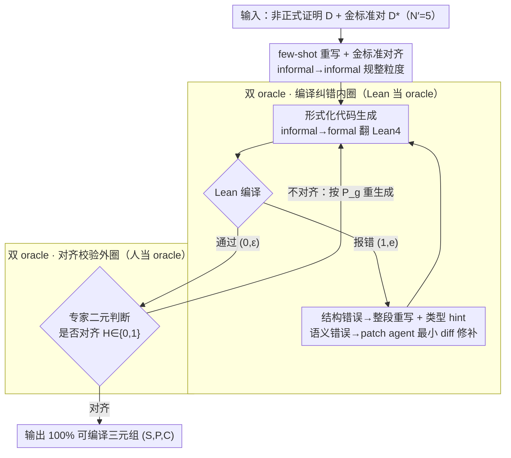

# FormalScience: Scalable Human-in-the-Loop Autoformalisation of Science with Agentic Code Generation in Lean

**会议**: ACL 2026  
**arXiv**: [2604.23002](https://arxiv.org/abs/2604.23002)  
**代码**: https://github.com/jmeadows17/formal-science  
**领域**: 代码智能 / 形式化 / Lean4 / 自动形式化  
**关键词**: 自动形式化, Lean4, 物理形式化, Agent, Human-in-the-loop, 语义漂移

## 一句话总结
FormalScience 提出一个领域无关的人在环 (HITL) Agent 流水线，让单个领域专家在不会 Lean 的情况下，把非正式的科学推理（特别是物理）转写成 100% 编译通过的 Lean4 代码，并构建出首个 200 题大学物理形式化基准 FormalPhysics，系统刻画了「编译通过」但「语义漂移」的现象。

## 研究背景与动机

**领域现状**：把人类自然语言写的数学推导自动翻译为 Lean / Coq 等定理证明器可编译的形式化代码（autoformalisation），是 LLM × 形式化方法的明星方向。已有的基准（miniF2F、ProofNet、Lean Workbook、Herald 等）几乎全部聚焦在奥林匹克或本科数学，最近虽然有 FormalMath、Herald-Proof 把规模做到几万到几十万级，但**域始终是纯数学**。

**现有痛点**：科学领域（特别是物理）的形式化几乎是空白。原因在于：(1) 物理大量使用 Dirac 记号 $\ket{\Psi}$、矢量微积分 $\nabla\times\vec{E}$ 等领域专有符号，而 Lean4/Mathlib 不直接支持；(2) LLM 在分布外、长链推理上幻觉率随复杂度爆炸式增长；(3) 现有 Herald-Proof 等数据集的形式有效率（FV）甚至只有 2%，意味着「自动生成」与「真正能编译」之间存在巨大鸿沟。

**核心矛盾**：作者通过实验发现一个核心 trade-off — **形式有效性 (FV)** 和 **语义对齐 (FQ/LP/MC)** 之间几乎正交（Spearman 系数 ≈ 0，$p>0.9$）。换言之，专门为 compile 优化的小模型（如 Kimina-7B 拿到 51.5% FV）会通过"凑出能编译的代码"来作弊，语义却完全跑偏；而对齐分高的大模型 GPT-5.1 在 zero-shot 下 FV 只有 14.5%。

**本文目标**：(i) 设计一个低成本（单人 / 1 月 / 50 美元）就能产出 100% FV 形式化数据集的人在环 pipeline；(ii) 给出物理领域第一个高质量基准 FormalPhysics；(iii) 系统刻画「编译通过但语义漂移」这一现象，回答**「Lean 到底验证了什么」**这个 epistemic 问题。

**切入角度**：作者把人类专家定位为**与编译器 $\mathcal{L}$ 同构的二元分类器** $\mathcal{H}\in\{0,1\}$ — 既然 LLM 单独搞不定语义对齐，那就让专家在"对齐"这一关充当一个轻量级 oracle，但**不要求专家会写 Lean**，只判断"形式化代码对不对得上原始陈述"。

**核心 idea**：把自动形式化分解为「语句生成 + 形式化代码生成 + 编译纠错 + 专家对齐校验」四个嵌套循环，编译循环由 Lean 当 oracle，对齐循环由人当 oracle，两者交替直到收敛。

## 方法详解

### 整体框架

FormalScience 把"把非正式科学推理翻成可编译 Lean4"拆成三个阶段、两层 oracle 的嵌套流水线（Alg.1）：输入是一批非正式证明 $\mathcal{D}$（如 LaTeX 推导）加少量金标准对 $\mathcal{D}^*=\{(\mathcal{S}_i,\mathcal{P}_i)\}_{i=1}^{N'}$（$N'=5$），先用 few-shot 重写把粗糙证明规整成统一粒度的语句-证明对，再进入「编译纠错」内圈把 Lean 代码反复修到能通过，最后由物理专家在「对齐校验」外圈判断形式化是否真的对得上原意；编译循环以 Lean 当严格 oracle、对齐循环以人当 oracle，两者交替到收敛，最终输出 100% 可编译的三元组 $(S,P,C)$。

### 关键设计

**1. few-shot 重写 + 金标准对齐：先把信噪比拉高再翻译**

物理证明常省略大量步骤（"由对称性可得"），而 Lean 要求每步显式，直接形式化会让编译循环迭代爆炸。这一步用 in-context learning 把金标准 $\mathcal{D}^*$ 的粒度规约喂给模型，按固定 prompt $P_a$ 把每条粗糙证明 $d$ 重写成风格一致的语句-证明对，得到中间数据 $X=\sum_{d\in\mathcal{D}} S\big(\mathcal{M}(T_{fs}(d,\mathcal{D}^*);P_a)\big)$，其中后处理函数 $S$ 负责把多题 batch 输出拆成单独的 $(S,P)$ 对。本质是一次"informal→informal"的重构，把噪声压下去后，下游 informal→formal 翻译的编译纠错次数显著减少。

**2. 双 oracle 嵌套循环：用编译器管语法、用人管语义**

作者发现 LP/MC 这类语义对齐指标和形式有效性 FV 几乎正交（$\rho\approx 0$），单一 oracle 无法同时把两个轴拉高，而让 LLM-as-judge 当外圈又会陷入"模型骗模型"。于是把两个目标解耦成两层循环：内圈 $\mathcal{R}$ 把 Lean compiler 抽象成工具 $\mathcal{L}(C)$，编译通过返回 $(0,\varepsilon)$、否则返回 $(1,e)$，按 $C^{(t+1)}=\mathcal{M}'(T_c(x,C^{(t)},e))$ 反复重写直到 $t^*=\min\{t:\mathcal{L}(C^{(t)})=(0,\varepsilon)\}$；外圈让物理专家以二元分类器 $\mathcal{H}^{(k)}=\mathcal{H}(\mathcal{M}'(T_g(x),C^{(k)}))\in\{0,1\}$ 只判断"对不对齐"，不对齐就在 $P_g$ 引导下重生成、并嵌套调用 $\mathcal{R}$ 再编译，由 patience $\mathcal{P}$ 控制最大轮数。关键在于专家**不需要会写 Lean**，只做 yes/no 判断（还可借 LLM 生成的对齐自评当辅助阅读），成本比逐行改 Lean 低数个量级——整套 FormalPhysics 由一位物理博士 1 个月、50 美元做完。

**3. Agent 基线里的结构错误 / 语义错误分流：让中型模型把 Lean 当工具用**

在 agentic baseline（基于 smolagents 的 CodeAgent + ReAct）里，先用 surface guard 拒掉含 forbidden token、未完成证明或非法 import 的代码；编译失败时再按错误类型分流——syntax、unknown identifier、缺 module 这类**结构错误**触发整段重写并附错误类型 hint，type mismatch、unsolved goals 这类**语义错误**则由 patch agent 只输出最小 unified diff 做局部修补，最多 25 轮 ReAct cycle。这种细粒度分流让中型开源模型受益明显：GPT-OSS-20B 的 FV 从 zero-shot 的 4.5% 飙到 31% 且对齐分不掉；但 7B 小模型（如 DeepSeek-Prover-7B）反而会因为加了错误反馈而 FV 下降（13%→4.5%），说明它们缺乏从错误信号中学习的基本能力，也正因此才需要外圈的人 oracle 兜底。

### 损失函数 / 训练策略
本文不训练模型，只做 inference-time pipeline 设计。所有 LLM 调用都用现成模型：FormalPhysics 数据构建用 GPT-5.1 + Claude-Opus-4.5；基线评测覆盖 Qwen2.5-Coder-7B、DeepSeek-Prover-V2-7B、Kimina-Autoformalizer-7B、GPT-OSS-20B、Qwen3-Sonnet-14B（Claude-Sonnet-4.5 蒸馏到 Qwen3-14B）、Qwen3-Coder-30B、GPT-5.1。LLM-as-judge 用 GPT-4.1-mini（temperature 0.2），并用 Qwen2.5-Coder-7B-Instruct 做 ≈ 6000 对二判 inter-judge agreement。

## 实验关键数据

### 主实验

不同 pipeline 在 FormalPhysics 上的语句形式化分数（GPT-4.1-mini 当 judge）：

| 方法 | 模型 | FV (%) | FQ (%) | LP (%) | MC (%) |
|------|------|--------|--------|--------|--------|
| Zero-Shot | Kimina-7B | 51.5 | 6.5 | 10.5 | 9.5 |
| Zero-Shot | GPT-OSS-20B | 4.5 | 68.5 | 73.0 | 72.5 |
| Zero-Shot | GPT-5.1 | 14.5 | 79.5 | 76.5 | 77.0 |
| Self-Refine | GPT-5.1 | 17.0 | 82.5 | 82.0 | 82.0 |
| Agentic | Qwen3-Sonnet-14B | 52.0 | 1.0 | 10.5 | 6.5 |
| Agentic | GPT-OSS-20B | **31.0** | 73.0 | 72.5 | 73.0 |
| **FormalScience (ours)** | GPT-5.1 + Claude-4.5 | **100.0** | **73.5** | 72.0 | 72.5 |

FormalPhysics 与现有 Lean4 基准的统计对比（200 样本随机抽样）：

| 数据集 | Objects | Formulae | FV (%) | LP (%) | MC (%) |
|--------|---------|----------|--------|--------|--------|
| miniF2F | 3.14 ± 1.55 | 3.21 ± 1.53 | 88.0 | 92.0 | 92.0 |
| ProofNet | 3.67 ± 1.48 | 3.62 ± 1.52 | 95.5 | 77.5 | 77.5 |
| FormalMATH | 4.47 ± 2.45 | 4.53 ± 2.62 | 97.5 | 98.0 | 96.5 |
| Herald-Proof | 6.57 ± 2.32 | 6.42 ± 2.37 | 2.0 | 94.5 | 94.0 |
| **FormalPhysics** | **6.41 ± 2.34** | **6.22 ± 2.13** | **100.0** | 72.0 | 72.5 |

### 消融实验

按 pipeline 复杂度递增的消融（GPT-OSS-20B）：

| 配置 | FV (%) | FQ (%) | LP (%) | MC (%) | 说明 |
|------|--------|--------|--------|--------|------|
| Zero-shot | 4.5 | 68.5 | 73.0 | 72.5 | 只 prompt，无反馈 |
| + Self-refine | 7.5 | 70.5 | 77.0 | 79.0 | 加编译错误反馈，FV 涨 3pp |
| + Agentic (ReAct + diff) | **31.0** | 73.0 | 72.5 | 73.0 | 加结构/语义错误分流，FV +26.5pp |
| + Human (FormalScience) | **100.0** | 73.5 | 72.0 | 72.5 | 再加人对齐 oracle，FV → 满分 |

### 关键发现

- **FV 与语义对齐几乎正交**：FV 与 FQ/LP/MC 均值的 Spearman、Pearson 系数都接近 0（$p>0.9$），证明 trade-off 是结构性的而非个例。Kimina-7B 是极端案例 — 用 compile shortcut 拿 51.5% FV 但 FQ 只有 6.5%。
- **Self-refinement 几乎免费午餐失败**：加 2× token 成本换来的 FV / 对齐提升 < 3pp，但在独立 7B judge 下 GPT-5.1 能涨 +9pp，**指标对 judge 选择敏感**。
- **Agentic 大幅缩小 FV 差距**：GPT-OSS-20B 从 4.5% 飙到 31%，且对齐分基本不掉，说明 ReAct + 结构/语义错误分流确实能让中型开源模型把 Lean 当工具用。
- **「自动形式化是一种 emergent 能力」**：14B、30B 不一定比 7B 强，关键在 **参数量 × 神经-符号集成 × test-time scaling** 三者同时到位；GPT-5.1 单独 zero-shot 只有 15% FV，进 FormalScience 直接到 100%。
- **物理比奥赛更难**：FormalPhysics 的 Objects/Formulae 比 miniF2F、ProofNet、Lean Workbook **多约 2 倍**，与 Herald-Proof 同级，但 Herald-Proof 的 FV 只有 2%，FormalScience 的 100% 是断崖式领先。

## 亮点与洞察

- **把人当 oracle 用，不当 annotator 用**：传统 HITL 让人写代码或改 label，本文只让人做"对齐 yes/no" 的二元判断，把人当成廉价 oracle 嵌进算法循环中，这种「人=轻量分类器」的抽象方式可以迁移到任何需要语义判断的任务（如 RLHF 偏好标注、code review）。
- **首次定量刻画"编译通过 ≠ 语义对齐"**：作者引入 Notational Collapse、Abstraction Elevation 等漂移分类，明确指出**当 $\ket{\Psi}$ 被 Lean 当成复标量 $\Psi$ 时，Lean 验证的根本不是量子力学**。这种"形式系统验证了什么"的元问题以前没人正面回答。
- **Trade-off 的存在性比方法本身更有价值**：FV 与对齐的 $\rho\approx 0$ 这一发现本身就是一个领域级别的负面结果，对未来设计 reward / loss 有指导意义 — 不能再用单一 compile pass rate 当 RL reward。
- **可扩展性论证**：单专家 1 月 / 50 美元 / 200 题 ≈ $0.25/题，意味着一个 10 人专家组可以在同等时间产出 2000 题，对 fine-tune 物理形式化模型来说是切实可行的。

## 局限与展望

- **作者承认**：(1) FormalPhysics 只 200 题，做 fine-tune 基准还不够大，定位是 evaluation set；(2) 物理只覆盖量子力学 + 电磁学两个子域，未覆盖广义相对论、统计力学；(3) Lean4 / Mathlib 对矢量微积分和 Dirac 记号无原生支持，导致 LP/MC 注定低（72%），不是 pipeline 的锅而是 Mathlib 的锅。
- **隐藏的扩展性瓶颈**：所谓"人当二元 oracle"听上去廉价，但实际上专家要先**看懂 Lean 代码**才能判断对齐，门槛比想象中高；论文没汇报每题平均要多少次 human-in-the-loop 迭代和单次判断耗时。
- **judge 依赖**：GPT-4.1-mini 与 Qwen2.5-7B 两个 judge 的 phi 系数只有 0.28-0.37，绝对分数能差 9pp，说明 LLM-as-judge 给的对齐分数仍有较大噪声，本文的"alignment 不变"结论需要谨慎对待。
- **改进思路**：(1) 在 Mathlib 中先建一套 Dirac/矢量微积分 DSL，能从根本上抬高 LP/MC 天花板；(2) 把外圈"人 oracle"换成 fine-tune 过的对齐验证器，朝全自动 FormalScience-v2 迭代；(3) 把漂移分类（Notational Collapse 等）作为 RL reward 的负项，让模型主动避免低质量编译通过。

## 相关工作与启发

- **vs miniF2F / ProofNet**：他们是奥林匹克/本科数学，本文是大学物理；他们的复杂度（Objects ~ 3）只有 FormalPhysics 的一半，且不需要处理领域专有记号。
- **vs Herald-Proof**：同等复杂度（Objects ~ 6.5）但 Herald-Proof 走全自动路线导致 FV 只有 2%，本文用 HITL 把 FV 拉到 100%，证明在复杂域里**人不是可选项而是必要项**。
- **vs Kimina-Autoformalizer**：Kimina 在 zero-shot 拿 51.5% FV，靠的是专为 compile 优化的 shortcut；本文揭示这是典型的 Goodhart's Law — 优化 FV 不等于优化语义，未来 autoformalizer 训练需要双目标。
- **vs DeepSeek-Prover-V2 / smolagents CodeAgent**：本文借用了 smolagents 的 ReAct + tool calling 框架但加上了 surface guard 和结构/语义错误分流，这一分流策略可迁移到所有 code-as-agent 任务。

## 评分
- 新颖性: ⭐⭐⭐⭐ 双 oracle + 物理域 + 漂移分类的组合很新，但单看 HITL 形式化本身不算革命。
- 实验充分度: ⭐⭐⭐⭐ 跨 3 类 pipeline × 7 模型 × 2 judge 全套跑完，inter-judge agreement 也做了。
- 写作质量: ⭐⭐⭐⭐ 公式编号清晰，Alg.1 / Alg.2 给出完整伪代码，漂移分类配图直观。
- 价值: ⭐⭐⭐⭐⭐ 推开了"科学形式化"这扇门，给社区一个高质量物理基准 + 一个明确的 trade-off 负面结果。

<!-- RELATED:START -->

## 相关论文

- [\[ICML 2026\] CentaurEval: Benchmarking Human-in-the-Loop Value in Agentic Coding](../../ICML2026/code_intelligence/centaureval_benchmarking_human-in-the-loop_value_in_agentic_coding.md)
- [\[ACL 2026\] Discover and Prove: An Open-source Agentic Framework for Hard Mode Automated Theorem Proving in Lean 4](discover_and_prove_an_open-source_agentic_framework_for_hard_mode_automated_theo.md)
- [\[ACL 2026\] ReCode: Reinforcing Code Generation with Reasoning-Process Rewards](recode_reinforcing_code_generation_with_reasoning-process_rewards.md)
- [\[ACL 2026\] CollabCoder: Plan-Code Co-Evolution via Collaborative Decision-Making for Efficient Code Generation](collabcoder_plan-code_co-evolution_via_collaborative_decision-making_for_efficie.md)
- [\[ACL 2026\] Aligned Multi-View Scripts for Universal Chart-to-Code Generation](aligned_multi-view_scripts_for_universal_chart-to-code_generation.md)

<!-- RELATED:END -->
