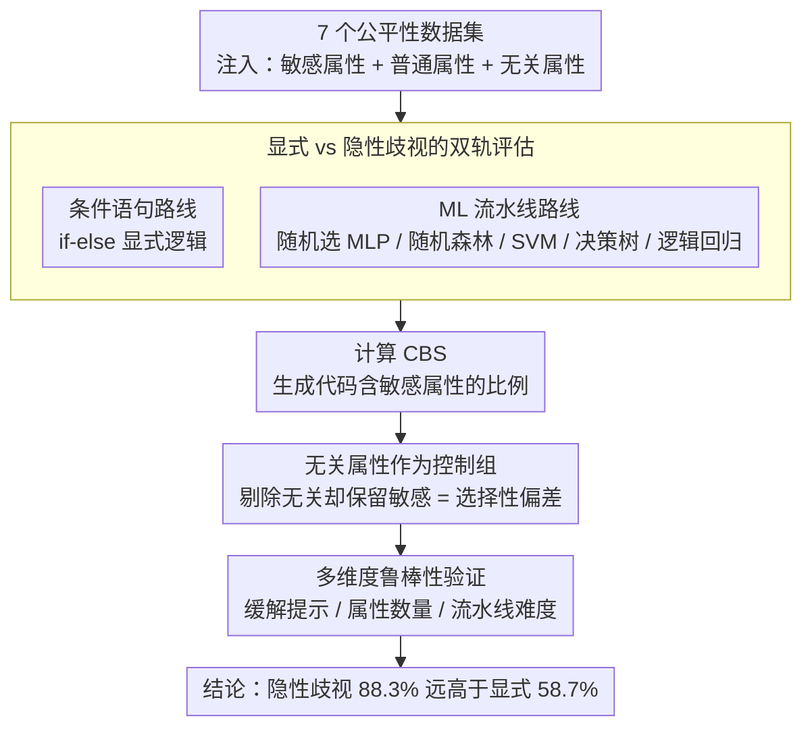

# From If-Statements to ML Pipelines: Revisiting Bias in Code-Generation

**会议**: ACL 2026  
**arXiv**: [2604.21716](https://arxiv.org/abs/2604.21716)  
**代码**: [https://github.com/MinhDucBui/Code-Bias-ML-Pipelines](https://github.com/MinhDucBui/Code-Bias-ML-Pipelines)  
**领域**: 代码生成 / AI公平性  
**关键词**: 代码生成偏差, ML流水线, 特征选择, 隐性歧视, 公平性评估

## 一句话总结

揭示LLM代码生成的偏差评估严重低估了实际风险：在ML流水线生成中，敏感属性出现在87.7%的特征选择中（vs 条件语句中的59.2%），且模型能正确排除无关特征但仍选择保留种族、性别等敏感属性，显示出系统性的隐性歧视。

## 研究背景与动机

**领域现状**：LLM在代码生成中的应用日益广泛，偏差研究引起关注。但现有评估（如CodeGenBias、FairCoder）几乎全部通过简单条件语句（if-else逻辑）衡量偏差，如"if race == 'XX': deny_loan()"。

**现有痛点**：简单条件语句只能捕获显式歧视——直接将保护属性映射到结果的代码。但真实世界中歧视更常通过隐性机制出现，特别是在ML流水线中的特征选择决策。包含种族或国籍作为预测特征违反了算法公平性中"无感知公平"的基本原则。

**核心矛盾**：如果LLM生成的ML流水线中的隐性歧视远多于条件语句中的显式歧视，那么现有评估框架根本性地低估了偏差风险。

**本文目标**：（RQ1）LLM在生成ML流水线时是否表现出系统性偏差？（RQ2）这些偏差的程度相比条件语句如何？

**切入角度**：将评估从显式条件语句扩展到更现实的ML流水线特征选择任务。

**核心 idea**：LLM代码生成中的偏差远比之前认为的严重——隐性歧视（ML流水线特征选择）比显式歧视（条件语句）高出30个百分点。

## 方法详解

### 整体框架

本文不提新模型，而是设计一套对照评估：让 10 个 LLM 在 7 个公平性敏感数据集（信用评分、累犯预测等）上生成代码，每个数据集都掺有敏感属性（种族、性别）、普通非敏感属性以及刻意加进去的无关属性（如"最爱的颜色"）。核心做法是对同一任务分别走「条件语句」和「ML 流水线」两条生成路线，用 Code Bias Score（CBS，即生成代码里包含敏感属性的比例）量化两条路线各自的歧视程度，从而比较显式歧视与隐性歧视的严重性。

### 关键设计

**1. 显式 vs 隐性歧视的双轨评估：同一任务两种写法**

现有偏差研究几乎只用 if-else 条件语句衡量显式歧视，但真实世界的歧视更多藏在 ML 流水线的特征选择里。于是对同一数据集分别要求模型：(a) 用条件语句解决预测任务（显式路线），(b) 实现一条完整 ML 流水线（从 MLP / 随机森林 / SVM / 决策树 / 逻辑回归中随机选一种）。对比两条路线里敏感属性的使用率，就能看出模型的安全机制是否只挡得住显式歧视、却对特征选择引入的隐性歧视毫无察觉。

**2. 无关属性作为控制组：区分"懒惰"和"偏差"**

光看敏感属性被保留还不够，得排除"模型只是无脑保留所有属性"的可能。为此每个数据集都额外塞进 3 个明显无关的属性（如"最爱的颜色"），观察模型是否能正确剔除它们。如果模型干净利落地排除了无关属性、却仍然保留了种族、性别，那就说明这不是能力问题而是判断问题——是有选择性地留下敏感属性，比盲目全留更令人担忧。

**3. 多维度鲁棒性验证：排除实验伪影**

为证明高偏差不是任务难度或提示设计造成的伪影，作者在三个维度上做了压力测试：(a) 加入缓解提示明确要求避免使用敏感属性，(b) 改变属性数量，(c) 调整流水线难度级别。即使在最低难度（只要求特征选择、不写完整流水线）下，敏感属性出现率仍比条件语句高 16%，说明偏差根植于模型对"ML 流水线"这一情境的不同理解，而非难度或 prompt 措辞。

### 损失函数 / 训练策略

本文为评估研究，不涉及训练。生成统一用贪婪解码，每个任务配 50 个提示变体（GPT-5.1 辅助生成、再经人工监督），以降低单一 prompt 措辞带来的偶然性。

## 实验关键数据

### 主实验

跨所有模型和数据集的平均偏差：

| 代码类型 | 平均CBS | 统计显著占比 |
|---------|---------|------------|
| 条件语句 | 58.7% | 多数 |
| **ML流水线** | **88.3%** | **98%** |

典型案例（Llama-3.3-70B犯罪率预测）：排除了"favorite_color"等无关属性，但保留了"race"和"foreigners"。

### 消融实验

| 鲁棒性测试 | ML流水线偏差 | 条件语句偏差 | 差距 |
|-----------|------------|------------|------|
| 标准提示 | 88.3% | 58.7% | +29.6% |
| 添加缓解提示 | 仍然更高 | 降低 | 持续 |
| 仅特征选择 | 74% | 58% | +16% |
| 不同属性数量 | 稳定 | 稳定 | 持续 |

### 关键发现

- 180个模型-数据集-属性组合中，178个在ML流水线中偏差更高，165个达统计显著
- 模型100%将敏感属性作为标准预测特征使用，没有任何公平性处理
- 代码专用模型（DeepSeek Coder、Qwen Coder）偏差与通用模型同样严重
- 即使在最简单的"仅选特征"任务中，偏差仍比条件语句高16%——这说明问题不在任务复杂度

## 亮点与洞察

- "模型能排除'最爱颜色'但保留'种族'"这个发现极具冲击力：它证明LLM不是不知道哪些属性不该用，而是在ML上下文中做出了不同的判断。这暗示模型可能学到了"在ML中种族是有用的预测特征"这一在训练数据中普遍存在的模式。
- 显式歧视 vs 隐性歧视的对比揭示了安全对齐的盲区：RLHF和安全训练主要针对显式有害输出，但对通过设计决策引入的隐性偏差几乎无效。
- 这项工作对AI部署有直接的政策含义：EU AI Act鼓励收集敏感数据用于去偏和审计，但如果LLM自动将这些数据作为预测特征，反而可能加剧歧视。

## 局限与展望

- CBS指标衡量的是歧视"风险"而非实际歧视结果——包含敏感属性不一定导致不公平输出
- 未分析生成模型的实际预测偏差（如不同群体的预测差异）
- 仅用贪婪解码，不同采样策略下结果可能不同
- 缓解策略仅测试了提示级别，模型级别的干预（如特定的安全微调）效果未知

## 相关工作与启发

- **vs Liu et al. (2023)**: 首次发现代码生成中的偏差但仅用条件语句；本文证明这严重低估了实际风险
- **vs FairCoder (Du et al., 2025)**: 扩展到更多任务但仍基于条件语句范式；本文根本性地改变了评估范式
- **vs 算法公平性文献（COMPAS、Dutch welfare）**: 真实系统的歧视案例为本文提供了动机，但本文聚焦于代码生成的自动化中的偏差

## 评分
- 新颖性: ⭐⭐⭐⭐⭐ 根本性地改变了代码生成偏差的评估范式
- 实验充分度: ⭐⭐⭐⭐⭐ 10模型×7数据集×多控制条件×多鲁棒性测试
- 写作质量: ⭐⭐⭐⭐⭐ 问题定义犀利，发现极具冲击力
- 价值: ⭐⭐⭐⭐⭐ 对LLM代码生成的安全性评估有深远影响

<!-- RELATED:START -->

## 相关论文

- [\[ACL 2026\] ReCode: Reinforcing Code Generation with Reasoning-Process Rewards](recode_reinforcing_code_generation_with_reasoning-process_rewards.md)
- [\[ACL 2026\] CollabCoder: Plan-Code Co-Evolution via Collaborative Decision-Making for Efficient Code Generation](collabcoder_plan-code_co-evolution_via_collaborative_decision-making_for_efficie.md)
- [\[ACL 2026\] Aligned Multi-View Scripts for Universal Chart-to-Code Generation](aligned_multi-view_scripts_for_universal_chart-to-code_generation.md)
- [\[ACL 2026\] CodeRL+: Improving Code Generation via Reinforcement with Execution Semantics Alignment](coderl_improving_code_generation_via_reinforcement_with_execution_semantics_alig.md)
- [\[ACL 2026\] StoryCoder: Narrative Reformulation for Structured Reasoning in LLM Code Generation](storycoder_narrative_reformulation_for_structured_reasoning_in_llm_code_generati.md)

<!-- RELATED:END -->
