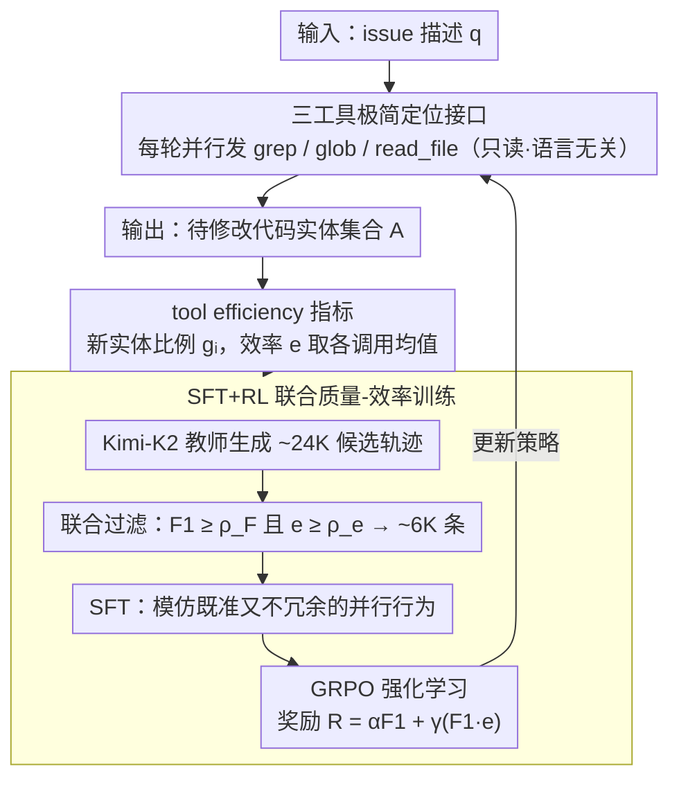

# Learning Adaptive Parallel Execution for Efficient Code Localization

**会议**: ACL2026 Findings  
**arXiv**: [2601.19568](https://arxiv.org/abs/2601.19568)  
**代码**: 未在缓存中看到公开代码链接  
**领域**: 代码智能 / LLM Agent  
**关键词**: 代码定位、并行工具调用、GRPO、工具效率、SWE-bench Verified  

## 一句话总结
FuseSearch 把代码定位中的并行工具调用建模为质量-效率联合优化问题，用 SFT+RL 学会按任务阶段自适应调节搜索宽度，在 SWE-bench Verified 上用紧凑模型取得高 F1 和显著更低的时间/Token 成本。

## 研究背景与动机
**领域现状**：自动软件开发 agent 往往要先定位需要修改的文件、函数或代码片段，再进入补丁生成。代码定位已经成为整条流水线的主要瓶颈，论文引用的近期结果显示 SOTA agent 超过 50% 的计算资源花在定位上。

**现有痛点**：传统 agent 多按顺序调用工具，紧 turn budget 下容易信息饥饿；如果强行每轮并行调用固定数量工具，又会产生大量重复或无用检索。论文观察到 enforced parallel tools 有 34.9% 是冗余调用，抵消了并行带来的收益。

**核心矛盾**：代码定位需要在有限交互轮次内尽快覆盖足够上下文，但覆盖面越大，越容易重复搜索或引入无关噪声；只追求低成本会漏掉关键文件，只追求高召回又会让搜索成本和上下文噪声爆炸。

**本文目标**：作者希望训练一个能自己决定“何时并行、并行多少、查哪里”的定位 agent，使其同时最大化定位 F1 和每次工具调用的信息增益。

**切入角度**：论文没有构建复杂代码图或语言特定 AST，而是只保留 grep、glob、read_file 三个语言无关只读工具，然后把工具调用是否带来新代码实体作为显式效率信号。

**核心 idea**：用 tool efficiency 衡量工具调用的新信息比例，并把它与 file/function F1 一起纳入 SFT 过滤和 GRPO reward，让模型学到从广泛探索到聚焦精修的自适应并行策略。

## 方法详解
FuseSearch 的设计很克制：推理时只有三种工具，训练时才引入轨迹质量和效率指标。它先用强 teacher 生成候选搜索轨迹，再筛选出既定位准确又工具效率高的轨迹做 SFT，最后用 GRPO 进一步优化一个把 F1 和效率相乘的 reward。

### 整体框架
输入是一个 issue description $q$，agent 在 $T$ 个离散轮次中产生一组工具调用 $a_t$，观察返回结果 $o_t$，最后输出需要修改的代码实体集合 $\mathcal{A}$。与顺序 agent 一次只调用一个工具不同，FuseSearch 每轮可以并行发出多个 grep/glob/read_file 调用；这些只读工具没有同步副作用，返回结果会在下一轮前聚合进上下文。

训练流程分两阶段。SFT 阶段用 Kimi-K2-Instruct 为 6K 个训练 query 生成约 24K 条候选轨迹，并用 file/function F1 与 tool efficiency 双指标筛选出约 6K 条高质量轨迹。RL 阶段以 SFT 模型为初始策略，用 GRPO 采样多条轨迹，根据定位质量和工具效率计算奖励，鼓励模型减少重复探索但不牺牲最终定位准确率。

### 关键设计

**1. 三工具极简定位接口：用只读工具换来跨语言与可并行**

图导航 agent 要先构建代码图、解析 AST 或起语言服务器，这些都是语言相关、预处理成本高的重活，换到 Java/C++ 上还得重做一遍。FuseSearch 干脆只留 grep（正则内容搜索）、glob（文件路径匹配）、read_file（读指定文件或行段）三件工具，全部语言无关、零索引开销。更关键的是这三者都是只读的、没有同步副作用，所以同一轮里并行发出多个调用是安全的——这为后面「每轮并行多查」的策略扫清了障碍。极简接口还有个副作用：把建模压力从「理解代码结构」转移到「学会怎么搜」，让模型的学习容量集中在搜索策略本身。

**2. tool efficiency 指标：只惩罚没带来新信息的调用，而非调用本身**

并行的代价是冗余——强行每轮固定并行，论文观测到 34.9% 的调用是在重复查已经看过的区域。但单纯惩罚轨迹长度无法区分「查了新地方」和「把旧地方又查一遍」。FuseSearch 显式维护一个已发现实体历史 $\mathcal{H}$，对第 $i$ 个工具返回的实体集合 $\mathcal{E}_i$，定义信息增益 $g_i=|\mathcal{E}_i\setminus\mathcal{H}|/|\mathcal{E}_i|$，即这次调用里有多大比例是没见过的实体；整条轨迹的效率取所有调用的均值 $e=\frac{1}{k}\sum_i g_i$。这样一来，重复检索会被直接打成低分，而探索新区域不会被冤枉，效率信号才真正对齐「搜索质量」而不是「搜索数量」。

**3. SFT+RL 联合质量-效率训练：先学会并行，再学会按阶段调节宽度**

光有效率指标还不够，得让模型真正把 F1 和效率一起当目标。FuseSearch 用两阶段：SFT 阶段从 teacher 生成的候选轨迹里只保留同时满足 $F_1\geq\rho_F$ 且 $e\geq\rho_e$ 的高质量轨迹，让模型先模仿出「既准又不冗余」的并行行为；RL 阶段用 GRPO 进一步精修，奖励设计成 $R(\tau)=\alpha F_1(\tau)+\gamma\big(F_1(\tau)\cdot e(\tau)\big)$，其中 $F_1$ 是 file-level 与 function-level F1 的加权和。

这里乘积项 $F_1\cdot e$ 是点睛之笔：如果定位失败（$F_1=0$），无论效率多高奖励都归零，模型学不到「少查所以高效」这种投机；只有当定位站得住时，效率才作为 bonus 被放大。论文对比了 F1-only、$F_1+e$、$F_1+F_1\cdot e$ 三种奖励，最终乘法交互项让质量、效率、成本同时最优，也正是这个奖励把模型推向「早期广泛探索、后期聚焦精修」的自适应节奏。

### 损失函数 / 训练策略
训练数据来自 233 个高质量 GitHub 仓库，去除会新增文件/函数、issue 描述过短或没有代码变化的样本，从约 21K 个过滤样本中抽取 ground truth 文件、函数/方法和行范围。SFT 模型需要生成每轮 2-8 个工具调用。RL 使用 GRPO，多输出采样并根据 file/function F1 和 efficiency 计算 reward；论文比较了 F1-only、$F_1+e$ 与 $F_1+F_1\cdot e$，最终选择乘法交互项。

## 实验关键数据

### 主实验
评测使用 SWE-bench Verified，按前人设置排除 patch 引入全新文件或函数的样本，保留 386/500 个 example。主结果表明，训练后的 FuseSearch-4B 同时提升定位质量和效率。

| 方法 / 配置 | File F1 | Func F1 | 效率 / 成本结果 | 说明 |
|-------------|---------|---------|-----------------|------|
| RepoSearcher, Qwen3-4B backbone | 38.1 | 21.7 | 作为摘要中对比基线 | 专门定位 agent |
| FuseSearch-4B trained | 84.7 | 56.4 | 时间加速 93.6%，turn 减少 67.7%，token 减少 68.9% | 摘要报告的核心结果 |
| Qwen3-4B Base | 64.50 | 38.91 | e=59.50, T=6.12s, Tok=47.9k | 未经两阶段训练 |
| Qwen3-4B SFT+RL | 84.65 | 56.43 | e=69.00, T=5.43s, Tok=30.9k | 两阶段训练后 |
| Qwen3-30B-A3B SFT+RL | 83.01 | 58.62 | e=64.53, T=10.6s, Tok=43.2k | 大模型同样受益 |

### 消融实验
| 配置 | File F1 | Func F1 | #Turn | T(s) | Tok.(k) | 说明 |
|------|---------|---------|-------|------|---------|------|
| Seq SFT+RL | 78.82 | 50.21 | 7.52 | 8.03 | 59.4 | 每轮 1 个工具 |
| Par SFT+RL | 84.65 | 56.45 | 5.60 | 5.43 | 30.9 | 并行执行明显更优 |
| SFT only | 78.86 | 47.94 | 4.96 | 9.17 | 54.8 | 会学到并行但仍有冗余 |
| RL reward: F1 only | 81.84 | 54.90 | 未在表中列出 | 7.28 | 39.4 | 提升质量但效率不是最优 |
| RL reward: $F_1+e$ | 79.22 | 51.98 | 未在表中列出 | 9.40 | 45.7 | 效率高但质量下降 |
| RL reward: $F_1+F_1\cdot e$ | 84.65 | 56.45 | 未在表中列出 | 5.43 | 30.9 | 质量、效率和成本同时最好 |

### 关键发现
- SFT 让模型学会更积极并行，提升 F1，但也会引入冗余；RL 后模型学到“先宽后窄”的策略，早期广泛探索，后期聚焦精修。
- joint filtering 比只按 F1 或只按 efficiency 过滤更稳。无过滤 SFT 的 File F1/Func F1/e 为 75.44/43.52/55.77，joint filtering 提升到 78.86/47.94/62.03。
- FuseSearch 能加速下游修复 agent。Kimi-K2 无定位时 pass rate 68.4、41.1 turns、312s、1053k tokens；Pre-Search 后 pass rate 68.1、31.6 turns、223s、562k tokens。
- 极简工具集在顺序模式下也有竞争力，说明代码定位不一定必须依赖语言特定图结构；但真正的收益来自模型学会有效并行。

## 亮点与洞察
- tool efficiency 是这篇论文最可复用的概念。它不是粗暴惩罚“工具调用多”，而是惩罚“没有新信息的调用”，这更贴近真实 agent 搜索质量。
- 乘法 reward 设计很合理：定位失败时效率没有意义，定位成功时效率才是 bonus。这避免了 agent 学成“少查所以高效”。
- 论文把并行工具调用从工程能力变成学习目标。很多 agent 框架支持 parallel call，但模型不会自然知道何时并行；FuseSearch 明确训练这个决策。
- 结果对小模型 agent 很有启发：4B 模型通过任务专门训练和工具效率奖励，可以在定位阶段接近甚至替代昂贵大模型的一部分工作。

## 局限与展望
- 作者指出 golden patch 只代表一种可行修复路径，可能漏掉其他正确定位，因此 F1 ground truth 本身有偏。
- SWE-bench Verified 主要覆盖 Python 仓库；虽然工具语言无关，但 Java/C++ 等静态语言上的有效性还需要更多训练和评测数据验证。
- 当前基准聚焦 issue-driven localization，没有评估 repository QA、代码理解、文档生成等更广义代码搜索任务。
- tool efficiency 依赖“代码实体是否新”的定义，未来可以把语义新颖性、调用成本、文件重要性也纳入效率度量。

## 相关工作与启发
- **vs Agentless**: Agentless 用固定层级流程从文件到函数再到行，简单稳定但缺少任务自适应；FuseSearch 用 learned policy 决定搜索宽度。
- **vs LocAgent / CoSIL**: 图导航 agent 能利用结构关系，但需要语言相关图构建；FuseSearch 用 grep/glob/read_file 降低部署门槛。
- **vs RepoSearcher**: RepoSearcher 也是轻量定位 agent，但多为顺序迭代；FuseSearch 的核心提升来自并行工具调用和效率奖励。
- **对后续工作的启发**: 通用 coding agent 可以把“每个工具调用的信息增益”作为在线反馈，训练或蒸馏出更少重复搜索、更低 token 成本的检索策略。

## 评分
- 新颖性: ⭐⭐⭐⭐☆ 工具效率指标和质量-效率乘法奖励很实用，方向清晰。
- 实验充分度: ⭐⭐⭐⭐☆ SWE-bench Verified、训练阶段、并行模式、过滤策略、reward 和下游修复都有覆盖；跨语言仓库还不足。
- 写作质量: ⭐⭐⭐⭐☆ 方法定义和消融逻辑清楚，个别表格因信息多稍难读。
- 价值: ⭐⭐⭐⭐⭐ 对代码 agent 降本提速很有实际价值，尤其适合定位作为下游修复前处理。

<!-- RELATED:START -->

## 相关论文

- [\[ACL 2026\] To Diff or Not to Diff? Structure-Aware and Adaptive Output Formats for Efficient LLM-based Code Editing](to_diff_or_not_to_diff_structure-aware_and_adaptive_output_formats_for_efficient.md)
- [\[ICLR 2026\] Improving Code Localization with Repository Memory](../../ICLR2026/code_intelligence/improving_code_localization_with_repository_memory.md)
- [\[ACL 2026\] CodeRL+: Improving Code Generation via Reinforcement with Execution Semantics Alignment](coderl_improving_code_generation_via_reinforcement_with_execution_semantics_alig.md)
- [\[ACL 2026\] PaT: Planning-after-Trial for Efficient Test-Time Code Generation](pat_planning-after-trial_for_efficient_test-time_code_generation.md)
- [\[ACL 2026\] PExA: Parallel Exploration Agent for Complex Text-to-SQL](pexa_parallel_exploration_agent_for_complex_text-to-sql.md)

<!-- RELATED:END -->
