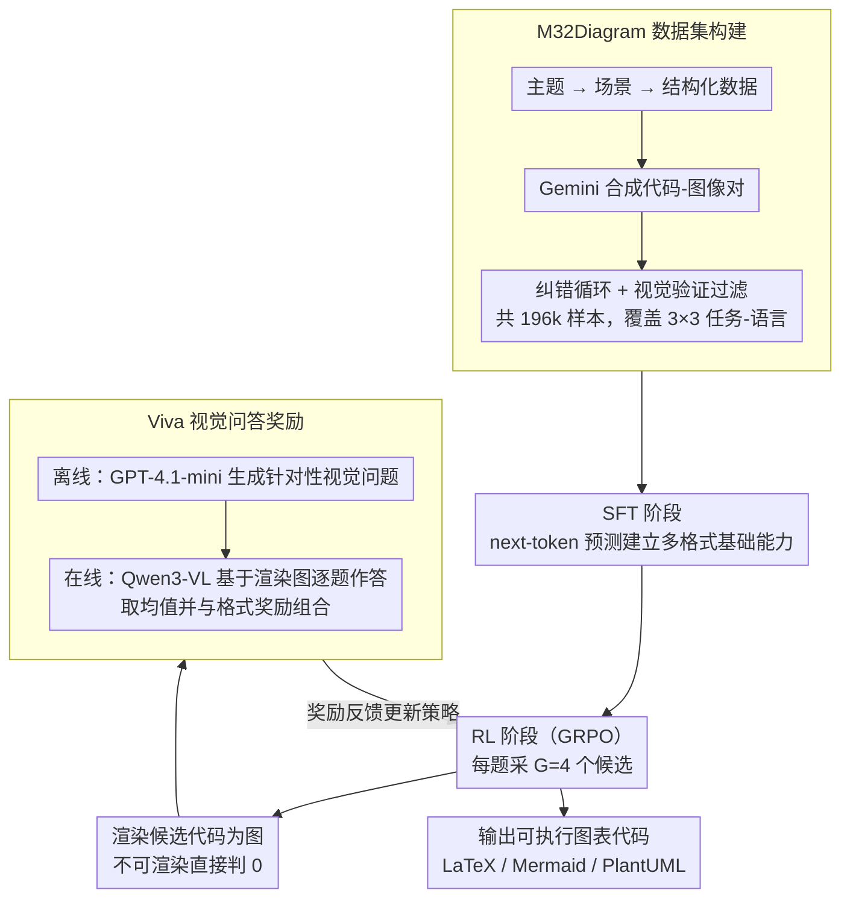

# OmniDiagram: Advancing Unified Diagram Code Generation via Visual Interrogation Reward

**会议**: ACL 2026 Findings  
**arXiv**: [2604.05514](https://arxiv.org/abs/2604.05514)  
**代码**: [GitHub](https://github.com/Haoyue-Yang/OmniDiagram)  
**领域**: 代码智能 / 多模态代码生成  
**关键词**: 图表代码生成, 视觉问答奖励, 强化学习, 统一框架, 多模态

## 一句话总结

本文提出 OmniDiagram，一个统一的图表代码生成框架，覆盖 LaTeX/Mermaid/PlantUML 三种语言和图表转代码/图表编辑/文本转代码三种任务，并引入基于视觉问答的 Viva 奖励机制来指导 RL 训练，在多个基准上达到 SOTA。

## 研究背景与动机

**领域现状**：可编程图表生成范式正在快速演进，在结构化可视化中发挥关键作用。多模态大语言模型使得直接处理非结构化图表（如 PNG 光栅格式）并生成可执行代码成为可能。然而，现有方法通常局限于单一任务或少数编程语言。

**现有痛点**：(1) StarFlow 仅支持 JSON 输出，忽略多样化图表语言；JanusCoder 虽尝试统一文本转代码和图表转代码，但仅依赖 SFT，限制了视觉对齐和代码执行鲁棒性。(2) 将 RL 与视觉反馈结合的方法（如 MSRL、RLRF）仅针对特定的图像转代码任务，缺乏跨任务灵活性。(3) 现有视觉反馈方法要么使用固定提示模板（受评估模型能力限制、易被 prompt hacking），要么计算全局视觉相似度（偏向表面结构相似而忽略细粒度细节）。

**核心矛盾**：图表代码生成需要同时保证代码逻辑正确性和渲染后的视觉保真度，但现有 RL 奖励机制难以统一验证异构任务中的关键结构细节——Text-to-Code 的结构多样性排除了单一参考图像，Diagram-to-Code 的非双射性意味着不同代码可产生视觉相同的输出。

**本文目标**：构建覆盖多种图表语言和任务模态的统一框架，设计一种能跨任务统一评估视觉保真度的 RL 奖励机制。

**切入角度**：借鉴人类在复杂构建任务中的元认知审查机制——不是通过整体相似度判断，而是通过有针对性的问题系统性地检查结构和语义约束。

**核心 idea**：Viva (Visual Interrogation Verifies All) 机制——为每个训练样本离线生成针对性视觉问题，在线让奖励模型基于渲染图像回答问题来评估视觉保真度，提供细粒度中间分数反馈。

## 方法详解

### 整体框架

图表代码生成的难点在于既要代码逻辑正确、又要渲染后的视觉保真，而异构任务里很难找到统一的视觉奖励——文本转代码（Text-to-Code）没有唯一参考图，图表转代码（Diagram-to-Code）又是非双射（不同代码可渲染出相同图像）。OmniDiagram 用一条"数据—SFT—RL"的流水线统一应对：先用自上而下的合成方法造出覆盖 3×3 任务-语言矩阵的 M32Diagram 数据集（196k 样本），再用 SFT 把基础的多格式图表代码生成能力打牢，最后进入由 Viva 视觉问答奖励驱动的 GRPO 阶段，让模型在渲染—审问—反馈的闭环中迭代提升视觉保真度，输出 LaTeX/Mermaid/PlantUML 三种语言的可执行图表代码。

### 关键设计

**1. M32Diagram 大规模数据集：自上而下合成 + 严格过滤，补齐 3×3 任务-语言的数据空白**

图表代码生成长期缺少覆盖多语言多任务的大规模数据，没有数据这条流水线无从谈起。OmniDiagram 采用场景驱动的自上而下合成（主题 topic → 场景 scenario → 结构化数据 → 代码-图像对），用 Gemini-2.5-Flash 生成，并经过错误纠正循环与视觉验证，从 300k 候选中筛出 165k 高质量样本，加上 31k 开源数据共 196k，另有 77k 推理增强样本。每种语言覆盖约 15 种图表类型，并用基于感知哈希（perceptual hashing）的分层聚类来平衡 SFT 与 RL 训练集在难度和拓扑复杂度上的分布，使数据既全面又不在某类图表上失衡。

**2. SFT-to-RL 两阶段训练管线：先立基础能力，再用 RL 精炼视觉保真**

直接上 RL 会导致模式坍缩——消融显示纯 RL（无 SFT）的模型只会生成 Mermaid 代码而无视具体指令。因此 OmniDiagram 先用标准 next-token prediction 做 SFT，建立跨格式的图表代码生成基础；再进入 RL 阶段，用 GRPO 每题采 $G=4$ 个候选，渲染后在线计算 Viva 奖励并惩罚不可渲染的 rollout。两阶段互补，SFT 保证了"会画"，RL 在此之上把"画得像不像"逐步拉满（执行率从 SFT 的 88.6% 提升到 93.0%）。

**3. Viva（Visual Interrogation Verifies All）奖励机制：用"逐题审问"代替整体相似度来判分**

这是驱动上述 RL 阶段的核心奖励。固定模板奖励受评估模型能力限制且易被 prompt hacking，全局相似度又偏向表面结构而忽略细粒度细节。Viva 借鉴人类审查复杂构建任务时的元认知机制，把问题生成与答案验证解耦：离线阶段用 GPT-4.1-mini 为每个样本生成若干针对性视觉问题（都设计为正确答案对应"Yes"）；在线阶段把每个 rollout 的代码渲染成图，再让 Qwen3-VL-32B 作为奖励模型基于渲染图回答这些问题。Viva 奖励取所有问题得分的均值，并与格式奖励组合为 $R_i = \alpha \cdot R_{\text{Viva}} + (1-\alpha) \cdot R_{\text{fmt}}$（$\alpha=0.9$），渲染失败的候选直接判 0。问题驱动的验证关注逻辑一致性而非严格全局模仿，因而能奖励更多样的 rollout，多问题聚合也通过方差分析被证明可有效压低单次 VQA 的奖励噪声。

### 损失函数 / 训练策略

SFT 阶段使用标准交叉熵损失，8 张 H800 GPU、全局 batch 32、训练 2 个 epoch。RL 阶段采用 GRPO（公式 4-5），$G=4$ 候选、$\alpha=0.9$、全局 batch 128，基于 ms-swift 与 EasyR1 框架。Viva 奖励的理论稳定性由方差分析给出：多维问题聚合衰减了单个 VQA 的不确定性影响。

## 实验关键数据

### 主实验

| 模型 | M32Bench D2C $S_{vis}$ | M32Bench Edit $S_{pres}$/$S_{task}$ | VisPlot Mermaid $S_{vis}$/$S_{task}$ |
|--------|------|------|------|
| Qwen2.5-VL-72B | 55.0 | 36.8/54.0 | 31.0/46.0 |
| Qwen3-VL-32B | 58.0 | 45.6/51.8 | 40.4/55.1 |
| OmniDia-3B (RL) | 72.2 | 59.0/64.8 | 49.4/64.5 |
| OmniDia-7B (RL) | **75.5** | **57.2/65.2** | **51.0/66.9** |
| Gemini-3-Flash | 73.6 | 77.8/82.0 | 58.4/80.2 |

### 消融实验

| 配置 | 关键指标 | 说明 |
|------|---------|------|
| 纯 RL（无 SFT） | Exec 30.2% | 模式坍缩，仅生成 Mermaid |
| 纯 SFT（无 RL） | Exec 88.6% | 基础能力完整但视觉保真度较低 |
| 完整管线 (SFT+RL) | Exec **93.0%** | 两阶段互补达到最优 |
| 加入推理轨迹 | 图表编辑提升，其他任务下降 | 推理上下文可能分散注意力 |
| 小奖励模型 (30B-A3B) | 性能差距极小 | 离线问题比奖励模型规模更关键 |

### 关键发现
- 3B 模型（OmniDia-3B）即超越 72B 开源模型（Qwen2.5-VL-72B），展现数据+训练策略的巨大杠杆效应
- RL 阶段显著提升执行率（SFT 88.6% → RL 93.0%），因为 RL 惩罚不可渲染的输出
- Viva 对奖励模型规模不敏感，表明离线生成的视觉问题提供了关键的视觉聚焦
- 推理轨迹的效果因任务而异：有利于图表编辑（增强指令分析），但可能不利于其他任务

## 亮点与洞察
- Viva 机制的"每个样本都值得仔细审问"哲学优雅地解决了异构任务的统一奖励问题
- 问题生成与答案验证的解耦设计巧妙——离线生成问题减少在线开销，同时保持实例特异性
- 3B 模型超越 72B 的结果有力证明了专注训练数据+策略的重要性
- 奖励模型规模实验揭示了一个反直觉但重要的发现：关键在于"问什么"而非"谁来回答"

## 局限与展望
- Viva 奖励中视觉/格式权重 $\alpha$ 固定为 0.9，任务自适应调整可能进一步优化
- 仅使用 GRPO 算法，PPO/DPO 等替代 RL 范式的对比实验缺失
- 数据合成和评估依赖外部模型（Gemini-2.5-Flash、GPT-4.1），计算成本较高
- 未涉及更复杂的图表类型（如 3D 图、交互式图表）

## 相关工作与启发
- **vs JanusCoder**: JanusCoder 仅用 SFT，OmniDiagram 通过 Viva RL 显著提升视觉保真度和执行率
- **vs RLRF/MSRL**: 这些方法使用全局视觉相似度或固定模板作为奖励，OmniDiagram 的 Viva 提供更细粒度、更鲁棒的反馈
- **vs VisCoder2**: VisCoder2 基于代码专用 LLM (Qwen-Coder)，OmniDiagram 从通用 VLM 出发获得更大提升

## 评分
- 新颖性: ⭐⭐⭐⭐ Viva 视觉问答奖励机制新颖，3×3 统一框架有价值，但整体思路建立在 GRPO+视觉反馈的已有范式上
- 实验充分度: ⭐⭐⭐⭐⭐ 消融研究全面（训练策略、推理轨迹、奖励模型规模），多基准多模型对比充分
- 写作质量: ⭐⭐⭐⭐ 结构清晰，方法描述详细，理论分析（奖励稳定性证明）增加了深度
- 价值: ⭐⭐⭐⭐ M32Diagram 数据集和 Viva 机制可推广至其他视觉代码生成场景

<!-- RELATED:START -->

## 相关论文

- [\[CVPR 2026\] MM-ReCoder: Advancing Chart-to-Code Generation with Reinforcement Learning and Self-Correction](../../CVPR2026/code_intelligence/mm-recoder_advancing_chart-to-code_generation_with_reinforcement_learning_and_se.md)
- [\[CVPR 2026\] GeoTikzBridge: Advancing Multimodal Code Generation for Geometric Perception and Reasoning](../../CVPR2026/code_intelligence/geotikzbridge_advancing_multimodal_code_generation_for_geometric_perception_and_.md)
- [\[ACL 2026\] QiMeng-PRepair: Precise Code Repair via Edit-Aware Reward Optimization](qimeng-prepair_precise_code_repair_via_edit-aware_reward_optimization.md)
- [\[ACL 2026\] R$^3$-SQL: Ranking Reward and Resampling for Text-to-SQL](r3-sql_ranking_reward_and_resampling_for_text-to-sql.md)
- [\[ACL 2025\] ExploraCoder: Advancing Code Generation for Multiple Unseen APIs via Planning and Chained Exploration](../../ACL2025/code_intelligence/exploracoder_advancing_code_generation_for_multiple_unseen_apis_via_planning_and.md)

<!-- RELATED:END -->
