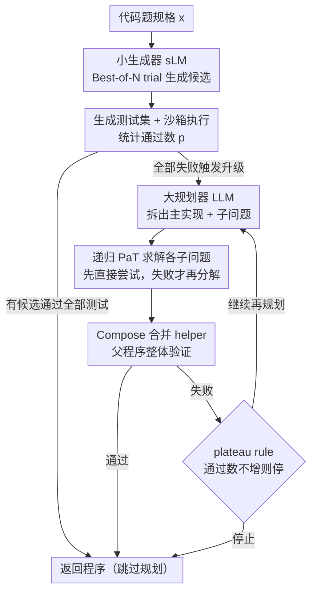

# PaT: Planning-after-Trial for Efficient Test-Time Code Generation

**会议**: ACL2026  
**arXiv**: [2605.07248](https://arxiv.org/abs/2605.07248)  
**代码**: 无公开代码（论文未给出）  
**领域**: 代码智能  
**关键词**: 测试时计算, 代码生成, 自适应规划, 执行验证, 异构模型

## 一句话总结
PaT 将代码生成中的“先规划再尝试”改成“先尝试、失败后再规划”，用执行反馈触发昂贵的分解步骤，并用小模型生成、大模型规划的异构配置显著改善 Pass@1 与推理成本之间的折中。

## 研究背景与动机
**领域现状**：LLM 代码生成已经从单次 few-shot 生成，逐渐走向测试时计算扩展。常见路线包括 Best-of-N 采样、用生成测试做候选筛选、迭代调试，以及把复杂题目拆成多个 helper function 再组合最终程序。后一类显式分解方法的代表是 FunCoder，它希望通过“先理解问题结构，再分别实现子问题”来解决直接生成容易失败的算法题。

**现有痛点**：分解确实能提升困难题的成功率，但它在简单题上也要付出完整的规划开销。论文指出，一个小模型在标准推理下已经能解决相当多基础代码题，例如 Qwen3-4B 在 foundational benchmarks 上的 Standard 平均 Pass@1 为 76.05%。如果所有题目都先规划，很多本可直接解决的问题会被额外规划、额外生成 helper、额外验证，导致成本快速膨胀。

**核心矛盾**：测试时计算的关键不只是“多花算力”，而是“在哪些样本上花算力”。Planning-before-Trial（PbT）把规划当成默认前置步骤，适合困难样本，却没有识别简单样本；而直接生成省钱但缺少在失败后升级策略的机制。这里的根本 trade-off 是：规划越早越稳，但越容易浪费；规划越晚越省，但必须有可靠的失败信号。

**本文目标**：作者要解决三个子问题：第一，如何用无需训练的方式判断一个题目是否值得进入规划流程；第二，如何在规划后复用已验证的子解，避免反复从零开始；第三，如何把不同规模模型分配到不同角色，让常见的生成尝试便宜，少数关键规划足够强。

**切入角度**：代码生成有一个比普通自然语言推理更硬的信号：程序可以执行，候选解可以用测试用例验证。PaT 的观察是，如果一个模型在多次直接尝试后仍无法通过测试，这比模型自评“题目很难”更可信；它说明当前问题很可能超出直接生成能力，此时再启动规划才更合理。

**核心 idea**：用执行失败作为规划触发器，把“所有样本先规划”改成“只有验证失败的样本才规划”，从而把昂贵测试时计算集中到真正需要分解的代码题上。

## 方法详解
PaT 不提出新的代码模型，而是重新组织测试时推理流程。它把一个代码题看作自然语言规格 $x$，目标是生成满足规格的程序 $\mathcal{F}$；系统由两个角色协作：生成器 $M_G$ 负责直接写代码或实现子问题，规划器 $M_P$ 负责在失败后把原题拆成 top-level implementation 和若干子问题规格 $\{x_i\}$，最终由 Compose 操作把主函数和已验证的 helper functions 合并成程序。

### 整体框架
输入是一道代码生成题，输出是最终程序，整个流程的核心是把"是否规划"这个决策推迟到执行反馈出现之后。PaT 先让生成器对同一规格做 Best-of-N trial 采样多个候选，再生成测试集 $\mathcal{T}(x)$ 在沙箱 Python runtime 中执行，用通过的测试数量 $p=\textsc{Evaluate}(\mathcal{F}, \mathcal{T}(x))$ 衡量候选质量。只要有一个候选通过全部测试，流程立即返回，大量简单题就此跳过规划器与额外子函数生成——这正是 PaT 省钱的来源。

只有当直接候选全部失败时，规划器才被唤醒：它基于原始问题和当前 helper 集合给出新的主实现草案以及若干子问题，每个未实现的子问题再递归调用 PaT（同样先直接尝试、失败才分解），子解通过各自测试后并入 helper 集合并组合回父问题整体验证。若组合后的父级程序通过全部测试则返回；若仍失败，系统进入再规划循环，让规划器在已成功 helper 的上下文上重新拆解，并通过 plateau rule（新一轮通过数不超过上一轮即停）防止被错误测试或无效分解拖入高成本循环。

### 关键设计

**1. 失败触发的自适应规划：把规划从默认前置改成失败后才升级**

FunCoder 这类 Planning-before-Trial 方法对每道题都先做分解，简单题也要无条件支付完整的 planning cost，而 benchmark 中简单、中等题占比并不低，浪费很可观。PaT 的做法是让生成器先执行 Best-of-N 候选生成并用测试集验证：存在候选通过全部测试就立即返回，所有候选都失败时才把这一信号解释为"直接解决不够"并触发规划器拆题。关键在于它用执行能否通过测试这一硬反馈（接受条件 $p=|\mathcal{T}(x)|$）作为难度判据，而不是依赖语言模型对自身难度的主观自评——代码题天然可执行，失败信号比自评更可靠，于是平均成本被显著压低。

**2. 生成测试、严格通过与平台期停止：用可控的二值开关对抗噪声测试**

PaT 需要的不是"哪个候选最像正确答案"，而是"是否应该升级到规划"这个明确开关，因此它没有采用 CodeT 式的 consensus scoring，而是为每题生成平均 6.7 个测试用例并要求候选必须通过全部测试才算成功。严格通过能减少错误接受，但自动生成的测试本身可能有噪声，于是 PaT 记录每轮通过数 $p^{(t)}$，当 $p^{(t)} \leq p^{(t-1)}$ 时触发 plateau rule 停止并返回上一轮最佳结果，避免为迎合少量 false positives 反复规划。Figure 3 显示这种严格信号在实践中可用：Qwen3-4B 下 63.4% 的 HumanEval 问题生成测试完全无 false positives。

**3. 小生成器 + 大规划器的异构配置：让高频生成便宜、低频规划够强**

单纯换小模型会让失败更频繁、规划调用增多，单纯全程用大模型又会抬高每次 trial 的基线成本，二者都不划算。PaT 把 generator 与 planner 解耦：generator 承担高频、相对局部的直接候选与子问题实现，适合 cost-efficient sLM；planner 承担低频、需要全局理解的分解与失败后再规划，适合更强 LLM。由于 planner 只在失败时才被调用，大模型的高单次成本被摊薄到少数困难样本上，于是异构配置的甜点是"生成器不弱到频繁触发规划，也不必强到为每个简单题支付大模型价格"。

### 损失函数 / 训练策略
PaT 不训练新的策略模型，也没有额外损失，它是一个纯 inference-time policy：靠 prompt、采样、测试生成、沙箱执行与递归规划完成。为公平比较，PaT 与 Best-of-N 使用相同采样设置 $N=5$、temperature=0.8，FunCoder 复现则按其原设置用更大的 $N=11$。成本建模上，论文用公开 token pricing 计算 LLM cost，并在附录给出理论分析：若规划成本低于异构配置节省的生成成本，则存在某个小模型生成器能比同质大模型策略有更低期望成本——这个分析服务于模型选择而非训练目标。

## 实验关键数据

### 主实验
论文在两类设置下评估 PaT。第一类是 homogeneous setting，即生成器和规划器使用同一个模型，用来回答“PaT 的策略本身是否优于 PbT”。第二类是 heterogeneous setting，即固定强规划器、替换更小生成器，用来回答“角色拆分是否进一步降低成本”。

基础代码生成基准包括 HumanEval、MBPP，以及 EvalPlus 扩展后的 HumanEval+ 和 MBPP+。困难基准使用 xCodeEval，并按 FunCoder 的 rating scheme 划分 Easy、Mid、Hard、Expert。指标是 Pass@1 和归一化 LLM cost。

| 设置 | 方法 | 平均 Pass@1 | 相对提升 | 相对成本 | 结论 |
|------|------|-------------|----------|----------|------|
| Qwen3-4B foundational | Standard | 76.05 | - | 1.00 | 小模型直接生成已能解决大量简单题 |
| Qwen3-4B foundational | FunCoder | 81.18 | +5.13 | 8.31 | 先规划能提升性能，但成本很高 |
| Qwen3-4B foundational | PaT | 83.13 | +7.08 | 4.85 | 比 FunCoder 更高分，成本约为其 58% |
| Qwen3-8B foundational | FunCoder | 83.82 | +6.18 | 9.43 | PbT 仍然昂贵 |
| Qwen3-8B foundational | PaT | 85.58 | +7.94 | 5.00 | 同规模下性能和成本均更优 |
| Qwen3-14B foundational | FunCoder | 84.84 | +5.03 | 8.82 | 规划开销随模型变大仍明显 |
| Qwen3-14B foundational | PaT | 86.18 | +6.37 | 4.91 | 用约 56% 的 FunCoder 成本得到更高平均分 |
| Qwen3-32B foundational | FunCoder | 87.66 | +4.31 | 8.93 | 大模型先规划也会浪费简单样本成本 |
| Qwen3-32B foundational | PaT | 88.37 | +5.02 | 5.09 | 保持最高平均 Pass@1，并显著降低规划开销 |

Table 1 的关键信息是：在 Qwen3 的 4B、8B、14B、32B 全部规模上，PaT 都比 FunCoder 有更高的平均 Pass@1，同时成本只有 FunCoder 的大约五到六成。跨模型族结果也类似：Llama3.1-8B 上 PaT 平均 73.31，高于 FunCoder 的 71.53；DeepSeek-Coder 上 PaT 平均 84.19，高于 FunCoder 的 83.60。

在 xCodeEval 这种更难的 benchmark 上，PaT 的性能优势仍然存在，但成本动态更复杂。

| 模型 | 方法 | Easy | Mid | Hard | Expert | All | Cost |
|------|------|------|-----|------|--------|-----|------|
| Qwen3-4B | Standard | 37.70 | 17.86 | 3.45 | 0.00 | 18.40 | 1.00 |
| Qwen3-4B | FunCoder | 55.19 | 29.46 | 12.64 | 0.00 | 29.00 | 12.95 |
| Qwen3-4B | PaT | 61.75 | 40.18 | 14.94 | 0.00 | 34.20 | 17.93 |
| Qwen3-8B | Standard | 54.10 | 28.57 | 5.75 | 0.00 | 27.20 | 1.00 |
| Qwen3-8B | FunCoder | 64.48 | 43.75 | 9.20 | 0.00 | 35.00 | 8.62 |
| Qwen3-8B | PaT | 69.95 | 45.54 | 11.49 | 0.00 | 37.80 | 6.98 |
| Qwen3-14B | Standard | 53.55 | 36.61 | 9.20 | 0.00 | 25.20 | 1.00 |
| Qwen3-14B | FunCoder | 73.22 | 52.68 | 18.39 | 0.00 | 41.80 | 9.03 |
| Qwen3-14B | PaT | 73.77 | 53.57 | 21.84 | 0.85 | 43.00 | 6.49 |
| Qwen3-32B | Standard | 54.64 | 39.29 | 11.49 | 0.00 | 30.80 | 1.00 |
| Qwen3-32B | FunCoder | 74.86 | 54.46 | 16.09 | 0.00 | 42.40 | 7.87 |
| Qwen3-32B | PaT | 74.32 | 54.46 | 18.39 | 1.69 | 43.00 | 6.00 |

xCodeEval 的结果说明，困难题越多，PaT 越会主动触发规划；对 Qwen3-4B 这样较弱的模型，它甚至比 FunCoder 更贵，因为失败更频繁。但这不是策略失效，而是 PaT 根据失败信号把更多预算投向真正难的样本，换来了 All 从 29.00 提升到 34.20。对 8B 及以上模型，PaT 同时取得更高 All 和更低成本，说明生成器能力足够后，自适应规划的成本收益更稳定。

### 消融实验
论文没有做传统“去掉模块 A/B”的训练式消融，而是通过策略对照、困难度分析与异构配置比较来拆解贡献。最关键的是 Table 3：固定 Qwen3-32B 作为强 planner 后，更小 generator 可以接近大模型同质 PaT 的性能，但成本大幅下降。

| Generator | Planner | 平均 Pass@1 | 相对成本 | 说明 |
|-----------|---------|-------------|----------|------|
| Qwen3-32B | Qwen3-32B | 88.37 | 1.00 | 同质大模型 PaT，作为性能上界参考 |
| Qwen3-14B | Qwen3-14B | 86.18 | 0.47 | 同质 14B，成本低但规划能力也下降 |
| Qwen3-14B | Qwen3-32B | 87.53 | 0.49 | 只升级 planner，接近 32B 性能但成本不到一半 |
| Qwen3-8B | Qwen3-8B | 85.58 | 0.25 | 同质 8B，成本很低但有性能差距 |
| Qwen3-8B | Qwen3-32B | 87.39 | 0.31 | 与 32B 同质只差 <1%，成本降到 31% |
| Qwen3-4B | Qwen3-4B | 83.13 | 0.14 | 最便宜但生成器偏弱 |
| Qwen3-4B | Qwen3-32B | 84.78 | 0.18 | 强 planner 有帮助，但 4B generator 成为瓶颈 |

这个对照很有说服力：8B+32B 是论文强调的甜点配置，平均 Pass@1 为 87.39，仅比 32B+32B 的 88.37 低不到 1 个点，但相对成本只有 0.31。换句话说，PaT 让“大模型只在少数失败样本上规划”成为可能，因此提升 planner 比把所有 trial 都换成大模型更划算。

### 关键发现
- PaT 的主要收益来自“跳过不必要规划”。在 foundational benchmarks 上，PaT 对所有 Qwen3 规模都比 FunCoder 更高分、更低成本，说明失败触发比固定 PbT 更适合真实难度分布。
- 生成测试不是完美的，但足够作为触发信号。Figure 3 显示大多数 HumanEval 问题的生成测试没有 false positives，少数噪声由 plateau rule 控制。
- 异构配置的最佳点不是越小越好。4B+32B 很便宜但性能提升有限，8B+32B 则在成本和能力之间更平衡。
- 对非常困难的数据，PaT 可能主动花更多钱。Qwen3-4B 在 xCodeEval 上成本高于 FunCoder，原因是小模型失败太频繁，但这也带来明显性能提升。
- PaT 与模型族无强绑定。Llama3.1 和 DeepSeek-Coder 上的结果说明，策略优势不只是 Qwen3 特例。

## 亮点与洞察
- **把验证失败当成预算分配信号**：论文最巧的地方是没有训练一个难度分类器，而是直接用执行失败触发规划。代码生成任务天然有可执行反馈，这比额外学习 policy 更轻，也更容易复现。
- **反转 PbT 的默认假设**：FunCoder 默认“复杂题需要规划，所以先规划”；PaT 默认“能直接解就不要规划”。这个反转很小，但对成本曲线影响很大，因为 benchmark 中简单和中等题占比并不低。
- **异构模型配置非常实用**：许多系统已经有不同尺寸模型可用，PaT 给了一个自然分工：小模型承担高频生成，大模型承担少数规划。这个思想可以迁移到数学推理、工具调用和 agent workflow，只要任务有可靠的失败检测信号。
- **平台期停止是必要的小设计**：如果只设“失败就继续规划”，系统可能被错误测试卡住。用通过数不再提升作为停止条件，虽简单，却把递归规划变成一个可控的 test-time loop。

## 局限与展望
- PaT 强依赖验证质量。代码生成可以执行和生成测试，但在开放式生成、前端 UI、长文写作等任务中，很难得到同样清晰的通过/失败信号。
- 自动生成测试仍可能有 false positives 或漏测。严格通过全部测试能降低误接受，但如果测试本身错了，PaT 可能错误触发规划或过早停止。
- 在非常困难的数据上，小模型生成器会频繁失败，导致 planner 调用过多。xCodeEval 上 Qwen3-4B 的高成本说明，异构配置必须调 generator 尺寸，不能机械地选择最便宜模型。
- Expert 级 xCodeEval 仍几乎没有被解决。即便 PaT 在 Qwen3-14B 和 32B 上把 Expert 从 0 推到 0.85/1.69，绝对成功率仍很低，说明递归分解无法替代更强算法推理能力。
- 论文主要评估开源模型和 Python 风格执行环境。未来可以补充更多语言、真实工程仓库、带依赖的 multi-file code generation，以及与迭代调试框架结合的结果。

## 相关工作与启发
- **vs FunCoder**: FunCoder 采用固定的 Planning-before-Trial，先把问题拆成函数层级再求解；PaT 则先直接尝试，失败后才规划。PaT 的优势是避免简单题上的规划浪费，劣势是在弱模型面对困难题时可能触发更多规划轮次。
- **vs CodeT**: CodeT 用生成测试做 consensus-based selection，从多个候选中选最稳的输出；PaT 用测试作为二值控制信号，决定是否升级到规划。两者都利用执行反馈，但优化目标不同。
- **vs Best-of-N**: Best-of-N 只是扩大候选池，无法在候选都错时改变解题结构；PaT 在 Best-of-N 失败后引入分解和递归求解，因此对 hard case 更有帮助。
- **vs 学习式自适应 policy**: 一些方法会训练额外模型判断是否规划或选择策略；PaT 不训练 policy，而是直接用执行失败作为触发条件。启发是：如果任务本身能给硬反馈，优先用反馈闭环，而不是先引入额外分类器。

## 评分
- 新颖性: ⭐⭐⭐⭐ 反转规划顺序的想法简洁但有效，创新点主要在测试时策略和异构角色分配，而不是新模型结构。
- 实验充分度: ⭐⭐⭐⭐ 覆盖多个 Qwen3 尺寸、Llama/DeepSeek 跨模型族、基础与困难基准，并给出成本分析；如果有更多真实工程任务会更完整。
- 写作质量: ⭐⭐⭐⭐ 动机和 cost-performance 叙事清楚，方法算法也易读；部分表格和附录信息较密，需要读者自己连接策略与实现细节。
- 价值: ⭐⭐⭐⭐⭐ 对实际代码生成系统很有工程价值，因为它直接回答“什么时候值得调用更贵推理流程”这个部署问题。

<!-- RELATED:START -->

## 相关论文

- [\[ACL 2026\] Ro-SLM: Onboard Small Language Models for Robot Task Planning and Operation Code Generation](ro-slm_onboard_small_language_models_for_robot_task_planning_and_operation_code_.md)
- [\[NeurIPS 2025\] Program Synthesis via Test-Time Transduction](../../NeurIPS2025/code_intelligence/program_synthesis_via_test-time_transduction.md)
- [\[ACL 2026\] CollabCoder: Plan-Code Co-Evolution via Collaborative Decision-Making for Efficient Code Generation](collabcoder_plan-code_co-evolution_via_collaborative_decision-making_for_efficie.md)
- [\[ACL 2026\] DUET: Dual Execution for Test Output Prediction with Generated Code and Pseudocode](duet_dual_execution_for_test_output_prediction_with_generated_code_and_pseudocod.md)
- [\[ICLR 2026\] IMSE: Intrinsic Mixture of Spectral Experts Fine-tuning for Test-Time Adaptation](../../ICLR2026/code_intelligence/imse_intrinsic_mixture_of_spectral_experts_fine-tuning_for_test-time_adaptation.md)

<!-- RELATED:END -->
