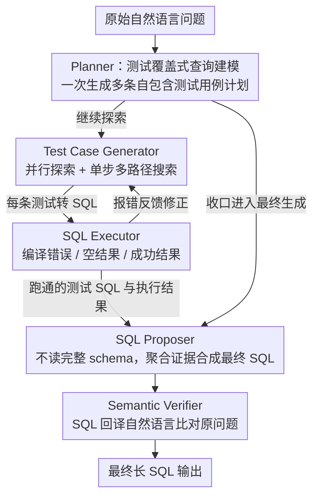

# PExA: Parallel Exploration Agent for Complex Text-to-SQL

**会议**: ACL2026  
**arXiv**: [2604.22934](https://arxiv.org/abs/2604.22934)  
**代码**: 未公开  
**领域**: LLM Agent / Text-to-SQL / 数据库问答  
**关键词**: Text-to-SQL, LLM Agent, 并行探索, 软件测试, Spider 2.0

## 一句话总结
PExA 把复杂 Text-to-SQL 改写成“为自然语言查询生成并执行一组语义测试用例”的并行探索问题，通过 Planner、Test Case Generator 和 SQL Proposer 三个子代理在 Spider 2.0 上提升执行准确率，并把延迟控制在与强基线相近的水平。

## 研究背景与动机
**领域现状**：Text-to-SQL 已经从早期的解析模型发展到 LLM agent。面对 Spider 2.0 这类真实复杂数据库基准，系统通常需要 schema linking、数据库压缩、多步推理、执行反馈和自我修正，才能处理大表、多库、嵌套类型和长 SQL。

**现有痛点**：强性能往往靠更长的 sequential reasoning 或更多工具调用换来。一个 agent 先规划，再查 schema，再写 SQL，再执行，再修正，性能可能上升，但延迟也按步骤累加。交互式数据分析里，用户很难接受每个问题都等待很久。

**核心矛盾**：复杂查询确实需要探索更多数据库信息，但探索不一定必须串行。现有方法把用户问题当作单个长 SQL 生成任务，容易在一条推理链里卡住；如果拆成可并行验证的语义需求，就能同时收集证据。

**本文目标**：作者希望改善 Text-to-SQL 的性能-延迟 Pareto 前沿：既要在 Spider 2.0 上取得更高执行准确率，又要避免通过线性增加推理步骤来堆性能。

**切入角度**：论文借鉴软件测试。复杂程序不是一次性证明正确，而是通过覆盖不同功能需求的测试套件来验证。复杂 NL 查询也可以被看成若干语义需求的集合，先生成一批更简单的 SQL “测试用例”覆盖过滤、连接、聚合、存在性检查等局部语义，再用这些执行结果支撑最终 SQL。

**核心 idea**：把 Text-to-SQL 从单链生成改成测试覆盖式并行探索，用多条可执行 test-case SQL 同时探测数据库，最后聚合证据生成完整 SQL。

## 方法详解
PExA 的关键是把“想清楚最终 SQL”前置为“先验证一组小问题”。这些小问题不是普通 query decomposition，因为它们可以探索原始问题之外但相关的数据库信息，例如某个字段有哪些值、某个 join 是否能返回非空结果、某个过滤条件是否合理。测试用例执行结果成为最终 SQL 的 grounding context。

### 整体框架
系统包含三个子代理和两个工具。Planner 接收原始自然语言问题，生成一组自包含测试用例，并决定是否继续探索或进入最终生成。Test Case Generator 把每个自然语言测试用例转成 SQL，调用 SQL Executor 执行并根据错误反馈修正。SQL Proposer 只拿原始问题、测试用例 SQL 和执行结果，不拿完整数据库元数据，然后合成最终长 SQL。两个工具分别是 SQL Executor 和 Semantic Verifier：前者返回编译错误、空结果或成功结果；后者把 SQL 回译成自然语言并与原问题比较，识别语义偏差。

并行性贯穿三个位置。Planner 一次前向生成多条测试计划；Test Case Generator 对互不依赖的测试用例并行生成和执行；每个测试用例内部还一次性生成多种候选 SQL，形成 single-step multi-path search。最终延迟近似由最慢的一条分支决定，而不是所有分支延迟之和。

### 关键设计

**1. 测试覆盖式查询建模：把复杂问题拆成一组可独立执行的 SQL 测试，用覆盖逼近原语义**

复杂 Text-to-SQL 难在一条推理链里要同时想清 schema 选择、值约束、join 路径和聚合逻辑，任何一环猜错都会让最终长 SQL 崩掉。PExA 借软件测试的直觉换了个思路：与其一次性证明整段程序正确，不如用一套覆盖不同功能需求的测试逐项验证。它为原问题生成若干自包含、可执行的小 SQL「测试用例」，每条覆盖一个局部要求——filter、join、aggregation、existence check 或某字段的值分布。

这和普通 query decomposition 的差别很关键：子问题分解只是复述原问题里已经写明的显式语义，而测试用例可以主动探测原查询周边、但题面没直接说的数据库信息，比如「某个 join 会不会返回空集」「这个过滤条件到底落在哪些取值上」。这些测试 SQL 的执行结果随后成为最终合成的 grounding context，让 Proposer 不是凭空写 SQL，而是基于已经跑通的局部证据来拼装。

**2. 三子代理分工：把规划、局部执行、最终合成拆开，各自只面对更窄的上下文**

复杂 Text-to-SQL 的错误常集中在早期规划和长上下文推理——一个 agent 既要读完整 schema 又要想全局逻辑，很容易顾此失彼。PExA 把流程切成三个子代理：Planner 接原始问题，生成一组自包含测试用例并决定是继续探索还是收口进入最终生成；Test Case Generator 结合轻量 schema linking 与压缩 schema，把每条自然语言测试转成可执行 SQL，调用 SQL Executor 执行、再按报错反馈修正；SQL Proposer 只拿原始问题、测试用例 SQL 和它们的执行结果来合成最终长 SQL，刻意不读完整数据库元数据。

配套两个工具支撑这条链：SQL Executor 返回编译错误、空结果或成功结果；Semantic Verifier 把 SQL 回译成自然语言再与原问题比对，识别语义偏差。分工后每个代理只解决一个子问题，尤其 Proposer 摆脱了庞大 schema 的上下文负担，专注「整合证据」这一件事。

**3. 并行探索与单步多路径搜索：扩大搜索宽度，却不让宽度线性累加成延迟**

Text-to-SQL 的不确定性来自 schema 选择、值约束和 join 路径，扩大搜索宽度能提高命中正确语义的概率——但若串行展开，宽度会原样变成等待时间，交互式分析场景无法接受。PExA 让并行贯穿三处：Planner 一次前向就生成多条测试计划；Test Case Generator 对互不依赖的测试用例并行生成与执行；每条测试用例内部还在一次 LLM 调用里产出多个候选 SQL，形成 single-step multi-path search，再靠执行反馈快速淘汰失败路径。结果是最终延迟近似由最慢的那一条分支决定，而非所有分支延迟之和——论文实测同样的搜索空间，顺序展开约需 680 秒，并行后降到 351 秒。

### 一个完整示例：一条复杂查询如何被「测」出来

以一个 Spider 2.0 风格的问题为例——「找出过去一年里，下单金额排名前三的地区中，复购率最高的那个地区」。这条问题在一条链里直接写 SQL 很容易在 join 和聚合上猜错，PExA 的走法是：

1. **Planner** 一次性铺开几条测试计划，分别针对局部语义：「过去一年的订单怎么筛时间」「按地区聚合金额并排序取前三」「复购率怎么定义、用哪些表算」「地区字段在哪张表、有哪些取值」。
2. **Test Case Generator** 把这几条并行转成可执行的小 SQL 同时下发：探时间字段的那条发现日期列是 `order_date` 而非 `created_at`；探地区取值的那条返回了真实地区列表，顺带确认 join 键非空；算金额排序的那条直接跑通返回前三地区。每条测试内部又一次生成 2~3 个候选写法，跑挂的当场被执行反馈淘汰。
3. **SQL Proposer** 只接过这几条已跑通的测试 SQL 和它们的结果（而非整库 schema），把「时间筛选 + 金额前三 + 复购率定义」拼成最终长 SQL，再交给 SQL Executor 跑一遍、Semantic Verifier 回译比对确认没偏离原意。

整条流程里耗时的几次数据库探查是同时发生的，所以 wall time 接近单条最慢分支，而最终 SQL 已经站在一堆验证过的局部证据上，而不是一次性的盲猜。

### 损失函数 / 训练策略
PExA 是推理时 agent 框架，不训练新的模型，也没有监督损失或强化学习目标。主要“优化目标”体现在推理过程：最大化测试覆盖和最终 SQL 执行准确率，同时通过并行执行约束 wall time。实现上使用 LangGraph 组织 agent，并限制每个 LLM agent 的最大迭代次数防止循环；主实验使用 GPT-o3，部分分析比较 GPT-5、Claude Sonnet-4、Claude Opus-4 以及不同组件混搭。

## 实验关键数据

### 主实验
实验使用 Spider 2.0 的 Snow 和 Lite* 版本。Snow 有 547 个样例、150+ 数据库，平均每个数据库约 800 列，使用 Snowflake dialect；Lite* 排除 BigQuery 样例。指标为 Execution Accuracy (EX)、EX@4 和平均 wall time。

| 方法 | Snow EX | Snow EX@4 | Lite* EX | Lite* EX@4 | Wall Time (min) |
|------|---------|-----------|----------|------------|-----------------|
| Spider-Agent | 25.2 | 27.4 | 26.2 | 28.7 | 5.90 |
| ReFoRCE | 36.6 | 39.7 | 36.2 | 39.5 | 5.44 |
| Chat2DB | 44.1 | - | - | - | - |
| AgenticData | - | - | 44.5 | - | - |
| PExA | 45.7 | 49.5 | 46.6 | 49.9 | 5.55 |

| 额外对比 | Snow EX | Snow EX@4 | 说明 |
|------|---------|-----------|------|
| PExA | 45.7 | 49.5 | 默认 schema linking |
| PExA w/ Gold Schema | 47.2 | 50.8 | 使用金标 schema 只提升约 1.5 点 |
| 更新 leaderboard 结果 | 70.2 | - | 论文称投稿时达到 Spider 2.0 新 SOTA |

### 消融实验

| 配置 | EX | 相对 Full | 解释 |
|------|----|-----------|------|
| PExA Full | 42.9 | - | 单次运行 Snow 分析设置 |
| w/o Plan-time parallelization | 40.0 | -2.9 | 规划阶段并行测试套件很关键 |
| w/o Test-time parallelization | 39.9 | -3.0 | 测试 SQL 并行生成/执行贡献最大 |
| w/o Semantic Verifier | 42.3 | -0.6 | 语义验证能修掉部分偏差，但不是主要瓶颈 |
| w/o Proposer | 41.1 | -1.8 | 直接由测试阶段产物返回会损失整合能力 |

| 并行度设置 | 执行分支=1 | 执行分支=2 | 执行分支=无限制 |
|----------|----------|----------|----------------|
| 规划分支=1 | 38.4 | 39.1 | 40.0 |
| 规划分支=2 | 38.9 | 39.5 | 41.1 |
| 规划分支=无限制 | 39.9 | 41.6 | 42.9 |

| 延迟模式 | 总延迟估计 |
|------|------------|
| 顺序执行相同搜索空间 | 680 秒 |
| 并行执行 | 351 秒 |

### 关键发现
- PExA 在 Snow 和 Lite* 上都超过 ReFoRCE，Snow EX 从 36.6 提到 45.7，Lite* EX 从 36.2 提到 46.6，且 wall time 5.55 分钟与 ReFoRCE 的 5.44 分钟接近。
- 消融显示两个并行组件各自贡献约 3 个 EX 点，比 Semantic Verifier 的 0.6 点更大，说明性能主要来自并行搜索宽度，而不是最后的语义检查。
- 限制规划分支和执行分支会连续降低准确率，从 42.9 降到 38.4；这给系统部署提供了可调旋钮，可以用更少分支换更低成本。
- Gold schema 只带来约 1.5 点提升，说明当前主要瓶颈不是 schema linking，而是复杂语义规划和长程逻辑组合。
- 错误分析指出主要失败来自语义误解和初始规划缺陷，而不是 SQL 语法错误。这与作者“未来应改进问题理解和计划搜索”的结论一致。

## 亮点与洞察
- 软件测试视角非常贴合复杂 Text-to-SQL。好的 SQL 不是凭空写出来的，而是要确认每个局部假设都能在数据库中跑通；PExA 把这种工程直觉显式变成 agent 结构。
- PExA 的测试用例不局限于原问题分解，可以探索非目标但相关的数据库信息。这比传统 decomposition 更主动，也更接近数据分析师在真实库里边查边写 SQL 的工作方式。
- 并行化不是简单“多采样”。它让每条探索路径有明确语义目标，避免无控制的 self-consistency 浪费 token。单步多路径搜索也比多轮串行反思更适合低延迟场景。
- Gold schema 对性能影响小这一点很有价值：在 Spider 2.0 这种大 schema 场景里，很多人直觉上会先优化 schema linking，但 PExA 表明高层计划和语义覆盖可能更值得投入。

## 局限与展望
- PExA 依赖强闭源 LLM，主实验使用 GPT-o3，成本和可复现性受限。虽然论文分析了其他模型混搭，但完整开放模型版本仍需验证。
- 并行探索降低 wall time，但不一定降低总 token 和 API 成本。对于生产环境，如何动态选择分支数、提前停止、复用测试结果，是关键工程问题。
- 测试用例质量高度依赖 Planner。如果一开始覆盖方向错了，后续并行执行只会更快地收集无关证据；错误分析也确认规划错误是主要瓶颈。
- Semantic Verifier 通过 SQL 回译自然语言判断语义，仍可能被 LLM 自身误判影响。更强的验证可能需要基于结果集、单元测试或符号约束。
- 目前只验证了 Spider 2.0，未来值得迁移到企业 BI、跨数据库方言、代码生成和其他需要“可执行测试覆盖”的 agent 任务。

## 相关工作与启发
- **vs Spider-Agent**: Spider-Agent 更像传统工具增强 agent，PExA 的差异在于把探索显式组织成并行测试套件，因此准确率和延迟前沿更好。
- **vs ReFoRCE**: ReFoRCE 强调数据库压缩和 inference-time scaling，PExA 也借鉴轻量 schema linking，但核心增量是 test-case SQL 的并行覆盖和最终证据聚合。
- **vs query decomposition**: 普通分解只拆原始问题的显式子语义，PExA 的测试用例可主动探索周边 schema、值分布和中间结果，覆盖范围更大。
- **vs self-consistency / 多采样**: 多采样常缺少方向控制；PExA 的每个分支都有测试目标和执行反馈，因此更像结构化搜索，而不是随机多生成。

## 评分
- 新颖性: ⭐⭐⭐⭐⭐ 用软件测试覆盖来重构 Text-to-SQL agent，很有辨识度，也自然解释了为什么能并行。
- 实验充分度: ⭐⭐⭐⭐☆ Spider 2.0 主结果、组件消融、并行度和延迟分析都到位，但闭源 LLM 依赖和开放复现不足。
- 写作质量: ⭐⭐⭐⭐☆ 方法叙述清晰，表格直接支持主张；若能给更多真实 test case 轨迹会更直观。
- 价值: ⭐⭐⭐⭐⭐ 对 Text-to-SQL、数据分析 agent 和一般工具使用 agent 都有可复用启发，尤其是“测试先行”的并行探索范式。

<!-- RELATED:START -->

## 相关论文

- [\[ACL 2026\] R$^3$-SQL: Ranking Reward and Resampling for Text-to-SQL](r3-sql_ranking_reward_and_resampling_for_text-to-sql.md)
- [\[ACL 2026\] PV-SQL: Synergizing Database Probing and Rule-based Verification for Text-to-SQL Agents](pv-sql_synergizing_database_probing_and_rule-based_verification_for_text-to-sql_.md)
- [\[ACL 2026\] DPC: Training-Free Text-to-SQL Candidate Selection via Dual-Paradigm Consistency](dpc_training-free_text-to-sql_candidate_selection_via_dual-paradigm_consistency.md)
- [\[ACL 2025\] STaR-SQL: Self-Taught Reasoner for Text-to-SQL](../../ACL2025/code_intelligence/star-sql_self-taught_reasoner_for_text-to-sql.md)
- [\[ACL 2025\] SHARE: An SLM-based Hierarchical Action CorREction Assistant for Text-to-SQL](../../ACL2025/code_intelligence/share_text_to_sql_correction.md)

<!-- RELATED:END -->
