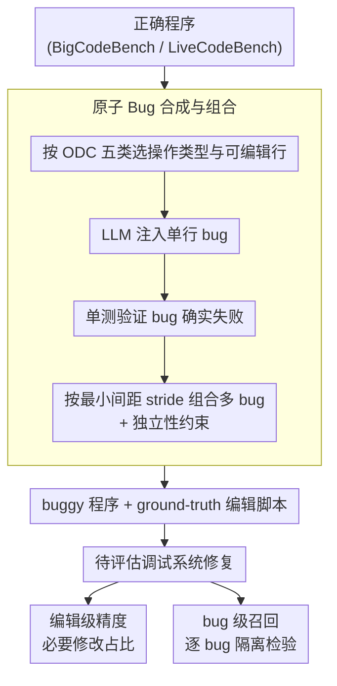

# Precise Debugging Benchmark: Is Your Model Debugging or Regenerating?

**会议**: ACL 2026 Findings  
**arXiv**: [2604.17338](https://arxiv.org/abs/2604.17338)  
**代码**: [GitHub](https://github.com)  
**领域**: 代码智能 / 调试评估  
**关键词**: 代码调试, LLM编程, 精确编辑, 基准测试, 代码重生成

## 一句话总结

本文揭示前沿 LLM 在调试任务中的"重生成"倾向——通过引入 PDB 框架和编辑级精度/bug 级召回指标，发现 GPT-5.1-Codex 等模型虽能通过 76% 以上单元测试，但编辑精度不足 45%，且迭代和 agent 调试策略也无法显著改善精度。

## 研究背景与动机

**领域现状**：LLM 在代码生成领域取得了巨大成功，能从自然语言描述合成复杂算法。然而，真实软件开发中的主要工作不是从零生成，而是调试和维护。

**现有痛点**：(1) 当给 LLM 有 bug 的代码时，模型往往重写大部分甚至全部代码来"修复"——这虽然能通过测试，但在现实代码库中代价高昂、风险大、难以 review；(2) 现有调试基准仅用单元测试通过率评估，无法区分精准修复和大规模重写——重写整个函数和修改一行 bug 得到相同分数；(3) 对于多 bug 程序，仅修复了部分 bug 的模型与完全未修复的模型得到相同的零分。

**核心矛盾**：单元测试通过率与调试精度之间存在负相关——模型越是激进地重写代码，越可能通过测试（功能正确），但编辑精度越低。现有评估体系奖励重生成行为，无法激励精准调试。

**本文目标**：(1) 设计一个能区分"精准调试"和"代码重生成"的评估框架；(2) 量化当前前沿模型距离精准调试有多远；(3) 评估迭代和 agent 调试策略是否改善精度。

**切入角度**：定义"编辑级精度"和"bug 级召回"两个新指标——精度衡量模型修改中有多少是必要的，召回衡量有多少 bug 被正确修复。通过自动注入验证过的原子 bug 并组合为多 bug 程序，构建有 ground-truth 编辑脚本的调试基准。

**核心 idea**：将调试评估从程序级（通过/不通过）下沉到编辑级（哪些修改是必要的、哪些是多余的），通过原子 bug 合成和独立性验证构建精确的评估基准。

## 方法详解

### 整体框架

PDB（Precise Debugging Benchmark）的核心是把调试评估从"程序整体能否通过测试"下沉到"哪些编辑是必要的、哪些 bug 被真正修好"，因此它需要一批带 ground-truth 编辑脚本的 buggy 程序。框架分两阶段：生成阶段从现有编程数据集出发，用 LLM 把验证过的原子 bug 注入正确程序，再组合成多 bug 程序；评估阶段让调试系统修复这些 buggy 程序，并用编辑级精度和 bug 级召回两个新指标衡量修复的"精准度"而非仅仅"功能正确性"。数据上，基准包含 PDB-Single-Hard（5,751 个单行 bug 样本）和 PDB-Multi（256 个多行 bug 样本），从 BigCodeBench 和 LiveCodeBench 构建，bug 生成器池由 GPT-5.1-Codex、Claude-4.5-Sonnet 与 Gemini-2.5-Pro 组成；整个框架不涉及任何模型训练。

### 关键设计

**1. 原子 Bug 合成与组合：构造有 ground-truth 编辑脚本、可精确度量的 buggy 程序**

要衡量"修改是否必要"，前提是知道正确答案到底改了哪几行，而历史提交挖掘出来的 bug 既无干净的 ground-truth 编辑、又掺杂无关改动。PDB 改为主动注入：对每个 ground-truth 程序，按 ODC（正交缺陷分类）的 5 个类别（赋值、检查、算法、构建/打包、时序）随机选择操作类型（插入/删除/替换）和可编辑行，用 LLM 注入单行 bug，并通过单元测试验证 bug 确实有效（注入后必须失败）。多 bug 程序再由多个独立原子 bug 组合而成，要求 bug 之间有最小间距 stride 并满足独立性约束。这样设计是为了保证原子性（修复不能靠只改 bug 的子集蒙混过关）和独立性（修一个 bug 不影响另一个 bug 的修复），而这正是精确定义编辑级精度与 bug 级召回的前提。

**2. 编辑级精度 (Edit-Level Precision)：量化模型的修改里有多少是真正必要的**

传统单元测试通过率完全无法惩罚"为修一行 bug 而重写整个函数"的多余改动，于是模型越激进重写越容易拿高分。精度指标把评估下沉到行级别，直接回答"这处修改是必要的吗"：$\text{precision}_\epsilon = \frac{1}{|\hat{E}|} \sum_{i=1}^k F_\mathcal{U}(\hat{C}_i) \cdot (|\hat{E}_i|)_\epsilon$，其中用 map 函数把 ground-truth 编辑与模型预测编辑对应起来，用 essential 函数搜索能让测试通过的最小必要编辑子集，再引入容差 $\epsilon$ 允许一定的编辑冗余。分母是模型实际编辑量、分子是其中被判定为必要的部分，于是大规模重写会被直接拉低分数。

**3. Bug 级召回 (Bug-Level Recall)：在多 bug 场景下给部分修复部分分**

若沿用程序级"全有或全无"的评分，一个修好了 3 个 bug 里 2 个的模型会和完全没修的模型同样得零分，这既不公平也无法刻画调试能力。召回把粒度下沉到单个 bug：$\text{recall} = \frac{1}{k} \sum_{i=1}^k F_\mathcal{U}(\hat{C}_i)$，对每个 bug $i$ 构建一个伪修正版本——保留其他所有 bug 的 ground-truth 修复，只替换上模型对 bug $i$ 的修改，再看单元测试能否通过。正因为前一步保证了 bug 之间相互独立，这种"逐 bug 隔离检验"才能成立，从而把多 bug 程序的修复率刻画为已正确修复 bug 的比例。

## 实验关键数据

### 主实验

| 模型 | 精度 | 召回 | 单元测试 (%) |
|------|------|------|-------------|
| Claude-Sonnet-4.5 | **71.8** | **81.4** | 75.7 |
| Gemini-2.5-Pro | 71.4 | 83.5 | 78.1 |
| Qwen3-Coder-480B | 65.8 | 77.2 | 70.3 |
| DeepSeek-V3.2 | 48.4 | 70.0 | 71.4 |
| DeepSeek-V3.2-Thinking | 45.0 | 71.2 | **79.0** |
| GPT-5.1-Codex | 39.7 | 71.7 | 76.1 |

### 消融实验

| 分析维度 | 结果 |
|----------|------|
| 自由提示 vs 最小编辑提示 | 自由提示下所有模型精度暴跌，Gemini 下降 40 个绝对点 |
| 迭代调试（3 轮） | 提升测试通过率和召回，但精度不变或下降 |
| Agent 调试（含测试反馈） | Claude-Code 精度仍仅 50%，额外反馈反而加剧重生成 |
| Bug 数量影响 | Bug 越多，精度越低（更多多余修改），召回与数据集相关 |

### 关键发现

- **排名反转**：GPT-5.1-Codex 单元测试通过率 76.1% 排名靠前，但精度 39.7% 排末位——它是最严重的"重生成者"
- Qwen3-Coder-480B 虽然通过率较低（70.3%），但精度高达 65.8%——"弱但精准"
- 模型调试行为可分为四类：精准通过型、弱但精准型、弱但能定位型、通过导向型（重生成）
- 迭代和 agent 策略改善功能正确性但不改善精度——当前方法通过扩大修改范围来修 bug，而非精确定位
- 约 1.65% 的案例存在 bug 交互，PDB 的独立性假设在绝大多数情况下成立

## 亮点与洞察

- "调试还是重生成？"这个问题切中了当前代码 LLM 的核心痛点——揭示了单元测试评估的根本缺陷
- 编辑级精度和 bug 级召回的定义精确且有实践意义——可直接用于改进后训练流程
- GPT-5.1-Codex 精度仅 39.7% 这一发现非常震撼——最强模型反而最不精准，说明后训练流程可能在强化重生成行为

## 局限与展望

- 假设 bug 独立性在现实软件中常常不成立——交互 bug 是调试的真正难点
- 仅评估 Python，其他语言的适用性需验证
- 语义等价但形式不同的修复可能被错误惩罚
- 未探索如何改进后训练流程以提升精度——这是最有价值的后续方向

## 相关工作与启发

- **vs DebugBench**: DebugBench 从历史提交挖掘 bug，但仅用单元测试评估，无法衡量精度；PDB 引入编辑级评估填补了这一空白
- **vs SWE-bench**: SWE-bench 关注真实 repo 级别的 bug 修复，涉及更复杂的定位，但同样缺乏精度评估；两者互补
- **vs APR (自动程序修复)**: 传统 APR 关注最小修复，PDB 将这一理念引入 LLM 评估

## 评分

- 新颖性: ⭐⭐⭐⭐⭐ 提出调试评估的范式转变——从程序级到编辑级，发现极有冲击力
- 实验充分度: ⭐⭐⭐⭐⭐ 9个前沿模型、迭代/agent/多行/分类分析，手工验证指标准确性
- 写作质量: ⭐⭐⭐⭐⭐ 问题定义精确，形式化严谨，实验分析深入
- 价值: ⭐⭐⭐⭐⭐ 直接揭示了代码 LLM 后训练的根本问题，对社区有重要启示

<!-- RELATED:START -->

## 相关论文

- [\[ACL 2025\] MLDebugging: Towards Benchmarking Code Debugging Across Multi-Library Scenarios](../../ACL2025/code_intelligence/mldebugging_towards_benchmarking_code_debugging_across_multi-library_scenarios.md)
- [\[ACL 2025\] Revisit Self-Debugging with Self-Generated Tests for Code Generation](../../ACL2025/code_intelligence/revisit_self-debugging_with_self-generated_tests_for_code_generation.md)
- [\[ACL 2026\] QiMeng-PRepair: Precise Code Repair via Edit-Aware Reward Optimization](qimeng-prepair_precise_code_repair_via_edit-aware_reward_optimization.md)
- [\[ACL 2026\] River-LLM: Large Language Model Seamless Exit Based on KV Share](river-llm_large_language_model_seamless_exit_based_on_kv_share.md)
- [\[ACL 2025\] CoCo-Bench: A Comprehensive Code Benchmark for Multi-task Large Language Model Evaluation](../../ACL2025/code_intelligence/coco-bench_a_comprehensive_code_benchmark_for_multi-task_large_language_model_ev.md)

<!-- RELATED:END -->
