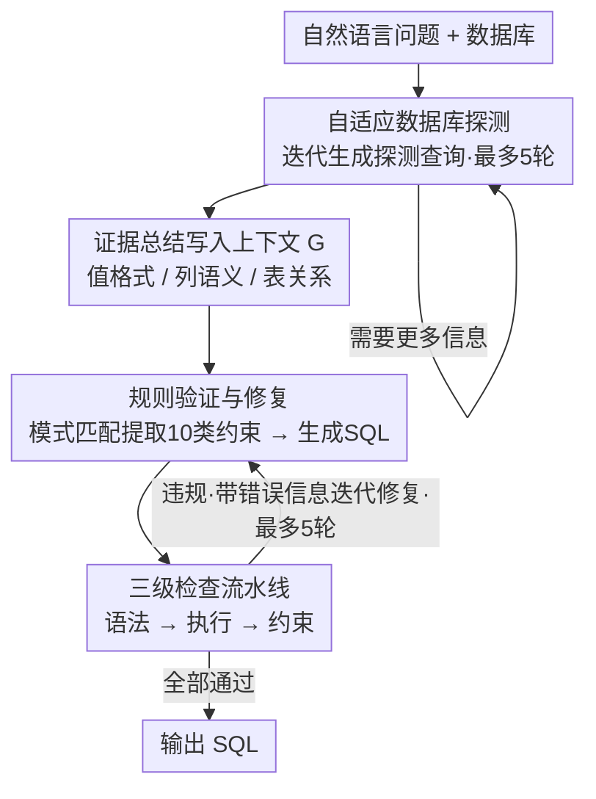

# PV-SQL: Synergizing Database Probing and Rule-based Verification for Text-to-SQL Agents

**会议**: ACL 2026 Findings  
**arXiv**: [2604.17653](https://arxiv.org/abs/2604.17653)  
**代码**: [GitHub](https://github.com/magic-YuanTian/PV-SQL)  
**领域**: Text-to-SQL / Agent  
**关键词**: Text-to-SQL, 数据库探测, 规则验证, 语义约束, Agent框架

## 一句话总结

本文提出 PV-SQL，一个 Agent 式 Text-to-SQL 框架，通过 Probe（迭代生成探测查询发现数据库值格式/列语义/表关系）和 Verify（基于模式匹配提取可验证约束并构建检查清单）两个互补组件，在 BIRD 基准上比最佳基线高 5% 执行准确率和 20.8% 有效效率分。

## 研究背景与动机

**领域现状**：Text-to-SQL 在 LLM 加持下取得重大进展，但面临持续挑战——schema 理解、值锚定（将自然语言映射到精确数据库值）和约束满足（确保 SQL 忠实捕捉所有语义）。

**现有痛点**：(1) 约 41% 的失败来自数据库误解——模型不知道"California"存为"CA"还是全称；(2) 即使理解正确，SQL 生成本身缺乏验证机制——可能产生语法正确但语义错误的查询；(3) 现有验证方法（LLM 自验证/测试用例生成）不可靠或计算昂贵。

**核心矛盾**：仅依赖 schema 描述（DDL）不包含实际数据值，但将所有值放入提示又不可行。需要按需、问题驱动地探索数据库内容。

**本文目标**：通过自适应数据库探测解决理解错误，通过确定性规则验证解决合成错误。

**切入角度**：Probe 增强输入（用真实数据库证据丰富上下文），Verify 增强输出（确保语义约束被满足）——两者解决互补的失败类型。

**核心 idea**：让 SQL Agent 像数据分析师一样先"看看数据长什么样"再写查询，然后像代码审查者一样逐条检查约束是否满足。

## 方法详解

### 整体框架

PV-SQL 把 Text-to-SQL 的失败拆成两类——输入侧的数据库/问题误解、输出侧的 SQL 合成错误——并用两个互补阶段分别对症。给定自然语言问题与数据库，Agent 先进入 Probe 阶段：像数据分析师一样迭代生成临时探测查询（最多 5 轮），看真实数据长什么样，把发现的值格式、列语义、表关系等证据积累进上下文 $G$；随后进入 Verify & Repair 阶段：用模式匹配从问题中提取可验证约束并生成 SQL，再逐条检查约束是否满足，不满足就带着错误信息迭代修复（最多 5 轮），最终输出执行通过且约束齐备的 SQL。整个框架免训练，可直接套在 6 种基础 LLM（GPT-4o/4.1、Claude 3.5/3.7、Gemini 2.0/2.5）之上。

### 关键设计

**1. 自适应数据库探测 (Database Probing)：先看数据再写查询，按需补齐 DDL 缺失的值信息**

约 41% 的失败源自数据库误解——模型不知道 "California" 在库里存成 "CA" 还是全称，而 schema 描述（DDL）只有结构、没有实际数据值，把所有值塞进提示又不现实。PV-SQL 让 Agent 在循环里自行判断是否需要更多信息：需要时就生成带 LIMIT 子句的 SELECT 查询取回相关记录样本，执行后把发现总结成自然语言证据（如"California 存为 CA"、"late 表示 ship_date > required_date"）并追加到上下文 $G$。与基于相似度检索的静态上下文增强不同，这种探测是问题自适应的——不同问题会去探索数据库的不同侧面，只补当前查询真正需要的那部分证据。

**2. 规则验证与修复 (Verify & Repair)：把问题里隐含的语义约束变成确定性检查清单**

即便理解正确，SQL 生成本身仍可能产出语法对、语义错的查询，而 LLM 自验证不可靠、生成测试用例又昂贵。PV-SQL 改用确定性的模式匹配从问题中提取 10 类可验证约束（DISTINCT ← "unique"/"distinct"，TOP-K ← "top/first N"，COUNT ← "how many" 等），形成检查清单；生成的 SQL 依次过语法检查、执行检查、约束检查的流水线，每个违规都生成一条描述性错误消息来指导下一轮修复。这条路线可靠（确定性匹配）、轻量（无需额外 LLM 调用）、可解释（每个约束都能追溯到问题原文），并刻意优先精确度而非召回——漏掉某个约束可以接受，误报却会引入不必要的修复反而扰乱生成。

**3. Probe 与 Verify 的互补性：两个组件分别覆盖输入侧与输出侧的主要失败模式**

这套设计由错误分析直接驱动：Probe 用真实数据库证据增强输入，针对的是 41.3% 的数据库误解 $\varepsilon_D$ 以及部分 24.8% 的问题误解 $\varepsilon_Q$；Verify 用约束检查清单增强输出，针对的是 33.9% 的合成错误 $\varepsilon_S$。两者攻击的是不同来源、互不重叠的失败类型，因此叠加后的收益接近各自贡献之和，而不是彼此抢功——这也是后文消融中 Probe（+4.3pp）与 Verify（+3.0pp）能近似线性相加的原因。

## 实验关键数据

### 主实验

**BIRD 基准执行准确率**

| 方法 | 执行准确率(%) | 有效效率分 |
|------|-------------|---------|
| 最佳基线 (TS-SQL) | ~60 | ~66 |
| PV-SQL | **65.12** | **86.9** |

### 消融实验

| 配置 | 执行准确率 | 说明 |
|------|---------|------|
| PV-SQL | 65.12 | 完整 |
| w/o Probe | 60.8 | 去掉探测，-4.3pp |
| w/o Verify | 62.1 | 去掉验证，-3.0pp |
| w/o 两者 | 57.3 | 回退到基线 |

### 关键发现

- Probe 和 Verify 分别贡献约 4.3pp 和 3.0pp 的提升，且两者叠加效果接近各自之和
- PV-SQL 的 token 消耗比 TS-SQL 更低——规则验证比 LLM 生成测试用例更高效
- Probe 在"hard"难度问题上提升最大——这些问题最需要值锚定
- 约束提取的精确度 > 90%——确认了优先精确度策略的正确性

## 亮点与洞察

- "先看数据再写查询"是一个非常实用且直觉化的策略——模拟了人类数据分析师的工作流
- 规则验证作为 SQL 的"测试用例"是一个巧妙的类比——SQL 天然缺少测试用例，但问题本身蕴含可验证的约束
- 10 类约束的模式匹配规则简单但有效——体现了"简单方案优先"的工程哲学

## 局限与展望

- 规则验证只覆盖 10 类约束，复杂语义约束仍依赖 LLM 理解
- 探测最多 5 轮可能不足以处理非常复杂的数据库
- 仅在 BIRD 系列基准上验证
- 探测查询可能泄露敏感数据信息

## 相关工作与启发

- **vs TS-SQL**: 用 LLM 生成测试用例验证，PV-SQL 用规则验证更可靠且轻量
- **vs DIN-SQL**: 分解问题但不探测数据库，PV-SQL 增加了数据库理解维度
- **vs MAC-SQL**: 多Agent框架但无显式验证机制

## 评分

- 新颖性: ⭐⭐⭐⭐ Probe+Verify的互补设计新颖，规则验证的切入角度实用
- 实验充分度: ⭐⭐⭐⭐⭐ 7基线+6LLM+3基准+详细消融+错误分析
- 写作质量: ⭐⭐⭐⭐⭐ 问题驱动，动机清晰，例子生动
- 价值: ⭐⭐⭐⭐⭐ 对Text-to-SQL实用化有直接推进

<!-- RELATED:START -->

## 相关论文

- [\[ACL 2026\] R$^3$-SQL: Ranking Reward and Resampling for Text-to-SQL](r3-sql_ranking_reward_and_resampling_for_text-to-sql.md)
- [\[ACL 2026\] PExA: Parallel Exploration Agent for Complex Text-to-SQL](pexa_parallel_exploration_agent_for_complex_text-to-sql.md)
- [\[ACL 2025\] STaR-SQL: Self-Taught Reasoner for Text-to-SQL](../../ACL2025/code_intelligence/star-sql_self-taught_reasoner_for_text-to-sql.md)
- [\[ACL 2026\] DPC: Training-Free Text-to-SQL Candidate Selection via Dual-Paradigm Consistency](dpc_training-free_text-to-sql_candidate_selection_via_dual-paradigm_consistency.md)
- [\[ACL 2025\] SHARE: An SLM-based Hierarchical Action CorREction Assistant for Text-to-SQL](../../ACL2025/code_intelligence/share_text_to_sql_correction.md)

<!-- RELATED:END -->
