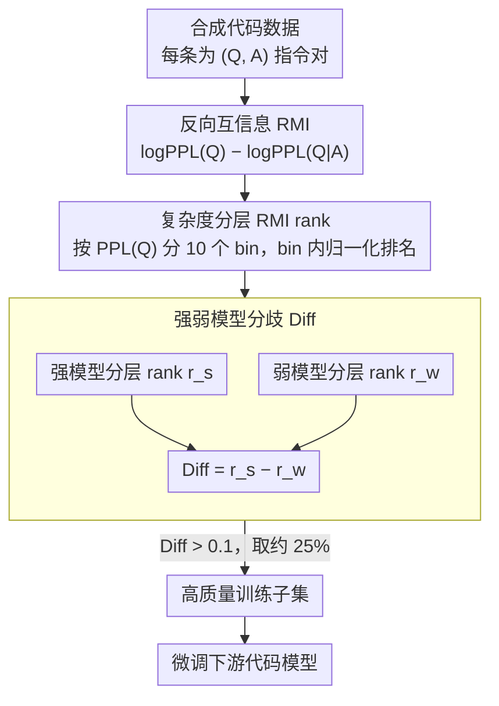

# QAQ: Bidirectional Semantic Coherence for Selecting High-Quality Synthetic Code Instructions

**会议**: ACL2026  
**arXiv**: [2603.12165](https://arxiv.org/abs/2603.12165)  
**代码**: 未开源  
**领域**: 代码智能 / 合成数据筛选  
**关键词**: 合成代码指令, 数据选择, 反向互信息, 困难样本, 模型分歧

## 一句话总结
QAQ 从“答案能否反推出问题”的反向语义一致性出发，用分层 RMI 与强弱模型分歧筛选合成代码指令，只用 25% WarriorCoder 数据就接近全量训练，并显著优于 IFD 等传统数据选择指标。

## 研究背景与动机
**领域现状**：代码生成模型越来越依赖大规模合成 instruction-response 数据。Magpie、WarriorCoder 等 seedless 合成管线可以直接从对齐模型交互中生成大量代码任务，但也会带来幻觉术语、无意义查询、问答错配和答案模板化等噪声。

**现有痛点**：很多数据选择方法只看 answer 方向，例如 IFD 衡量给定 query 后生成 answer 的难度，即 $A|Q$ 方向。这个角度在干净数据上能找到“模型还没掌握”的样本，但在噪声合成代码数据上会混淆两种情况：任务本身难，或者 query/answer 本来就不匹配。

**核心矛盾**：合成代码数据的质量问题常常隐藏在 query 侧。一个答案可能是语法正确的代码，但 query 是伪造术语或非代码请求；如果只评价答案质量，就会把这类样本误认为高质量。

**本文目标**：设计一个可规模化的数据筛选方法，既能过滤语义错配和表面重复，也能保留对代码模型真正有训练价值的难样本，从而降低微调成本。

**切入角度**：作者把方向反过来，问“看到答案后，模型能不能更好地预测原问题”。一个真正贴合问题的代码答案应该含有足够信息，让模型推断它解决的是哪类任务；反之，错配答案对问题几乎没有解释力。

**核心 idea**：用 Reverse Mutual Information 评估 answer 对 query 的解释力，并通过强弱模型的分歧保留“强模型看出其有效、弱模型仍觉得困难”的样本。

## 方法详解
QAQ 的关键不是简单取 RMI 最大的样本。作者先定义反向互信息，再发现 RMI 的两个极端都可能有问题：过低常表示 query-answer 错配，过高可能是答案直接复述 query 或包含容易被模型识别的缺陷模式。因此 QAQ 还加入 question complexity 分层和强弱模型 disagreement，让筛选逻辑从“高分优先”变成“同复杂度内的适中质量 + 有认知差距”。

### 整体框架
输入是大规模合成代码 instruction-tuning 数据集 $D={(Q_i,A_i)}$。QAQ 先用语言模型分别计算 query 的困惑度 $PPL(Q)$ 与给定 answer 后 query 的困惑度 $PPL(Q|A)$，得到 RMI；再按 $PPL(Q)$ 把样本分成 10 个复杂度 bin，在每个 bin 内做 RMI 排名；最后用强模型和弱模型分别计算分层 RMI rank，保留强模型 rank 高、弱模型 rank 低的 Diff-High 样本，形成约 25% 的训练子集。

### 关键设计

**1. 反向互信息 RMI：不问「题能不能写出答案」，而问「答案能不能反推出题」**

传统数据选择（如 IFD）只看 $A|Q$ 方向，即给定 query 后生成 answer 的难度。但在噪声合成代码数据上，这个角度分不清两种情况：任务本身确实难，还是 query 和 answer 根本就不匹配——两者都会让 answer 难以生成。质量问题常常恰恰藏在 query 侧（伪造术语、非代码请求），只评价答案就会把语法正确但答非所问的样本误判成高质量。QAQ 把方向反过来，定义 $RMI(Q,A)=\log PPL(Q)-\log PPL(Q|A)$：如果看到答案后 query 变得更容易预测（困惑度大幅下降），说明答案确实携带了问题的规格信息，二者语义一致；如果几乎没变，则多半是错配或无关样本。这背后的直觉是，一段真正对题的代码答案应当包含函数名、输入输出、算法结构和边界条件，这些恰好能反映它解决的是哪类任务，因此反向预测对代码任务格外有解释力。

**2. 按问题复杂度分层的 RMI rank：让简单题只跟简单题比，避免被全局排名误伤**

直接对全体样本按 RMI 排序会出问题：论文发现 RMI 与 $\log PPL(Q)$ 呈异方差关系——低复杂度问题天然 $PPL(Q)$ 就低，RMI 的天花板也跟着低。若全局排序，一批简单但完全有效的样本会被系统性地排到后面误删。QAQ 的做法是先按 $PPL(Q)$ 把数据切成 $K=10$ 个 decile，在每个 bin 内部独立算 RMI rank 并归一化到 $[0,1]$。这样简单题只和同复杂度的简单题竞争，复杂题只和复杂题竞争，RMI 信号被校准到「同难度内的相对质量」，不再被问题本身的难度尺度污染。

**3. 强弱模型分歧 Diff：从 RMI 信号里进一步拣出「有效但仍有学习价值」的样本**

只取 RMI 高分还不够，因为 RMI 两端都可能坏：过低是 query-answer 错配，过高则可能是答案直接复述 query、或包含容易被模型一眼识破的模板化缺陷模式——这两种都不是好训练样本。QAQ 引入一对强弱模型：用 DeepSeek-Coder-6.7B-Base 作强模型、Qwen3-0.6B 作弱模型，分别算出分层 RMI rank $r_s$ 与 $r_w$，定义 $Diff=r_s-r_w$，最终用 $Diff>0.1$ 保留约 25% 样本。

$$Diff = r_s - r_w$$

Diff 高意味着「强模型已能识别这条 query-answer 关系、弱模型还看不懂」——强弱都高的样本往往是重复或答案复述问题，强弱都低的多是坏数据或过难样本，唯有强高弱低才更像「有效且可学」的训练信号。这一步把数据选择从「找最容易识别的高质量样本」扭转成「找强模型能看懂、弱模型还需要学的样本」，和 curriculum learning、最近发展区的直觉相通。

### 损失函数 / 训练策略
QAQ 本身是数据选择策略，不改变下游代码模型的损失函数。实验中作者用 LlamaFactory 对 DeepSeek-Coder-6.7B-Base 微调 3 个 epoch，按数据规模调整 batch size 与学习率：全量数据 batch size 512、学习率 1.2e-4；50% 数据 batch size 256、学习率 0.8e-4；25% 数据 batch size 256、学习率 0.4e-4，warmup ratio 为 0.2，cosine decay。评估采用 greedy decoding，在 HumanEval、HumanEval+、MBPP、MBPP+ 上看 pass@1。

## 实验关键数据

### 主实验

| 方法 | 数据比例 | HumanEval | HumanEval+ | MBPP | MBPP+ |
|------|----------|-----------|------------|------|-------|
| Full Data | 100% | 78.05 | 72.56 | 71.69 | 59.52 |
| RMI Top 50% | 50% | 78.05 | 73.17 | 72.22 | 58.20 |
| RMI 50-75% | 25% | 77.44 | 72.56 | 71.43 | 58.47 |
| Random | 25% | 73.78 | 69.51 | 68.52 | 57.67 |
| IFD | 25% | 71.95 | 66.46 | 64.81 | 54.76 |
| RDS+ | 25% | 76.83 | 71.34 | 71.69 | 58.99 |
| SCAR | 25% | 75.00 | 70.73 | 70.63 | 57.67 |

### 消融实验

| 选择策略 | HumanEval | HumanEval+ | MBPP | MBPP+ | 说明 |
|----------|-----------|------------|------|-------|------|
| Diff-High | 77.44 | 71.95 | 71.43 | 58.73 | 强高弱低，本文核心策略 |
| Sum-High | 74.39 | 68.90 | 71.16 | 59.52 | 强弱共识高，可能混入复述模式 |
| Sum-Low | 71.34 | 65.85 | 66.14 | 55.56 | 强弱共识低，质量最差 |
| Diff-Low | 71.34 | 67.07 | 74.87 | 62.43 | 更偏简单模式，对 MBPP 有利 |

### 关键发现
- RMI 与 IFD 相关性很低，Spearman 仅 0.252，说明 $Q|A$ 与 $A|Q$ 捕捉的是不同质量维度。
- 25% 的 RMI 50-75% 样本几乎达到全量训练效果，HumanEval+ 与 Full Data 同为 72.56。
- Diff-High 与 Sum-High 选择集合重叠只有 13.85%，表明模型分歧挑出来的是很不一样的一批样本。
- 同一模型微调前后 RMI 排名相关性为 0.9539，说明 RMI 有较强稳定性，适合一次性静态筛选。
- 在 Magpie-Qwen2.5-Coder-Pro-300K 上，QAQ 25% 数据也取得较均衡结果：HumanEval 71.95、HumanEval+ 65.24、MBPP 68.25、MBPP+ 56.35。

## 亮点与洞察
- 最巧妙的点是把“代码能否解释题目”作为质量信号。代码生成任务天然具有 answer 结构化、query 规格化的特点，反向预测比一般文本任务更有语义解释力。
- RMI 两端都可能坏这一观察很重要。低 RMI 是错配，高 RMI 也可能是关键词 echo 或 paraphrase 捷径，所以简单 top-k 不够，必须结合分层和分歧。
- 强弱模型分歧把数据选择从“找最容易识别的高质量样本”改成“找强模型能看懂、弱模型还需要学的样本”，这和 curriculum / zone of proximal development 有相似直觉。
- 该方法对训练成本很友好：RMI 计算可以离线做，筛完后只用 25% 数据微调即可接近全量性能。

## 局限与展望
- 主要实验集中在 WarriorCoder，补充验证也只是另一个 seedless 合成代码数据集；对 seed-based 数据、通用指令数据和领域代码数据的泛化还需要更多证据。
- RMI 计算需要对大规模数据跑 teacher-forcing perplexity，虽然比全量微调便宜，但仍依赖多 GPU 离线评分。
- 强弱模型的选择会影响 Diff 信号。论文显示不同 pair 都有效，但还没有给出自动选择 model pair 的原则。
- 对非常短的问题或非常长的答案，RMI 可能仍受长度、模板、语言风格影响，需要进一步校准。
- 论文未开源实现，复现实验中的 chat template、per-token normalization 和筛选阈值细节需要格外小心。

## 相关工作与启发
- **vs IFD**: IFD 看 $A|Q$ 方向，关注 instruction-following difficulty；QAQ 看 $Q|A$ 方向，关注答案对问题的解释力，对 query 质量更敏感。
- **vs Superfiltering**: Superfiltering 用弱模型近似强模型评分以节省成本；QAQ 反而利用强弱不一致，把分歧本身当作信号。
- **vs SCAR**: SCAR 关注 instruction-response 风格一致性，QAQ 更直接建模语义一致性，因此在跨 benchmark 上更均衡。
- **vs RDS+ / coreset**: RDS+ 需要目标任务 seed，而 QAQ 不依赖下游测试集种子，更适合通用合成数据清洗。

## 评分
- 新颖性: ⭐⭐⭐⭐ 反向互信息加模型分歧的组合很有辨识度。
- 实验充分度: ⭐⭐⭐⭐ 主结果、分歧消融、跨数据集和 model pair 敏感性都覆盖到了。
- 写作质量: ⭐⭐⭐⭐ 动机清楚，失败模式示例直观，表格信息量高。
- 价值: ⭐⭐⭐⭐ 对代码指令数据清洗、合成数据去噪和低成本微调都有实用意义。

<!-- RELATED:START -->

## 相关论文

- [\[ACL 2026\] SciCoQA: Quality Assurance for Scientific Paper–Code Alignment](scicoqa_quality_assurance_for_scientific_paper--code_alignment.md)
- [\[ACL 2026\] DeepGuard: Secure Code Generation via Multi-Layer Semantic Aggregation](deepguard_secure_code_generation_via_multi-layer_semantic_aggregation.md)
- [\[ACL 2026\] Sense and Sensitivity: Examining the Influence of Semantic Recall on Long Context Code Understanding](sense_and_sensitivity_examining_the_influence_of_semantic_recall_on_long_context.md)
- [\[ACL 2026\] ChatHLS: Towards Systematic Design Automation and Optimization for High-Level Synthesis](chathls_towards_systematic_design_automation_and_optimization_for_high-level_syn.md)
- [\[ACL 2026\] CuBridge: An LLM-Based Framework for Understanding and Reconstructing High-Performance Attention Kernels](cubridge_an_llm-based_framework_for_understanding_and_reconstructing_high-perfor.md)

<!-- RELATED:END -->
