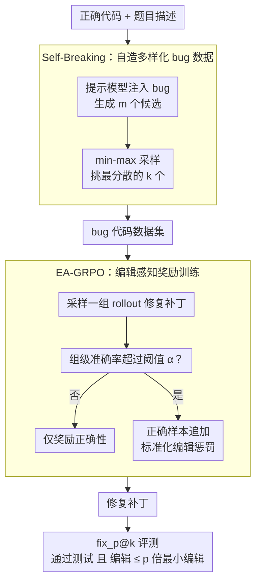

# QiMeng-PRepair: Precise Code Repair via Edit-Aware Reward Optimization

**会议**: ACL 2026  
**arXiv**: [2604.05963](https://arxiv.org/abs/2604.05963)  
**代码**: [GitHub](https://github.com/...)  
**领域**: 代码智能 / 程序修复  
**关键词**: 精确代码修复, 过度编辑, 编辑感知奖励, GRPO, 推测编辑

## 一句话总结

本文识别了 LLM 代码修复中的"过度编辑"问题——模型倾向于重写大量代码而非精确定位和修复 bug，提出 PRepair 框架，通过 Self-Breaking（多样化 bug 注入）和 Self-Repairing（编辑感知 GRPO 训练），显著提升修复精确度同时保持正确性，并加速推测解码推理。

## 研究背景与动机

**领域现状**：LLM 在程序修复中表现优异，现有训练方法（SFT 和 RL）通常仅优化修复正确性，将代码修复视为纯正确性目标。

**现有痛点**：(1) 模型在 GRPO 训练中随着正确性提升，编辑代价也不断增加——模型不是学会了精确修复而是通过大量修改"碰对"正确解；(2) 过度编辑破坏了原始代码结构，增加开发者审查负担；(3) 过度编辑无法定位 bug，限制了修复的实际有效性和可维护性。

**核心矛盾**：修复正确性和编辑最小性之间存在张力——仅优化正确性会导致模型走"重写"捷径而非学会理解和精确定位 bug。

**本文目标**：设计一种精确修复（Precise Repair）框架，在保持修复正确性的同时最大化对原始代码的复用。

**切入角度**：观察到 GRPO 训练中编辑代价与正确性同步增长（Figure 2），表明需要在奖励中显式引入编辑约束。

**核心 idea**：编辑感知的 GRPO（EA-GRPO）——仅当组级准确率超过阈值时才对正确样本施加编辑惩罚，平衡正确性和编辑最小性。

## 方法详解

### 整体框架

PRepair 把"精确修复"拆成一条数据自造、奖励自洽的闭环流水线。先让模型自己向正确代码注入多样化 bug（Self-Breaking），凭空造出大量"逻辑大体正确、仅局部出错"的训练样本；再在这些 bug 代码上用编辑感知的 GRPO（Self-Repairing）训练模型，让奖励在正确性达标后才追加编辑惩罚。从输入的 bug 代码到输出的修复补丁，整条链路都不依赖人工标注，最终统一用新提出的 $\text{fix}_p@k$ 指标衡量"既改对又改得少"。

### 关键设计

**1. $\text{fix}_p@k$ 精确修复指标：让评测同时盯住正确性和编辑量**

pass@k 只问"改没改对"，却放过了"把整段代码重写一遍碰巧通过测试"这种坏修复，因此无法反映真实修复质量。$\text{fix}_p@k$ 在 pass@k 之上加一道编辑闸门：只有当生成代码通过全部测试、且编辑代价不超过理论最小编辑的 $p$ 倍时才算成功。这里编辑代价用行级 Levenshtein 距离归一化，$\mathbf{D}_{\text{EC}}(X,Y) = \mathbf{D}(X,Y)/|X|$，把"改了多少行"折算成与原代码规模相称的比例，使不同长度的样本可比。

**2. Self-Breaking：用 min-max 采样自造多样化 bug 数据**

精确修复真正需要的训练数据是"含大量正确逻辑、仅有局部错误"的代码，而这类样本在现实中极度稀缺。PRepair 反其道而行，给模型正确代码与描述、提示它主动注入 bug，再从 $m$ 个候选里挑出最分散的 $k$ 个：$\mathcal{X}_s = \min_{\mathcal{X}' \subset \mathcal{X}, |\mathcal{X}'|=k} \max_{X_i,X_j \in \mathcal{X}', i \neq j} (1 - \mathbf{D}_{\text{EC}}(X_i, X_j))$。这个 min-max 准则刻意压低被选集合内部的最大相似度，避免 bug 模式扎堆，从而让模型见过的错误类型足够丰富。

**3. EA-GRPO：编辑感知奖励，先学对再学精**

直接在 RL 里惩罚编辑量会适得其反——正确性还没学稳就被编辑约束拽住，反而学不会修对。EA-GRPO 因此给惩罚加了一个"开关"：先算每个 rollout 组的准确率 $\text{Acc}_{\mathcal{G}^t}$，只有当它超过阈值 $\alpha$ 时才激活编辑惩罚。激活后，对组内正确样本算标准化编辑惩罚 $\mathcal{P}_i^{\mathcal{G}} = \sigma(\frac{\mathbf{D}_{\text{EC}}(X_t, o_i) - \text{mean}}{\text{std}})$，最终奖励为正确时 $\mathcal{R}_i = 1 - \mathcal{T}(\mathcal{G}) \cdot \beta \cdot \mathcal{P}_i^{\mathcal{G}}$、错误时为 $0$。这样模型先在组级正确率上站稳，再被引导去压缩编辑量，正确性与精确性不再硬碰硬。

### 损失函数 / 训练策略

EA-GRPO 沿用 PPO 风格的截断目标加 KL 正则化，奖励计算全程不需要金标准代码，只靠 bug 输入与生成输出之间的编辑代价。训练后的模型在 Python（HumanEvalFix）和 Verilog（自建基准）两套基准上评估。

## 实验关键数据

### 主实验

**精确修复指标对比**

| 指标 | 说明 |
|------|------|
| $\text{fix}_1@1$ 提升 | 最高 +31.4% |
| pass@k 保持/提升 | 正确性不下降 |
| 跨语言有效 | Python 和 Verilog 都有效 |

### 消融实验

**EA-GRPO vs 标准 GRPO**

| 配置 | 说明 |
|------|------|
| 标准 GRPO | 正确性提升但编辑代价持续增长 |
| EA-GRPO | 正确性提升且编辑代价受控 |
| 推测编辑加速 | 编辑代价降低→推测解码接受率提高→推理加速 |

### 关键发现

- PRepair 在 $\text{fix}_1@1$ 上最高提升 31.4%，同时 pass@k 保持或提升
- EA-GRPO 的动态激活设计至关重要——过早惩罚编辑会显著损害正确性
- Self-Breaking 的 min-max 采样确保了训练 bug 的多样性，优于随机采样
- 模型学到了隐式的错误定位能力——精确修复迫使模型聚焦 bug 所在行
- 与推测编辑结合时，编辑代价降低直接转化为推理加速——实际价值显著

## 亮点与洞察

- 过度编辑问题的识别和量化是重要贡献——揭示了仅优化正确性的 RL 训练的系统性缺陷
- EA-GRPO 的"先学对再学精"策略优雅——避免了正确性和精确性的硬冲突
- 与推测解码的天然协同——精确修复减少编辑→更多 n-gram 匹配→更高推理吞吐——将训练改进转化为推理加速

## 局限与展望

- 仅在 Python 和 Verilog 两种语言上评估，未覆盖更多编程语言
- $\text{fix}_p@k$ 的阈值 p 的选择对评估结果影响较大
- Self-Breaking 依赖模型自身的 bug 注入能力，可能不覆盖所有真实 bug 类型
- 编辑代价基于行级 Levenshtein 距离，可能无法捕获语义级别的编辑最小性

## 相关工作与启发

- **vs 标准 GRPO (Shao et al., 2024)**: 后者仅优化正确性导致过度编辑，EA-GRPO 通过动态编辑惩罚解决
- **vs HumanEvalFix (Muennighoff et al., 2023)**: 后者仅用 pass@k 评估，本文的 $\text{fix}_p@k$ 更全面

## 评分

- 新颖性: ⭐⭐⭐⭐ 过度编辑的识别和 EA-GRPO 的设计新颖且实用
- 实验充分度: ⭐⭐⭐⭐ Python + Verilog 跨语言 + 推测解码加速分析
- 写作质量: ⭐⭐⭐⭐ 问题动机清晰，指标设计合理
- 价值: ⭐⭐⭐⭐⭐ 对代码修复实践有直接影响，推测解码协同有部署价值

<!-- RELATED:START -->

## 相关论文

- [\[NeurIPS 2025\] QiMeng-SALV: Signal-Aware Learning for Verilog Code Generation](../../NeurIPS2025/code_intelligence/qimeng-salv_signal-aware_learning_for_verilog_code_generation.md)
- [\[ACL 2026\] Precise Debugging Benchmark: Is Your Model Debugging or Regenerating?](precise_debugging_benchmark_is_your_model_debugging_or_regenerating.md)
- [\[ICML 2026\] NEMO: Execution-Aware Optimization Modeling via Autonomous Coding Agents](../../ICML2026/code_intelligence/nemo_execution-aware_optimization_modeling_via_autonomous_coding_agents.md)
- [\[ACL 2026\] OmniDiagram: Advancing Unified Diagram Code Generation via Visual Interrogation Reward](omnidiagram_advancing_unified_diagram_code_generation_via_visual_interrogation_r.md)
- [\[ICML 2026\] BoostAPR: Boosting Automated Program Repair via Execution-Grounded Reinforcement Learning with Dual Reward Models](../../ICML2026/code_intelligence/boostapr_boosting_automated_program_repair_via_execution-grounded_reinforcement_.md)

<!-- RELATED:END -->
