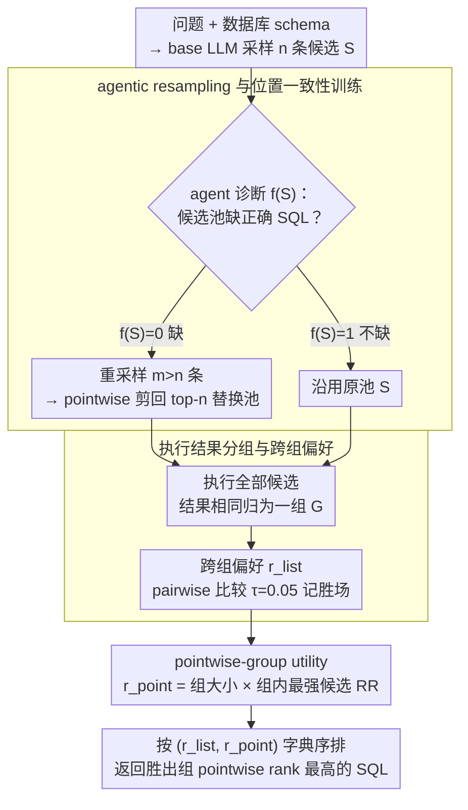

# R$^3$-SQL: Ranking Reward and Resampling for Text-to-SQL

**会议**: ACL2026  
**arXiv**: [2604.25325](https://arxiv.org/abs/2604.25325)  
**代码**: 未开源  
**领域**: LLM Agent / Text-to-SQL  
**关键词**: Text-to-SQL, 候选排序, 执行结果分组, agentic resampling, 位置偏置

## 一句话总结
R3-SQL 面向 generate-then-rank Text-to-SQL，先按执行结果把等价 SQL 分组并结合 pairwise/listwise 与 pointwise reward 排序，再用 LLM agent 判断候选池是否缺少正确 SQL 并选择性重采样，在 BIRD-dev 上达到 75.03 EX。

## 研究背景与动机
**领域现状**：现代 Text-to-SQL 系统常用 generate-then-rank：LLM 先采样多条 SQL 候选，再由 pointwise、listwise 或 majority voting ranker 选择最终 SQL。CSC-SQL、Contextual-SQL、CHASE-SQL、XiYan-SQL 等方法都属于这个范式。

**现有痛点**：现有 ranker 有两个核心问题。第一是 functional inconsistency：表面不同但执行结果相同的 SQL 会被赋予不同分数，甚至把正确等价类中的某条 SQL 排低。第二是 bounded recall：如果候选池中根本没有正确 SQL，任何排序器都无法恢复。

**核心矛盾**：Text-to-SQL 的正确性由执行语义决定，而不是 SQL 字符串表面形式；但常见 ranker 仍按单条 SQL 打分。同时，排序阶段默认正确候选已存在，却没有机制判断生成阶段是否漏掉了正确答案。

**本文目标**：建立一个同时解决排序一致性和候选召回的框架，让 ranker 在执行等价类层面做决策，并在候选池不足时主动扩展搜索空间。

**切入角度**：作者把候选选择拆成 exploration 和 exploitation。exploration 用 agentic resampling 提高候选池 recall；exploitation 用 execution-result grouping 和双 reward 排序提高 precision。

**核心 idea**：不要对 SQL 字符串逐条排序，而是对执行结果等价组排序；不要无条件重采样，而是让 agent 只在判断候选池缺正确 SQL 时替换为更大的重采样池。

## 方法详解

### 整体框架
R3-SQL 要一并解决 generate-then-rank Text-to-SQL 的两个老毛病：排序器对等价 SQL 打分不一致，以及候选池里压根没有正确 SQL 时再强的排序也救不回来。它把候选选择拆成 exploration 和 exploitation 两条线——前者补召回，后者提精度。输入是自然语言问题和数据库 schema，base LLM 先采样 $n$ 条 SQL 候选 $S=\{s_1,\dots,s_n\}$；一个 agent 先审一眼这个池子，若判断 $f(S)=0$（缺正确答案）就重采样 $m>n$ 条、用 pointwise ranker 剪回 top-$n$ 形成替换池。随后所有 SQL 被真正执行，输出结果相同的候选归为一组 $G=\{g_1,\dots,g_M\}$，每组对应一个 distinct semantic outcome。最终排序在组层面进行：先算跨组偏好 $r_{list}$，再算组内 pointwise utility $r_{point}$，按二元组 $(r_{list},r_{point})$ 字典序排，返回胜出组中 pointwise rank 最高的那条 SQL。

### 关键设计

**1. agentic resampling 与位置一致性训练：补候选召回的洞，顺便治排序器的输入顺序偏置**

排序阶段默认正确候选已经在池子里，可现实是 bounded recall——没有就是没有，排序器无能为力。R3-SQL 让 agent 先诊断初始池：若判断缺正确 SQL（$f(S)=0$），就丢掉原池、采样一个更大的新池（$m>n$），再用 pointwise pruning 剪回原大小，避免无脑 always-resample 引入的噪声和成本。另一个隐患是 listwise ranker 会被候选喂入顺序带偏，于是训练时把同一对 correct/incorrect SQL 以原顺序和交换顺序都喂一遍，在 GRPO 里加一项 consistency reward $R=R_{base}+\lambda_c R_c$（$\lambda_c=0.5$），逼排序器对调换顺序也给出一致判断。这一步对应整体框架里的 exploration 线，补的是候选池 recall。

**2. 执行结果分组与跨组偏好：把“逐条排序”换成“按执行语义分组再排序”，消除等价 SQL 打分不一致**

痛点是 functional inconsistency——表面不同但执行结果相同的 SQL 会被排序器给出不同分数，甚至把正确等价类里的某条压低。R3-SQL 的做法是先执行候选、把输出相同的归入同一组，于是组内的表面差异不再影响语义判断。组间则由 pairwise ranker 两两比较：对组 $g_i,g_j$ 估计 $P(g_i>g_j)$，只有当偏好 margin 超过阈值 $\tau=0.05$ 才记一次 decisive win，组分数 $r_{list}(g_i)$ 就是它对其他组的胜场数。这样比 functional majority voting 只数组大小更聪明——它能识别“小但正确”的组，而不是让大而错误的组靠人多取胜。

**3. pointwise-group utility 作为稳定锚点：当跨组偏好分不出胜负时，给一个顺序无关的补充信号**

只靠 listwise 偏好有时几个组打得难解难分，只靠 group size 又会压过小而正确的组，只靠 pointwise 打分则重新被表面形式带偏。R3-SQL 给每个组再算一个 utility $r_{point}(g)=w(g)\cdot u(g)$：$w(g)=|g|$ 反映执行一致性（多少条候选落到同一结果），$u(g)=\max_{s\in g} RR_s$ 保留组内最强候选的 reciprocal rank。最终按 $(r_{list},r_{point})$ 字典序排序，先用相对偏好定大局，再用组内一致性和单条候选质量稳住接近的组——三种信号互补，谁都不会单独主导。

### 损失函数 / 训练策略
R3-SQL 的排序训练包含 pointwise ranker 和 listwise/pairwise ranker。R3-POINT-32B 从 Contextual-RM-32B 继续训练；R3-7B listwise ranker 用 GRPO，并加入输入顺序一致性奖励。推理阶段的组排序以 $r_{list}$ 为主，$r_{point}$ 为 tie-breaker，最后对 top-2 组再做一次个体 SQL 层面的比较，返回获胜组中 pointwise rank 最高的候选。

## 实验关键数据

### 主实验

| SQL 选择方法 | Ranker | BIRD-dev | Spider-test | Spider-DK | EHRSQL | ScienceBenchmark | Avg. |
|--------------|--------|----------|-------------|-----------|--------|------------------|------|
| CSC-SQL | FMV | 71.58 | 86.64 | 76.97 | 41.04 | 56.68 | 66.58 |
| Contextual-SQL | Pointwise | 73.14 | 86.36 | 75.50 | 41.41 | 63.13 | 67.91 |
| CHASE-SQL | Listwise | 73.34 | 86.18 | 75.94 | 44.44 | 63.59 | 68.70 |
| XiYan-SQL | Listwise + FMV | 72.03 | 85.89 | 75.28 | 43.43 | 63.59 | 68.04 |
| R3-SQL | Groupwise Point+List+FMV | 75.03 | 87.19 | 77.92 | 46.30 | 66.82 | 70.65 |

### 消融实验

| 配置 | BIRD-dev EX | 说明 |
|------|-------------|------|
| R3-SQL | 75.03 | 完整系统 |
| w/o Agentic Resampling | 74.25 | 候选召回下降 |
| w/o Pointwise Pruning | 73.92 | 重采样池噪声更大 |
| w/o Exec. Group Scoring | 73.47 | 等价 SQL 一致性下降 |
| w/o Pointwise Ranker | 73.34 | 缺少顺序无关锚点 |
| w/o Listwise Ranker | 73.14 | 缺少跨组相对偏好 |

### 关键发现
- R3-SQL 在五个 benchmark 上都优于 baseline，平均 EX 达 70.65，是唯一突破 70 的方法。
- Functional inconsistency 直接被分组消除：Contextual-SQL 的同执行结果 score variance 为 0.8571，而 R3-SQL 降为 0.0000；加入 R3-7B 后 BIRD-dev EX 从 73.47 提到 75.03。
- Agentic resampling 提高候选 recall：平均 ranking upper bound 从 78.80 升到 82.72，BIRD-dev 从 81.23 升到 84.62。
- 位置一致性奖励有效：R3-7B input consistency 为 57.49%，去掉 consistency reward 降为 45.60%，去掉 GRPO 降为 37.82%。
- Agent 并非盲目触发：Trigger Resampling precision 为 93.27，recall 为 56.02；Skip Resampling recall 为 83.17，有助于减少无效重采样。
- 计算上 R3-SQL 每 query 用 32 次 pointwise call、107 次 listwise call，1.56 sec/query，比 CHASE-SQL 的 1.68 sec/query 更快且 EX 更高。

## 亮点与洞察
- 最核心洞察是“SQL 正确性是 execution semantics，不是 token semantics”。分组后再排序比逐条排序更符合 Text-to-SQL 的评价方式。
- Agentic resampling 把检索里的 bounded recall 思想迁移到候选 SQL 生成：排序器再强也无法选出不存在的正确候选，因此需要先诊断候选池覆盖。
- Lexicographic combination 很朴素但有效：先用跨组偏好解决相对正确性，再用 pointwise utility 稳住接近的组。
- always-resample 反而不如 agentic replace，说明增加候选数量不是免费午餐；噪声候选会干扰 ranker，选择性触发更关键。

## 局限与展望
- 作者明确指出 R3-SQL 在 in-domain 更强，对 supervised pointwise ranker 有依赖；out-of-domain 上 domain gap 会让 pointwise 模块带来 0.46-0.67 的边际差异。
- 执行结果分组依赖能成功执行 SQL，对超时、空结果、非确定性函数或数据库权限受限场景可能更脆弱。
- Agentic resampling 需要额外 LLM 判断和更多候选生成，虽然比 always-resample 省，但部署成本仍高。
- 候选池替换策略在实验中优于 union，但可能丢掉原池中少数有价值候选；更细粒度的保留/替换策略值得探索。
- 代码未开源，复现 R3-POINT-32B、R3-7B、GRPO 奖励和 agent prompt 会有难度。

## 相关工作与启发
- **vs Contextual-SQL**: Contextual-SQL 用 pointwise ranker 逐条打分，R3-SQL 把等价执行结果合并，避免等价 SQL 分数不一致。
- **vs CSC-SQL / functional majority voting**: FMV 只看组大小，容易让大但错误的组胜出；R3-SQL 用 listwise 偏好和 pointwise utility 排组。
- **vs CHASE-SQL**: CHASE-SQL 依赖 listwise ranker，R3-SQL 额外处理 position bias 和 bounded recall，精度更高且计算略低。
- **vs XiYan-SQL**: XiYan-SQL 结合 listwise 与 FMV，但没有 agentic resampling；R3-SQL 在候选生成阶段也做主动修复。

## 评分
- 新颖性: ⭐⭐⭐⭐ 执行结果分组、双 reward 排序和 agentic resampling 的组合很完整。
- 实验充分度: ⭐⭐⭐⭐⭐ 五个 benchmark、seed 稳定性、计算成本和多组消融都覆盖得好。
- 写作质量: ⭐⭐⭐⭐ 问题定义清楚，图示直观，实验表格支撑充分。
- 价值: ⭐⭐⭐⭐⭐ 对实际 Text-to-SQL 系统的候选选择和生成修复非常有参考价值。

<!-- RELATED:START -->

## 相关论文

- [\[ACL 2026\] PExA: Parallel Exploration Agent for Complex Text-to-SQL](pexa_parallel_exploration_agent_for_complex_text-to-sql.md)
- [\[ACL 2026\] PV-SQL: Synergizing Database Probing and Rule-based Verification for Text-to-SQL Agents](pv-sql_synergizing_database_probing_and_rule-based_verification_for_text-to-sql_.md)
- [\[ACL 2025\] STaR-SQL: Self-Taught Reasoner for Text-to-SQL](../../ACL2025/code_intelligence/star-sql_self-taught_reasoner_for_text-to-sql.md)
- [\[ACL 2026\] DPC: Training-Free Text-to-SQL Candidate Selection via Dual-Paradigm Consistency](dpc_training-free_text-to-sql_candidate_selection_via_dual-paradigm_consistency.md)
- [\[ACL 2025\] SHARE: An SLM-based Hierarchical Action CorREction Assistant for Text-to-SQL](../../ACL2025/code_intelligence/share_text_to_sql_correction.md)

<!-- RELATED:END -->
