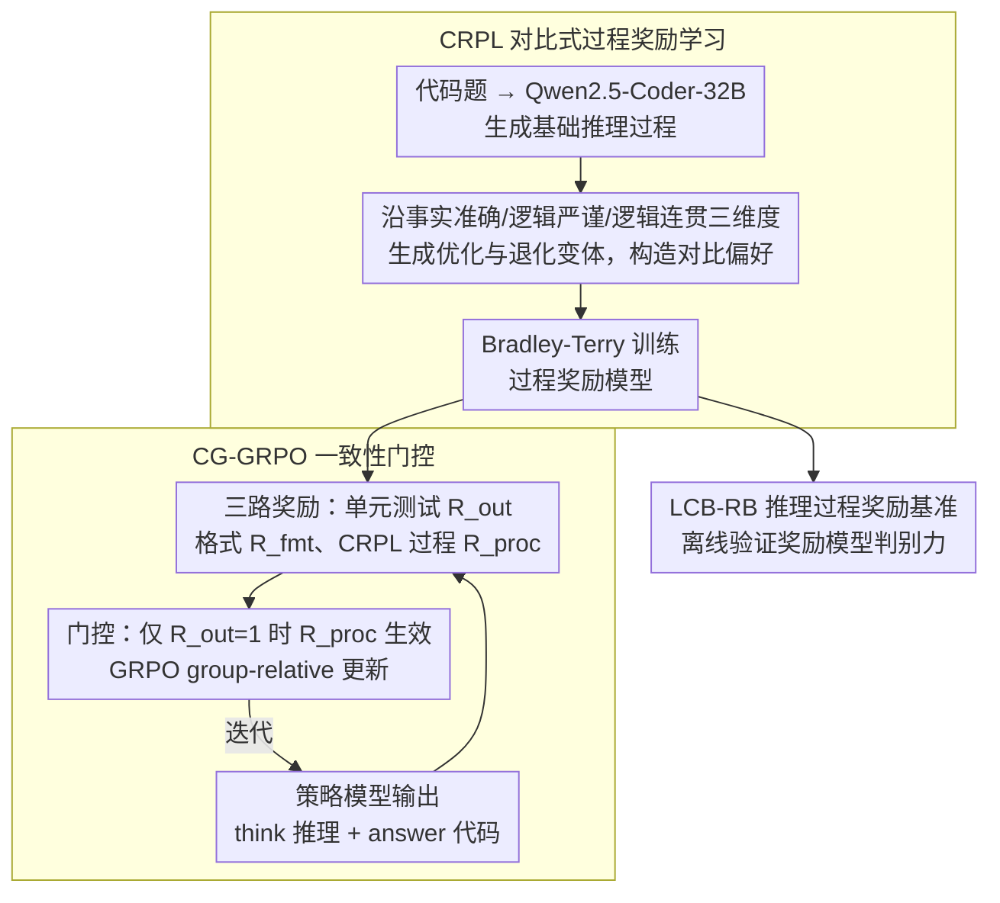

# ReCode: Reinforcing Code Generation with Reasoning-Process Rewards

**会议**: ACL 2026  
**arXiv**: [2508.05170](https://arxiv.org/abs/2508.05170)  
**代码**: https://github.com/ZJU-CTAG/ReCode  
**领域**: 代码智能 / 强化学习 / 推理过程奖励  
**关键词**: 代码生成、过程奖励、GRPO、奖励模型、Reasoning-Process

## 一句话总结
ReCode 通过 CRPL 训练能评价代码推理过程质量的奖励模型，并用 CG-GRPO 只在代码执行正确时激活过程奖励，从而在避免 reward hacking 的同时提升代码生成模型的 Pass@1。

## 研究背景与动机
**领域现状**：代码生成天然有可执行验证信号，近年来很多 RL 方法直接用单元测试是否通过作为 outcome reward，训练模型提升 HumanEval、MBPP、LiveCodeBench 等 benchmark 的 Pass@1。

**现有痛点**：只看最终测试结果会忽略模型“为什么写出这段代码”。两个程序都通过测试时，推理过程可能一个严谨、一个碰巧；两个程序都失败时，也可能一个思路正确但实现细节出错。纯 outcome reward 对这些差异没有细粒度监督。

**核心矛盾**：推理过程质量确实影响代码正确性，但直接把 neural process reward 加进 RL 又容易被模型钻空子。模型可能学会写出看似高质量的推理文本，而实际代码并不正确。

**本文目标**：一方面构造可扩展的推理过程偏好数据，训练可靠的 reasoning-process reward model；另一方面设计安全的 RL 融合方式，让过程奖励补充而不是替代执行正确性。

**切入角度**：作者把推理过程看作代码生成中的中间产物，用 optimized / degraded reasoning variants 构造对比偏好；再用执行结果作为硬门控，约束过程奖励只在正确代码中起作用。

**核心 idea**：过程奖励只有在结果正确时才可信，因此应让 execution correctness 当“闸门”，让 reasoning reward 只区分正确解之间的推理质量。

## 方法详解

### 整体框架
ReCode 要解决的是：代码 RL 普遍只用单元测试通过与否当 outcome reward，可两个都通过的程序，推理过程可能一个严谨、一个碰巧；两个都失败的，也可能一个思路对、只是实现崴了脚——纯结果奖励对这些差异完全没有细粒度监督。但直接把神经过程奖励加进 RL 又会被模型钻空子，学会写漂亮的推理文本而代码并不对。ReCode 的两个组件正是对着这两点：CRPL（Contrastive Reasoning-Process Reward Learning）用合成对比数据训练一个能判推理质量的过程奖励模型（reward model）；CG-GRPO（Consistency-Gated GRPO）把它接进 RL，但让执行结果当闸门控制过程奖励是否生效。训练时策略模型输出 `<think>...</think><answer>...</answer>` 结构，`<think>` 是推理过程、`<answer>` 是代码，三路奖励分别来自单元测试（outcome）、格式检查（format）和 CRPL（process）。为单独验证 CRPL 训出的奖励模型是否真在判推理质量，作者还配套构造了专门的评估基准 LCB-RB。

### 关键设计

**1. CRPL 对比式过程奖励学习：用“优化/退化”变体造强对比偏好，训出能判推理好坏的 reward model**

直接让 LLM 给推理过程打个绝对分往往校准很差，相对偏好则稳得多。CRPL 先用 Qwen2.5-Coder-32B-Instruct 为每道代码题生成一份基础推理过程，再沿事实准确性（factual accuracy）、逻辑严谨性（logical rigor）、逻辑连贯性（logical coherence）三个维度分别生成优化（optimized）和退化（degraded）版本，由此构造强对比 pair、优化 pair、退化 pair 三类偏好。明确制造出来的质量落差，让 reward model 能学到细粒度的 reasoning features，而不是只会看最终答案对不对。

**2. LCB-RB 推理过程奖励基准：补一个专测“能否判推理质量”的评估集，因为现成 RewardBench 测不了这件事**

现有 RewardBench 关注的是最终答案好坏，没法专门衡量 reasoning-process discrimination。LCB-RB 从 LiveCodeBench v6 出发，每题生成 50 个 reasoning-solution pair，先用执行结果初筛，再让 GPT-4o 检查逻辑正确性与实现一致性，最后两名作者人工复核，最终得到 219 个高质量偏好 pair，专门用来验证奖励模型是否真在判推理过程、而非碰运气。

**3. CG-GRPO 一致性门控：让执行正确性当硬闸门，过程奖励只在“对的代码”之间比质量**

代码任务本就有严格的执行信号，应该把它当硬约束，否则模型会去优化 reward model 偏好的文本而非可运行代码。CG-GRPO 因此不把过程奖励当常数项简单相加，而是写成

$$R = R_{fmt} + R_{out} + \mathbb{I}(R_{out}=1)\cdot R_{proc}$$

只有当代码通过全部测试时，过程分数 $R_{proc}$ 才参与奖励。这样当一个采样组里多个答案都正确时，过程奖励仍能在它们之间提供非零 advantage、区分推理质量；而错误答案无论推理写得多漂亮都拿不到这份加分，reward hacking 的口子被堵死。

### 损失函数 / 训练策略
CRPL 奖励模型使用 Bradley-Terry pairwise loss：对每个 `(problem, preferred reasoning, rejected reasoning)`，提升 preferred reasoning 的分数相对 rejected reasoning 的差值。策略优化基于 GRPO，使用 group-relative advantage。ReCode 的特殊之处在于 reward composition：过程奖励不是常数项加入，而是由 outcome reward 硬门控。这在全组都正确时仍能提供区分信号，在错误样本上则避免 reward hacking。

## 实验关键数据

### 主实验
在 Qwen2.5-Coder-7B-Instruct 上，ReCode 相比 base 平均提升 16.1%，相比 outcome-only GRPO 也有 6.7% 相对提升，并接近 GPT-4-Turbo 的平均表现。

| 模型 | HE | HE+ | MBPP | MBPP+ | LCB Easy | LCB Medium | LCB Hard | BigCode Full | BigCode Hard | Avg |
|------|----|-----|------|-------|----------|------------|----------|--------------|--------------|-----|
| GPT-4-Turbo | 90.2 | 86.0 | 85.7 | 73.3 | 68.5 | 24.2 | 4.6 | 58.2 | 35.1 | 58.4 |
| Qwen2.5-Coder-14B | 89.6 | 87.2 | 86.2 | 72.8 | 61.0 | 11.3 | 2.8 | 48.4 | 22.2 | 53.5 |
| Qwen2.5-Coder-7B | 88.4 | 84.1 | 83.5 | 71.7 | 56.1 | 3.8 | 6.9 | 41.0 | 18.2 | 50.4 |
| +SFT | 66.2 | 57.3 | 73.3 | 63.5 | 34.1 | 3.8 | 0.0 | 39.9 | 13.5 | 39.1 |
| +GRPO | 85.9 | 81.1 | 86.7 | 75.1 | 58.5 | 15.1 | 9.7 | 52.0 | 29.7 | 54.9 |
| +ReCode | 90.9 | 86.0 | 87.0 | 76.2 | 68.3 | 20.8 | 9.7 | 54.0 | 33.8 | 58.5 |

CRPL 奖励模型在 LCB-RB 和 RewardBench reasoning subsets 上表现很强，说明合成对比偏好确实学到了有迁移性的过程质量判别信号。

| 奖励模型 | Size | LCB-RB | RewardBench Code | RewardBench Math | Avg |
|----------|------|--------|------------------|------------------|-----|
| DeepSeek-V3 | 671B | 66.9 | 98.5 | 78.5 | 81.3 |
| GPT-4-Turbo | - | 63.7 | 98.1 | 67.3 | 76.4 |
| EURUS-RM | 7B | 57.0 | 92.8 | 79.9 | 76.5 |
| Qwen2.5-Coder-7B | 7B | 53.8 | 43.9 | 65.8 | 54.5 |
| +Score | 7B | 57.7 | 80.2 | 71.8 | 69.9 |
| +CRPL | 7B | 62.6 | 88.6 | 99.8 | 83.7 |

### 消融实验
ReCode 能迁移到数学任务，也能迁移到 Qwen3-4B，并与 compiler-based supervision 互补。

| 设置 | 指标 | 基线 | +GRPO / 过程方法 | +ReCode | 结论 |
|------|------|------|------------------|---------|------|
| Qwen2.5-Math-7B | Avg on MATH500/Minerva/AIME24 | 24.5 | 48.0 | 51.5 | 过程奖励对数学也有效 |
| Qwen3-4B-Instruct | LiveCodeBench Avg | 30.7 | 32.5 | 36.1 | 跨模型家族有迁移 |
| Compiler-based reward | LiveCodeBench Avg | 18.1 | 24.1 | 25.3 | ReCode 优于编译器过程奖励 |
| ReCode + Compiler | LiveCodeBench Avg | 18.1 | 24.1 | 27.1 | 两类信号互补 |

生成效率实验显示 ReCode 不是靠生成更长 reasoning 取胜，而是更短且更有效。

| 难度 | GRPO Pass@1 | GRPO Avg Tokens | ReCode Pass@1 | ReCode Avg Tokens |
|------|-------------|-----------------|---------------|-------------------|
| Easy | 58.5 | 427.3 | 68.3 | 324.1 |
| Medium | 15.1 | 568.2 | 20.8 | 441.7 |
| Hard | 9.7 | 813.6 | 9.7 | 619.8 |

### 关键发现
- ReCode 的提升来自更严谨的推理，而不是更长的推理。LiveCodeBench 上平均生成 token 减少 23.4%，Pass@1 反而更高。
- 直接把过程奖励加入总奖励会导致 reward hacking，过程分数很快接近 1.0 但下游性能停滞。
- 硬门控让 process reward 只在正确程序之间比较质量，既保留细粒度信号，又避免错误程序靠文字质量获利。
- CRPL 比 score-based reward model 更强，说明相对偏好比标量打分更适合训练过程质量判别器。
- 单一强生成器产生的偏好数据优于混合生成器，作者认为这是固定预算下信噪比更高。

## 亮点与洞察
- 论文把“推理过程质量”从口号变成了可训练、可评估、可接入 RL 的组件。CRPL 和 LCB-RB 形成了完整闭环。
- Consistency gate 是非常关键的工程判断。代码生成已有执行信号，神经奖励应当服从执行正确性，而不是和它平权相加。
- 结果显示过程监督可以提升 token 效率，这对实际代码模型很重要：更短推理、更高正确率意味着推理成本下降。
- ReCode 对数学任务也有效，说明 reasoning-process reward 不是代码专属技巧，而是一类可迁移的训练范式。

## 局限与展望
- 训练输出长度限制为 4K，尚未验证 30K tokens 以上长上下文推理过程中的效果。
- LCB-RB 只有 219 个高质量人工验证偏好 pair，可靠但覆盖有限，后续需要扩展到更多题型和语言。
- 策略模型最大只评到 7B 级别，尚不清楚更大模型上过程奖励的边际收益是否保持。
- CRPL 依赖强代码模型生成 optimized/degraded reasoning，生成器质量会影响奖励模型上限。
- 过程奖励仍然可能学到风格偏好，虽然 execution gate 降低了风险，但奖励模型本身还需要更细粒度审计。

## 相关工作与启发
- **vs outcome-only GRPO**: 普通 GRPO 只看测试通过，奖励稀疏且无法区分多个正确解。ReCode 在正确解内部继续优化推理质量。
- **vs StepCoder / PRLCoder**: 这些方法更偏 implementation-level 或 compiler/test signal，ReCode 聚焦 reasoning-process 的逻辑质量，与编译器信号互补。
- **vs 通用 RewardBench reward model**: 通用奖励模型不专门看代码推理过程，CRPL 用 optimized/degraded reasoning 训练后在 LCB-RB 和 RewardBench reasoning subsets 上更强。
- **启发**: 对可验证任务，神经过程奖励最好作为“通过验证后的排序信号”，而不是替代验证本身。

## 评分
- 新颖性: ⭐⭐⭐⭐☆ 过程奖励并非全新概念，但 CRPL + consistency-gated RL 的组合很扎实。
- 实验充分度: ⭐⭐⭐⭐⭐ 覆盖代码、奖励模型、数学迁移、跨模型、编译器监督和效率分析，证据链完整。
- 写作质量: ⭐⭐⭐⭐☆ 方法逻辑清晰，实验表格丰富；部分附录细节较多，需要读者耐心追踪。
- 价值: ⭐⭐⭐⭐⭐ 对代码模型 RL、过程奖励设计和 reward hacking 防控都有高实用价值。

<!-- RELATED:START -->

## 相关论文

- [\[ICML 2025\] Reasoning Through Execution: Unifying Process and Outcome Rewards for Code Generation](../../ICML2025/code_intelligence/reasoning_through_execution_unifying_process_and_outcome_rewards_for_code_genera.md)
- [\[ACL 2026\] StoryCoder: Narrative Reformulation for Structured Reasoning in LLM Code Generation](storycoder_narrative_reformulation_for_structured_reasoning_in_llm_code_generati.md)
- [\[ACL 2026\] CodeRL+: Improving Code Generation via Reinforcement with Execution Semantics Alignment](coderl_improving_code_generation_via_reinforcement_with_execution_semantics_alig.md)
- [\[ACL 2026\] MARS2: Scaling Multi-Agent Tree Search via Reinforcement Learning for Code Generation](mars2_scaling_multi-agent_tree_search_via_reinforcement_learning_for_code_genera.md)
- [\[AAAI 2026\] ReCode: Updating Code API Knowledge with Reinforcement Learning](../../AAAI2026/code_intelligence/recode_updating_code_api_knowledge_with_reinforcement_learning.md)

<!-- RELATED:END -->
