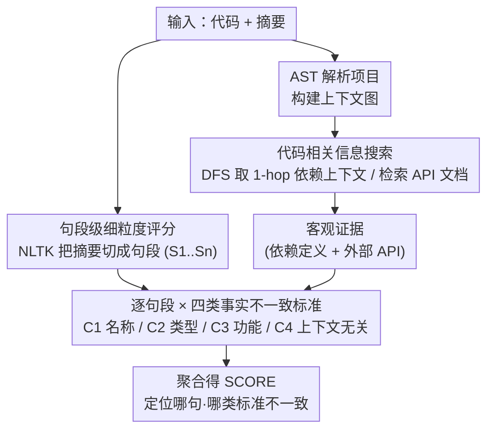

# ReFEree: Reference-Free and Fine-Grained Method for Evaluating Factual Consistency in Real-World Code Summarization

**会议**: ACL 2026  
**arXiv**: [2604.10520](https://arxiv.org/abs/2604.10520)  
**代码**: [GitHub](https://github.com/bsy99615/ReFEree)  
**领域**: 代码智能 / 代码摘要评估  
**关键词**: 事实一致性, 代码摘要, 无参考评估, 细粒度评估, 依赖分析

## 一句话总结

本文提出 ReFEree，一种针对真实世界代码摘要的无参考、细粒度事实一致性评估方法，定义四类不一致标准并在句段级别评估，结合依赖信息搜索机制，在 Python 和 Java 上相比前 SOTA 提升 15-18% 的人类判断相关性。

## 研究背景与动机

**领域现状**：LLM（GPT-4、Codex、GitHub Copilot、Claude Code 等）正被广泛集成到真实开发工作流中，自动生成长而描述性的代码摘要。然而，当摘要不准确地反映代码实际实现时，会导致开发者误解代码、延误调试、增加维护成本。

**现有痛点**：(1) 参考基准方法（ROUGE、BLEU、METEOR）依赖人工编写参考摘要，但代码摘要是一对多任务——语义正确的摘要可能使用完全不同的措辞。(2) LLM-as-judge 方法将摘要视为整体，使用单一标准产生二值或粗粒度 5 分制评分，无法提供细粒度评估，也无法定位具体哪些句子不一致及原因。(3) 现有方法仅基于输入代码评估，忽略了真实代码中函数/类的外部依赖定义——摘要经常描述外部定义的元素，但评估时缺乏这些上下文。

**核心矛盾**：真实世界代码摘要越来越长且描述性强，包含多句话覆盖多个功能点，且经常涉及外部依赖元素，但现有评估方法既不细粒度也不考虑依赖上下文。

**本文目标**：设计一种无需参考、细粒度、考虑代码依赖关系的事实一致性评估方法，能定位不一致位置并解释原因。

**切入角度**：从 LLM 生成摘要的实际错误模式出发，实证分析归纳四类典型不一致标准，然后在句段级别逐一检查。

**核心 idea**：将摘要分割为句段，对每个句段按四类标准评估，同时通过项目上下文图搜索相关依赖信息作为客观证据，最终聚合为整体分数。

## 方法详解

### 整体框架

ReFEree 把"整段摘要打一个分"换成"逐句段、按多维标准核对事实"。给定一段代码和它的摘要，先用 AST 把项目解析成上下文图、围绕被评函数搜出 1-hop 的依赖信息作为客观证据；再用 NLTK 把摘要切成句段，让 LLM 对每个句段按四类不一致标准逐一判定是否一致；最后把所有句段、所有标准的判定聚合成一个可解释的整体一致性得分。整条流程无需参考摘要、也无需训练，输出既给总分又指出"哪句话、哪类标准"出了问题。

### 关键设计

**1. 四类事实不一致标准：把"事实一致性"拆成四个正交维度**

单一的"事实一致性"标准太笼统，掩盖了不同错误对代码理解的差异化影响。作者实证分析 300 个 LLM 生成摘要（3 个模型 × 100 个函数），人工标注后归纳出四类可操作标准：[C1] 名称不一致（14%，标识符名称写错）、[C2] 类型不一致（15%，返回/变量类型写错）、[C3] 功能不一致（35%，描述与实现不符，常因忽略依赖）、[C4] 上下文无关（33%，掺入无关内容即幻觉）。C3 与 C4 合计 68%，说明功能性错误和幻觉才是主战场，因此评估必须能把这两类单独拎出来看。

**2. 代码相关信息搜索：用 1-hop 依赖图补齐评估证据**

真实摘要经常描述函数外部定义的元素，只看输入代码就会缺乏判断依据。ReFEree 分两步补证据：先遍历 AST 构建项目上下文图，把代码实体作节点、依赖关系作有向边；再以 DFS 只搜函数/类/变量三类核心实体的 1-hop 依赖上下文，外部依赖则检索预定义 API 文档。之所以卡在 1-hop，是因为多跳搜索会随跳数增加迅速引入噪声，1-hop 恰好在"够用的上下文"和"可控的噪声"之间取得平衡，让评估能准确判断涉及外部元素的描述是否属实。

**3. 句段级细粒度评分：分解-聚合得到可解释总分**

把摘要切成句段 $\mathcal{D} = \{S_1, ..., S_n\}$ 后，对每个句段按四类标准分别判定，$f(S, C)$ 输出 0（检测到不一致）或 1（一致），最终汇总为 $\text{SCORE} = \frac{1}{|\mathcal{D}| \times |Criteria|} \sum_{S} \sum_{C} f(S, C)$。这种分解再聚合的结构一举两得：既能精确定位是哪一句、哪一类标准出问题，又让最终总分有清晰可追溯的推导过程，而非黑箱式的一个数字。

### 损失函数 / 训练策略

ReFEree 是无训练的评估方法。主实验用 GPT-4.1-mini 作句段级标准评估器（温度 0.1、top-p 0.9、top-k 50），每个样本评估成本仅 $0.004，且支持替换为多种开源/闭源 LLM 作为评估器。

## 实验关键数据

### 主实验

| 方法 | Python Avg(rp/rs/τ) | Java Avg(rp/rs/τ) |
|--------|------|------|
| ROUGE-L | 0.037 | 0.172 |
| BERTScore | 0.005 | 0.150 |
| G-Eval (前 SOTA) | 0.400 | 0.406 |
| CODERPE | 0.392 | 0.401 |
| ReFEree (w/o info) | 0.404 | 0.438 |
| ReFEree (w/ info) | **0.459** (+15%) | **0.480** (+18%) |

### 消融实验

| 配置 | Python | Java | 说明 |
|------|---------|------|----|
| 仅 C1 (名称) | 0.394 | 0.318 | 最弱单标准，低于 G-Eval |
| 仅 C3 (功能) | 0.419 | 0.391 | 最强单标准，超过 G-Eval |
| 全部四标准 | **0.459** | **0.480** | 多标准协同最优 |
| 无依赖信息 | 0.404 | 0.438 | 搜索模块贡献约 0.05 提升 |

### 关键发现
- ReFEree 在 Python 和 Java 上均大幅超越所有 13 个基线，相比前 SOTA (G-Eval) 提升 15-18%
- 句段级评估准确率高达 93.4%（Python）和 93.0%（Java），表明 LLM 能可靠执行细粒度标准判断
- 参考基准方法（BLEU/ROUGE）与人类判断相关性极低（<0.05），在代码摘要场景几乎无效
- 功能不一致（C3）对人类判断影响最大，名称不一致（C1）影响最小
- 方法对不同 LLM 评估器（Llama-8B、Mistral-7B、GPT-4.1-mini 等）表现稳健

## 亮点与洞察
- 将事实不一致标准从"整体一致性"细化为四个正交维度是方法论的核心贡献，使评估可解释且可操作
- 基于 AST 构建项目上下文图并限制 1-hop 搜索的设计平衡了信息完整性和噪声控制
- 评估基准的构建过程（Human-AI 协作标注，Krippendorff's α 达 0.74-0.84）保证了可靠性
- 每样本 $0.004 的成本使方法具有很强的实际可部署性

## 局限与展望
- 主要在 Python 和 Java 上验证，对其他编程语言的泛化性未验证
- 依赖 LLM 作为评估器，受限于 LLM 的代码理解能力
- 四类标准是从 300 个样本中实证归纳的，可能未覆盖所有不一致类型
- 当前仅支持静态代码分析获取依赖信息，动态分析或跨文件复杂依赖的处理能力有限

## 相关工作与启发
- **vs G-Eval**: G-Eval 使用单一"事实一致性"标准对整体摘要评分，ReFEree 通过多标准句段级评估提升 15-18%
- **vs FactScore**: FactScore 分解为原子事实但每个仅用单一一致性标准，ReFEree 的多标准设计更全面
- **vs SIDE**: SIDE 使用对比学习评估语义适配度，但在长描述性摘要上表现差，ReFEree 专为长摘要设计
- **vs Maharaj et al.**: 该工作在实体级做二值检测但不解释原因且依赖 LLM 内部知识，ReFEree 提供原因解释并显式建模依赖

## 评分
- 新颖性: ⭐⭐⭐⭐ 四标准细粒度评估框架+依赖信息搜索的组合方案新颖实用，但核心思路（LLM-as-judge + 细粒度分解）有前人基础
- 实验充分度: ⭐⭐⭐⭐⭐ 13 个基线对比、多语言验证、句段级/摘要级评估、多 LLM 鲁棒性、消融全面
- 写作质量: ⭐⭐⭐⭐⭐ 问题动机清晰，方法流程图直观，实验组织严谨，定量+定性分析兼备
- 价值: ⭐⭐⭐⭐ 对代码摘要质量评估有直接实用价值，低成本可部署，评估标准可扩展到其他代码理解任务

<!-- RELATED:START -->

## 相关论文

- [\[ACL 2026\] LogicEval: A Systematic Framework for Evaluating Automated Repair Techniques for Logical Vulnerabilities in Real-World Software](logiceval_a_systematic_framework_for_evaluating_automated_repair_techniques_for_.md)
- [\[ACL 2026\] DPC: Training-Free Text-to-SQL Candidate Selection via Dual-Paradigm Consistency](dpc_training-free_text-to-sql_candidate_selection_via_dual-paradigm_consistency.md)
- [\[ACL 2026\] SecureVibeBench: Evaluating Secure Coding Capabilities of Code Agents with Realistic Vulnerability Scenarios](securevibebench_evaluating_secure_coding_capabilities_of_code_agents_with_realis.md)
- [\[ACL 2025\] CompileAgent: Automated Real-World Repo-Level Compilation with Tool-Integrated LLM-based Agent System](../../ACL2025/code_intelligence/compileagent_automated_real-world_repo-level_compilation_with_tool-integrated_ll.md)
- [\[ACL 2026\] CodeWiki: Evaluating AI's Ability to Generate Holistic Documentation for Large-Scale Codebases](codewiki_evaluating_ai39s_ability_to_generate_holistic_documentation_for_large-s.md)

<!-- RELATED:END -->
