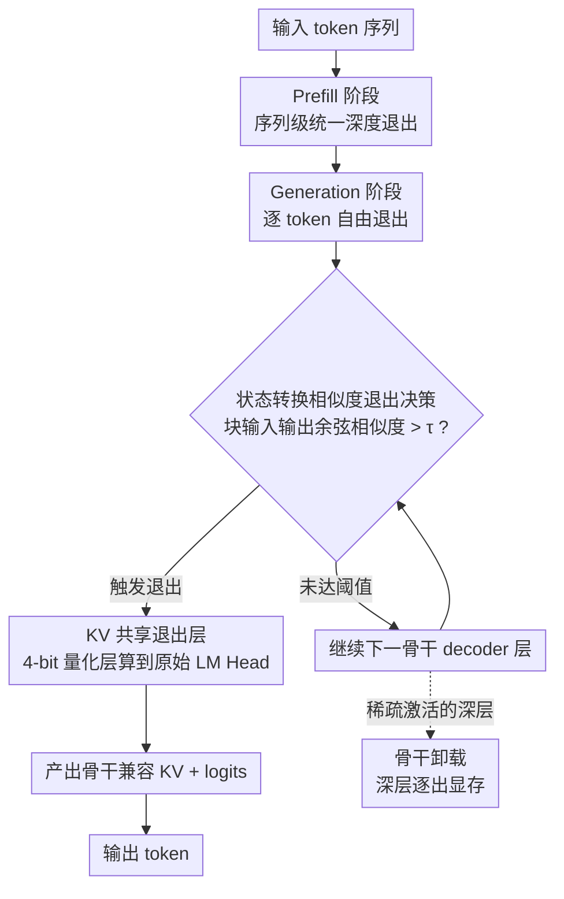

# River-LLM: Large Language Model Seamless Exit Based on KV Share

**会议**: ACL 2026  
**arXiv**: [2604.18396](https://arxiv.org/abs/2604.18396)  
**代码**: 无  
**领域**: 代码智能  
**关键词**: 早退机制, KV缓存, 动态推理, 模型加速, 量化

## 一句话总结
本文提出 River-LLM，一个无需训练的框架，通过构建轻量级 KV 共享退出通道（Exit River）解决了 decoder-only 架构中 Early Exit 的 KV Cache 缺失问题，利用状态转换相似度引导退出决策，实现 1.71×-2.16× 的实际推理加速且保持近无损生成质量。

## 研究背景与动机

**领域现状**：Early Exit 是 LLM 动态推理加速的主流方向，通过根据输入复杂度动态跳过冗余层来减少计算。已有方法如 SkipDecode（单调递减退出）、EE-LLM（批量重计算）、CALM（状态传播）、D-LLM（KV掩码）等从不同角度尝试解决这一问题。

**现有痛点**：在 decoder-only 架构中，Early Exit 的效率受到 **KV Cache 缺失问题**的严重瓶颈。当一个 token 提前退出时，跳过的层无法为后续 token 提供必要的历史 KV 状态。作者的实证分析表明：虽然理论上超过 50% 的 token 可以在早期层退出，但实际 wall-clock 加速微乎其微。

**核心矛盾**：现有四种 KV 恢复策略都存在根本性缺陷：批量重计算引入显著延迟开销；单调递减退出严重限制退出灵活性；状态传播牺牲精度换取速度；KV 掩码导致严重精度损失。没有方法能同时满足"逐 token 自由退出"和"KV 完整性"。

**本文目标**：设计一种"无缝退出"(Seamless Exit) 机制，使单个 token 可以在任意层独立退出（粒度自由），同时跳过层的 KV 缓存作为退出路径执行的副产品自动填充（内在 KV 完整性），无需后退出恢复或重计算。

**切入角度**：受 KV 缓存冗余性研究启发，作者发现可以通过量化后的轻量级退出层复制骨干 decoder 的 KV 生成，以极低开销"代替"跳过的层完成 KV 填充。退出层产出的 KV 与骨干层的余弦相似度保持在 0.97 以上。

**核心 idea**：构建一条与骨干 decoder 一一映射的轻量级"退出河流"（KV-Shared Exit River），使用 4-bit 量化权重加速 token 通过退出通道的速度（2.4× 吞吐提升），同时自然生成与骨干兼容的 KV 缓存。

## 方法详解

### 整体框架

River-LLM 在骨干 decoder 旁并行架起一条"退出河流"——一串与骨干层一一对应、4-bit 量化的轻量退出层，专门负责给提前退出的 token 补完剩余计算和 KV 缓存。推理分两段走：Prefill 阶段所有 token 统一深度退出以保住并行注意力效率；Generation 阶段切换为逐 token 自由退出，每个 token 在自己的最优深度终止。一旦某 token 触发退出条件，它的剩余计算就被卸载到退出河流，由量化退出层一路算到原始 LM Head 出 logits，同时顺手产出与骨干兼容的完整 KV——这样后续 token 不再缺历史 KV，彻底绕过了 decoder-only Early Exit 的 KV 缺失瓶颈。

### 关键设计

**1. KV 共享退出层：用量化层近似 KV，而非精确恢复**

退出层直接继承骨干层的架构与参数，再对 Attention 和 FFN 块施加 4-bit 权重量化（W4A16），但刻意把 KV Cache 留在 FP16 以保住表示密度，并与对应骨干层共用同一套 KV Cache 寻址方案。核心洞察是 KV 缓存本就无需完全精确——4-bit 量化带来的误差落在可接受区间，换来的却是巨大的计算节省：配合量化和部分图编译优化的内核，退出层取得 2.4× 吞吐，而它生成的 KV 与骨干原生 KV 的余弦相似度稳定在 0.97 以上。整个权重迁移一般一分钟内完成，全程无需训练。

**2. 基于状态转换相似度的退出决策：用早期层信号预测何时该退**

退出指标取 decoder 块输入输出之间的余弦相似度（状态转换相似度），退出判据为 $\mathcal{D}^{(l)} = \mathbb{I}(\min_{b \in \mathcal{B}} s_{t,b}^{(l)} > \tau)$，其中 $s_{t,b}^{(l)} = \frac{\mathbf{h}_{t,b}^{(l-1)\top} \mathbf{h}_{t,b}^{(l)}}{\|\mathbf{h}_{t,b}^{(l-1)}\| \|\mathbf{h}_{t,b}^{(l)}\|}$。作者发现早期层的状态转换相似度与最终层的骨干-退出值向量相似度存在中等正相关（$r=0.5536$），于是可以用前者预判后者、提前决定退出时机；而该相似度大致单调递增，恰好契合 Early Exit 的客观规律——退出层之后的大多数层也都满足退出条件。退出判定本身只是 $\mathcal{O}(d)$ 的复杂度、约 100 微秒，仅占总推理时间的 0.0688%，几乎不增成本。

**3. 骨干卸载：把稀疏激活的深层逐出显存**

由于绝大多数 token 都在早期就终止了骨干遍历，框架可以自动把后续很少被激活的骨干深层从主显存中驱逐，让模型以接近全量化基线的显存占用运行，而退出河流则常驻显存提供连续的语义补全。这正是 River-LLM 相比全模型量化的关键优势：保留了选择性的计算保真度——"困难"或高熵 token 仍以全精度走骨干，"简单" token 才卸载到量化退出河流，从而在内存和精度之间取得更优的折中。

### 损失函数 / 训练策略

River-LLM 完全无需训练：退出层权重直接从骨干层复制再施加 PTQ 量化，不做任何微调，仅靠调节阈值 $\tau$ 就能在精度与速度之间灵活权衡。

## 实验关键数据

### 主实验
在 GSM8K、MATH、HumanEval 上的实际 wall-clock 加速对比。

| 模型 | 任务 | Backbone Acc | Full Quant. Acc | River-LLM Acc | River-LLM 加速 |
|------|------|------|------|------|------|
| Llama3.2 1B | GSM8K | 33.2 | 25.1 | 29.3 | 2.16× |
| Llama3.2 1B | MATH | 17.8 | 12.2 | 14.6 | 1.88× |
| Llama3.1 8B | GSM8K | 78.2 | 69.8 | 74.4 | 1.78× |
| Llama3.1 8B | HumanEval | 57.3 | 50.2 | 55.5 | 1.77× |
| Ministral3 8B | MATH | 48.1 | 46.0 | 46.6 | 1.85× |

### 消融实验

| KV 策略 | 实际延迟 | 精度保持 | 说明 |
|---------|---------|---------|------|
| KV Mask | 最高骨干延迟 | 差 | 需执行更深层来补偿精度损失 |
| KV Recompute | 高计算开销 | 好 | 长序列生成中开销累积 |
| State Propagation | 中等 | 中等 | 精度-速度折中 |
| Mono-Decreasing | 中等 | 好 | 限制退出灵活性 |
| KV Share (Ours) | 最低 | 好 | 无需恢复操作 |

### 关键发现
- River-LLM 平均只执行 3-4 个骨干层即可达到与全模型接近的精度，在 Llama3.1 8B 上大部分任务在中位层之前终止
- 在 HumanEval 上 River-LLM 甚至超过全模型基线（57.3 vs 55.5），可能是通过跳过冗余深层减少了累积噪声或"过度思考"
- 相比全量化基线，River-LLM 吞吐略低约 10%，但精度保持远优于全量化
- 退出决策逻辑仅约 100 微秒，占总推理时间 0.0688%，开销可忽略
- GPU 内存消耗显著低于骨干模型和现有 Early Exit 基线，接近全量化模型

## 亮点与洞察
- **"无缝退出"的概念定义**很有价值：粒度自由 + 内在 KV 完整性，清晰地将 River-LLM 与所有先前方法区分开来。这个定义本身就是对 Early Exit 研究的贡献
- **量化退出层作为 KV 代理**的想法非常巧妙：不追求精确恢复 KV，而是用 4-bit 量化层"近似"生成，0.97+ 的余弦相似度足以维持自回归生成质量。这利用了 KV 缓存的内在冗余性
- 完全无需训练是一大实用优势，权重迁移在一分钟内完成，可以即插即用于任何 decoder-only 模型
- 量化后端可替换（HQQ→AWQ 后精度进一步提升），框架具有良好的可扩展性

## 局限与展望
- 当前评估仅覆盖最大 8B 参数模型，24B 和 70B 模型上的行为未验证
- 对 prefill 主导的任务（如 MMLU）加速不明显，因为 prefill 阶段使用序列级退出
- 退出阈值 $\tau$ 需要手动选择，不同模型和任务的最优值可能不同
- 累积量化误差在非常早的退出点仍然存在（虽然可控），对极长序列生成的影响未充分研究

## 相关工作与启发
- **vs LayerSkip/SpecEE**: 这些方法将 Early Exit 与投机解码结合，但受限于序列级退出或短 draft 序列，River-LLM 实现了真正的 token 级自由退出
- **vs CALM**: CALM 使用状态传播填充 KV，这是一种精度-速度折中；River-LLM 通过量化退出层生成高保真 KV，消除了这种折中
- **vs 全模型量化**: 全量化对所有 token 施加均匀精度损失，River-LLM 选择性地让"难" token 走全精度骨干、"易" token 走量化退出河流，实现了更优的帕累托前沿

## 评分
- 新颖性: ⭐⭐⭐⭐⭐ KV 共享退出河流的概念新颖且优雅，清晰解决了 Early Exit 的核心瓶颈
- 实验充分度: ⭐⭐⭐⭐ 四个模型、多个基准、与全量化和现有策略的对比充分，但缺少 >8B 模型验证
- 写作质量: ⭐⭐⭐⭐ 动机推导清晰，图表信息量大，但部分内容有重复

<!-- RELATED:START -->

## 相关论文

- [\[ICLR 2026\] KV Cache Transform Coding for Compact Storage in LLM Inference](../../ICLR2026/code_intelligence/kv_cache_transform_coding_for_compact_storage_in_llm_inference.md)
- [\[ACL 2025\] CoCo-Bench: A Comprehensive Code Benchmark for Multi-task Large Language Model Evaluation](../../ACL2025/code_intelligence/coco-bench_a_comprehensive_code_benchmark_for_multi-task_large_language_model_ev.md)
- [\[ACL 2026\] KoCo-Bench: Can Large Language Models Leverage Domain Knowledge in Software Development?](koco-bench_can_large_language_models_leverage_domain_knowledge_in_software_devel.md)
- [\[ACL 2026\] Precise Debugging Benchmark: Is Your Model Debugging or Regenerating?](precise_debugging_benchmark_is_your_model_debugging_or_regenerating.md)
- [\[ACL 2026\] StoryCoder: Narrative Reformulation for Structured Reasoning in LLM Code Generation](storycoder_narrative_reformulation_for_structured_reasoning_in_llm_code_generati.md)

<!-- RELATED:END -->
