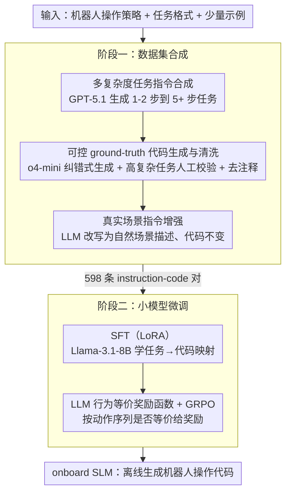

# Ro-SLM: Onboard Small Language Models for Robot Task Planning and Operation Code Generation

**会议**: ACL2026  
**arXiv**: [2604.10929](https://arxiv.org/abs/2604.10929)  
**代码**: https://github.com/ai-uavsec/Ro-SLM  
**领域**: 代码智能  
**关键词**: 小语言模型、机器人规划、代码生成、知识蒸馏、边缘部署

## 一句话总结
Ro-SLM 用 LLM 合成和校验机器人任务-代码数据，再通过 SFT 与 LLM 奖励的 GRPO 优化 Llama-3.1-8B，使小模型能在无人机和地面车任务中接近云端 LLM 的规划与操作代码生成能力。

## 研究背景与动机
**领域现状**：LLM 已经被用于机器人任务理解、规划和操作代码生成。通过结构化提示，GPT、Gemini 等大模型可以把自然语言任务转换为机器人 API 调用或控制脚本，并在复杂空间推理中表现出较强能力。

**现有痛点**：很多 LLM 驱动机器人方案依赖云端 API 或高性能本地 GPU。对于小型 UAV、地面车、灾害救援或山区巡检场景，网络连接、能耗、算力和载重都可能限制云端或超大模型部署。小语言模型更适合 onboard inference，但原始 SLM 的推理与代码生成能力远弱于 LLM。

**核心矛盾**：机器人需要低延迟、离线可用、资源友好的 onboard 模型；但机器人规划和代码生成又需要强语义理解、空间推理和动作序列规划。如何把 LLM 的知识与推理能力蒸馏进可部署的小模型，是本文的核心问题。

**本文目标**：作者希望构建一个端到端框架，让 SLM 通过高质量合成数据和 LLM 反馈优化，学会从自然语言任务生成可执行机器人操作代码，并在复杂任务上接近 LLM baseline。

**切入角度**：论文没有只靠 prompt 让 SLM 模仿 LLM，而是从数据构造入手。LLM 负责生成多复杂度任务指令、映射 ground-truth code、把简洁指令扩展成真实场景描述，并在强化优化阶段担任 reward function。

**核心 idea**：用 LLM 构建任务-代码监督并作为行为等价性评判器，把云端 LLM 的机器人任务知识蒸馏到可 onboard 部署的 SLM 中。

## 方法详解
Ro-SLM 包含两个阶段：数据集合成和小模型微调。第一阶段生成不同复杂度的机器人任务指令，并将其映射到正确操作代码；第二阶段用这些 instruction-code pairs 训练 SLM，再用 LLM 奖励优化模型输出的动作等价性。

### 整体框架
数据合成阶段先定义机器人操作策略、任务格式和少量 demonstrations，让 GPT-5.1 生成从简单到复杂的任务指令。随后，o4-mini 通过 corrective code generation 生成对应机器人操作代码；对于五步及以上高复杂任务，引入人类专家校验和修正，保证 ground truth 可靠。接着，LLM 将简洁任务指令改写为真实应用场景描述，但保持对应代码不变，从而提升模型面对自然人类表达时的鲁棒性。

训练阶段以 Llama-3.1-8B 为 SLM backbone，先用 LoRA 做 supervised fine-tuning，让模型学习机器人 API 和任务到代码的映射。然后使用 GRPO 进一步优化，奖励由 LLM 生成：它比较 SLM 代码和 ground truth 代码所隐含的机器人行为是否等价，而不是只看字符串相似度。

### 关键设计

**1. 多复杂度任务指令合成：把简单动作到长程规划的任务分布一次性铺开**

如果只用简单任务训练，SLM 学不会复杂规划；只用复杂任务又会丢掉基础动作能力——消融里 simple-only 在 Advanced 上 SR 为 0%、complex-only 在 Basic 上 SR 为 0%，正好把这个两难钉死。为此，LLM agent 依据机器人能力、操作约束和少量示例生成任务指令，并用多种系统 prompt 配置控制复杂度分布，让任务从一两步的基本移动一路覆盖到五步以上、含动态推理的 long-horizon planning。任务多样性因此成为框架的前提，而不是事后补丁。

**2. 可控 ground-truth code 生成与清洗：用最小人工成本换来可靠的 instruction-code 监督**

机器人控制代码错一步就可能让真实动作走样，若全部交给 LLM 自动生成，复杂样本会被引入错误监督。Ro-SLM 因此分而治之：简单任务由 LLM 的 corrective code generation 自动产代码，五步及以上的高复杂任务则交人类专家审核修正。最终数据里还统一移除代码注释——因为注释是“给人看的解释”，会诱导 SLM 去学表层语言模式而非动作逻辑。混合校验保证复杂样本的 ground truth 可信，去注释则逼模型盯住代码本身。

**3. 真实场景指令增强：让小模型扛得住人类的自然表达**

为防止代码生成被误解，合成出的任务指令必须简洁、机械（如“向上飞 5 米，再向下飞 4 米”），但这和人类真实下达任务的口吻相差很远。Ro-SLM 因此用 LLM 把每条简洁指令改写（augment）成对应的真实部署场景描述，而保持代码不变——于是指令-代码对的指令侧变得自然多样，代码侧仍指向同一份 ground truth。为避免改写擅自引入新动作或啰嗦失真，系统 prompt 约束改写不得增删机器人动作、只用常见词汇和单段人类口吻表达。消融显示该增强在 Basic 上提升 SR/Completeness 至少 2%、在 Advanced 上超过 5%，在 real-world 改写版上的鲁棒性提升尤其明显。

**4. LLM 作为行为等价奖励函数：让优化目标对齐机器人动作，而不是代码文本**

机器人代码里变量名、写法不同未必代表行为不同，反过来语义相近的文本也可能产生不同动作，单纯的字符串相似度会两头误判。在 GRPO 阶段，Ro-SLM 让 LLM 分别解释 SLM 生成代码与 ground truth 代码对应的机器人行为，判断两条动作序列是否等价，再把这个等价信号作为奖励去优化 SLM 的 step-level reasoning。奖励因此挂在“动作是否一致”这个任务本质上，比形式匹配更贴合机器人控制。

### 损失函数 / 训练策略
Ro-SLM 先用 LoRA 对 Llama-3.1-8B 做 SFT，学习从任务指令到操作代码的映射。随后用 GRPO 做优化，奖励由 GPT-5.1 实现的 reward function 提供。训练数据共由 203 条原始任务指令生成，其中 150 条自动 grounded，53 条高复杂任务有人类辅助；经过 augmentation 后得到 598 个 instruction-code pairs，划分为 492 条训练和 106 条评估。

## 实验关键数据

### 主实验
实验使用 AirSim 的 block 环境，在 Basic、Advanced 及其 real-world mapping 版本上评估 Success Rate 和 Completeness。对比方法包括原始 Llama-3.1-8B、GSCE、Corrective GSCE 和 Ro-SLM 变体。

| 数据集 | 指标 | Ro-SLM | 原始 Llama-3.1-8B | GSCE | Corrective GSCE |
|--------|------|------|----------|------|------|
| Basic | SR / Completeness | 97.7% / 98.9% | 9.1% / 9.1% | 100% / 100% | 100% / 100% |
| Advanced | SR / Completeness | 70.0% / 83.7% | 5.0% / 9.0% | 75.0% / 91.5% | 90.0% / 97.8% |
| Basic real-world | SR / Completeness | 93.2% / 95.5% | 11.4% / 26.1% | 100% / 100% | 100% / 100% |
| Advanced real-world | SR / Completeness | 75.0% / 87.0% | 0% / 8.4% | 75.0% / 94.8% | 81.7% / 96.3% |
| Ground vehicle | SR / Completeness | 75.0% / 81.1% | 未作为主对比 | 未报告 | 87.5% / 97.2% |

结果显示，原始 SLM 几乎不能完成机器人代码生成，而 Ro-SLM 显著缩小与 LLM-based GSCE 的差距。Advanced real-world 上 Ro-SLM 的 SR 达到 75%，与 GSCE 持平，但 Completeness 仍低于 Corrective GSCE。

### 消融实验
作者通过注释、augmentation、任务复杂度分布和 GRPO 优化分析各组件贡献。

| 配置 | Basic SR / Comp. | Advanced SR / Comp. | 说明 |
|------|---------|------|------|
| Ro-SLM | 97.7% / 98.9% | 70.0% / 83.7% | 完整框架 |
| with Comments | 95.5% / 96.6% | 50.0% / 76.2% | 注释噪声伤害复杂任务 |
| without Augmentation | 95.5% / 96.6% | 55.0% / 74.8% | 缺少真实表达降低鲁棒性 |
| Simple Task Only | 90.9% / 93.2% | 0% / 1.9% | 只学简单任务无法泛化复杂规划 |
| Complex Task Only | 0% / 2.3% | 75.0% / 83.8% | 只学复杂任务会丢失基础动作能力 |
| without GRPO | 97.7% / 98.9% | 70.0% / 83.1% | GRPO 主要提升复杂任务 step-level completeness |

### 关键发现
- prompting 对 LLM 有效，不代表对 SLM 有效。原始 Llama-3.1-8B 常重复任务指令或生成错误推理代码。
- augmentation 对 real-world mapping 特别重要。Advanced real-world 中 Ro-SLM 的 Completeness 达到 87.0%，高于原始 Advanced 的 83.7%，说明自然场景描述训练提升了鲁棒性。
- Very High 复杂度任务上，Ro-SLM 的 SR 达到 50%，高于 GSCE 的 25%，这可能来自高复杂样本中人类校验过的准确 ground truth code。
- 在 ground vehicle 实验中，Ro-SLM 仍能接近 Corrective GSCE，说明框架不只是记住 UAV API，也能迁移到不同机器人平台。

## 亮点与洞察
- 论文把 SLM 上机器人控制的核心瓶颈定位为数据和对齐，而不是只靠更复杂 prompt。通过合成、校验、增强、奖励优化串起来，形成了一个完整可复用 pipeline。
- 去掉代码注释这个细节很有意思。它说明 SLM 可能对训练数据中的语言表层模式非常敏感，机器人代码生成中“给人看的解释”反而可能干扰模型学习动作逻辑。
- LLM reward function 关注行为等价，而非代码文本相似度，这一点很符合机器人任务。未来可进一步接入模拟器执行反馈或形式化动作检查，降低 LLM judge 的不确定性。
- Ro-SLM 的价值不在于超过最强云端 LLM，而在于在离线、低算力、低延迟场景下达到可用水平。这个取舍对真实机器人部署非常实际。

## 局限与展望
- 当前主要在模拟环境评估。真实机器人有传感器噪声、定位误差、动力学偏差和安全约束，部署前需要更强的验证与防护。
- 数据合成仍然任务特异。迁移到新机器人、新 API 或新任务域时，需要重新定义操作策略、生成数据并校验复杂代码。
- Llama-3.1-8B 约需 16GB 内存，仍不适合所有紧凑边缘设备。更小 3B 或 1B 模型在该框架下的能力尚未验证。
- 高复杂任务仍需要人类专家审核 ground truth code，扩展到更大规模或更复杂机器人系统时人工成本会增加。
- 与 Corrective GSCE 不同，Ro-SLM 推理时是单轮生成，不能自我迭代修正中间错误。未来可探索轻量 onboard verifier 或分步执行-反馈机制。

## 相关工作与启发
- **vs GSCE**: GSCE 通过结构化 prompt 让云端 LLM 生成机器人代码；Ro-SLM 把这种能力蒸馏到小模型中，牺牲一部分性能换取 onboard deployment。
- **vs Corrective GSCE**: Corrective GSCE 用多轮 LLM 修正达到更高成功率，但依赖多模型推理；Ro-SLM 单轮推理更适合资源受限平台。
- **vs PRISM / LLM-Trainer**: 这些工作也利用 LLM 合成机器人数据或蒸馏 planner；Ro-SLM 更强调操作代码生成、任务复杂度分布和 LLM 奖励优化。
- **启发**: 对边缘智能体而言，LLM 可以在训练期承担数据生成、验证和奖励建模，推理期则由 SLM 执行。这种“云端训练期重、端侧推理轻”的模式值得推广。

## 评分
- 新颖性: ⭐⭐⭐⭐☆ 框架组合较工程化，但面向 onboard SLM 机器人代码生成的完整 pipeline 有明确价值。
- 实验充分度: ⭐⭐⭐⭐☆ 覆盖 UAV、真实场景改写和 ground vehicle，并有充分消融；真实硬件实验仍缺。
- 写作质量: ⭐⭐⭐⭐☆ 结构清晰，实验数字直观；部分数据构造细节依赖附录 prompt。
- 价值: ⭐⭐⭐⭐☆ 对资源受限机器人、端侧 agent 和 LLM-to-SLM 蒸馏实践很有参考意义。

<!-- RELATED:START -->

## 相关论文

- [\[ACL 2026\] PaT: Planning-after-Trial for Efficient Test-Time Code Generation](pat_planning-after-trial_for_efficient_test-time_code_generation.md)
- [\[ACL 2025\] Personality-Guided Code Generation Using Large Language Models](../../ACL2025/code_intelligence/personality_guided_code_gen.md)
- [\[ICML 2026\] SWE-rebench V2: Language-Agnostic SWE Task Collection at Scale](../../ICML2026/code_intelligence/swe-rebench_v2_language-agnostic_swe_task_collection_at_scale.md)
- [\[ACL 2025\] CodeIF: Benchmarking the Instruction-Following Capabilities of Large Language Models for Code Generation](../../ACL2025/code_intelligence/codeif_benchmarking_the_instruction-following_capabilities_of_large_language_mod.md)
- [\[ACL 2026\] Static Program Slicing Using Language Models With Dataflow-Aware Pretraining and Constrained Decoding](static_program_slicing_using_language_models_with_dataflow-aware_pretraining_and.md)

<!-- RELATED:END -->
