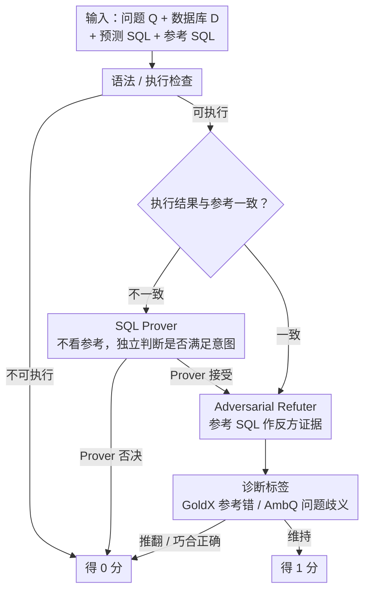

# ROSE: An Intent-Centered Evaluation Metric for NL2SQL

**会议**: ACL2026  
**arXiv**: [2604.12988](https://arxiv.org/abs/2604.12988)  
**代码**: https://github.com/CedricPei/ROSE  
**领域**: NL2SQL / 评测指标 / 数据库问答  
**关键词**: 意图中心评测, Text-to-SQL, Prover-Refuter, 执行准确率, 数据集诊断

## 一句话总结
ROSE 将 NL2SQL 评测从“预测 SQL 是否匹配单一参考 SQL”改为“预测 SQL 是否满足用户意图”，通过 SQL Prover 与 Adversarial Refuter 两阶段推理，在 ROSE-VEC 上比现有最佳指标高近 24 个百分点 Cohen's Kappa，并揭示 BIRD 等基准中参考 SQL 错误和问题歧义造成的评测危机。

## 研究背景与动机
**领域现状**：NL2SQL 的目标是把自然语言问题转换为可执行 SQL，评测长期依赖 Execution Accuracy。EX 的判断标准很直接：预测 SQL 和标注 SQL 在数据库上执行结果一致就算正确，否则算错。这个指标简单、自动、可扩展，因此成为 Spider、BIRD 等基准的核心标准。

**现有痛点**：随着 LLM 生成能力增强，EX 的缺陷越来越明显。第一，同一语义可以有多种 SQL 写法或输出表示，EX 会误判非标准但正确的实现；第二，用户问题可能本身有多种合理解释，单一参考 SQL 无法覆盖；第三，标注 SQL 也会出错，错误参考会把正确预测判成错误。论文引用已有分析称非规范但正确形式可导致高达 28.9% 假阴性，BIRD Dev 中也有约 6.91% ground-truth SQL 错误报告。

**核心矛盾**：NL2SQL 真正要评价的是“有没有回答用户问题”，而不是“有没有复刻参考 SQL”。参考 SQL 有用，但不能成为唯一真理；完全抛开参考又可能让 LLM judge 过度宽松。因此需要一种既以用户意图为中心、又能把参考 SQL 当成证据进行反驳的评测机制。

**本文目标**：作者提出 ROSE 作为 intent-centered metric，构造 ROSE-VEC 专家共识验证集，验证 ROSE 与人类专家的一致性，并用 ROSE 重新评估 19 个 NL2SQL 方法，分析强模型时代 EX 与语义正确性之间的差距。

**切入角度**：论文没有简单地让 LLM 比较预测 SQL 和参考 SQL，而是把评测拆成证明与反驳。Prover 先不看参考 SQL，独立判断预测 SQL 是否满足问题意图；Refuter 再使用参考 SQL 作为反证材料，挑战 Prover 的判断并诊断参考错误或问题歧义。

**核心 idea**：把 ground-truth SQL 从“唯一答案”降级为“可用于反驳的证据”，通过 Prover-Refuter cascade 平衡意图中心评测的宽容性与参考信号的约束性。

## 方法详解
ROSE 的评价对象是自然语言问题、数据库、预测 SQL、参考 SQL、执行结果和一组接受准则。它首先要求预测 SQL 可执行；如果不可执行，直接判错。如果预测 SQL 与参考 SQL 的执行结果不同，SQL Prover 独立判断预测 SQL 是否满足用户意图；如果结果相同，Refuter 仍会检查是否存在巧合正确或参考错误。最终只有通过所有阶段的预测才得到 1 分。

### 整体框架
ROSE 的主流程可以分成三步。第一步是语法与执行检查，过滤无法运行的 SQL。第二步是 SQL Prover：当预测执行结果与参考不一致时，Prover 只看问题、数据库、预测 SQL 和预测结果，根据接受准则判断预测 SQL 是否语义正确。第三步是 Adversarial Refuter：它读取预测 SQL 与参考 SQL，把参考当作证据来挑战 Prover 或检查执行结果相同但逻辑错误的情况，并输出是否推翻 Prover 的判断以及诊断标签。

ROSE-VEC 用于验证指标本身。数据集包含 585 个 NL-SQL 对，其中 263 个来自 Spider Test 上多个系统输出，322 个来自 BIRD Dev 上多个系统输出。每个样本由 5 位专家中的两位独立判断，只保留完全一致的样本，以得到高置信专家标签。

### 关键设计

**1. SQL Prover 的参考无关判断：先把单一参考 SQL 的锚定效应摘掉**

很多正确预测只是因为格式、排序、冗余列或问题本身的合理歧义，执行结果就和参考 SQL 不一致——若一上来就拿参考当唯一答案，这些预测会被直接判死刑。Prover 因此不访问 ground-truth SQL，只看问题、数据库 schema 与内容、预测 SQL 及其执行结果，按接受准则判断预测是否满足用户意图，并输出布尔结论加理由。把参考信号挡在第一步之外，意图中心评测才有宽容度可言。

**2. Adversarial Refuter 的证据式反驳：把参考 SQL 从裁判降级为反方证据**

完全 reference-free 的 LLM judge 容易放过真正错误的 SQL，可参考 SQL 虽不总对，却仍是有价值的反证材料。当 Prover 接受了一个与参考结果不同的预测时，Refuter 会比较预测与参考的推理逻辑，判断差异是否影响用户意图，从而可以推翻 Prover；它也能反向给参考挑错，打上 ground-truth 错误 GoldX 或问题歧义 AmbQ 的标签；即便两者执行结果相同，Refuter 还会检查这是不是“碰巧对上”。一收一放之间，宽容性与约束性被同时握住。

**3. 诊断标签与版本化 LLM judge：让指标既能给分，又能反查数据集、还能复现**

NL2SQL 的评测危机有一部分来自基准本身——参考 SQL 错、问题歧义都会污染分数。ROSE 让 Refuter 对冲突案例输出 GoldX、AmbQ 等诊断标签，把指标变成能反向定位标注错误和歧义的审计工具。同时 LLM judge 会随底座版本漂移，ROSE 用 `ROSE_model-time` 命名（如 `ROSE_o3-2504`），要求换新模型必须重新验证后才能替换，避免排行榜因底座更新产生不可复现的分数。

### 损失函数 / 训练策略
ROSE 本身不是训练模型，而是一个基于 reasoning backbone 的评测流程。作者分别实例化 OpenAI o3-2504、Gemini-2.5 Pro-2506 和 DeepSeek-R1-2505 作为 Prover/Refuter 的底座。为了降低成本，ROSE 使用精简 prompt，并根据执行结果决定是否调用第二阶段 Refuter；为了提高吞吐，评测可多线程并行。

## 实验关键数据

### 主实验
ROSE-VEC 上的核心结果显示，ROSE 与专家标签的一致性显著高于 EX、FLEX 和 LLM-SQL-Solver。

| Backbone | Metric | Kappa (%) | Acc (%) | MCC (%) | F1 (%) |
|----------|--------|-----------|---------|---------|--------|
| Deterministic | EM | 0.51 | 27.86 | 5.07 | 1.86 |
| Deterministic | ETM | 6.60 | 35.56 | 18.47 | 20.63 |
| Deterministic | EX | 25.56 | 55.90 | 37.23 | 57.00 |
| OpenAI o3 | FLEX | 56.70 | 78.97 | 62.01 | 83.31 |
| OpenAI o3 | ROSE w/o Refuter | 60.74 | 85.47 | 61.46 | 90.40 |
| OpenAI o3 | ROSE | 80.43 | 91.79 | 81.04 | 94.16 |
| Gemini-2.5 Pro | ROSE | 69.68 | 86.84 | 71.01 | 90.41 |
| DeepSeek-R1 | ROSE | 64.49 | 84.62 | 65.68 | 88.81 |

### 消融实验

| Backbone | Metric | Kappa (%) | Acc (%) | MCC (%) | F1 (%) | 说明 |
|----------|--------|-----------|---------|---------|--------|------|
| OpenAI o3 | Unified w/o GT | 53.35 | 80.43 | 54.00 | 86.09 | 单提示且不使用参考 SQL |
| OpenAI o3 | Unified | 66.35 | 83.85 | 68.22 | 86.87 | 单提示使用参考 SQL |
| OpenAI o3 | ROSE w/o GT | 71.01 | 86.34 | 72.25 | 89.11 | 分阶段但不使用参考 SQL |
| OpenAI o3 | ROSE | 80.68 | 90.99 | 81.64 | 92.91 | 完整 Prover-Refuter cascade |
| Gemini-2.5 Pro | Unified | 59.90 | 81.06 | 61.02 | 84.86 | 合并阶段性能较低 |
| Gemini-2.5 Pro | ROSE | 64.79 | 82.92 | 67.15 | 85.93 | 分阶段推理更稳 |

### 关键发现
- EX 的 Kappa 只有 25.56%，说明它与专家语义判断的差距非常大；ROSE_o3-2504 达到 80.43%，比 FLEX_o3-2504 高约 23.73 个百分点。
- Refuter 是关键组件。OpenAI o3 下，ROSE w/o Refuter 的 Kappa 为 60.74%，完整 ROSE 提升到 80.43%，说明单纯 reference-free Prover 仍不够。
- ROSE 的诊断标签有实用价值：OpenAI o3 对 GoldX 的 precision 为 84.32%，对 AmbQ 的 precision 为 91.23%，可以用于自动审计基准。
- 重新评估 BIRD Mini-Dev 上 19 个方法后，作者发现强模型时代 ROSE 与 EX 的 gap 越来越大，提示方法进步可能被参考匹配指标低估。
- 多线程能显著提升效率。ROSE_o3-2504 在 ROSE-VEC-BIRD 上单线程平均 22.48 秒/题，8 线程有效降到 3.35 秒/题。

## 亮点与洞察
- 论文最重要的思想是重新定义 ground truth 的角色。参考 SQL 不再是裁判，而是反方证据；这比“完全相信参考”或“完全忽略参考”都更合理。
- ROSE 把评测指标和数据集诊断结合起来，不仅告诉你方法分数，还告诉你分歧可能来自参考错误或问题歧义。这对维护 NL2SQL benchmark 很有价值。
- 结果揭示了一个值得警惕的趋势：模型越强，越可能生成语义正确但形式不同的 SQL，EX 反而越容易低估进步。评测指标如果不升级，会扭曲研究方向。
- 版本化 LLM judge 是一个很实用的工程细节。很多 LLM-as-judge 指标容易因底座更新产生不可复现分数，ROSE 明确要求记录 backbone 和发布时间。

## 局限与展望
- ROSE 依赖基础 reasoning model，不同底座性能差异明显；DeepSeek-R1 和 Gemini 的 Kappa 低于 OpenAI o3，说明指标可靠性会随模型能力变化。
- ROSE-VEC 只保留两位专家完全一致的样本，降低了标签噪声，但可能低估边界案例和真正歧义问题上的难度。
- 多阶段 LLM judge 成本和延迟高于 EX。虽然多线程和条件调用能缓解，但对于超大规模在线排行榜仍需要预算控制。
- Refuter 使用参考 SQL 作为证据，如果参考 SQL 错得非常隐蔽或数据库内容不足，仍可能误导判断。未来可以引入多参考 SQL、反事实数据或执行测试生成来增强证据链。

## 相关工作与启发
- **vs Execution Accuracy**: EX 自动、便宜、可复现，但把语义正确性压缩成单一执行结果匹配；ROSE 更接近用户意图，但需要 LLM 推理成本。
- **vs FLEX**: FLEX 也是 LLM-based 评测，但仍主要围绕参考 SQL 做充分性判断；ROSE 通过 Prover 先独立判断，再用 Refuter 反驳，减少参考锚定。
- **vs LLM-SQL-Solver**: LLM-SQL-Solver 直接判断 SQL 等价性，ROSE 则显式区分语义满足、参考错误和问题歧义，诊断能力更强。
- **启发**: 很多生成任务都有“单一参考答案不可靠”的问题，如代码生成、数据分析、信息抽取和多跳问答。把参考答案改造成 adversarial evidence，可能比简单 reference matching 更适合强生成模型时代。

## 评分
- 新颖性: ⭐⭐⭐⭐⭐ 从评测范式上重构 NL2SQL 指标，Prover-Refuter 设计很有启发性。
- 实验充分度: ⭐⭐⭐⭐☆ 指标验证、消融、诊断和大规模重评估都很充分，但专家集规模和保留策略仍有选择偏差。
- 写作质量: ⭐⭐⭐⭐☆ 问题讲得清楚，表格密集但逻辑顺；部分附录信息对理解成本和版本管理很关键。
- 价值: ⭐⭐⭐⭐⭐ 对 NL2SQL 评测和排行榜维护价值很高，也能迁移到其他 reference 不唯一的任务。

<!-- RELATED:START -->

## 相关论文

- [\[ACL 2025\] UTBoost: Rigorous Evaluation of Coding Agents on SWE-Bench](../../ACL2025/code_intelligence/utboost_rigorous_evaluation_of_coding_agents_on_swe-bench.md)
- [\[ACL 2025\] CoCo-Bench: A Comprehensive Code Benchmark for Multi-task Large Language Model Evaluation](../../ACL2025/code_intelligence/coco-bench_a_comprehensive_code_benchmark_for_multi-task_large_language_model_ev.md)
- [\[NeurIPS 2025\] SWE-rebench: An Automated Pipeline for Task Collection and Decontaminated Evaluation of Software Engineering Agents](../../NeurIPS2025/code_intelligence/swe-rebench_an_automated_pipeline_for_task_collection_and_decontaminated_evaluat.md)
- [\[ACL 2026\] PExA: Parallel Exploration Agent for Complex Text-to-SQL](pexa_parallel_exploration_agent_for_complex_text-to-sql.md)
- [\[ACL 2026\] QAQ: Bidirectional Semantic Coherence for Selecting High-Quality Synthetic Code Instructions](qaq_bidirectional_semantic_coherence_for_selecting_high-quality_synthetic_code_i.md)

<!-- RELATED:END -->
