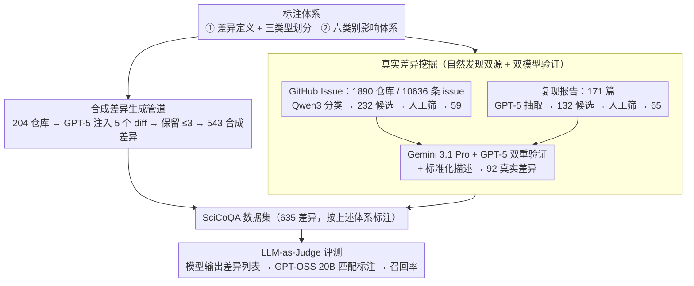

# SciCoQA: Quality Assurance for Scientific Paper–Code Alignment

**会议**: ACL 2026  
**arXiv**: [2601.12910](https://arxiv.org/abs/2601.12910)  
**代码**: [https://github.com/ukplab/scicoqa](https://github.com/ukplab/scicoqa)  
**领域**: 科学可复现性/论文-代码一致性验证  
**关键词**: 论文代码差异检测, 科学可复现性, 跨模态验证, LLM评测, 质量保证

## 一句话总结

本文提出 SciCoQA，首个用于检测科学论文与其代码实现之间差异的基准数据集，包含 635 个差异实例（92 个真实 + 543 个合成），评测 22 个 LLM 后发现最强模型仅能检测 46.7% 的真实差异，揭示了自动化科学质量保证中的关键能力缺口。

## 研究背景与动机

**领域现状**：科学可复现性危机持续困扰学术界，发布代码和数据已成为共识，但代码的可用性并不等于代码与论文描述的一致性。实际中，实现细节常常偏离论文描述——从"mathiness"（方程仅模拟技术深度而真正增益来自未记录的技巧）到评估指标的实现差异（如 BLEU 分数的不同实现导致科学比较无效）。

**现有痛点**：(1) 论文-代码不一致通常只在复现尝试中才被发现，浪费大量资源并侵蚀科学信任；(2) 审稿人已面临严重时间压力，进行细致的代码审查不切实际；(3) 随着"AI 科学家"等自动化系统（自动生成想法、代码和论文）的兴起，人工审查越来越不可行——一个自动生成的代码库可能完美运行且性能优异，但实现的方法与论文描述完全不同。

**核心矛盾**：科学产出正因自动化而指数级增长，但验证论文与代码忠实性的能力仍完全依赖人工。现有评估（如 PaperBench 的人工评分表、通用 LLM 评判或"代码能否运行"）都无法可靠检测论文-代码语义差异。

**本文目标**：构建首个论文-代码差异检测基准，系统评估 LLM 能否自动发现科学论文与代码之间的语义不一致。

**切入角度**：从可复现性社区的"自然发现"入手——利用 GitHub Issues 中用户报告的论文-代码差异和可复现性挑战赛的复现报告作为真实差异来源，并通过合成生成管道将数据扩展到 CS 以外的计算科学领域。

**核心 idea**：将论文-代码差异检测定义为跨模态验证任务（文本 vs 代码），构建包含差异类型分类体系（Difference/Paper Omission/Code Omission）和影响类别分类体系（Algorithm/Model/Loss/Evaluation/Data/Training）的结构化数据集，用以评估 LLM 的长上下文跨模态推理能力。

## 方法详解

### 整体框架

SciCoQA 把"论文与代码是否忠实对应"形式化为一个跨模态验证任务：输入一篇论文的方法描述与对应代码库，输出二者之间的语义差异列表。数据集沿真实与合成两条路线构建——真实差异从社区"自然发现"中挖掘（1890 个仓库的 10636 条 GitHub Issue 经自动+人工筛选得 59 个差异，171 篇可复现性复现报告经 GPT-5 提取+人工验证得 65 个差异，再由 Gemini 3.1 Pro 与 GPT-5 双重核验并标准化描述，合计 92 个真实差异），合成差异则在 204 个仓库上由 GPT-5 注入受控代码改动（543 个），把领域从 CS/AI 扩展到物理、统计等计算科学。评测端用 LLM-as-Judge（GPT-OSS 20B 推理模型）解析模型给出的差异列表并与标注匹配，在 1039 个人工标注样本上达到 F1 87.5%。

### 关键设计

**1. 差异的严格定义与三类型划分：先框定"什么才算差异"**

整个基准的标注一致性都建立在一个收紧的定义上：差异指"论文的科学方法描述与代码实现之间的语义冲突，使代码无法忠实复现所报告的方法"。在此之上再细分为三型——Difference（实现逻辑与论文不同，如把 L2 正则写成 L1）、Paper Omission（代码含论文未提及的关键组件）、Code Omission（论文描述的步骤在代码里缺失）。定义同时明确排除三类噪声：与论文无关的 bug、可由 CLI/配置切换的超参差异、以及数值稳定性加噪等标准工程实践。把工程细节和 bug 排除在外，数据集才能聚焦于真正影响科学有效性的语义不一致，否则标注标准会被海量无关改动淹没。

**2. 六类别影响分类体系：标注差异落在研究流水线的哪一环**

在"是什么类型"之外，每个差异还被打上"影响哪里"的标签，分为 Algorithm（步骤顺序/操作/核心逻辑）、Model（架构/权重初始化）、Loss（损失定义/项）、Evaluation（评估逻辑/指标）、Data（数据使用/预处理/增广）、Training（学习过程/调度/优化）六类。真实数据由 Algorithm（25%）与 Loss（24%）主导，合成数据则集中在 Algorithm（26%）与 Model（21%）。同时给出类型（what）与影响范围（where），便于分析不同差异的严重程度与检测难度，也让后续按维度拆解模型表现成为可能。

**3. 真实差异挖掘：从社区「自然发现」双源采集、再双模型验证**

真实差异天然稀少、只能「被发现」，本文从两条互补的社区渠道采集。一是 GitHub Issue：爬取 1890 个在主页/描述里引用论文的仓库、共 10636 条 issue，先用 Qwen3 4B 自动分类筛出 232 条疑似差异，再人工核对得 59 个。二是复现报告：从 ML Reproducibility Challenge 等收集 171 篇「复现单篇论文」的报告，用 GPT-5 抽取出 132 个候选，人工核对得 65 个。两路候选最后统一交由 Gemini 3.1 Pro 与 GPT-5 双模型对照原文、代码及原始线索复核，分歧处再人工裁定，并让模型生成 3–8 句的标准化差异描述（写明论文说了什么、代码实现了什么、差在哪），作为格式统一的 ground truth。这一步既是高精度过滤器（只保留有明确证据可验证的差异，最终留下 92 个、来自 72 篇论文），又借双模型抵消单一模型在筛选与措辞上的偏好。整套流程本质是把可复现性社区已有的零散发现「收割」成结构化数据，比凭空标注更贴近真实失配。

**4. 合成差异生成管道：用受控注入补齐规模与领域覆盖**

真实差异天然稀少且几乎只来自 CS/AI，于是从爬取的、链接 arXiv 论文且许可宽松的仓库中采样 204 个，让 GPT-5 依据论文与代码、并受差异定义约束生成 5 个代码 diff；每个仓库至多保留 3 个不触碰同一文件、且能与原始代码精确匹配的改动。合成与真实数据上的检测率相关性高达 $r = 0.94$，说明合成集可作为模型排名的可靠代理；该管道还能持续生成不在预训练语料中的样本，用以对抗数据污染。

## 实验关键数据

### 主实验

| 模型 | 真实数据召回率 | 合成数据召回率 | 平均召回率 |
|------|-------------|-------------|----------|
| Gemini 3.1 Pro | 46.7% | — | — |
| GPT-5 Mini | 46.7% | — | — |
| GPT-5 | — | 70.0% | — |
| Nemotron 49B | — | — | 23.9% |
| Qwen3 30B Coder | — | — | 23.5% |

| 模型 | Precision | Recall | F1 |
|------|-----------|--------|----|
| GPT-5 | 88.0 | 51.2 | 64.7 |
| Gemini 2.5 Pro | 94.6 | 41.1 | 57.3 |
| GPT-OSS 20B | 69.9 | 55.8 | 62.1 |

### 消融实验

| 输入条件 | 真实数据 | 合成数据 | 说明 |
|---------|---------|---------|------|
| 论文 + 代码 | 基线 | 基线 | 完整输入 |
| 仅代码 | -19.2pp（相对↓48.3%） | -16.3pp（相对↓30.8%） | 论文提供了必要的跨模态信号 |

### 关键发现

- **召回率是核心瓶颈**：最强模型仅检测 46.7% 的真实差异，精度（88-94.6%）远高于召回率，说明模型"找到的基本是对的，但漏掉了太多"。
- **Paper Omission 最难检测**：代码含论文未描述的组件时最难发现（GitHub 来源的差异 71.4% 是 Difference 所以更容易，复现报告来源 50% 是 Paper Omission 所以更难），因为无法从论文中找到锚点来对比。
- **长上下文严重降低性能**：随着论文+代码 token 数增加，检测率一致下降。中位数输入 56903 token，73/276 篇超 100k token。
- **数据污染影响显著**：模型在预训练截止日期之前发表的论文上表现更好，2025 年论文检测率最低，表明模型受益于预训练中看过的特定论文和代码。
- **论文是必需输入**：去掉论文后所有模型性能显著下降（真实数据相对下降 48.3%），确认任务的跨模态本质。
- **代码专用模型不占优**：GPT-5 Codex 反而不如 GPT-5 Mini，说明此任务需要代码理解和自然语言推理的双重能力，通用指令遵循更有用。

## 亮点与洞察

- **填补关键空白**：首次将论文-代码一致性检测形式化为可基准测试的 NLP 任务，在科学自动化时代具有极高的现实意义。
- **真实与合成的互补设计**：真实数据保证了现实性（来自实际用户报告和复现努力），合成数据解决了稀缺性和领域覆盖问题，两者检测率高度相关（$r=0.94$）验证了设计有效性。
- **"高精度低召回"的深刻洞察**：在验证场景中低召回率危害最大——漏检的差异会提供虚假安全感，而误报可由人工过滤。这对部署自动化验证系统具有重要警示意义。
- **数据污染的自然测试床**：按发表年份分析检测率的设计巧妙地揭示了数据污染问题，合成管道为持续生成未受污染数据提供了解决方案。

## 局限与展望

- 真实数据严重偏向 CS/AI，非 CS 领域仅有合成数据，错误分布可能与真实情况不同。
- 合成差异由 GPT-5 生成，而 GPT-5 也作为被评测模型之一，可能存在自我偏好偏差（去掉 GPT-5 后 $r$ 从 0.94 上升至 0.98）。
- 数据集规模较小（635 个差异），是质量与规模的权衡。
- 差异定义排除了 bug 和超参数问题，未覆盖研究代码中软件工程缺陷的完整谱系。
- 未来需扩大非 CS 领域真实数据的收集渠道，并开发专门的论文-代码验证模型。

## 相关工作与启发

- **vs Bianchi et al. (2025)**: 该工作检测论文文本内部的不一致，SciCoQA 扩展到论文与代码的跨模态不一致。
- **vs PaperBench**: PaperBench 用人工评分表验证代码实现的正确性，成本极高且不可扩展，SciCoQA 提供了可自动评测的基准。
- **vs CCI (Code-Comment Inconsistency)**: CCI 处理函数级别的代码-注释不一致，SciCoQA 要求对整篇论文和多文件代码库进行全局语义对齐，挑战性大得多。
- **vs ProcessBench/ErrorRadar**: 这些基准检测推理链中的错误，SciCoQA 检测论文描述与代码实现之间的跨模态语义差异。

## 评分

- 新颖性: ⭐⭐⭐⭐⭐ 首次形式化论文-代码一致性验证任务，问题定义精准且极具现实意义
- 实验充分度: ⭐⭐⭐⭐⭐ 22 个模型、多维度分析（类型/来源/长度/年份/消融/精度验证），实验设计非常严谨
- 写作质量: ⭐⭐⭐⭐⭐ 问题动机阐述深刻，差异定义严格，实验分析层层递进
- 价值: ⭐⭐⭐⭐⭐ 在科学自动化时代为验证论文-代码忠实性提供了基础设施级贡献

<!-- RELATED:START -->

## 相关论文

- [\[ACL 2026\] CodeRL+: Improving Code Generation via Reinforcement with Execution Semantics Alignment](coderl_improving_code_generation_via_reinforcement_with_execution_semantics_alig.md)
- [\[ACL 2026\] QAQ: Bidirectional Semantic Coherence for Selecting High-Quality Synthetic Code Instructions](qaq_bidirectional_semantic_coherence_for_selecting_high-quality_synthetic_code_i.md)
- [\[ACL 2026\] CodeDistiller: Automatically Generating Code Libraries for Scientific Coding Agents](codedistiller_automatically_generating_code_libraries_for_scientific_coding_agen.md)
- [\[ICLR 2026\] Paper2Code: Automating Code Generation from Scientific Papers in Machine Learning](../../ICLR2026/code_intelligence/paper2code_automating_code_generation_from_scientific_papers_in_machine_learning.md)
- [\[NeurIPS 2025\] Embedding Alignment in Code Generation for Audio](../../NeurIPS2025/code_intelligence/embedding_alignment_in_code_generation_for_audio.md)

<!-- RELATED:END -->
