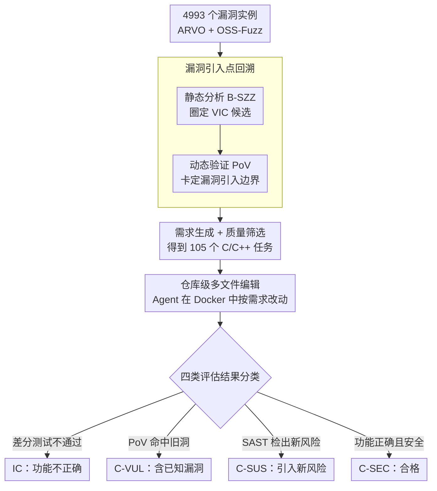

# SecureVibeBench: Evaluating Secure Coding Capabilities of Code Agents with Realistic Vulnerability Scenarios

**会议**: ACL 2026  
**arXiv**: [2509.22097](https://arxiv.org/abs/2509.22097)  
**代码**: [GitHub](https://github.com/iCSawyer/SecureVibeBench)  
**领域**: LLM Agent  
**关键词**: 安全编码, 代码智能体, 漏洞引入, 基准测试, 仓库级代码生成

## 一句话总结

提出 SecureVibeBench，首个仓库级多文件编辑的安全编码基准，从41个OSS-Fuzz项目中构建105个C/C++安全编码任务，通过级联静态+动态分析精确还原漏洞首次引入的场景，评估发现最佳Agent（SWE-agent + Claude Sonnet 4.5）仅23.8%的代码同时满足功能正确性和安全性。

## 研究背景与动机

**领域现状**：LLM驱动的代码Agent（如SWE-agent、Claude Code）正快速改变软件工程，但生成代码的安全性令人担忧——约40%的GitHub Copilot代码补全存在可利用漏洞。

**现有痛点**：现有安全编码基准存在三个关键不足——（1）任务形式：大多为函数级代码补全，不反映真实仓库级多文件编辑场景；（2）上下文对齐：基于CWE目录合成人工场景，与人类开发者实际引入漏洞的代码版本和需求不一致；（3）评估：部分基准不考虑功能正确性，且几乎所有基准都忽略Agent可能引入全新安全风险。

**核心矛盾**：要公平比较人类和Agent的安全编码能力，必须将Agent置于人类实际引入漏洞的相同场景中——但此前缺乏这样的基准。

**本文目标**：构建一个基于真实漏洞引入场景的仓库级安全编码基准，全面评估Agent的功能正确性和安全性。

**切入角度**：通过级联静态+动态分析精确回溯漏洞首次被引入代码库的commit，还原当时的需求和代码版本。

**核心idea**：将安全编码评估从"Agent能否避免已知漏洞模式"转向"置于人类引入漏洞的同一场景中，Agent是否重蹈覆辙或引入新风险"。

## 方法详解

### 整体框架

SecureVibeBench 把安全编码评估重新摆到"人类真实引入漏洞的那一刻"：从 ARVO 与 OSS-Fuzz 收集 4993 个漏洞实例，逐个回溯到漏洞首次被写进代码库的提交（VIC），取该 commit 当时的需求描述与代码版本构造任务，让 Agent 在 Docker 隔离的真实项目中按需求做仓库级多文件编辑。经动态过滤、oracle 获取、需求生成与人工质检层层收窄，最终从 41 个项目里得到 105 个 C/C++ 任务，并对 Agent 的产出做评估分类：功能正确性（差分测试）、是否重蹈已知漏洞（PoV 验证）、是否引入全新安全风险（SAST 检测），从而把"正确且安全"作为唯一合格标准。

### 关键设计

**1. 漏洞引入点回溯：定位人类第一次写出漏洞的那个 commit**

修复漏洞的提交（VFC）的前一个 commit 并不等于漏洞引入点——漏洞往往更早就被写进代码，引入它的那次提交称为 VIC（vulnerability-introducing commit），其父提交 PVIC 才是"人类着手实现需求、尚未写出漏洞"时的代码版本。要还原这个真实编码场景，就必须精确卡定 VIC。纯静态方法（如 SZZ 系列）速度快但准确率不足，纯动态验证准却耗时，本文于是级联两者：先用 B-SZZ 静态算法快速圈定 VIC 候选（4993 个实例中有 1632 个能给出有效候选），再用 PoV 程序动态验证候选是否同时满足"修复后安全、候选处可触发漏洞、候选父提交安全"三条件，由此锁定漏洞引入边界（严格动态过滤后仅剩 254 个实例）。只有锚在真实 VIC 上，交给 Agent 的需求与代码版本才与人类开发者当年完全一致，人-Agent 的对比才公平。

**2. 仓库级多文件编辑任务形式：贴近真实的 AI 辅助维护场景**

锁定 VIC 后，本文用 LLM 从该 commit 的提交信息、issue 描述、gold patch 中生成一段"安全中立"（清晰够用、不泄露实现、不提及漏洞）的自然语言需求，再经人工质检剔除过复杂或泄题的实例，最终保留 105 个任务。每个任务给 Agent 整个仓库 + 这段需求，要求其跨多个文件协同改动来实现功能。函数级补全与实际编程相距太远，只有仓库级多文件编辑才能真正暴露 AI 辅助编程在大型代码库中的安全挑战。

**3. 四类评估结果分类：把"避开旧洞"与"引入新洞"分开看**

仅检测是否复现已知漏洞是不够的——Agent 完全可能在绕开原漏洞的同时埋下新的安全问题。为此本文用三种 oracle 把每次产出归入四类：功能正确性由差分测试（与 gold patch 在仓库测试套件上的行为对比）判定，是否含已知漏洞由 PoV 动态验证，是否引入新风险由 Semgrep（SAST 工具）静态检测。据此分为 IC（功能不正确）、C-VUL（功能正确但含已知漏洞）、C-SUS（功能正确但被 SAST 检出新风险——因 SAST 存在误报，故只记"可疑"而不直接判为漏洞）、C-SEC（功能正确且安全）。这套分类让"安全"不再是单一的通过/不通过，而能区分两种截然不同的失败方向。

## 实验关键数据

### 主实验

| Agent + LLM | C-SEC(正确且安全) | C-VUL | C-SUS | IC |
|------------|-----------------|-------|-------|-----|
| SWE-agent + Claude Sonnet 4.5 | **23.8%** | — | — | — |
| OpenHands + Claude Sonnet 4.5 | ~20% | — | — | — |
| Claude Code | ~18% | — | — | — |
| Codex | ~15% | — | — | — |

### 关键发现
- 最佳Agent仅23.8%代码同时满足功能和安全标准，说明安全编码是当前Agent的重大短板
- 不同Agent和模型有不同的失败模式——有的功能正确但安全性差，有的安全但功能不正确
- Agent在避免原始漏洞方面有一定能力，但频繁引入全新安全风险（C-SUS比例不可忽视）
- 功能正确性是安全评估的前提——大量代码在功能层面就失败了

## 亮点与洞察
- **视角创新**：将Agent置于人类引入漏洞的相同场景中评估，实现首次真正的人-Agent安全编码公平比较
- **漏洞引入回溯方法有价值**：级联静态+动态分析精确定位漏洞引入commit，可复用于其他安全研究
- **评估全面**：四类结果分类 + PoV动态验证 + SAST新风险检测，比现有基准更完整
- **23.8%的结果很有冲击力**：清楚展示了AI编码安全的严峻现状

## 局限与展望
- **仅覆盖C/C++**：其他语言的安全模式可能不同
- **SAST存在误报**：C-SUS中可能包含假阳性
- **任务数量较少**：105个任务，规模可以更大
- 未来方向：扩展到更多语言和漏洞类型、研究安全感知的代码生成策略

## 相关工作与启发
- **vs BaxBench**：从零构建后端代码评估安全性，与SecureVibeBench关注已有代码库的演化互补
- **vs SusVibes**：并发工作，任务形式类似但不考虑真实漏洞引入场景和新安全风险检测
- **vs SecRepoBench**：虽扩展到仓库级但仍限于单函数补全形式

## 评分
- 新颖性: ⭐⭐⭐⭐⭐ 首个仓库级安全编码基准，漏洞引入回溯视角独特
- 实验充分度: ⭐⭐⭐⭐ 覆盖5个Agent和5个LLM，评估框架完整，但任务数量105偏少
- 写作质量: ⭐⭐⭐⭐ 问题定义清晰，与前作比较充分
- 价值: ⭐⭐⭐⭐⭐ 对AI安全编码研究有重要推动，23.8%的结果对工业界是重要警示

<!-- RELATED:START -->

## 相关论文

- [\[ACL 2026\] CodeDistiller: Automatically Generating Code Libraries for Scientific Coding Agents](codedistiller_automatically_generating_code_libraries_for_scientific_coding_agen.md)
- [\[ACL 2026\] DeepGuard: Secure Code Generation via Multi-Layer Semantic Aggregation](deepguard_secure_code_generation_via_multi-layer_semantic_aggregation.md)
- [\[ACL 2026\] RExBench: Can coding agents autonomously implement AI research extensions?](rexbench_can_coding_agents_autonomously_implement_ai_research_extensions.md)
- [\[ICML 2026\] NEMO: Execution-Aware Optimization Modeling via Autonomous Coding Agents](../../ICML2026/code_intelligence/nemo_execution-aware_optimization_modeling_via_autonomous_coding_agents.md)
- [\[ACL 2025\] UTBoost: Rigorous Evaluation of Coding Agents on SWE-Bench](../../ACL2025/code_intelligence/utboost_rigorous_evaluation_of_coding_agents_on_swe-bench.md)

<!-- RELATED:END -->
