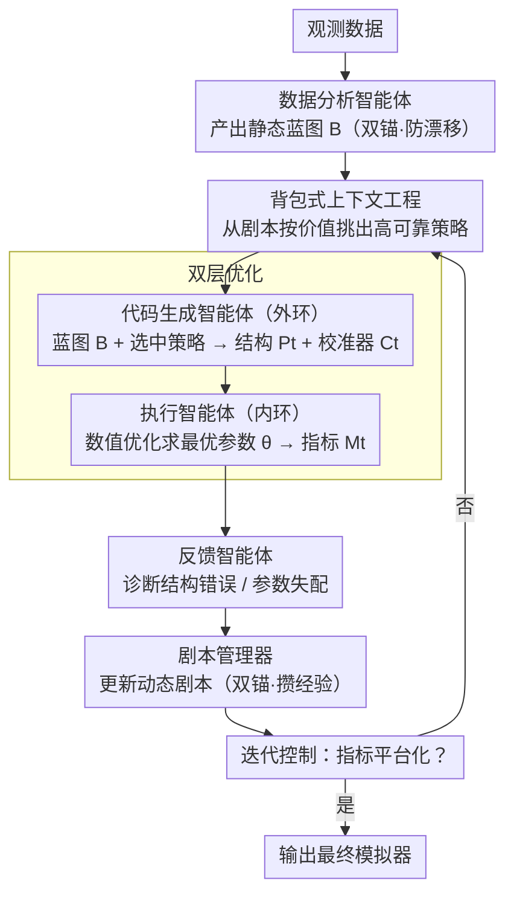

# SOCIA-EVO: Automated Simulator Construction via Dual-Anchored Bi-Level Optimization

**会议**: ACL 2026  
**arXiv**: [2604.17351](https://arxiv.org/abs/2604.17351)  
**代码**: [https://github.com/cruiseresearchgroup/SOCIA/tree/evo](https://github.com/cruiseresearchgroup/SOCIA/tree/evo)  
**领域**: 代码智能  
**关键词**: 自动化模拟器构建, 双锚进化框架, 双层优化, 策略剧本, 分布保真度

## 一句话总结

本文提出 SOCIA-EVO，一种将自动化模拟器构建重新定义为双锚进化过程的 LLM 智能体框架，通过静态蓝图（Blueprint）锚定经验约束、双层优化解耦结构修正与参数校准、自我策划的策略剧本（Playbook）管理修复假说并通过执行反馈进行贝叶斯加权检索，在用户建模、口罩佩戴扩散和个人出行三个模拟任务上显著超越 Reflexion、G-SIM 等基线。

## 研究背景与动机

**领域现状**：从观测数据自动构建模拟器（数据驱动模拟）是理解复杂系统的基石。与通用软件工程中功能正确性即可不同，模拟器构建本质上是科学建模任务，要求分布保真度——生成的程序必须复现真实数据的统计规律、因果机制和涌现行为。

**现有痛点**：标准 LLM 智能体应用于长周期模拟器构建时存在两个关键失败模式：(1) 上下文漂移——随模拟器复杂度增加，初始数据分析中建立的约束逐渐失去显著性，智能体可能幻觉出数据中不存在的机制；(2) 优化不稳定——智能体混淆结构错误（如转移逻辑错误）和参数不匹配（如速率次优），在本可简单调参时却重写正确逻辑，陷入"打地鼠"式振荡修改。

**核心矛盾**：LLM 擅长离散的逻辑推理但不擅长高维连续参数搜索；同时缺乏持久化的修复策略验证机制——之前尝试过的修复及其量化结果随上下文窗口推进而丢失，导致重复提出表面合理但经验上无效的修复。

**本文目标**：设计一个能保持长周期一致性、区分结构与参数问题、并积累有效修复经验的智能体框架。

**切入角度**：引入双锚机制——静态蓝图防止上下文漂移，动态策略剧本积累和验证修复假说；双层优化将结构修正（LLM 驱动的外环）与参数校准（数值优化器的内环）严格解耦。

**核心 idea**：模拟器构建 = 蓝图锚定搜索空间 + 双层优化解耦结构与参数 + 策略剧本自我策划修复假说。

## 方法详解

### 整体框架

SOCIA-EVO 把"自动构建模拟器"重新定义为一个由六个专用智能体协作的闭环进化过程，目标不是功能跑通而是分布保真度——让生成的程序复现真实数据的统计规律与涌现行为。输入观测数据，数据分析智能体先产出一份静态蓝图 $\mathcal{B}$（不可变的权威规格）；随后进入进化循环：代码生成智能体依据 $\mathcal{B}$ 和当前剧本策略 $\mathcal{K}$ 产出模拟器代码 $P_t$ 与参数校准器 $C_t$，执行智能体跑内环优化参数 $\theta$ 并得到指标 $\mathcal{M}_t$，反馈智能体据此诊断偏差、剧本管理器更新策略库、迭代控制智能体判断是否收敛；如此循环直到指标平台化，输出最终模拟器。

### 关键设计

**1. 双锚机制：静态蓝图防漂移，动态剧本攒经验**

长周期构建里有两个顽疾：上下文漂移（随复杂度上升，初始数据分析建立的约束逐渐失声，智能体开始幻觉出数据里没有的机制）和修复经验流失（试过的修复及其结果随上下文窗口推进被遗忘，反复提出表面合理却无效的修补）。双锚分别对症：蓝图 $\mathcal{B}$ 经人类专家验证后锁定，严格定义模拟拓扑、智能体模式、评估指标等，作为不可变约束把生成过程钉在真实数据上；剧本 $\mathcal{K}$ 则是动态策略库，每个策略 $S_i = \langle R_i, I_i, \Sigma_i \rangle$ 含诊断内容（带指标绑定集 $\Lambda_i$）、使用/成功/失败计数与生命周期状态，沿 Open→Queued→InProgress→Resolved 流转，并按指标变化阈值判定为验证成功（$\Delta\mathcal{M}/\mathcal{M}_t > \tau$）、证伪（$< -\tau$）或不确定。其精髓是把修复策略当作待检验的假说而非可信修正，用执行证据来自我策划。

**2. 双层优化：把离散结构修正和连续参数校准彻底拆开**

LLM 擅长离散逻辑推理却不擅长高维连续参数搜索，于是外环交给 LLM、内环交给数值优化器。外环由代码生成智能体在程序空间搜索，产出结构与校准器 $(P_t, C_t) \leftarrow \pi_{code}(P_{t-1}, \mathcal{B}, \text{Knapsack}(\mathcal{K}))$；内环则执行校准器 $C_t$，用贝叶斯优化等数值方法求解 $\theta_t^* = \arg\min_\theta \mathcal{L}(\text{Sim}(P_t, \theta), \mathcal{D}_{obs})$。关键在于 LLM 不直接猜参数值，而是生成"寻找参数的优化程序"。这样反馈智能体看到的指标始终是结构 $P_t$ 在参数最优处的内在能力，过滤掉了未调优参数的噪声，使缺陷归因能精确指向结构逻辑而非被参数问题误导。

**3. 背包式上下文工程：在有限窗口里挑出最值钱的修复策略**

把全部策略一股脑塞进提示会稀释注意力——实验显示 3200 token 全剧本的退化与完全无记忆相当。因此每轮从 Open/Queued 池求解一个 0-1 背包：$\max \sum_i v_i x_i$ 受约束于 $\sum_i c_i x_i \leq L_{budget}$，策略价值 $v_i = w_{sev} \cdot U_i^{queue} \cdot \Phi_{rel}(S_i)$ 同时权衡严重度 $w_{sev}$、防饥饿的积压奖励 $U_i^{queue}$、以及基于 Beta-Bernoulli 模型的贝叶斯可靠性 $\Phi_{rel}(S_i) = (s_i+1)/(s_i+f_i+2)$。被选中的策略再按系统区/背景区/指令区三区布局对抗"中间丢失"。贝叶斯可靠性让经验证伪的策略自然衰减，从而把宝贵的上下文预算让给真正有效的修复。

### 一个完整示例

以用户建模任务的某一轮迭代为例：执行智能体跑出当前模拟器 $P_{t-1}$ 后，反馈智能体发现生成分布与真实数据的 MAE 偏高，诊断出一条"转移逻辑把两类用户行为混淆"的结构缺陷，写成新策略 $S_i$ 投入剧本并置 Open。下一轮，背包按价值 $v_i$ 从 Open/Queued 池里选中这条（高严重度、可靠性先验中性），连同蓝图 $\mathcal{B}$ 一起喂给代码生成智能体；后者据此改写转移逻辑得到 $P_t$ 与新的校准器 $C_t$，内环用贝叶斯优化重新求出最优参数 $\theta_t^*$，再交执行智能体评估。若 MAE 相对下降超过阈值 $\tau$，剧本管理器把 $S_i$ 标为 Resolved 并提升其可靠性；若反而变差则证伪、压低其后续被选中的概率。正是这种"假说→执行→验证/证伪"的循环，让累积重复错误在第五轮迭代时减少 76%。

### 损失函数 / 训练策略

SOCIA-EVO 不训练模型，而是通过迭代进化优化模拟器本身。内环采用 Optuna 贝叶斯优化或随机校准器求解参数；外环的迭代控制在指标改进平台化或出现回归时停止，以防过度修正。所有实验以 GPT-5.1 为骨干，跑 5 个随机种子并报告均值与 95% 置信区间。

## 实验关键数据

### 主实验

**三个模拟任务的性能对比（均值 ± 95% CI，越低越好）**

| 方法 | 用户建模 MAE↓ | 口罩模拟 RMSE↓ | 出行 N→A WD↓ |
|------|-------------|-------------|------------|
| Reflexion | 0.17±0.01 | 0.26±0.02 | 0.69±0.02 |
| YuLan-OneSim | 0.21±0.02 | 0.16±0.01 | 0.64±0.01 |
| G-SIM-SBI | 0.19±0.01 | 0.11±0.02 | 0.56±0.02 |
| ACE-OL | 0.14±0.02 | 0.24±0.01 | 0.61±0.02 |
| **SOCIA-EVO** | **0.11±0.01** | **0.07±0.01** | **0.53±0.02** |

### 消融实验

| 配置 | ΔMAE↓ | ΔRMSE↓ | ΔWD↓ |
|------|-------|--------|------|
| SOCIA-EVO (完整) | — | — | — |
| w/o 内环校准 | +0.25 | +0.47 | +0.29 |
| w/o 蓝图 | +0.20 | +0.37 | +0.23 |
| w/o HITL | +0.18 | +0.34 | +0.21 |
| w/o 记忆机制 | +0.14 | +0.30 | +0.20 |
| w/o 策略剧本 | +0.10 | +0.23 | +0.15 |
| 上下文窗口 +2200 token | +0.12 | +0.14 | +0.13 |

### 关键发现

- 内环参数校准是最关键组件——去除后 RMSE 暴涨 +0.47，因为参数更新退化为 LLM 的启发式猜测
- 上下文窗口过大（+2200 token 装入全部剧本）导致性能退化接近无记忆水平，验证了"注意力稀释效应"
- 累积重复错误在第五轮迭代时减少 76%，证明基于价值的背包机制有效抑制了"打地鼠"现象
- 开源骨干（Llama-3.3-70B、Qwen3-80B）也能实现有竞争力的性能，框架不依赖特定专有模型

## 亮点与洞察

- 将修复策略视为需要验证/证伪的假说而非可信修正，这种"科学方法论"思维在 LLM 智能体设计中非常新颖——可迁移到任何需要长周期记忆管理的智能体系统
- 双层优化的核心洞察精辟：让 LLM 生成寻找参数的程序而非直接猜测参数值，巧妙地发挥了 LLM 的代码生成优势并规避了其在连续优化上的劣势
- 背包+贝叶斯可靠性的上下文工程提供了在有限窗口内最大化信息价值的通用方案

## 局限与展望

- 最强结果依赖商用 LLM 骨干（GPT-5.1），虽然开源模型可行但存在性能差距
- 当前仅关注可通过迭代结构修正和有界参数校准表达的任务，更复杂的设置（长周期规划、策略性多智能体交互）可能需要更强的推理模块
- 蓝图的 HITL 验证虽轻量但引入了人工依赖，且蓝图质量直接影响后续所有迭代
- 策略匹配使用阈值化文本匹配，更细粒度的语义匹配可能提升策略合并质量

## 相关工作与启发

- **vs Reflexion**: Reflexion 使用情景记忆做言语强化学习，但无指标驱动的修复验证，导致在口罩模拟中 RMSE 高达 0.26 vs SOCIA-EVO 的 0.07
- **vs G-SIM**: G-SIM 有效分离结构生成和参数估计，但缺乏长期证据跟踪，重复探索已证伪的策略
- **vs Dynamic Cheatsheet**: DC 积累成功策略但可能从不相关上下文中引入负迁移
- **vs YuLan-OneSim**: 在预定义环境中生成行为，而非从数据中推断模拟器逻辑

## 评分

- 新颖性: ⭐⭐⭐⭐⭐ 将模拟器构建形式化为双锚进化过程，策略假说验证/证伪机制极具创意
- 实验充分度: ⭐⭐⭐⭐⭐ 三个任务、六个基线、详细消融、收敛分析、骨干可移植性验证
- 写作质量: ⭐⭐⭐⭐⭐ 问题形式化严谨，框架设计清晰，理论与实验结合紧密
- 价值: ⭐⭐⭐⭐ 为 LLM 驱动的科学建模提供了系统性解决方案，双锚+双层优化的设计范式有广泛迁移潜力

<!-- RELATED:START -->

## 相关论文

- [\[ACL 2026\] ChatHLS: Towards Systematic Design Automation and Optimization for High-Level Synthesis](chathls_towards_systematic_design_automation_and_optimization_for_high-level_syn.md)
- [\[ICML 2026\] BoostAPR: Boosting Automated Program Repair via Execution-Grounded Reinforcement Learning with Dual Reward Models](../../ICML2026/code_intelligence/boostapr_boosting_automated_program_repair_via_execution-grounded_reinforcement_.md)
- [\[ACL 2026\] DUET: Dual Execution for Test Output Prediction with Generated Code and Pseudocode](duet_dual_execution_for_test_output_prediction_with_generated_code_and_pseudocod.md)
- [\[ACL 2026\] Benchmarking Testing in Automated Theorem Proving](benchmarking_testing_in_automated_theorem_proving.md)
- [\[ACL 2026\] DPC: Training-Free Text-to-SQL Candidate Selection via Dual-Paradigm Consistency](dpc_training-free_text-to-sql_candidate_selection_via_dual-paradigm_consistency.md)

<!-- RELATED:END -->
