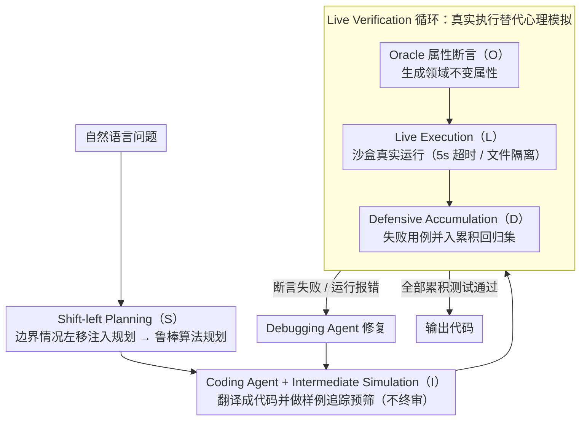

# SolidCoder: Bridging the Mental-Reality Gap in LLM Code Generation through Concrete Execution

**会议**: ACL 2026  
**arXiv**: [2604.19825](https://arxiv.org/abs/2604.19825)  
**代码**: [https://github.com/10kH/SolidCoder](https://github.com/10kH/SolidCoder)  
**领域**: 代码生成 / LLM Agent  
**关键词**: 代码生成, 心理模拟, 执行验证, 多智能体, 属性测试

## 一句话总结

SolidCoder 通过 S.O.L.I.D. 架构（Shift-left Planning、Oracle-based Assertions、Live Execution、Intermediate Simulation、Defensive Accumulation）将代码验证从 LLM 的"想象执行"转变为"真实执行"，在 GPT-4o 上达到 HumanEval 95.7%、CodeContests 77.0%、APPS 26.7% 的 pass@1 性能。

## 研究背景与动机

**领域现状**：当前最先进的代码生成框架（如 MapCoder、CodeSIM）采用多智能体架构，其中 CodeSIM 通过"心理模拟"（Mental Simulation）让 LLM 在内部追踪代码执行来验证正确性，在多个基准上取得了领先结果。

**现有痛点**：心理模拟存在根本缺陷——LLM 会产生执行幻觉。在复杂的算法场景中，模型会"想象"出与实际程序行为不符的执行轨迹，自信地验证有 bug 的代码。这就像蒙眼下棋却宣布胜利一样。CodeSIM 团队曾尝试通过自一致性来增强测试用例，结果性能下降了 9.3%，因此放弃了执行验证。

**核心矛盾**：Mental-Reality Gap（心理-现实鸿沟）沿两个正交维度展开：(1) Specification Gap——在规划阶段忽视边界情况；(2) Verification Gap——在验证阶段幻觉出正确的执行轨迹。这两个问题独立存在，修复一个不能解决另一个。

**本文目标**：同时弥合两个维度的鸿沟，既让模型在规划阶段考虑边界情况，又用真实执行替代想象执行进行验证。

**切入角度**：作者观察到 CodeSIM 测试生成失败的原因不是测试生成本身，而是试图预测精确输出。验证不需要精确答案——通过检查属性（如"输出长度等于输入长度"、"结果是输入的排列"）而非精确值，就可以在没有 oracle 的情况下判断正确性。

**核心 idea**：用基于属性的断言（property-based assertions）替代精确输出预测，结合沙盒执行，将验证从"想象"变为"执行"——don't imagine, execute。

## 方法详解

### 整体框架

SolidCoder 复用了 CodeSIM 的三智能体骨架（Planning、Coding、Debugging），但把 S.O.L.I.D. 五个组件嵌进流程，核心是把验证从 LLM 的"想象执行"换成沙盒里的"真实执行"。给定自然语言问题，Planning Agent 先在带边界意识的提示下产出鲁棒算法规划，Coding Agent 把规划翻译成代码并做一次轻量的内部追踪预筛，随后进入 Live Verification 循环——生成基于属性的断言、在沙盒中真实跑、把失败用例累积成回归测试集，反复 debug 直到所有累积测试通过才输出代码。

### 关键设计

**1. Shift-left Planning（S）：把边界情况从 debug 阶段左移到规划之前**

传统多智能体框架要等代码跑挂了才在 debug 阶段反应式地补边界处理，但此时算法骨架往往已经写歪。SolidCoder 在规划开始前先抛给 LLM 一句"什么样的最坏输入会让一个朴素解法崩掉？"，把模型答出的空输入、边界值、角落情况注入规划 prompt，逼它一上来就按鲁棒思路设计算法。消融里去掉这一步直接掉 23.7%p，是所有组件中最大的一块，说明在算法竞赛题上"边界情况盲区"才是首要失败模式，甚至超过执行幻觉本身。

**2. Oracle 属性断言（O）+ Live Execution（L）：用真实执行替代心理模拟**

心理模拟的死穴是缺少 oracle——不知道正确答案就没法判对错，而精确预测输出又容易跟着幻觉一起翻车（CodeSIM 团队正是因此放弃了执行验证）。SolidCoder 的破法是把问题从"这个输出对不对？"换成"这个输出满不满足必要属性？"：Oracle 组件生成领域不变的属性断言（排序应保长度、保有序、是输入的排列），这类断言无需精确答案就能验证。Live Execution 则把代码丢进受限沙盒（5 秒超时、文件系统隔离）真实运行，断言失败或运行时报错就路由回 debug。两者一起把"想象执行"换成"执行"，消融中移除 O 掉 11.6%p、移除 L 掉 7.9%p，且 L 捕获的是心理模拟会自信放过的另一类 bug，无法靠改规范弥补。

**3. Intermediate Simulation（I）+ Defensive Accumulation（D）：低成本预筛 + 单调防回归**

I 在代码刚生成时让 LLM 在样例输入上追踪一遍，但与 CodeSIM 不同，它只是廉价的预过滤器、不下终审，真正的裁决权交给 Live Execution，这避免了"想象裁决"重新引入幻觉。D 则维护一个持久测试套件：每次 Live Execution 发现新的失败用例就并入累积集，之后每轮代码修改都必须通过全部累积测试，从而给迭代 debug 提供单调性保证，防止"修好一个又改坏另一个"。两者分别贡献 13.0%p 和 6.7%p 的回归防护。三个迭代上限沿用 CodeSIM 设置：规划迭代 $p=5$、debug 迭代 $d=5$、假设打破迭代 $a=3$；整个框架是推理时方法，不涉及模型训练。

## 实验关键数据

### 主实验

| 基准 | 模型 | CodeSIM | SolidCoder | 提升 |
|------|------|---------|------------|------|
| HumanEval | GPT-4o | 95.1% | 95.7% | +0.6%p |
| CodeContests | GPT-4o | 72.7% | 77.0% | +4.3%p |
| APPS | GPT-4o | 23.3% | 26.7% | +3.4%p |
| CodeContests | GPT-OSS-120B | 87.9% | 92.1% | +4.2%p |
| CodeContests | Grok-4.1-Fast | 95.2% | 98.2% | +3.0%p |

### 消融实验（CodeContests, GPT-4o）

| 配置 | Pass@1 | Δ |
|------|--------|---|
| Full SolidCoder | 77.0% | – |
| w/o Shift-left Planning [S] | 53.3% | -23.7%p |
| w/o Intermediate Simulation [I] | 64.0% | -13.0%p |
| w/o Oracle-based Assertions [O] | 65.4% | -11.6%p |
| w/o Live Execution [L] | 69.1% | -7.9%p |
| w/o Defensive Accumulation [D] | 70.3% | -6.7%p |
| GPT-4o Direct | 42.4% | -34.6%p |

### 关键发现
- **Shift-left Planning 贡献最大**（-23.7%p），证明边界情况盲目性是算法任务的主要失败模式，而非执行幻觉
- **Live Execution 捕获的是分类上不同的错误**，心理模拟会错误地验证这些 bug 代码。虽然绝对贡献小于 [S]，但这类错误无法通过改善规范来解决
- 改进与难度成正比：HumanEval（简单）仅 +0.6%p，CodeContests（中等）+4.3%p 增幅最大，APPS（困难）瓶颈从验证转移到生成本身
- RL 后训练模型（GPT-OSS-120B、Grok-4.1-Fast）同样受益，说明即使模型生成能力提升，推理时仍依赖心理模拟做自我评估

## 亮点与洞察
- **属性测试替代精确输出预测**是核心创新：将不可解的 oracle 问题转化为可执行的属性验证问题，思路非常巧妙且具有广泛迁移价值
- **两维度分解的分析框架**（Specification Gap + Verification Gap）让问题分析更加清晰，消融实验完美地验证了两者独立且互补
- **Shift-left 思想源自软件工程**，将测试左移到规划阶段的做法可以迁移到其他多智能体推理框架，如数学推理或科学推理任务中

## 局限与展望
- Live Execution 目前仅支持 Python，扩展到其他语言需要语言特定的沙盒化
- 评估聚焦于函数级基准，未在仓库级任务（如 SWE-bench）上验证
- 当 LLM 同时生成代码、属性和验证测试时，系统性偏差可能传播
- Token 开销显著：CodeContests 上 +50%，HumanEval 上 +97%；可考虑难度感知路由来优化效率
- 消融实验仅覆盖 CodeContests + GPT-4o 一个组合

## 相关工作与启发
- **vs CodeSIM**: CodeSIM 用心理模拟做终审判定，SolidCoder 用真实执行替代。核心区别在于 SolidCoder 的 [I] 只是预过滤器而非终审
- **vs LDB/MGDebugger**: 这些执行式 debugger 在代码生成后作为二次修正，且需要真实测试用例。SolidCoder 将执行集成到生成循环中，用属性断言替代真实输出
- **vs Reflexion/LATS**: 利用迭代自修正和树搜索，但验证仍依赖 LLM 内部推理

## 评分
- 新颖性: ⭐⭐⭐⭐ Mental-Reality Gap 的二维分解和属性测试解决 oracle 问题是有意义的创新，但整体架构增量式
- 实验充分度: ⭐⭐⭐⭐ 三个基准、三个模型、完整消融；但消融仅在一个组合上做
- 写作质量: ⭐⭐⭐⭐⭐ 动机讲解清晰，"蒙眼下棋"的比喻生动，Figure 2 的对比示例直观有说服力
- 价值: ⭐⭐⭐⭐ 属性测试思路具有广泛迁移价值，但 token 开销和 Python 限制降低实用性

<!-- RELATED:START -->

## 相关论文

- [\[ACL 2026\] CodeRL+: Improving Code Generation via Reinforcement with Execution Semantics Alignment](coderl_improving_code_generation_via_reinforcement_with_execution_semantics_alig.md)
- [\[ACL 2026\] StoryCoder: Narrative Reformulation for Structured Reasoning in LLM Code Generation](storycoder_narrative_reformulation_for_structured_reasoning_in_llm_code_generati.md)
- [\[ICML 2025\] Reasoning Through Execution: Unifying Process and Outcome Rewards for Code Generation](../../ICML2025/code_intelligence/reasoning_through_execution_unifying_process_and_outcome_rewards_for_code_genera.md)
- [\[ACL 2026\] CollabCoder: Plan-Code Co-Evolution via Collaborative Decision-Making for Efficient Code Generation](collabcoder_plan-code_co-evolution_via_collaborative_decision-making_for_efficie.md)
- [\[ACL 2026\] MARS2: Scaling Multi-Agent Tree Search via Reinforcement Learning for Code Generation](mars2_scaling_multi-agent_tree_search_via_reinforcement_learning_for_code_genera.md)

<!-- RELATED:END -->
