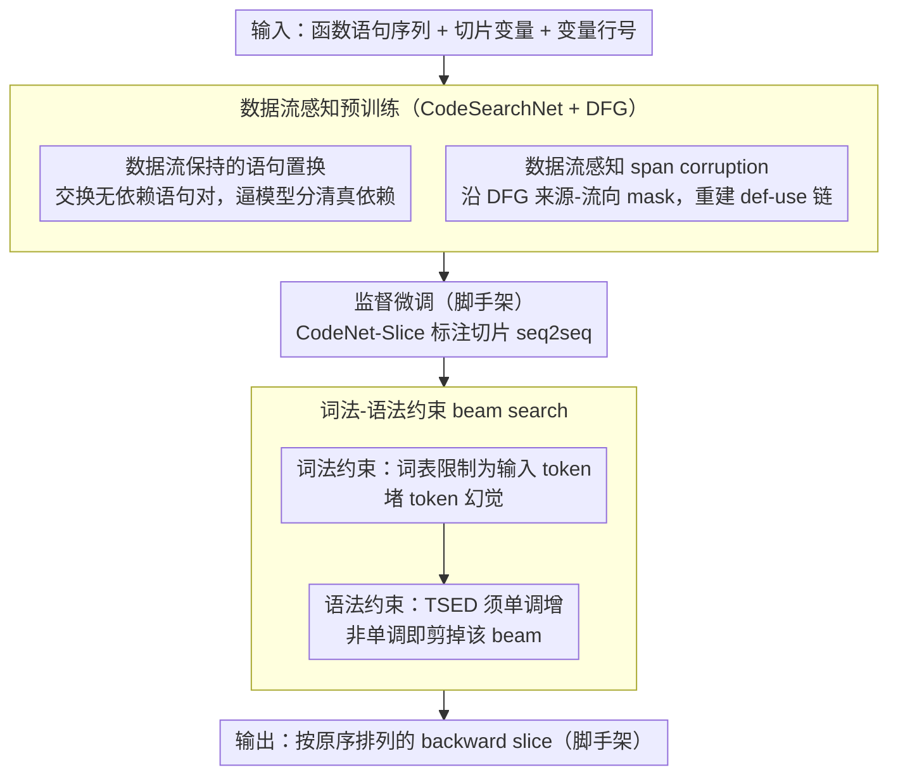

# Static Program Slicing Using Language Models With Dataflow-Aware Pretraining and Constrained Decoding

**会议**: ACL2026  
**arXiv**: [2604.26961](https://arxiv.org/abs/2604.26961)  
**代码**: https://anonymous.4open.science/r/staticsliceT5-4E22  
**领域**: 代码智能 / 程序分析  
**关键词**: 程序切片、数据流预训练、约束解码、CodeT5+、静态分析

## 一句话总结
Sliceformer 把静态程序切片重写为小型代码语言模型的 seq2seq 任务，通过数据流感知预训练学习依赖关系，并用词法与语法约束解码防止幻觉，在 Java 和 Python 切片基准上显著提升 ExactMatch。

## 研究背景与动机
**领域现状**：静态程序切片用于找出与某个变量或语句相关的代码片段，是调试、漏洞分析和程序理解中的基础技术。传统方法依赖系统依赖图和图可达性分析，精确但工程复杂；近年学习式方法尝试用 CodeBERT、GraphCodeBERT 或大语言模型自动预测切片。

**现有痛点**：学习式切片有两个核心问题。第一，语言模型容易根据表面相似或位置邻近错误判断依赖，遗漏真正相关语句或加入无关语句。第二，生成式模型可能输出原程序中不存在的 token、变量名或语句，而程序切片本质上必须是输入代码的精确子序列。

**核心矛盾**：代码语言模型擅长生成自然代码，却不天然遵守程序分析任务的硬约束。程序切片既要求理解数据流语义，又要求输出完全抽取式、无幻觉、结构合法；单纯监督微调很难同时满足这两点。

**本文目标**：作者希望保留语言模型端到端建模完整函数上下文的优势，同时把静态分析中的数据流约束显式注入预训练和解码过程，从而提升切片的准确性和可靠性。

**切入角度**：论文选择 CodeT5+ 这类 encoder-decoder 小模型，而不是依赖大型闭源 LLM。方法分为训练前的数据流能力塑造和推理时的硬约束解码，两者分别对应依赖识别与幻觉抑制。

**核心 idea**：用 Data Flow Graph 设计预训练任务教模型“哪些语句真的相关”，再用只允许生成输入 token 且保持 AST 相似度单调增加的 constrained decoding 保证输出是合法切片。

## 方法详解

### 整体框架
Sliceformer 的输入由函数语句序列、切片变量和变量所在行号组成，输出是按原代码顺序排列的 backward slice。模型先在 CodeSearchNet 的 Python/Java 函数上进行数据流感知预训练，再在 CodeNet-Slice 的标注切片数据上监督微调，最后在解码阶段用词法和语法约束过滤非法候选。

这个 pipeline 的关键是把程序切片的两个任务性质拆开：预训练负责增强“语义依赖识别”，约束解码负责保证“元素保持”。前者让模型知道变量值从哪里来、流向哪里；后者让生成过程不能创造原程序外的 token，也不能拼出结构上偏离输入代码的片段。

### 关键设计

**1. 数据流保持的语句置换预训练：逼模型分清哪些语句之间真有数据依赖**

切片的关键是判断某条语句是否真正影响 slicing criterion，而模型很容易只凭位置邻近来猜依赖。这个任务给定代码和 Data Flow Graph，在同一 basic block 内找出没有数据边相连的语句对，随机交换它们，训练模型生成数据流等价的代码变体。与自然语言里随便打乱句序不同，代码的合法顺序不唯一、必须尊重 def-use 关系，于是模型为了重建合法变体，被迫去关注数据依赖而不是死记原始位置。

**2. 数据流感知 span corruption：沿 DFG 重建变量级和语句级的依赖链**

普通 span corruption 主要学局部语言模式，AST masking 偏语法结构，二者都不是切片最需要的跨语句数据流。这里改为在 DFG 中随机选一个变量节点，顺着它的 parent 和 child 找到值的来源与流向，再按两种粒度 mask：既可以只遮变量，也可以遮掉包含这些变量的整条语句，让模型依上下文恢复被遮的 def-use 片段。直接沿数据流来源-流向 mask，等于把 backward slicing 真正依赖的依赖链当成预训练目标。

**3. 词法-语法约束 beam search：从解码层面堵死“生成原程序里没有的东西”**

合法切片必须是输入代码的精确子序列，但生成式模型常会吐出原程序里不存在的标识符或拼出结构错乱的语句。约束解码因此双管齐下：每一步先把词表限制为输入代码中出现过的 token，解决 token 幻觉；当生成到语句边界时，计算当前 partial slice 与输入代码 AST 的 Tree Similarity Edit Distance，一旦 TSED 不再单调增加，就判定该 beam 出现结构错误并剪掉。前者管“token 不能凭空造”，后者管“token 合法但顺序结构不合法”，两层约束共同保证输出是合法切片。

### 损失函数 / 训练策略
预训练阶段基于 CodeT5+ 0.7B，在 CodeSearchNet 的 Python 和 Java 子集上使用约 1.0M 函数。每个函数用 Tree-Sitter 抽取 AST 和变量，再按 GraphCodeBERT 风格构造 DFG。span corruption mask 25% token，语句置换每个样本最多交换 3 条语句，context length 为 512，batch size 为 32，训练 100K steps。

监督微调阶段使用 CodeNet-Slice 的 Python 和 Java 子集，输入输出长度均为 512，AdamW 优化，batch size 为 32，学习率 5e-5，1000 warmup steps，训练 10 epochs。输出格式加入 line number、code、criterion、slice 等特殊控制标记，帮助模型生成结构化切片。

## 实验关键数据

### 主实验
Sliceformer 在 Java 和 Python 两种语言、四个指标上都超过基线，尤其在 ExactMatch 上提升明显。

| 方法 | Java Acc-D | Java ExactMatch | Java CodeBLEU | Java TSED | Python Acc-D | Python ExactMatch | Python CodeBLEU | Python TSED |
|------|------------|-----------------|---------------|-----------|--------------|-------------------|-----------------|-------------|
| GPT-5 + CoT | 60.27 | 14.00 | 71.35 | 63.81 | 56.94 | 13.00 | 68.56 | 61.27 |
| NS-slicer CodeBERT | 95.65 | 81.72 | 88.41 | 91.00 | 82.47 | 56.32 | 74.68 | 78.91 |
| NS-slicer GraphBERT | 96.51 | 85.77 | 89.26 | 90.35 | 84.92 | 61.25 | 76.84 | 80.12 |
| CodeT5+ SFT | 95.33 | 87.24 | 89.26 | 93.42 | 87.53 | 77.24 | 79.98 | 81.75 |
| Sliceformer | 98.78 | 92.20 | 93.23 | 97.68 | 90.85 | 83.15 | 85.35 | 89.74 |

相对最强旧基线 NS-slicer GraphBERT，Sliceformer 的 ExactMatch 在 Java 上从 85.77 提升到 92.20，提升 6.4 个百分点；在 Python 上从 61.25 提升到 83.15，提升 21.9 个百分点。相对直接 SFT 的 CodeT5+，Java ExactMatch 提升约 5.0 个百分点，Python 提升约 5.9 个百分点。

效率方面，Sliceformer 比 7B/8B SFT 模型快一个数量级，同时只比 CodeT5+ 增加很小开销。

| 方法 | 模型规模 | 单任务运行时间 | 备注 |
|------|----------|----------------|------|
| NS-slicer CodeBERT | 125M | 0.105s | 最快但准确性较低 |
| NS-slicer GraphCodeBERT | 125M | 0.135s | 旧学习式强基线 |
| CodeT5+ | 770M | 0.289s | 直接 SFT |
| Sliceformer | 770M | 0.296s | 高准确率且开销接近 CodeT5+ |
| CodeLlama-7B SFT | 7B | 5.75s | 明显更慢 |
| Qwen3-8B SFT | 8B | 6.52s | 明显更慢 |

### 消融实验
原文图示消融表明四个组件均有效，其中数据流 span corruption 和词法约束影响最大。附录还给出了不同架构对约束解码的兼容性比较。

| 配置 | 架构 | 预训练 | SFT | 约束解码 | Java ExactMatch |
|------|------|--------|-----|----------|-----------------|
| CodeT5 | Encoder-Decoder | 否 | 是 | 否 | 82.80 |
| CodeT5 + Sliceformer 组件 | Encoder-Decoder | 是 | 是 | 是 | 85.12 |
| CodeLlama-7B | Decoder-only | 否 | 是 | 否 | 75.27 |
| Qwen3-8B | Decoder-only | 否 | 是 | 否 | 80.55 |
| Qwen3-8B + 约束解码 | Decoder-only | 否 | 是 | 是 | 83.11 |

| 组件 | 消融现象 | 解释 |
|------|----------|------|
| 去掉 span corruption | 性能下降最大之一 | DFG-guided mask 直接训练模型恢复 def-use 链，对完整切片识别最关键 |
| 去掉词法约束 | 性能下降最大之一 | 生成式模型容易产生输入外 token，词法硬约束对 element preservation 很重要 |
| 去掉语句置换 | 性能下降 | 模型少了对数据流无关语句可交换性的学习 |
| 去掉 TSED 语法约束 | 性能下降较小但稳定 | 结构错误少于词法幻觉，但在复杂语句中仍能过滤错误 beam |

### 关键发现
- 闭源 LLM 即使加 RAG 或 CoT，ExactMatch 仍很低，说明程序切片不是普通代码问答，而是强约束抽取任务。
- NS-slicer 把每条语句独立二分类，难以区分同样语句在不同控制流分支中的位置；Sliceformer 在函数级上下文中生成切片，更能处理位置和上下文差异。
- Constrained decoding 几乎不增加延迟，Sliceformer 0.296s 与 CodeT5+ 0.289s 接近，但 ExactMatch 更高。
- Encoder-decoder 架构更自然支持数据流 span reconstruction；decoder-only 模型仍可从约束解码中获益，但不能直接复用全部预训练目标。

## 亮点与洞察
- 论文把“代码生成模型的幻觉问题”转化为程序切片的元素保持约束，并用硬解码约束解决，比单纯提示模型“不要幻觉”可靠得多。
- 数据流预训练目标设计贴合程序分析任务：不是让模型泛泛理解代码，而是让它学习 def-use 依赖，这正是 backward slicing 的核心。
- TSED 单调性是一个很有启发的结构约束：输出作为输入代码子序列时，AST 相似性应该随合法语句加入而非下降。
- 小模型路线很实用。770M CodeT5+ 加任务约束在精确程序分析任务上远胜 7B/8B 生成模型和 GPT prompting，说明任务归纳偏置比模型规模更关键。

## 局限与展望
- 实验只覆盖 Java 和 Python，扩展到 C/C++、JavaScript、Rust 等语言需要重新适配解析器、DFG 构建和切片标注工具。
- 数据流预训练主要面向 encoder-decoder 模型，decoder-only 大模型如何设计等价预训练目标仍未解决。
- 评测依赖 CodeNet-Slice 及工具生成 ground truth，若工具本身有噪声，模型可能学习到特定标注偏差。
- TSED 单调约束针对语法结构，不直接保证语义依赖完整；复杂控制依赖、异常处理和跨函数调用仍可能困难。
- 未来可以把传统静态分析图约束和神经生成结合得更紧，例如在 beam search 中显式维护可达依赖子图。

## 相关工作与启发
- **vs JavaSlicer / 传统静态分析**: 传统工具依赖显式依赖图与可达性规则，工程可解释但语言适配成本高；Sliceformer 用学习模型近似切片，同时通过 DFG 约束保留程序分析归纳偏置。
- **vs NS-slicer**: NS-slicer 是语句级二分类，容易丢失函数级上下文；Sliceformer 以 seq2seq 形式输出完整切片，更能处理同名语句和跨位置依赖。
- **vs GPT prompting**: Prompting 可以生成解释，但 ExactMatch 很差且容易幻觉；Sliceformer 的硬约束更适合需要精确抽取的程序分析任务。
- **vs GraphCodeBERT**: GraphCodeBERT 使用数据流信息做表示学习；本文进一步把 DFG 变成面向切片的生成式预训练目标，并结合 constrained decoding。
- **启发**: 对代码智能任务，最有效的 LLM 方案往往不是直接放大模型，而是把任务的可验证结构写进训练目标和解码过程。

## 评分
- 新颖性: ⭐⭐⭐⭐☆ DFG 预训练与 TSED 单调约束结合得很贴任务，整体思路清晰。
- 实验充分度: ⭐⭐⭐⭐☆ 主结果、效率、消融和架构附录较完整，但语言数量偏少。
- 写作质量: ⭐⭐⭐⭐☆ 问题定义和方法解释完整，部分算法排版较长但不影响理解。
- 价值: ⭐⭐⭐⭐⭐ 对程序切片、代码生成约束解码和神经程序分析都有较高实践参考价值。

<!-- RELATED:START -->

## 相关论文

- [\[ICML 2026\] Locally Coherent Parallel Decoding in Diffusion Language Models](../../ICML2026/code_intelligence/locally_coherent_parallel_decoding_in_diffusion_language_models.md)
- [\[ACL 2026\] Ro-SLM: Onboard Small Language Models for Robot Task Planning and Operation Code Generation](ro-slm_onboard_small_language_models_for_robot_task_planning_and_operation_code_.md)
- [\[ACL 2026\] To Diff or Not to Diff? Structure-Aware and Adaptive Output Formats for Efficient LLM-based Code Editing](to_diff_or_not_to_diff_structure-aware_and_adaptive_output_formats_for_efficient.md)
- [\[ACL 2026\] SWE-QA: Can Language Models Answer Repository-level Code Questions?](swe-qa_can_language_models_answer_repository-level_code_questions.md)
- [\[ACL 2025\] DynaCode: A Dynamic Complexity-Aware Code Benchmark for Evaluating Large Language Models in Code Generation](../../ACL2025/code_intelligence/dynacode_a_dynamic_complexity-aware_code_benchmark_for_evaluating_large_language.md)

<!-- RELATED:END -->
