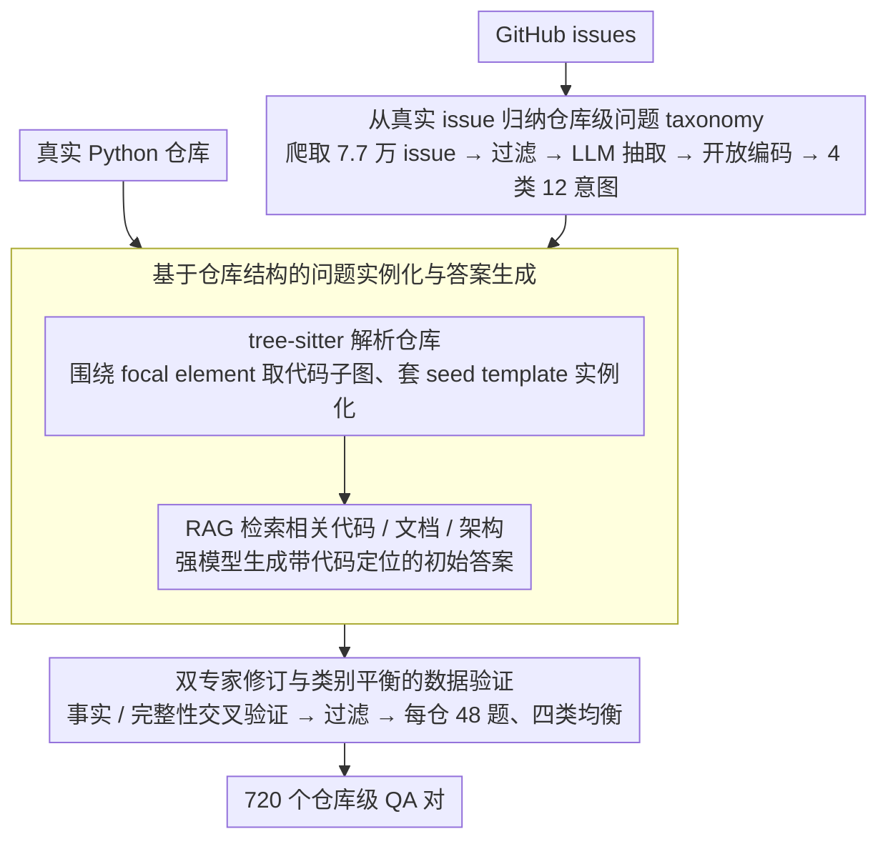

# SWE-QA: Can Language Models Answer Repository-level Code Questions?

**会议**: ACL 2026 Findings  
**arXiv**: [2509.14635](https://arxiv.org/abs/2509.14635)  
**代码**: https://github.com/peng-weihan/SWE-QA-Bench  
**领域**: 代码智能 / 仓库级问答  
**关键词**: 仓库级代码理解, Code QA, RAG, 软件工程 Agent, SWE-Bench

## 一句话总结
SWE-QA 构建了一个覆盖 15 个真实 Python 仓库、720 个高质量问答对的仓库级代码问答基准，用 GitHub issue 归纳问题类型并用人工校验答案，实验显示单纯 LLM 直接回答很弱，RAG 与 OpenHands/SWE-agent 这类工具化 agent 才能接近真实开发问答需求。

## 研究背景与动机
**领域现状**：代码问答评测长期偏向函数、代码片段、API 注释或 StackOverflow 式局部问题，例如 CoSQA、CodeQA、CodeQueries 等基准更像是在考“给一段代码能不能解释”。近两年出现 CodeRepoQA、CoreQA、Spyder-CodeQA 等仓库级数据集，但覆盖的问题类型、跨文件依赖和人工验证仍不够系统。

**现有痛点**：真实软件开发里，开发者常问的并不是“这行代码什么意思”，而是“某个 feature 在哪里实现”“为什么这个类要延迟访问某个属性”“某个测试如何跨路由、配置和 request context 生效”。这类问题需要模型在多个文件、类、函数和控制流之间跳转，单靠参数记忆或一段检索片段很容易漏掉关键依赖。

**核心矛盾**：代码大模型越来越会写局部代码，但评测体系仍没有充分检验“仓库作为系统”的理解能力。片段级 benchmark 可以让模型看起来很强，却不能说明它能否回答真实维护者会问的系统设计、依赖追踪和功能定位问题。

**本文目标**：作者希望补上一个更贴近真实软件工程的评测切面：一方面从开发者 issue 中抽象出仓库级问题 taxonomy，另一方面构造可复用的 QA 生成与人工校验流水线，再用这个基准系统比较 direct prompting、RAG、agent 和商业代码助手。

**切入角度**：论文没有从手写模板凭空编题，而是先爬取 SWE-Bench 相关仓库的 GitHub issues，观察真实开发者如何提问，再把这些问题归纳为 What / Why / Where / How 四大类与 12 个细粒度意图。这让 benchmark 的问题分布更像真实开发环境，而不是单纯的学术任务拼接。

**核心 idea**：用 GitHub issue 驱动的问题 taxonomy 加上静态代码结构与人工校验，构造一个既可扩展又能考察跨文件、多跳、仓库级推理的代码问答基准。

## 方法详解
SWE-QA 本质上是一篇 benchmark 论文，但它的方法部分不只是“收集数据”，而是一条完整的仓库级问答生产线。作者先从真实 issue 中理解开发者问题，再把问题类型模板化；随后解析目标仓库，围绕具体类、函数或模块实例化问题；接着用 RAG 生成初始答案，最后由有经验的开发者逐条修订、交叉验证和过滤。

### 整体框架
输入是一批真实开源 Python 仓库，以及从 GitHub issues 中抽取出的开发者问题。输出是 720 个仓库级 QA 对，每个问题都绑定一个目标仓库、一个问题类型、一个需要多跳推理的上下文和一个人工校验过的长答案。

整个 pipeline 分四步：第一步，爬取并分析 GitHub issue，建立问题 taxonomy 与 seed templates；第二步，用 tree-sitter 解析仓库结构，围绕焦点代码元素实例化问题；第三步，用检索增强生成方式生成初始参考答案；第四步，由专家修订答案、过滤低质量样本并做类别平衡。

### 关键设计

**1. 从真实 issue 归纳仓库级问题 taxonomy：让题目分布来自维护者真正会问的问题，而不是研究者拍脑袋**

如果问题类型由研究者主观设计，很容易偏向"好标注"的局部问题——比如"这行代码什么意思"——而真实开发者关心的"某个 feature 在哪实现""为什么这个类要延迟访问属性"反而被漏掉。为了让题目分布贴近真实维护场景，作者直接去 issue 里挖：爬取 12 个 SWE-Bench 热门仓库的 77,100 个 GitHub issues，过滤出正文长度至少 1,000 字符的 41,955 个 issue，再用 LLM 从中抽取显式的代码理解问题，得到 127,415 个候选问题。

接着人工抽样其中 1,000 个问题做开放编码，归纳成 What、Why、Where、How 四大类与 12 个细粒度意图，例如 Architecture exploration、Dependency tracing、Design rationale、Feature Location、Algorithm Implementation。这套从真实工单里长出来的 taxonomy 既保留了系统性维护问题的真实分布，也给后续问题模板提供了有开发场景感的种子。

**2. 基于仓库结构的问题实例化与答案生成：把抽象 seed question 落到某个真实仓库的具体多跳问题上**

仓库级问题难就难在上下文又长又稀疏：把整个仓库塞给模型不现实，只喂单个函数又不足以支撑跨文件推理。作者用 tree-sitter 解析仓库，提取类、函数、方法和依赖关系，围绕一个 focal element 选出紧凑的代码子图，再套进对应的 seed template，把抽象问题实例化成"这个仓库里"的具体问题。

答案生成阶段先为代码元素建索引，结合语义相似度和结构依赖检索出相关代码、文档和架构信息，再让强模型在这些上下文上生成初始答案，并强制它引用具体代码位置、不许脱离上下文自由发挥。结构子图加检索上下文这一折中，既让问题真实、答案可追溯，又把生成成本压在可控范围内。

**3. 双专家修订与类别平衡的数据验证：仓库级答案太长，必须靠人交叉验证才能保住可信度**

仓库级答案平均长达 266.64 个词，涉及 8.71 个函数、3.19 个文件，仅靠 LLM 生成很容易出现"局部正确但整条依赖链漏了一环"的答案。为此每个答案都由两名有至少三年开发经验的专家独立检查事实、完整性和表述；若两人分歧较大，再引入第三名专家共同讨论达成一致。

最后这一关还负责过滤模糊问题、事实错误答案、无法用仓库内容支撑的答案，并强制每个仓库保留 48 个样本、让 What / Why / Where / How 四类均衡。正是这层人工交叉验证，把一个本来可能"看起来对"的合成数据集，校准成了可信的评测基准。

### 损失函数 / 训练策略
本文不训练新模型，因此没有传统损失函数。评测策略是把 SWE-QA 作为测试集，比较六个 LLM 在 direct prompting、Function Chunking RAG、Sliding Window RAG、SWE-agent、OpenHands 等上下文增强方式下的答案质量。自动评测使用 Claude Sonnet 4.5 作为 LLM-as-Judge，从 correctness、completeness、relevance、clarity、coherence 五个维度打分，每个维度 20 分，总分 100，并通过候选系统匿名化、答案顺序随机化和人工评估切片降低 judge 偏差。

## 实验关键数据

### 主实验
SWE-QA 包含 720 个问题，覆盖 15 个 Python 仓库、13,300 个文件、22,522 个类、142,404 个函数与超过 340 万行代码。平均每个问题需要 8.71 个函数、3.19 个文件、4.72 层 reasoning chain 和 2.96 层 dependency chain；90.9% 的问题 reasoning chain 深度大于 1，77.6% 需要跨文件知识。

| 系统 / 方法 | Overall | 关键信息 | 结论 |
|--------|---------|----------|------|
| Qwen3-Coder-30B direct | 50.80 | 无仓库上下文 | 直接回答最弱 |
| Qwen3-Coder-30B + Sliding Window RAG | 64.86 | +14.06 | 检索上下文明显补强 |
| Qwen3-Coder-30B + OpenHands | 65.88 | +15.08 | 小模型使用 agent 有提升但不稳定 |
| GLM-4.6 + OpenHands | 70.15 | 接近最佳 | 强模型配 agent 很有竞争力 |
| GPT-5.1 direct | 61.41 | 基础能力最强 | 但仍低于工具化系统 |
| GPT-5.1 + OpenHands | 70.79 | 全表最佳 | agent 框架带来最高总分 |
| Cursor | 70.66 | 商业工具 | 接近最佳开放组合 |
| Tongyi Lingma | 69.07 | 商业工具 | 说明端到端工程化检索有效 |

### 消融实验
论文没有对数据构造模块做传统 ablation，但做了问题类型、仓库来源和评测协议分析，可以看成对 benchmark 难点的拆解。

| 分析维度 | 关键结果 | 说明 |
|------|---------|------|
| Why 类问题 | 平均 69.77 | 设计理由、目的解释通常有注释或语义线索，模型更容易回答 |
| How 类问题 | 平均 69.13 | 系统设计和算法实现需要过程理解，但常可由结构化上下文支持 |
| Where 类问题 | 平均 66.76 | 需要精确定位代码位置，对检索召回和跨文件追踪要求更高 |
| What 类问题 | 平均 65.81 | Architecture exploration 仅 61.84，是最难子类之一 |
| SWE-Bench 仓库 | 平均 68.59 | 相比 SWE-Bench-Live 更容易 |
| SWE-Bench-Live 仓库 | 平均 64.98 | 低 3.61 分，可能更少受训练数据泄漏影响 |
| 人工评估 GPT-5.1 + OpenHands | 82.33 | 与 LLM-as-Judge 排序一致，支持自动评测可信度 |

### 关键发现
- 上下文获取方式几乎决定上限：direct prompting 对仓库级问题明显不够，RAG 能稳定提升，OpenHands/SWE-agent 这类 agent 在强模型上进一步提升。
- What 与 Where 问题更难，因为它们要求模型找准实现位置、重建架构关系和数据/控制流，而不是泛泛解释目的。
- Agent 的代价很高：OpenHands 平均每题约 87,045 个输入 token / 1,930 个输出 token，SWE-agent 更高，说明性能提升伴随显著成本。
- Pylint 等大型复杂仓库显著更难，Flask、Requests 等较小仓库得分更高，仓库规模和架构复杂度会直接影响 QA 难度。

## 亮点与洞察
- 这篇论文最好的地方是把“仓库级理解”具体化为可评测的数据结构，而不是停留在口号。它用 issue 归纳问题类型，说明真实开发者的问题并不只是 API 查询，而是大量跨文件定位、设计理由和系统行为解释。
- 数据统计很有说服力：平均一个问题涉及 3.19 个文件和 8.71 个函数，77.6% 需要跨文件信息，这些数字直接证明 SWE-QA 与传统片段级 Code QA 不是同一个难度层级。
- 对 RAG 与 agent 的比较很实用。结果并没有简单说“大模型最好”，而是显示 GPT-5.1 direct 也只有 61.41，必须配合检索和工具化执行才能到 70+，这对代码助手系统设计很有启发。
- 这个 benchmark 可以迁移到项目内文档问答、配置理解、测试失败解释等任务：先从真实 issue / ticket 归纳问题模板，再用结构化解析和人工校验构造组织内部评测集。

## 局限与展望
- 目前只覆盖 Python 仓库，且主要来自 SWE-Bench / SWE-Bench-Live，语言、工程栈和生态仍较窄；Java、TypeScript、C++ 项目的构建系统和依赖关系会带来不同挑战。
- QA 对规模为 720，质量很高但规模不大。如果要训练或微调仓库级 QA 模型，还需要更大规模、持续更新的数据。
- 自动评测依赖 LLM-as-Judge，即使有人类评估验证，复杂代码答案中的细粒度事实错误仍可能被 judge 漏掉。
- 问题答案以自然语言为主，还没有要求模型实际执行测试、运行静态分析或给出可验证 patch；未来可以把 QA 与仓库操作任务结合起来。

## 相关工作与启发
- **vs CoSQA / CodeQA**: 这些数据集更偏查询到代码片段或函数级问答，SWE-QA 则明确考察仓库级、多跳和跨文件推理，难度更接近真实软件维护。
- **vs CodeRepoQA / CoreQA**: 这些工作已经进入 repo-level，但 SWE-QA 更强调问题 taxonomy、模块级信息、multi-hop reasoning 与人工验证的组合，因此评测维度更完整。
- **vs SWE-Bench**: SWE-Bench 关注 issue resolution 和生成 patch，SWE-QA 关注回答仓库理解问题；两者可以互补，一个考“会不会改”，一个考“懂不懂系统”。
- **对代码助手的启发**: 仅靠 embedding 检索函数块还不够，强代码助手需要结构索引、跨文件依赖追踪和可迭代工具调用，否则很难回答 Why / Where 类真实问题。

## 评分
- 新颖性: ⭐⭐⭐⭐☆ 从真实 issue 归纳仓库级 QA taxonomy 很扎实，benchmark 设计比普通 Code QA 更贴近软件工程。
- 实验充分度: ⭐⭐⭐⭐☆ 覆盖 6 个 LLM、5 类上下文增强、商业工具、问题类型和仓库分析，但缺少更多语言与动态执行设置。
- 写作质量: ⭐⭐⭐⭐☆ 构造流程、统计和评测维度写得清楚，表格信息密集，少量 pipeline 细节还可更形式化。
- 价值: ⭐⭐⭐⭐⭐ 对代码助手、repo-level RAG 和软件工程 agent 都很有参考价值，是一个可以直接复用的评测基准。

<!-- RELATED:START -->

## 相关论文

- [\[ACL 2026\] RepoShapley: Shapley-Enhanced Context Filtering for Repository-Level Code Completion](reposhapley_shapley-enhanced_context_filtering_for_repository-level_code_complet.md)
- [\[ICML 2026\] MatchFixAgent: Language-Agnostic Autonomous Repository-Level Code Translation Validation and Repair](../../ICML2026/code_intelligence/matchfixagent_language-agnostic_autonomous_repository-level_code_translation_val.md)
- [\[ACL 2026\] KoCo-Bench: Can Large Language Models Leverage Domain Knowledge in Software Development?](koco-bench_can_large_language_models_leverage_domain_knowledge_in_software_devel.md)
- [\[ACL 2026\] Can LLMs Compress (and Decompress)? Evaluating Code Understanding and Execution via Invertibility](can_llms_compress_and_decompress_evaluating_code_understanding_and_execution_via.md)
- [\[ICLR 2026\] Improving Code Localization with Repository Memory](../../ICLR2026/code_intelligence/improving_code_localization_with_repository_memory.md)

<!-- RELATED:END -->
