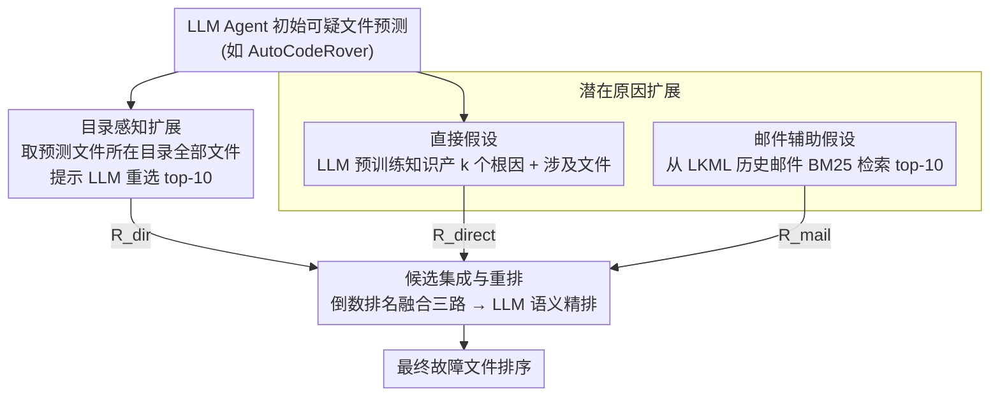

# Taming System Complexity: Demystifying Software Engineering Agents in Diagnosing Linux Kernel Faults

**会议**: ACL2026  
**arXiv**: [2505.19489](https://arxiv.org/abs/2505.19489)  
**代码**: https://github.com/FudanSELab/LinuxFLBench  
**领域**: 软件工程Agent / 代码智能  
**关键词**: 故障定位、Linux内核、LLM Agent、代码定位、系统复杂性

## 一句话总结
通过建立大规模 Linux 内核故障定位基准 LinuxFLBench，揭示现有 LLM Agent 在复杂系统中的局限，并提出 LinuxFL+ 框架通过目录感知和潜在原因双维扩展，以低成本显著提升故障定位精度。

## 研究背景与动机

**领域现状**：故障定位（Fault Localization, FL）是软件工程中的经典问题，目标是从给定的 bug 报告和源代码中自动找出有缺陷的代码位置。近年来，大语言模型驱动的 Agent（如 SWE-Agent、AutoCodeRover、Agentless）在通用软件系统上取得了显著进展，在 SWE-bench 基准上达到了 70% 左右的准确率，展现了 Agent 自主探索代码库的能力。

**现有痛点**：然而，这些 Agent 的评估主要集中在中等规模的通用软件项目（如 Python 库）上，对于真实存在的大型复杂系统（如 Linux 内核）的适用性仍然未知。Linux 内核面临三重独特挑战：（1）代码规模庞大，内核 v5.8 包含 69K 个文件和 28M 行代码，是 SWE-bench 中最大项目的 30 倍以上；（2）可观察性受限，由于内核运行在特权模式且需最小化开销，用户报告的 bug 通常缺乏详细的运行时信息和调试线索；（3）影响因素多维多样，硬件配置、系统负载、时序因素等都可能导致 bug，大大扩展了诊断的推理空间。

**核心矛盾**：现有 Agent 虽然在通用软件中表现优异，但这些优势可能完全无法转移到 Linux 内核这样的极具挑战的真实系统，需要深入研究其在该领域的真实表现并找到改进方向。

**本文目标**：一是构建首个大规模 Linux 内核故障定位基准，二是全面评估现有顶级 LLM Agent 在该任务上的表现，三是诊断其主要失败原因并提出有效的增强方案。

**切入角度**：作者从实证研究出发，先通过大量实验数据揭示 Agent 的真实缺陷，随后针对性地设计改进策略。关键观察包括：Agent 通常能准确识别相关的高层次模块，但在模块内难以精确定位具体文件；同时 Agent 的探索范围过于狭窄，只关注少数可能的原因，遗漏了许多相关的根因。

**核心 idea**：通过两个维度的结构化扩展来弥补 Agent 的不足——在空间维度上利用目录结构扩展搜索范围，在知识维度上通过直接假设和邮件知识辅助假设扩展潜在原因池，最后通过聚合重排产生最终预测。

## 方法详解

### 整体框架

LinuxFL+ 是一个挂在现有 Agent 输出之上的后处理框架，针对实证中观察到的两个 Agent 盲点——能定位到相关模块却在模块内选错文件、探索范围又过窄只盯少数原因——做双维度结构化扩展。给定任意 LLM Agent（如 AutoCodeRover）跑出的初始可疑文件预测，框架先沿空间维度做目录感知扩展、沿知识维度做潜在原因扩展，把两路产生的候选文件汇聚后用倒数排名聚合并交给 LLM 精排，输出最终的故障文件排序。整套流程借助代码库的目录结构和 Linux 邮件列表这类外部知识来纠正 Agent 的盲区。

### 关键设计

**1. 目录感知扩展：给 Agent 在正确目录里第二次精选的机会**

LLM Agent 往往能正确命中相关的高层目录（模块），却在该目录里文件一多就选错，而 Linux 内核每个目录平均含 16 个文件（SWE-bench 仅 8 个），这种高密度把模块内精确定位的难度放大了。该设计先收集所有初始预测文件所在目录的完整文件清单，再提示 LLM 在这个扩展候选集里重新筛选、排出 top-10。本质上是利用目录边界这一代码库的显式组织形式划定搜索范围，在保住"模块粒度命中有效"的前提下，给模型足够详尽的上下文做微调。

**2. 潜在原因扩展：用双层假设系统性铺开根因空间**

真实 bug 诊断是迭代的"猜测-验证"过程，单靠 Agent 的初次直觉会漏掉大量相关根因。该设计生成两层假设：第一层**直接假设**只用 LLM 的预训练知识，提示模型产出 $k$ 个可能的 bug 原因，每个原因附带对应的修复方案和涉及文件；第二层**邮件辅助假设**引入领域知识，用 RAG 从 Linux 内核邮件列表（LKML）检索历史讨论——为防数据泄漏只检索 bug 报告之前的邮件，并先把报告提炼成行为、原因、预期行为、解决方案四个维度的关键词，再用 BM25 取 top-10 相关邮件喂给 LLM。直接假设发挥通用知识、邮件假设注入历史智慧，两者互补，在性能问题这类原因跨多模块分散的场景下提升尤其明显。

**3. 候选集成与重排：倒数排名融合三路证据再做语义精排**

目录扩展、直接假设、邮件假设三路各有独特视角，需要融成一个统一排序。对每个候选文件 $f$ 分别记下它在三路里的排名 $R_{dir}(f)$、$R_{direct}(f)$、$R_{mail}(f)$（未出现记为 $\infty$），聚合得分取倒数之和

$$\text{score}(f) = \frac{1}{R_{dir}(f)} + \frac{1}{R_{direct}(f)} + \frac{1}{R_{mail}(f)}$$

任一路里排名靠前的文件即可拿到较高分，多路都靠前的进一步被优先；按得分降序得到初排后，再提示 LLM 依据文件路径与 bug 报告的语义对应关系做最后精排。这套经典 rank fusion 既简洁地综合了多源信息，末端的 LLM 重排又补上语义意识，避免纯数值聚合可能的死板。

## 实验关键数据

### 主实验

论文构建的 LinuxFLBench 包含 250 个真实 Linux 内核 bug，覆盖 120 个内核版本和 66 个不同的内核子模块（如驱动、网络、文件系统等）。Bug 报告平均长 283 词，对应的代码库平均 28808 个文件、1149 万行代码，远超 SWE-bench（平均 195 词、3010 个文件、43.8 万行）。

表1 展示了文件级故障定位的性能对比：

| 方法 | Recall@1 | Recall@5 | Recall@10 | MRR |
|------|----------|----------|-----------|-----|
| BM25（信息检索基线） | 0.168 | 0.328 | 0.396 | 0.231 |
| BugLocator | 0.127 | 0.209 | 0.272 | 0.215 |
| BLUiR（传统 IR 最佳） | 0.228 | 0.317 | 0.404 | 0.321 |
| SWE-Agent | 0.416 | 0.552 | 0.584 | 0.476 |
| SWE-Agent + LinuxFL+ | **0.524** | **0.720** | **0.768** | **0.610** |
| AutoCodeRover | 0.388 | 0.496 | 0.496 | 0.435 |
| AutoCodeRover + LinuxFL+ | **0.500** | **0.712** | **0.744** | **0.589** |
| Agentless | 0.368 | 0.492 | 0.504 | 0.419 |
| Agentless + LinuxFL+ | **0.440** | **0.684** | **0.724** | **0.549** |

关键观察：（1）现有 Agent 虽然远超传统 IR 方法，但在 LinuxFLBench 上表现仍远低于在 SWE-bench 上的表现（top-1 recall 下降 15%+ 以上），揭示了系统复杂性的真实挑战；（2）即使最佳 Agent（SWE-Agent）的 Recall@1 也仅 41.6%，说明 Linux 内核 FL 仍是极具挑战的任务；（3）LinuxFL+ 对所有三个 Agent 都带来了显著提升，SWE-Agent 的 Recall@1 从 41.6% 提至 52.4%（+10.8%），AutoCodeRover 从 38.8% 提至 50.0%（+11.2%）。

### 消融与细粒度分析

表2 展示了不同难度下的表现（按 bug 报告中是否显式提及文件名来区分）：

| 难度等级 | Agentless 基线 | AutoCodeRover 基线 | SWE-Agent 基线 | LinuxFL+ 平均提升 |
|---------|---------------|-------------------|---|---|
| Easy（文件提示清晰） | 0.605 | 0.623 | 0.664 | +0.105 |
| Hard（无文件提示） | 0.273 | 0.287 | 0.341 | +0.127 |

结果表明 LinuxFL+ 特别擅长处理"难"的情况（无显式文件线索），这正是扩展策略的目标场景。在症状层面，LinuxFL+ 对模糊症状的 bug（如性能问题，基线 MRR 0.165）的提升最显著（提升至 0.458，+177%），而对症状清晰的 bug（如 Watchdog 错误）虽然也有提升，但基线本身已很高（0.833）。成本方面，LinuxFL+ 每任务额外使用 11.8K-15.3K tokens，成本约 $0.04，仅为各 Agent 基础成本的 10% 左右。

## 亮点与洞察

- **首个大规模内核 FL 基准**：过往的内核相关基准要么规模太小（Linux-3.16 仅单一版本）、要么来源不切实际（模糊器检测的崩溃）。本文的 LinuxFLBench 覆盖 250 个真实用户报告的多样化 bug，跨越 120 个版本和 66 个组件，是首个真正反映内核故障定位难度的基准，对后续研究极具参考价值。
- **揭示 Agent 能力的真实边界**：通过实证数据清晰地展示了通用 Agent 在大型复杂系统中的局限——性能掉点 15%+ 以上，并定性分析出两个主要失败模式：混淆相关文件和探索范围过窄。这些洞察对理解何时何地应该增强 Agent、如何有效增强具有重要指导意义。
- **低成本、高效的增强方案**：与从头重新训练 Agent 或微调模型相比，LinuxFL+ 作为一个后处理框架，仅需极少额外成本（$0.04/task）却能带来显著性能提升。特别是邮件知识的引入展示了如何有效融合领域特定知识和通用 LLM 能力的范式。
- **设计的通用性**：虽然针对 Linux 内核设计，但目录感知扩展和潜在原因扩展的思想完全可迁移到其他大型复杂系统（如操作系统、数据库等）的故障定位任务，具有超出本文范畴的推广空间。

## 局限与展望

作者承认的主要局限包括：

- **LLM 选择的局限性**：虽然实验中使用了 GPT-4o 和 Qwen3-32B，但重点仍在 GPT-4o。其他更小或更大的模型、特别是开源模型的表现还需深入探索。
- **邮件数据的粗粒度利用**：LKML 邮件内容丰富但杂乱，过滤策略（避免外链、限制修改文件数等）仍然较为启发式，未来可以探索更精细的邮件内容抽取和匹配方法。
- **函数级定位仍需改进**：表显示函数级 Recall@1 仅 0.089-0.138，远低于文件级，说明 LinuxFL+ 虽然改进了文件级定位，但细粒度定位的挑战仍未充分解决，可能需要更细致的代码理解策略。

**具体改进方向**：

- 探索更高级的邮件检索策略，如结构化邮件解析、多跳推理等，以提取更精准的根因知识。
- 为不同内核组件定制专有的假设生成策略，而非全局通用策略。
- 结合程序分析（如数据依赖、控制流）来增强基于 LLM 的推理。

## 相关工作与启发

- **vs 传统 IR-based FL（BugLocator、BLUiR）**：传统方法依赖词袋相似度，在处理内核级别的概念漂移和复杂依赖时能力受限（MRR 仅 0.2-0.3）。本文展示了 LLM Agent 的优势在于能够进行符号推理和多跳推理，但同时也揭示了即使 Agent 也需外力增强来应对超大规模系统。
- **vs 通用 Agent（SWE-Agent、AutoCodeRover、Agentless）**：这些 Agent 在 SWE-bench（Python 项目）上表现优异，但性能在 LinuxFLBench 上大幅下滑。本文说明了不同软件系统的规模、复杂性、可观察性差异带来的挑战，提示未来 Agent 设计应更加领域感知，而非一刀切的通用方案。
- **vs 其他代码定位工作（LocAgent、AgentFL）**：这些工作主要关注改进 Agent 本身的架构。本文的增强框架强调的是在 Agent 输出的基础上进行结构化的后处理，通过知识融合而非重新训练来快速迭代改进，提供了互补的研究思路。

## 评分

- **新颖性**: ⭐⭐⭐⭐ 首个系统评估 LLM Agent 在 Linux 内核故障定位上的研究，基准构建和问题定义都很清晰。增强方案的两维扩展思想虽然相对直观，但组合方式有效且落地性强。
- **实验充分度**: ⭐⭐⭐⭐⭐ 250 个真实 bug 的基准规模可观，对三个主流 Agent 的评估系统全面，消融实验揭示了各组件的贡献，细粒度分析（症状、难度、成本）覆盖面广。方法级 FL 的扩展评估虽然指标较弱，但加强了多维度论证。
- **写作质量**: ⭐⭐⭐⭐ 文章组织清晰，从基准构建→问题分析→方案设计→全面实验的逻辑递进自然，可读性强。定性分析的两个失败模式（混淆和探索窄）诊断明确。少许地方定式化表述较多，创意表达欠缺。
- **价值**: ⭐⭐⭐⭐ 对工业界 Linux 内核维护团队有实用价值，基准对后续研究的参考意义重大。增强方案的成本低、效果显著，可快速落地。但受限于内核特殊性，通用化程度有限；对 Agent 根本架构改进的启发有限。

<!-- RELATED:START -->

## 相关论文

- [\[ACL 2026\] EET: Experience-Driven Early Termination for Cost-Efficient Software Engineering Agents](eet_experience-driven_early_termination_for_cost-efficient_software_engineering_.md)
- [\[ICLR 2026\] Ambig-SWE: Interactive Agents to Overcome Underspecificity in Software Engineering](../../ICLR2026/code_intelligence/ambig-swe_interactive_agents_to_overcome_underspecificity_in_software_engineerin.md)
- [\[ICML 2025\] Training Software Engineering Agents and Verifiers with SWE-Gym](../../ICML2025/code_intelligence/training_software_engineering_agents_and_verifiers_with_swe-gym.md)
- [\[NeurIPS 2025\] SWE-rebench: An Automated Pipeline for Task Collection and Decontaminated Evaluation of Software Engineering Agents](../../NeurIPS2025/code_intelligence/swe-rebench_an_automated_pipeline_for_task_collection_and_decontaminated_evaluat.md)
- [\[ACL 2026\] CodeDistiller: Automatically Generating Code Libraries for Scientific Coding Agents](codedistiller_automatically_generating_code_libraries_for_scientific_coding_agen.md)

<!-- RELATED:END -->
