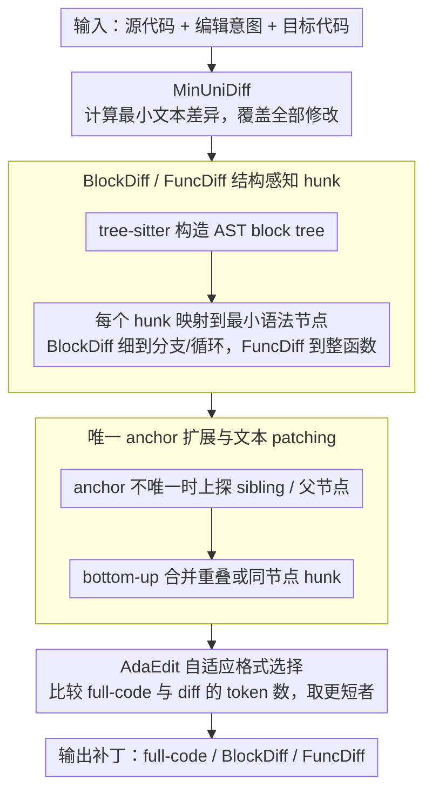

# To Diff or Not to Diff? Structure-Aware and Adaptive Output Formats for Efficient LLM-based Code Editing

**会议**: ACL2026  
**arXiv**: [2604.27296](https://arxiv.org/abs/2604.27296)  
**代码**: https://github.com/nju-websoft/AdaEdit  
**领域**: 代码智能 / LLM代码编辑 / 编辑格式学习  
**关键词**: 代码编辑, 结构化diff, AdaEdit, AST, 低延迟生成

## 一句话总结
这篇论文把 LLM 代码编辑的“输出格式”本身作为训练对象，提出 BlockDiff、FuncDiff 和自适应格式选择策略 AdaEdit，在接近 full-code 生成准确率的同时，在长代码编辑中将延迟和输出 token 成本降低 30% 以上。

## 研究背景与动机
**领域现状**：LLM 代码编辑已经成为 IDE、代码助手和自动修复系统中的基础能力。主流训练和评测通常让模型根据编辑意图直接输出完整修改后的代码，或者在强模型 prompt 中要求生成 unified diff / search-replace 之类的补丁格式。

**现有痛点**：完整代码生成对模型最自然，因为预训练语料里大量是完整代码，但效率很差：哪怕只改一行，也要重新输出整个文件，带来延迟、API 成本和意外改动风险。传统 diff 看起来更省 token，却对 LLM 不自然：带行号的格式要求精确 offset，content-addressed diff 又把代码切成碎片化 hunk，破坏语法结构。

**核心矛盾**：代码编辑要同时满足两个目标：输出越短越好，才能低延迟低成本；输出又要足够自然和可 patch，才能保证功能正确。full-code 自然但冗余，line-level diff 高效但脆弱，单一格式很难覆盖所有编辑规模。

**本文目标**：作者希望回答一个更基础的问题：LLM-based code editing 应该用什么输出表示？如果 diff 格式要被模型学习，它应该保持哪些代码结构？如果某些场景下 diff 反而比 full-code 更长，模型能否自动切换格式？

**切入角度**：论文先系统比较 conventional diff，证明 line-number offset 和 fragmented hunk 是主要失败源；然后用 AST 把文本 diff 扩展到语法完整的 block 或 function，最后让模型通过 SFT 学会在 diff 和 full-code 中选择 token 更少的表示。

**核心 idea**：把局部文本修改提升到语法块级重写，并用 AdaEdit 让模型按样本选择“结构化 diff 还是完整代码”，而不是固定使用一种编辑格式。

## 方法详解
论文的方法由两层组成。第一层是结构感知 diff 格式：BlockDiff 和 FuncDiff，它们仍然是文本 search/replace patch，但 hunk 的 anchor 和 rewrite 内容不再是任意行片段，而是 AST 中的语法块。第二层是 AdaEdit，它不发明新 patch 语法，而是改训练数据标签：对每个样本比较 full target code 和某种 diff 表示的 token 长度，把更短者作为训练目标，让模型内化格式选择逻辑。

### 整体框架
给定源代码、编辑意图和目标代码，系统先计算最小文本差异 MinUniDiff，保证所有文本修改都被覆盖；再用 tree-sitter 构造 AST block tree，将每个 diff hunk 映射到最小的语法节点或连续节点集合。随后通过 anchor expansion 保证待替换片段在源代码中唯一可定位，并通过 bottom-up 合并处理重叠 hunk 或同一细粒度节点内的多个修改。训练时，模型输入仍是编辑意图和源代码，输出可以是 full-code、BlockDiff、FuncDiff 或 AdaEdit 选择后的混合格式。

### 关键设计

**1. BlockDiff / FuncDiff 的结构感知 hunk：让 diff 的修改单位是完整语法块，而不是任意碎片行**

传统 content diff 把代码切成任意行片段，模型要生成缺头缺尾的 hunk，而预训练分布里 LLM 最擅长的恰恰是完整、语法连贯的代码块——格式和模型能力对不上，patch 自然容易坏。两种结构感知格式正是为了消除这种错配：BlockDiff 允许在细粒度 AST 节点上编辑，覆盖分支、循环、上下文块和函数；FuncDiff 则忽略控制结构，更偏向整函数级重写。

两者的统一形式都是"定位一个唯一 anchor，然后替换其中的结构化内容"。相比极致局部化的行级 diff，结构化 hunk 牺牲了一点最小性，却换来更贴合 LLM 生成分布的输出和更高的 patch 可用性——这也解释了后面实验里 FuncDiff 往往比更细的 BlockDiff 更稳。

**2. 唯一 anchor 扩展与文本 patching：保证结构化 diff 能无歧义地贴回源代码**

结构化 diff 再优雅，只要 patch 时 anchor 在源代码里不唯一就会失败，无法进入真实 IDE 流程。作者用一个自底向上的扩展策略保证唯一性：每个 hunk 先映射到最小 AST 节点，若该节点的文本内容在源码中不唯一，就逐步并入相邻 sibling 节点；仍不唯一就继续上探到父节点；最极端时以整个文件为 anchor。多个重叠 hunk 或落在同一细粒度节点内的修改也通过这种 bottom-up 合并消解。

值得注意的是，AST 只在生成格式时出场，真正 patch 时不依赖 AST，只做文本级 search/replace，并对空白和空行留一定容错。这样既能稳定定位，又能覆盖注释、空格乃至带语法错误的片段——这些恰恰是纯 AST 工具容易忽略的内容。

**3. AdaEdit 自适应格式选择：让模型按样本自动挑最省 token 的输出表示**

diff 并不总是更省：当修改分散或范围很大时，多个 anchor 加多 hunk 的开销可能反超完整代码，"为了 diff 而 diff"反而更长。AdaEdit 不发明新语法，而是改训练数据的监督目标——对每个训练样本的源代码 $C_j$ 和目标代码 $C'_j$，分别算出 full-code 表示和 diff 表示的 token 数，取更短者作为标签：

$$E_j = \arg\min\big(|C'_j|,\ |\mathrm{Diff}(C_j, C'_j)|\big)$$

这样模型不需要额外的分类头、也不必先输出"格式选择"再输出内容，格式决策被直接编进生成分布里。换句话说，AdaEdit 把推理期的 routing 提前固化进了数据标签，把效率取舍交给训练数据中真实的 token 成本信号。

### 损失函数 / 训练策略
训练目标仍是标准 token-level cross entropy。主要实验使用 OCEData 训练 Python 编辑，评测 EditEval、CanItEdit、HumanEvalFix、Aider-1 和 Aider-2；模型包括 DeepSeek-Coder-6.7B、Qwen2.5-Coder-7B 和 Qwen2.5-Coder-14B。所有模型从 base 版本做全参数 SFT，以隔离“输出格式”对结果的影响。评价从两方面进行：效果用 pass@1、patch-apply 成功率和 linter check；效率用首次可渲染输出 token、完整输出 token 和延迟。

## 实验关键数据

### 主实验
主表比较 full-code、传统 ContentDiff、结构化 BlockDiff / FuncDiff 以及加入 AdaEdit 后的平均 pass@1。

| 基座模型 | FullCode | ContentDiff | BlockDiff | BlockDiff + AdaEdit | FuncDiff | FuncDiff + AdaEdit | 主要结论 |
|----------|----------|-------------|-----------|---------------------|----------|--------------------|----------|
| DeepSeek-Coder-6.7B | 52.21 | 48.92 | 50.64 | 52.16 | 50.79 | 52.55 | AdaEdit 后接近或超过 FullCode |
| Qwen2.5-Coder-7B | 57.07 | 54.43 | 55.98 | 57.61 | 57.32 | 57.95 | FuncDiff + AdaEdit 最好 |
| Qwen2.5-Coder-14B | 63.89 | 62.16 | 64.11 | 63.92 | 64.89 | 64.68 | 强模型能更好利用结构化 diff |

传统 diff 的问题也很明显：Qwen2.5-Coder-7B 上 MinUniDiff 只有 14.07 平均 pass@1，UniDiff 33.15，即使用行号辅助也只有 31.13 / 37.66；ContentDiff 提升到 54.43，但仍低于 FullCode 57.07。这说明“去掉行号”只是第一步，保留语法结构才是关键。

### 消融实验
论文从长代码效率、格式选择准确率和跨语言泛化几个角度分析 AdaEdit。

| 设置 | Pass@1 | 输出成本 tokens | 说明 |
|------|--------|-----------------|------|
| FullCode, CanItEdit >300 tokens | 39.75 | 648.30 | 准确但冗余 |
| ContentDiff | 33.75 | 612.85 | 省得不多且准确率低 |
| ContentDiff + AdaEdit | 33.00 | 432.73 | 成本降但准确率仍弱 |
| BlockDiff | 38.69 | 570.26 | 更接近 FullCode |
| BlockDiff + AdaEdit | 37.94 | 466.04 | 成本明显降低 |
| FuncDiff | 40.75 | 546.77 | 准确率超过 FullCode |
| FuncDiff + AdaEdit | 40.69 | 481.63 | 准确率基本不降，成本降约25.7% |

JavaScript 跨语言实验也支持结构化格式的泛化能力。

| 格式 | HumanEvalFix-JavaScript pass@1 | 结论 |
|------|---------------------------------|------|
| Base model | 63.48 | 未针对编辑格式微调 |
| FullCode | 66.13 | 强基线 |
| ContentDiff | 56.55 | 传统 diff 明显退化 |
| ContentDiff + AdaEdit | 64.97 | AdaEdit 可缓解但不够 |
| BlockDiff + AdaEdit | 65.70 | 接近 FullCode |
| FuncDiff + AdaEdit | 67.74 | 超过 FullCode |

### 关键发现
- 结构化 diff 的优势随模型能力增强而更明显。Qwen2.5-Coder-14B 上 FuncDiff 平均 64.89，已经超过 FullCode 的 63.89；这说明更强模型能够更好理解结构化编辑格式。
- AdaEdit 的格式选择准确率超过 90%，如果允许 20% token 偏差，平均准确率超过 95%；few-shot 强模型并不会天然具备这种成本-收益判断，训练是必要的。
- 对长代码，FullCode 输出 token 与代码长度近似线性增长；FuncDiff 在短代码上有 anchor 开销，但代码越长越划算，AdaEdit 则能在不同代码尺度上自动取更低成本格式。
- 可用性分析显示 ContentDiff 更容易 patch 失败，因为模型生成的 anchor 不唯一；带行号的格式虽然 patch 成功率看起来高，但 linter check 暴露出更多代码破坏。

## 亮点与洞察
- 这篇论文的核心价值不是又做了一个 code edit benchmark，而是把“输出格式”提升为模型训练设计的一部分。很多代码智能工作默认 full-code 或 diff 是工程细节，这篇证明格式会直接影响准确率、延迟和成本。
- BlockDiff 与 FuncDiff 的取舍很清楚：BlockDiff 更细，潜在 token 更省；FuncDiff 更粗，更自然也更稳定。实验中 FuncDiff 往往准确率更强，说明对 LLM 来说“稍微多写一点完整结构”可能比极致局部化更划算。
- AdaEdit 很像把 inference-time routing 编进数据标签里。它不需要额外分类头，也不要求模型先输出格式选择再输出内容，而是通过监督目标让格式选择成为生成分布的一部分。
- 对 IDE 产品很有启发：用户体感通常由延迟、patch 成功率和是否误改共同决定，而不仅是 pass@1。结构化 diff 提供了比 full-code 更可控、比传统 diff 更自然的中间点。

## 局限与展望
- 结构化 diff 的效果依赖基座模型能力。较弱模型对新格式理解不足时，BlockDiff / FuncDiff 未必能超过 FullCode；论文也明确指出性能收益随模型规模和能力增强而提升。
- 训练数据仍以 Python 为主，虽然补充了 JavaScript 实验，但 repository-level 编辑、跨文件修改、构建系统修改和大型重构还没有充分覆盖。
- 任何 diff-based 方法都存在 patch 失败或意外代码破坏风险。论文通过唯一 anchor 和 linter check 缓解问题，但真实 IDE 还需要测试运行、类型检查和回滚机制。
- AdaEdit 目前用 SFT 从 token 长度标签中学习格式选择。未来可以把功能正确性、运行测试结果和 token 成本放进同一个可验证 reward，用 RL 进一步探索更灵活的编辑格式。

## 相关工作与启发
- **vs FullCode generation**: FullCode 与预训练分布最一致，准确率强但冗余严重；本文结构化 diff 试图保持足够完整的语法结构，同时避免整文件重写。
- **vs UniDiff / MinUniDiff**: 传统 unified diff 依赖行号和 offset，LLM 很难稳定生成。论文实验显示即使给源代码加行号，准确率仍远低于 full-code。
- **vs ContentDiff / search-replace**: content-addressed diff 去掉了行号脆弱性，但 hunk 仍是任意行片段，容易不自然或 anchor 不唯一。BlockDiff / FuncDiff 用 AST 节点解决这两个问题。
- **vs AST edit scripts**: GumTree 等语法感知工具适合程序分析，但输出是操作序列或 DSL，不适合 LLM 逐 token 生成，也可能忽略空白和注释。本文保留文本 patching，因此更适合精确重构代码文本。

## 评分
- 新颖性: ⭐⭐⭐⭐⭐ 把代码编辑格式系统化为可训练设计，并提出结构化 diff + 自适应选择，问题切入非常实用。
- 实验充分度: ⭐⭐⭐⭐☆ 覆盖多模型、多 benchmark、长代码、可用性和 JavaScript 泛化；repository-level 编辑还需要更多验证。
- 写作质量: ⭐⭐⭐⭐☆ 逻辑清楚，先诊断 conventional diff 再提出方法，实验表格也直接支撑论点。
- 价值: ⭐⭐⭐⭐⭐ 对代码助手、IDE 编辑和低延迟补丁生成很有工程价值，值得作为代码编辑模型训练格式的参考。

<!-- RELATED:START -->

## 相关论文

- [\[ACL 2026\] Learning Adaptive Parallel Execution for Efficient Code Localization](learning_adaptive_parallel_execution_for_efficient_code_localization.md)
- [\[ACL 2026\] PaT: Planning-after-Trial for Efficient Test-Time Code Generation](pat_planning-after-trial_for_efficient_test-time_code_generation.md)
- [\[ACL 2026\] DUET: Dual Execution for Test Output Prediction with Generated Code and Pseudocode](duet_dual_execution_for_test_output_prediction_with_generated_code_and_pseudocod.md)
- [\[ACL 2026\] The Path Not Taken: Duality in Reasoning about Program Execution](the_path_not_taken_duality_in_reasoning_about_program_execution.md)
- [\[ACL 2026\] Static Program Slicing Using Language Models With Dataflow-Aware Pretraining and Constrained Decoding](static_program_slicing_using_language_models_with_dataflow-aware_pretraining_and.md)

<!-- RELATED:END -->
