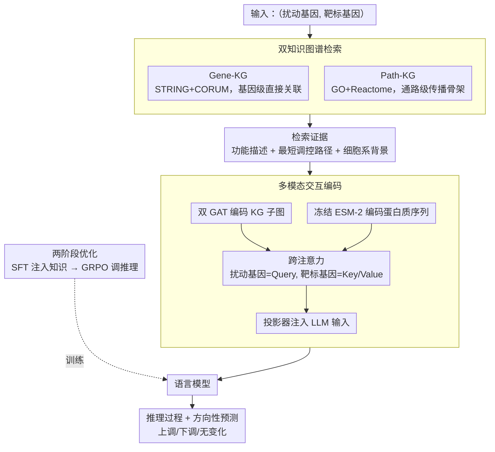

# AROMA: Augmented Reasoning Over a Multimodal Architecture for Virtual Cell Genetic Perturbation Modeling

**会议**: ACL 2026  
**arXiv**: [2604.20263](https://arxiv.org/abs/2604.20263)  
**代码**: [github](https://github.com/blazerye/AROMA)  
**领域**: Medical Imaging / 生物信息学  
**关键词**: 虚拟细胞建模, 基因扰动预测, 多模态融合, 知识图谱, 强化学习推理

## 一句话总结

提出 AROMA 框架，通过整合文本证据、知识图谱拓扑信息和蛋白质序列特征的多模态架构，结合两阶段训练策略（SFT + GRPO），实现了可解释且精确的基因扰动效应预测。

## 研究背景与动机

**领域现状**：虚拟细胞建模旨在预测基因扰动后的分子状态变化，对生物机制研究至关重要。现有方法包括通用 LLM、领域微调语言模型、细胞基础模型以及检索增强方法。

**现有痛点**：(1) 通用 LLM 缺乏生物约束，自由形式推理不可靠；(2) 现有基础模型仅输出标签或差异表达分数，缺乏人类可解释的推理过程；(3) 检索增强方法的检索信号与调控拓扑弱对齐，未建模调控方向性和多步传播。

**核心矛盾**：基因扰动效应高度依赖上下文，且通过多步调控级联传播，单纯的文本相似度检索无法捕捉从扰动基因到靶标基因的机制性路径。

**本文目标**：构建一个既能准确预测又能提供可解释推理的基因扰动预测框架。

**切入角度**：将扰动预测锚定在结构化的、查询特定的生物学证据上，显式建模扰动基因与靶标基因之间的依赖关系。

**核心 idea**：结合知识图谱检索（提供拓扑结构证据）、图神经网络编码器（结构表示）、蛋白质序列编码器（分子表示），通过跨模态交互注意力机制建模扰动-靶标关系，再用两阶段训练优化预测与推理质量。

## 方法详解

### 整体框架

AROMA 的核心思路是把"预测某个基因被扰动后靶标基因怎么变"这件事，从单纯的文本相似度匹配，改造成锚定在结构化生物学证据上的推理。整条链路是：输入一对（扰动基因，靶标基因）后，先从两张知识图谱里检索出基因功能描述、调控最短路径和细胞系背景作为上下文；再由多模态编码器把知识图谱的拓扑结构、蛋白质序列特征与文本一起喂给语言模型；最后语言模型输出一段可读的推理过程加一个方向性预测（上调/下调/无变化）。训练上分两步走——先用大规模监督微调注入领域知识，再用 GRPO 强化学习把推理质量磨准。

### 关键设计

**1. 双知识图谱检索：用互补的两层结构兜住"扰动如何传播"**

单纯靠文本相似度检索抓不住从扰动基因到靶标基因的机制性通路，所以 AROMA 构建了两张互补的图：Gene-KG 整合 STRING 与 CORUM，覆盖 18k 节点、700k 边，刻画基因间的直接关联；Path-KG 整合 GO 与 Reactome，覆盖 80k 节点、400k 边，编码更高层的生物过程结构。检索时同时取出基因功能描述、BFS 算出的最短调控路径（不超过 3 条）和细胞系描述。两图一低一高地配合，让证据既有基因级的直接连边，又有通路级的传播骨架，正好对上"多步调控级联"这一痛点。

**2. 多模态交互编码：以扰动基因为 Query 显式建模扰动-靶标关系**

光有文本不够，结构和分子层面的信号才能把扰动-靶标关系刻画清楚。AROMA 预训练两个 GAT 编码器分别编码 Gene-KG 与 Path-KG 的子图，并冻结 ESM-2 来编码蛋白质序列；对每种模态都做一次跨注意力，让扰动基因充当 Query、靶标基因充当 Key/Value，再经一个轻量投影器把融合后的表示注入语言模型输入。这种"扰动基因主动去查询靶标基因"的非对称设计，直觉上对应了"是扰动驱动了靶标的变化"这一生物学方向性，比对称地做相似度更贴合任务。

**3. 两阶段优化（SFT + GRPO）：先灌知识再调推理**

第一阶段在 PerturbReason（498k+ 样本）上做多模态 SFT，此时冻结 GNN 与 ESM-2、只用 LoRA 微调语言模型，目的是把领域知识稳稳注入；第二阶段切到 GRPO 强化学习，对每个实例采样多条推理轨迹，按任务级反馈打分并组内归一化算优势。这样拆开是因为 SFT 只能教模型"模仿正确答案"，而 GRPO 能直接拿预测对错当奖励信号，进一步压住推理过程里的不一致与跑偏，二者一注入一精调，缺一不可。

### 损失函数 / 训练策略

SFT 阶段用标准自回归语言建模损失。GRPO 阶段为每个实例采样多条推理轨迹，奖励由三部分组成：预测正确性（正确 $+5.0$ / 错误 $-1.0$）、推理格式规范性（$+0.5$）、答案类别唯一性（$+0.5$），再在组内归一化得到优势值用于策略更新。

## 实验关键数据

### 主实验

| 方法 | K562 Avg | HepG2 Avg | Jurkat Avg | RPE1 Avg | 总平均 F1 |
|------|---------|---------|---------|---------|----------|
| DeepSeek-R1 | 0.32 | 0.34 | 0.33 | 0.31 | 0.33 |
| SUMMER | 0.58 | 0.67 | 0.65 | 0.67 | 0.64 |
| GAT | 0.59 | 0.67 | 0.63 | 0.65 | 0.64 |
| AROMA | **0.66** | **0.76** | **0.75** | **0.77** | **0.73** |

### 消融实验

| 配置 | 平均 F1 | 说明 |
|------|---------|------|
| 原始 Qwen3-8B | 0.26 | 缺乏领域知识 |
| + SFT | 0.65 | 领域知识注入关键 |
| + SFT + GRPO | 0.68 | 强化学习提升推理 |
| + RAG | 0.71 | 检索证据补充 |
| 全模块（AROMA） | 0.73 | 各组件协同增益 |

### 关键发现
- AROMA 在所有 4 个细胞系上一致超越所有基线方法，平均 F1 达 0.73，比最强基线 SUMMER 高出 9 个百分点
- 零样本泛化（RPE1）性能仅轻微下降（0.77 → 0.73），展示了强跨分布泛化能力
- 在低流行度和低连通性基因上的性能下降远小于去除检索和多模态模块的变体，说明增益来自联合建模而非记忆高频基因
- GRPO 采样轨迹数从 4 增加到 16 时性能稳步提升

## 亮点与洞察
- 首次在基因扰动预测中系统性地整合知识图谱拓扑、蛋白质序列和文本证据三种模态
- 双知识图谱的设计思路值得借鉴：Gene-KG 提供局部关联，Path-KG 提供全局通路结构
- 跨注意力机制以扰动基因为 Query、靶标基因为 Key/Value 的设计直觉清晰
- 构建的 PerturbReason 数据集（498k 样本）是重要的社区资源贡献

## 局限与展望
- 目前仅支持单基因扰动，无法处理多基因组合扰动或化学干预
- 每次推理仅预测单个靶标基因的表达变化，未扩展到同时预测多个下游基因
- 对知识图谱和外部文本资源的依赖意味着对缺乏注释的基因预测可能退化
- 未来可扩展到组合扰动和化学干预场景

## 相关工作与启发
- **vs SUMMER**: SUMMER 使用文本相似度检索，AROMA 进一步引入拓扑结构和蛋白质序列建模扰动-靶标交互
- **vs GEARS**: GEARS 注入图结构先验但缺乏可解释推理，AROMA 同时提供预测和推理路径
- **vs SynthPert/rBio-1**: 它们依赖合成推理轨迹训练，可能继承监督噪声；AROMA 通过 GRPO 直接从任务反馈优化

## 评分
- 新颖性: ⭐⭐⭐⭐ 多模态融合思路清晰，双知识图谱和交互编码设计新颖
- 实验充分度: ⭐⭐⭐⭐⭐ 多细胞系、零样本、消融、鲁棒性分析全面
- 写作质量: ⭐⭐⭐⭐ 结构清晰，图示精美
- 价值: ⭐⭐⭐⭐ 对虚拟细胞建模领域有重要推动，资源贡献价值高

<!-- RELATED:START -->

## 相关论文

- [\[ICLR 2026\] Retrieval-Augmented Generation for Predicting Cellular Responses to Gene Perturbation](../../ICLR2026/computational_biology/retrieval-augmented_generation_for_predicting_cellular_responses_to_gene_perturb.md)
- [\[ICLR 2026\] VCWorld: A Biological World Model for Virtual Cell Simulation](../../ICLR2026/computational_biology/vcworld_a_biological_world_model_for_virtual_cell_simulation.md)
- [\[ICML 2026\] What Makes a Representation Good for Single-Cell Perturbation Prediction?](../../ICML2026/computational_biology/what_makes_a_representation_good_for_single-cell_perturbation_prediction.md)
- [\[ICLR 2026\] scDFM: Distributional Flow Matching for Robust Single-Cell Perturbation Prediction](../../ICLR2026/computational_biology/scdfm_distributional_flow_matching_model_for_robust_single-cell_perturbation_pre.md)
- [\[ACL 2026\] ToxReason: A Benchmark for Mechanistic Chemical Toxicity Reasoning via Adverse Outcome Pathway](toxreason_a_benchmark_for_mechanistic_chemical_toxicity_reasoning_via_adverse_ou.md)

<!-- RELATED:END -->
