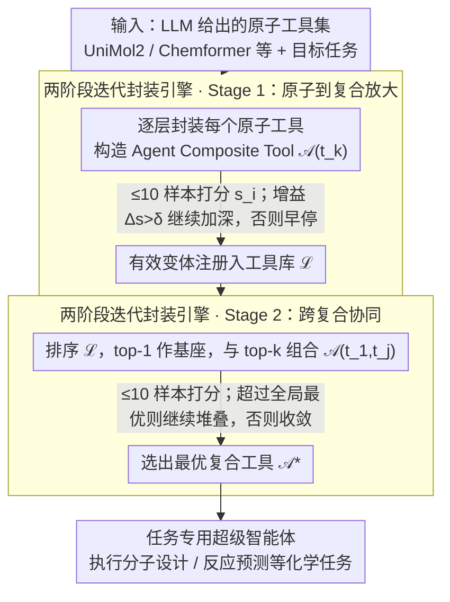

# ChemAmp: Amplified Chemistry Tools via Composable Agents

**会议**: ACL 2026 Findings  
**arXiv**: [2505.21569](https://arxiv.org/abs/2505.21569)  
**代码**: [GitHub](https://github.com/Chang-pw/ChemAmp)  
**领域**: 科学AI/化学  
**关键词**: 工具放大, 可组合智能体, 化学AI, 多智能体系统, 层次化组合

## 一句话总结

提出"工具放大"新范式（区别于传统的工具编排），通过 ChemAmp 框架将化学专用工具（UniMol2、Chemformer等）作为可组合积木块动态构建任务专用超级智能体，在分子设计、反应预测等四个核心化学任务上超越专用模型和通用LLM，同时推理token成本减少94%。

## 研究背景与动机

**领域现状**：LLM-based智能体已能在化学领域编排多步工具使用流程（如ChemCrow、Coscientist），顺序调用RDKit、分子生成器等工具完成跨任务工作流。

**现有痛点**：现有方法聚焦于"工具编排"（跨任务调度工具顺序），但单个任务内的性能受制于底层工具的原子能力上限。即使最好的化学专用工具（UniMol2、ChemDFM），在单独使用时分子描述精确匹配仅35%，错误会在推理链中传播。

**核心矛盾**：工具编排优化的是任务间的工具调度，但任务内的工具性能瓶颈才是真正制约Agent表现的根本因素。

**本文目标**：从"工具编排"转向"工具放大"——通过动态组合使工具在单个任务内超越各自的原子能力。

**切入角度**：将每个工具视为可组合的积木块智能体，通过层次化迭代封装构建性能更强的复合工具。

**核心idea**：两阶段放大——先将原子工具封装为增强的子智能体（Stage 1），再将子智能体组合成层次化网络（Stage 2），通过自适应评分和自动反馈迭代优化组合。

## 方法详解

### 整体框架

ChemAmp 把"提升单任务性能"重新表述成一个自下而上的工具组合搜索问题：给定一组化学原子工具（UniMol2、Chemformer 等）和一个目标任务，框架自动找出能产生协同效应的工具组合，封装成一个性能更强的复合智能体来执行该任务。整个过程由一个两阶段迭代封装引擎驱动，先把每个原子工具单独放大（Stage 1），再让放大后的复合工具彼此组合（Stage 2），迭代到全局性能收敛为止。

### 关键设计

**1. Agent Composite Tool：既是积木又是执行器**

ChemAmp 的核心抽象是 Agent Composite Tool $\mathcal{A}(t_1,...,t_n)$——它封装了若干底层工具以及它们之间的协调策略，同时扮演两个角色：对上层智能体而言它是一块可被继续组合的积木，对具体化学子任务而言它又是一个能独立运行的自主执行器。这种双重性是"工具放大"区别于"工具编排"的关键：编排系统只在任务之间调度固定能力的工具，而 ChemAmp 把组合本身当作一等公民，因此能在工具协同产生增益的位置主动注入封装，让复合工具的能力超过任意单个原子工具的上限，而不只是机械堆叠。

**2. 两阶段迭代封装引擎**

放大分两步进行。Stage 1 对每个原子工具 $t_k$ 迭代封装出复合变体 $\mathcal{A}_i(t_k)$，用任务指标给出评分 $s_i$，只有当增益超过阈值 $\delta$ 时才继续加深封装，所有有效变体都注册进工具库。Stage 2 在工具库内做跨复合协同：按评分排序后取 top-1 作为基座，与 top-k 其余工具组合出 $\{\mathcal{A}(t_1,t_2),...,\mathcal{A}(t_1,t_k)\}$，再次评分并迭代，直到全局性能不再提升。手工枚举组合不现实、暴力穷举成本又过高，而"评分排序 + 阈值早停"的迭代策略恰好在搜索空间和计算开销之间取得平衡，自动收敛到接近最优的组合结构。

**3. 极低数据需求（≤10 样本）**

化学领域标注数据稀缺，因此整个组合优化过程对每个任务只用不超过 10 个样本来打分和筛选。这之所以可行，是因为每个原子工具本身已经携带强领域先验，ChemAmp 需要的只是判断"某个组合是否带来提升"这一相对信号，而非从零学习任务知识——少量验证样本足以稳定地区分有增益和无增益的组合，使方法在数据极度受限的真实化学场景下依然能落地。

## 实验关键数据

### 主实验（分子设计 - ChemLLMBench）

| 方法 | 精确匹配 | BLEU | FTS |
|------|---------|------|-----|
| ChemDFM-13B | 0.32 | 0.85 | 0.74 |
| Text+Chem T5 | 0.32 | 0.85 | 0.82 |
| GPT-4o | 0.01 | 0.57 | 0.54 |
| ChemAmp | **0.42** | **0.88** | **0.84** |

### 消融实验

| 配置 | 关键指标 | 说明 |
|------|---------|------|
| 仅Stage 1 | 有提升 | 单工具增强有效 |
| Stage 1 + Stage 2 | 最佳 | 跨复合协同进一步提升 |
| Vanilla多智能体 | 较差 | 简单堆叠不如结构化组合 |
| Token成本 | 94%减少 | vs vanilla多智能体系统 |

### 关键发现
- ChemAmp在四个核心化学任务上全面超越化学专用模型、通用LLM和传统Agent编排系统
- 推理token成本仅为vanilla多智能体系统的6%，效率极高
- 自下而上的组合策略优于自上而下的编排策略
- 分子设计精确匹配从SOTA的0.32提升至0.42（+31%），证明工具放大的实际效果

## 亮点与洞察
- **范式创新**："工具放大"vs"工具编排"的区分清晰有力，从"跨任务调度"转向"任务内增强"
- **效率与效果兼得**：超越SOTA的同时减少94%推理token成本，说明结构化组合比暴力堆叠高效
- **通用性**：虽然应用于化学领域，但工具放大范式可迁移到其他科学领域
- **低数据需求**：≤10样本即可优化组合，实用性强

## 局限与展望
- **依赖GPT-4o作为核心Agent**：组合策略的效果可能受限于底层LLM的能力
- **仅在ChemLLMBench的100个实例上评估**：测试规模偏小
- **化学领域特有**：需验证在其他科学领域的适用性
- 未来方向：扩展到更多科学领域、研究组合策略的可解释性、降低对闭源LLM的依赖

## 相关工作与启发
- **vs ChemCrow/Coscientist**：典型的工具编排系统，在跨任务调度方面有效但不增强单任务性能
- **vs ChemToolAgent**：支持大工具集和动态选择，但仍在编排范式内
- **vs AgentPrune/GPTSwarm**：自动化工作流优化但不涉及原子工具级增强

## 评分
- 新颖性: ⭐⭐⭐⭐⭐ "工具放大"范式提出新颖且有说服力，两阶段封装引擎设计优雅
- 实验充分度: ⭐⭐⭐⭐ 四个化学任务全面评估，有消融和效率分析，但测试规模偏小
- 写作质量: ⭐⭐⭐⭐ 编排vs放大的区分图清晰，算法描述完整
- 价值: ⭐⭐⭐⭐ 为科学AI工具增强提供了新思路，效率和效果的双重提升有实际部署价值

<!-- RELATED:START -->

## 相关论文

- [\[NeurIPS 2025\] Interpreting GFlowNets for Drug Discovery: Extracting Actionable Insights for Medicinal Chemistry](../../NeurIPS2025/computational_biology/interpreting_gflownets_for_drug_discovery_extracting_actionable_insights_for_med.md)
- [\[ACL 2026\] ToxReason: A Benchmark for Mechanistic Chemical Toxicity Reasoning via Adverse Outcome Pathway](toxreason_a_benchmark_for_mechanistic_chemical_toxicity_reasoning_via_adverse_ou.md)
- [\[ACL 2026\] AROMA: Augmented Reasoning Over a Multimodal Architecture for Virtual Cell Genetic Perturbation Modeling](aroma_augmented_reasoning_over_a_multimodal_architecture_for_virtual_cell_geneti.md)
- [\[ACL 2026\] BioTool: A Comprehensive Tool-Calling Dataset for Enhancing Biomedical Capabilities of Large Language Models](biotool_a_comprehensive_tool-calling_dataset_for_enhancing_biomedical_capabiliti.md)
- [\[ACL 2026\] ProtoCycle: Reflective Tool-Augmented Planning for Text-Guided Protein Design](protocycle_reflective_tool-augmented_planning_for_text-guided_protein_design.md)

<!-- RELATED:END -->
