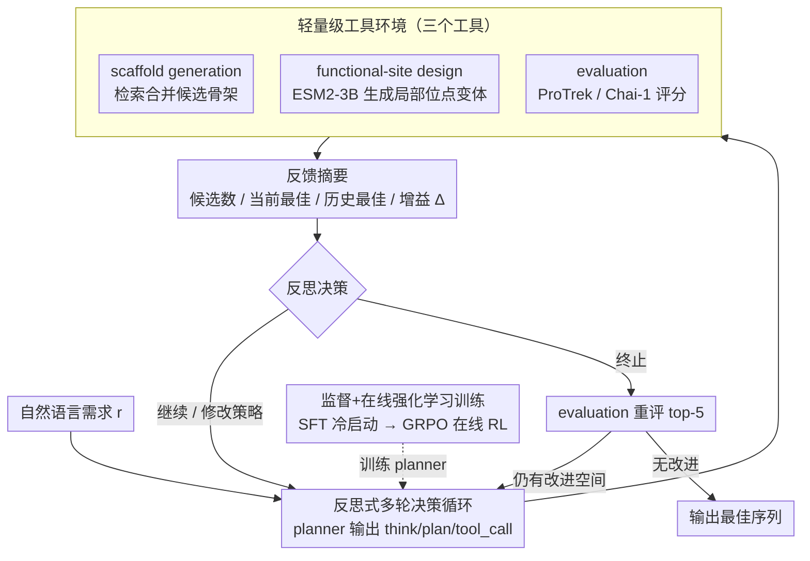

# ProtoCycle: Reflective Tool-Augmented Planning for Text-Guided Protein Design

**会议**: ACL 2026 (Findings)  
**arXiv**: [2604.16896](https://arxiv.org/abs/2604.16896)  
**代码**: [https://github.com/huggggoooooo/ProtoCycle](https://github.com/huggggoooooo/ProtoCycle)  
**领域**: AI for Science / 蛋白质设计  
**关键词**: 蛋白质设计, 文本引导, 反思规划, 工具增强, 强化学习

## 一句话总结

ProtoCycle提出一种将LLM作为规划器、结合轻量级工具环境的**反思式智能体框架**，用于文本引导蛋白质序列设计：它用多轮“规划-工具调用-评估-反思”循环替代一次性文本到序列生成，在 Mol-Instructions 上将 ProTrek 提升到 14.681、Retrieval 提升到 0.936，并只用约 2,000 条 SFT 轨迹和在线 RL 达到接近/超过专用蛋白质设计模型的语言对齐效果。

## 研究背景与动机

**领域现状**: 设计满足自然语言功能需求的蛋白质是蛋白质工程的核心目标。直接的方法是微调通用指令调优LLM作为文本到序列生成器，但这种方法数据和计算密集。

**现有痛点**: (1) 直接文本到序列的方法需要大量监督数据和计算资源；(2) 在有限监督下，LLM可以生成连贯的文本计划，但无法可靠地将其实现为蛋白质序列——存在**计划-执行鸿沟**（plan-execute gap）；(3) 蛋白质设计需要迭代试错，但现有方法大多是一次性生成。

**核心矛盾**: LLM善于理解自然语言功能描述并生成计划，但不善于直接从文本映射到有效的蛋白质序列，尤其在训练数据有限时。

**本文目标**: 构建一个利用LLM规划能力同时弥补其序列生成弱点的蛋白质设计框架。

**切入角度**: 借鉴人类蛋白质工程师的迭代工作流——不是一步生成，而是"规划→执行→反馈→修正"的多轮循环，将LLM定位为规划器而非生成器。

**核心idea**: 将LLM规划器与轻量级工具环境耦合，工具提供序列操作和评估功能，LLM通过反思工具反馈来迭代修正设计方案，并通过监督轨迹+在线强化学习训练来提升Agent能力。

## 方法详解

### 整体框架

ProtoCycle 将文本引导蛋白质设计形式化为一个多步决策过程。给定自然语言需求 $r$，planner 在第 $t$ 轮基于历史状态、工具反馈和原始需求输出状态 $s_t$ 与工具动作 $a_t$：$a_t$ 被拆成工具类型和工具参数，随后由轻量级工具环境执行并返回反馈摘要。LLM 不直接吐出完整氨基酸序列，而是负责需求拆解、工具选择、策略更新、反思和终止判断；具体序列生成与局部编辑交给专门工具完成。

每轮输出采用 `<think>`、`<plan>`、`<tool_call>` 三段式协议。第一轮中，planner 把需求拆成细粒度子目标并规划工具调用顺序；后续轮次中，planner 读取前一轮工具返回的候选数量、当前最佳分数、历史最佳分数和增益 $\Delta$，判断是继续当前计划、修改策略还是终止。终止前会触发 evaluation 工具对 top-5 候选重新评分，若还有改进空间则继续规划，否则输出最佳序列。

### 关键设计

**1. 反思式多轮决策循环（reflective multi-round decision loop）**

把文本到序列的一次性生成换成模拟人类蛋白质工程师的迭代试错。每轮 planner 用 `<think>/<plan>/<tool_call>` 三段式协议输出：先在 `<think>` 里总结当前策略表现并反思它是否有效，再在 `<plan>` 里决定继续当前计划、修改策略还是终止，最后用 `<tool_call>` 选定一个工具及参数。工具执行后返回候选数量、当前最佳分数、历史最佳分数和增益 $\Delta$ 的摘要，planner 据此进入下一轮；第一轮先把需求拆成细粒度子目标并规划工具调用顺序，之后每轮都依据反馈调整。之所以这么做，是因为蛋白质设计本质上是迭代优化，单次生成难以满足复杂功能要求，而显式反思让 Agent 能从差反馈中学习、及时修正甚至停止——消融显示真正起作用的正是「依据反馈改策略」这一步，仅学会 `<think>/<plan>` 格式却不反思，与固定 workflow 差别有限。

**2. 轻量级工具环境（lightweight tool environment）**

planner 只负责高层规划，底层序列操作和评估交给三个工具：scaffold generation 从 UniProt、Rhea、InterPro、QuickGO 等知识库检索并合并候选骨架；functional-site design 基于 ESM2-3B 在给定骨架和局部描述上生成位点级（site-level）变体；evaluation 用 ProTrek 评估语言对齐、用 Chai-1 评估可折叠性。终止前会专门触发 evaluation 对 top-5 候选重新评分，若还有改进空间就继续规划，否则输出最佳序列。把序列生成与打分外置，既弥补了 LLM 不擅长 residue-level 决策的短板（论文测得序列 token 的 epistemic uncertainty 系统性偏高），也让整个设计过程可解释、可追溯。

**3. 监督+在线强化学习训练（SFT + online RL）**

分两阶段训练 planner。第一阶段用约 2,000 条 Mol-Instructions 样本构造工具交互轨迹做 SFT，只在 planner 的状态 $s_1,\ldots,s_n$ 上计算交叉熵（不在工具返回的内容上算），让模型先学会 `<think>/<plan>/<tool_call>` 协议、获得冷启动能力。第二阶段在真实工具环境里用 GRPO 做在线强化学习，reward 同时奖励格式正确、工具使用合理、在差反馈后做反思、以及在适度轮数内完成任务。监督提供模仿起点、RL 进一步探索出超越专家轨迹的策略——这也是 ProtoCycle-RL 相比 SFT 版把 ProTrek 从 12.502 提到 14.681 的来源。

## 实验关键数据

### 主实验

| 模型 | PPL↓ | Repeat↓ | pTM↑ | pLDDT↑ | PAE↓ | ProTrek↑ | EvoLLaMA↑ | Retrieval↑ |
|---|---:|---:|---:|---:|---:|---:|---:|---:|
| Natural | 4.737 | 2.129 | 0.762 | 0.815 | 9.443 | 14.628 | 0.328 | 0.848 |
| Qwen2.5-7B-Agent | 8.235 | 5.153 | 0.542 | 0.699 | 15.299 | 6.926 | 0.261 | 0.523 |
| Qwen2.5-72B-Agent | 7.414 | 5.341 | 0.618 | 0.714 | 13.343 | 8.791 | 0.267 | 0.563 |
| Qwen3-8B-Agent | 7.227 | 3.795 | 0.650 | 0.723 | 13.493 | 8.705 | 0.277 | 0.573 |
| ProDVa | 5.265 | 1.580 | 0.765 | 0.800 | 8.761 | 12.037 | 0.317 | 0.730 |
| Pinal | 3.990 | 9.317 | 0.792 | 0.825 | 7.768 | 14.162 | 0.318 | 0.807 |
| ProtoCycle-SFT | 4.149 | 2.902 | 0.734 | 0.807 | 10.200 | 12.502 | 0.317 | 0.840 |
| ProtoCycle-RL | **3.865** | 2.549 | 0.775 | 0.822 | 8.543 | **14.681** | 0.323 | **0.936** |

ProtoCycle-RL 在语言对齐上最强：ProTrek 相比 Pinal 提升 3.66%，相比 ProDVa 提升 21.97%；Retrieval 达到 0.936，明显高于 Natural、Pinal 和 ProDVa。折叠质量方面，它相较 Pinal 的 pTM/pLDDT 略低、PAE 略高，但相较 ProDVa 在 pTM、pLDDT、PAE 上都更好，说明 agentic workflow 没有牺牲基本结构可折叠性。

### 消融实验

| 实验 | 关键结论 |
|---|---|
| ProtoCycle-RL vs ProtoCycle-SFT | ProTrek 从 12.502 到 14.681，Retrieval 从 0.840 到 0.936；PPL 和 Repeat 分别下降 6.85% 与 12.16% |
| CAMEO 泛化 | ProtoCycle-RL 未用 keyword-style 数据训练，仍达 pLDDT 0.80、ProTrek 11.17、Keyword Recovery 0.59 |
| 单工具质量 | Scaffold search: ProTrek 11.42、PAE 8.96、pLDDT 0.83；Functional-site design: ProTrek 12.87、PAE 10.73、pLDDT 0.80 |
| 工具延迟 | Scaffold search 约 4s/round；functional-site design 约 20s/seq；ProTrek-35M 约 3s/round；ProTrek-650M 约 40s/round |
| 反思机制 | 反思 planner 的语言对齐分数接近无反思版本的 2 倍；有效工具调用率约 +20%，带来改进的工具调用率约 +40% |

### 关键发现

1. **LLM 更适合规划而非直接生成蛋白序列**: 直接 SFT Qwen2.5-7B 时，ProTrek 随数据增加只从约 1 提升到 7，离 ground-truth 14.6 仍很远；power-law 外推显示要接近 12 可能需要约 $6\times10^8$ 监督样本。
2. **序列 token 的 epistemic uncertainty 更高**: 规划 token 和序列 token 的 aleatoric uncertainty 类似，但序列 token 的 epistemic uncertainty 系统更高，说明模型在 residue-level 决策上证据不足。
3. **RL 主要提升语言对齐和检索**: 相比 SFT-only，在线 RL 显著提升 ProTrek 和 Retrieval，同时降低 PPL/Repeat。
4. **反思不是格式装饰**: 仅学习 `<think>/<plan>` 格式但不反思，与固定 Workflow 差别有限；真正有效的是根据工具反馈修改策略和及时停止。

## 亮点与洞察

1. **跨域思路迁移**: 将NLP/AI Agent领域的"规划+工具调用+反思"范式成功迁移到蛋白质设计领域，展示了Agent框架的跨域潜力
2. **弥合计划-执行鸿沟**: 明确识别了LLM在蛋白质设计中的"能说不能做"问题，并通过工具环境提供了优雅的解决方案
3. **迭代优化vs一次生成**: 蛋白质设计不适合一步到位，多轮反馈循环更符合领域实际工作流
4. **监督+RL训练策略**: 在Agent训练中平衡了模仿学习和探索学习，是训练复杂Agent的有效范式

## 局限与展望

1. **功能位点设计工具仍较轻量**: 当前工具适合在现实计算预算内提高候选质量，但不能保证生成理想序列，尤其难以严格实现高特异性结合或催化几何。
2. **agentic workflow 存在吞吐量-质量权衡**: ProtoCycle 在规划和评估中多次调用结构/功能工具，计算成本高于一次性生成器。
3. **评估仍以计算指标为主**: 语言对齐、foldability 和 keyword recovery 都是有用 proxy，但不能替代湿实验验证。
4. **工具反馈可能带来偏差**: 如果 ProTrek、Chai-1 或检索工具对某些蛋白家族覆盖不足，planner 会继承这些偏差。
5. **复杂功能设计仍未被彻底解决**: 论文定位是提高文本引导设计流程，而不是给出可直接保证功能的 de novo protein design 方案。

## 相关工作与启发

1. **蛋白质LLM (ProtGPT2, ESM等)**: 直接用LLM生成蛋白质序列的方法，ProtoCycle改为将LLM用作规划器
2. **AlphaFold**: 蛋白质结构预测工具，可作为ProtoCycle工具环境中的评估组件
3. **ReAct/OctoTools等Agent框架**: NLP领域的Agent框架思路，ProtoCycle将其迁移到蛋白质设计
4. **RLHF/在线RL**: 训练方法借鉴了NLP中的RLHF范式，用工具反馈替代人类反馈

## 评分

- **新颖性**: ⭐⭐⭐⭐ — 将Agent范式引入蛋白质设计是有趣的跨域尝试，反思式迭代设计符合领域直觉
- **实验充分度**: ⭐⭐⭐⭐ — 覆盖 Mol-Instructions、CAMEO 泛化、工具效率和反思消融，但仍缺少湿实验验证
- **写作质量**: ⭐⭐⭐⭐ — 问题定义清晰（plan-execute gap），框架设计直观
- **价值**: ⭐⭐⭐⭐ — 展示了LLM Agent框架在科学发现领域的应用潜力，为蛋白质设计提供了新范式

<!-- RELATED:START -->

## 相关论文

- [\[NeurIPS 2025\] Protein Design with Dynamic Protein Vocabulary](../../NeurIPS2025/computational_biology/protein_design_with_dynamic_protein_vocabulary.md)
- [\[ICML 2025\] Reliable Algorithm Selection for Machine Learning-Guided Design](../../ICML2025/computational_biology/reliable_algorithm_selection_for_machine_learning-guided_design.md)
- [\[NeurIPS 2025\] Pharmacophore-Guided Generative Design of Novel Drug-Like Molecules](../../NeurIPS2025/computational_biology/pharmacophore-guided_generative_design_of_novel_drug-like_molecules.md)
- [\[ICLR 2026\] Protein Counterfactuals via Diffusion-Guided Latent Optimization](../../ICLR2026/computational_biology/protein_counterfactuals_via_diffusion-guided_latent_optimization.md)
- [\[ICML 2026\] From Feasible to Practical: Pareto-Optimal Synthesis Planning](../../ICML2026/computational_biology/from_feasible_to_practical_pareto-optimal_synthesis_planning.md)

<!-- RELATED:END -->
