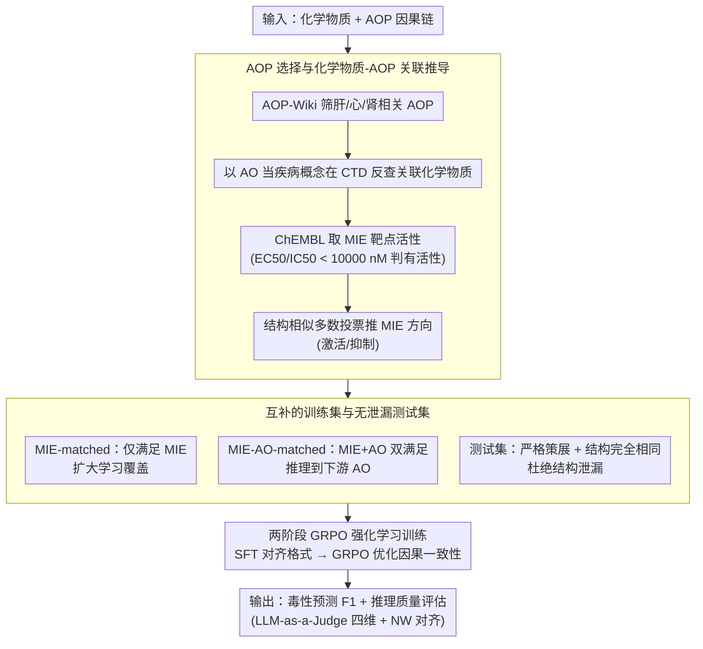

# ToxReason: A Benchmark for Mechanistic Chemical Toxicity Reasoning via Adverse Outcome Pathway

**会议**: ACL 2026  
**arXiv**: [2604.06264](https://arxiv.org/abs/2604.06264)  
**代码**: 无  
**领域**: 计算生物
**关键词**: 毒性推理, 不良结局路径, 基准测试, 强化学习, LLM评估

## 一句话总结

本文提出 ToxReason，一个基于不良结局路径 (AOP) 框架的化学毒性机理推理基准，整合药物-靶点实验数据与毒性标签，要求模型从分子起始事件推理到器官级不良结局；通过 GRPO 强化学习训练的 4B 模型在毒性预测（F1 71.4%）和推理质量上均超越 GPT-5 等大模型。

## 研究背景与动机

**领域现状**：LLM 已被用于分子推理和毒性预测任务，现有基准（如 Tox21、ClinTox）主要关注结构-性质关系的预测，将毒性视为简单的分类任务。

**现有痛点**：毒性本质上源于复杂的生物学机制（分子靶点→细胞事件→器官响应），而非仅由化学结构决定。LLM 可以生成流畅但生物学上不可靠的解释，导致高预测准确率不等于可靠推理。现有数据集（如 UniTox）的推理基于临床观察而非因果机理路径。

**核心矛盾**：预测性能与推理质量之间存在显著脱节——模型可能"蒙对答案"但给出错误的机理解释，这在药物安全评估等高风险场景中不可接受。

**本文目标**：构建一个评估毒性机理推理的基准，要求模型从分子起始事件 (MIE) 到不良结局 (AO) 进行逐步因果推理，并探索提升推理能力的训练策略。

**切入角度**：毒理学中的 AOP 框架天然描述了从 MIE→关键事件 (KE)→AO 的因果链条，这与 NLP 中多步推理的范式高度吻合。

**核心 idea**：将 AOP 因果链作为毒性推理的 ground truth，构建评估 benchmark 并通过推理感知训练 (reasoning-aware training) 同时提升预测和推理能力。

## 方法详解

### 整体框架

ToxReason 把"化学毒性"从一道结构-性质分类题重新定义为一条沿不良结局路径（AOP）展开的因果推理题：输入一个化学物质，模型需要从分子起始事件（MIE）出发，经关键事件逐步推理到器官级不良结局（AO），既给出毒性预测又给出与生物机制对齐的解释。围绕这一目标，论文先从权威毒理库构造带 AOP 标注的数据，再切分出支持学习与无泄漏评估的训练/测试集，最后用强化学习显式优化"预测正确 + 推理忠实"的联合目标。评估同时看毒性预测的 F1 和推理质量的 LLM-as-a-Judge 四维度评分。

### 关键设计

**1. AOP 选择与化学物质-AOP 关联推导**

要让模型学会机理推理，首先得有以生物因果链为骨架的标注数据，而直接的"化学物质-MIE"实验数据往往缺失。论文从 AOP-Wiki 筛出与肝、心、肾毒性相关的 AOP，把每条 AOP 的 AO 当作疾病概念在 CTD 中反查关联化学物质；再从 ChEMBL 取出对应 MIE 靶点的活性数据（EC50/IC50，以 $<10000\,\mathrm{nM}$ 判为有活性），对每个候选化学物质用结构相似性做多数投票来推断其 MIE 方向（激活或抑制）。这一"用相似分子的已知活性做证据聚合"的设计，绕开了直接实验数据不可得的困境，让因果起点 MIE 能被可靠地标注出来。

**2. 互补的训练集与无泄漏测试集**

数据被切成两类互补的训练子集：MIE-matched 只要求满足 MIE 条件（结构 Dice 相似度 $\ge 0.5$），覆盖面广，帮助模型学到"什么样的分子会触发起始事件"的模式；MIE-AO-matched 则要求同时满足 MIE 和 AO，迫使模型把跨分子交互一路推理到下游毒性结局。测试集刻意只用严格策展的关联和结构完全相同的化学物质，杜绝与训练集的结构泄漏，从而保证评出的是真正的机理泛化能力而非记忆。两者分工明确：一个负责扩大学习覆盖，一个负责拔高推理深度与评估严格度。

**3. 两阶段 GRPO 强化学习训练**

为了让模型不只"蒙对答案"而是真按 AOP 路径推理，训练分两阶段：先用 SFT 把模型对齐到任务的输入输出格式，再用 GRPO（Group Relative Policy Optimization）以显式奖励优化推理链与 AOP 的因果一致性和生物学忠实度。这么设计是因为实验发现 SFT 只能教会输出格式、几乎不改善推理质量；只有当奖励信号直接指向"推理是否与因果路径对齐"时，模型才会被引导去生成机制上站得住的推理链，从而同时抬升预测和推理两项指标。

### 损失函数 / 训练策略

GRPO 的奖励同时综合两部分信号——毒性预测的准确性，以及生成推理链与 AOP 路径的对齐度，使预测正确性与机理忠实度被联合优化而非彼此割裂。整个微调用 LoRA 做参数高效更新，因此一个 4B 规模的模型即可在该框架下训练。

## 实验关键数据

### 主实验

| 模型 | 肾毒性 F1 | 心脏毒性 F1 | 肝毒性 F1 | 平均 F1 | 推理Overall |
|------|----------|-----------|----------|---------|----------|
| GPT-5 | 56.4 | 72.7 | 65.0 | 64.7 | 5.420 |
| GPT-5.1 | 50.3 | 71.2 | 58.9 | 60.1 | 5.523 |
| o3 | 60.0 | 72.5 | 58.8 | 63.8 | 5.326 |
| DeepSeek-R1-70B | 59.1 | 78.5 | 59.6 | 65.7 | 4.487 |
| Qwen3-4B (base) | 56.9 | 71.1 | 57.3 | 61.8 | 4.523 |
| ToxReason-4B-SFT | 57.9 | 74.3 | 57.4 | 63.2 | 4.554 |
| **ToxReason-4B-GRPO** | **73.4** | 72.7 | **68.2** | **71.4** | **5.642** |

### 消融实验

| 配置 | 平均 F1 | 推理 Overall | 说明 |
|------|---------|-------------|------|
| Qwen3-4B base | 61.8 | 4.523 | 基础模型 |
| + ICL 1-shot | 68.8 | 5.373 | Few-shot 最佳 |
| + ICL 2-shot | 59.1 | 4.373 | 更多示例反而引入噪声 |
| + SFT | 63.2 | 4.554 | 微调提升有限 |
| + GRPO | 71.4 | 5.642 | RL 显著提升 |

### 关键发现

- 预测性能和推理质量之间存在显著脱节：GPT-5.1 推理最好但预测最差（60.1%），DeepSeek-R1 预测最好但推理较差
- SFT 对推理质量几乎无帮助，而 GRPO 同时大幅提升预测（+9.6%）和推理（+1.1 分）
- ICL 在 1-shot 时效果最好，增加 shot 数反而引入噪声导致性能下降
- NW 对齐分数与 LLM-as-a-Judge 评分高度相关（Spearman ρ=0.837），验证了评估方法的可靠性

## 亮点与洞察

- **预测-推理脱节的发现**：揭示了 LLM 可以在毒性预测上表现良好但推理机制完全错误，这对安全关键应用有重要警示意义
- **4B 模型超越 GPT-5**：通过 GRPO 推理感知训练，4B 参数模型在预测和推理上均超越闭源大模型，证明了显式推理优化的价值
- **AOP 框架与 NLP 多步推理的巧妙映射**：将毒理学因果链条转化为 NLP 可评估的推理任务，这一思路可推广到其他科学领域的机理推理评估

## 局限与展望

- 仅覆盖肝、心、肾三种器官毒性，受 AOP-Wiki 覆盖范围限制
- MIE 推断基于结构相似分子而非从分子结构直接预测，限制了对全新化学物质的适用性
- LLM-as-a-Judge 评估本质上是主观的，虽有 NW 算法验证但仍应视为相对度量
- 未来可扩展到更多器官系统和更复杂的 AOP 网络

## 相关工作与启发

- **vs CoTox**: CoTox 通过 CoT 提升预测但不评估推理是否与因果路径对齐，ToxReason 将推理评估作为核心目标
- **vs Tox21/ClinTox**: 传统毒性基准仅做结果预测，ToxReason 要求模型解释"为什么有毒"
- **vs UniTox**: UniTox 基于临床观察提供解释，ToxReason 基于 AOP 因果机制要求逐步推理

## 评分

- 新颖性: ⭐⭐⭐⭐ 首个系统评估 LLM 毒性机理推理的 benchmark，预测-推理脱节的发现有价值
- 实验充分度: ⭐⭐⭐⭐ 覆盖多种开/闭源模型和学习策略，但仅三种器官毒性
- 写作质量: ⭐⭐⭐⭐ 结构清晰，AOP 背景介绍详实
- 价值: ⭐⭐⭐⭐ 对药物安全和 AI 可信推理领域有实际意义

<!-- RELATED:START -->

## 相关论文

- [\[NeurIPS 2025\] Beyond Chemical QA: Evaluating LLM's Chemical Reasoning with Modular Chemical Operations](../../NeurIPS2025/computational_biology/beyond_chemical_qa_evaluating_llms_chemical_reasoning_with_modular_chemical_oper.md)
- [\[ACL 2026\] AROMA: Augmented Reasoning Over a Multimodal Architecture for Virtual Cell Genetic Perturbation Modeling](aroma_augmented_reasoning_over_a_multimodal_architecture_for_virtual_cell_geneti.md)
- [\[NeurIPS 2025\] FGBench: A Dataset and Benchmark for Molecular Property Reasoning at Functional Group-Level in Large Language Models](../../NeurIPS2025/computational_biology/fgbench_a_dataset_and_benchmark_for_molecular_property_reasoning_at_functional_g.md)
- [\[ICML 2026\] SIGMA: Structure-Invariant Generative Molecular Alignment for Chemical Language Models via Autoregressive Contrastive Learning](../../ICML2026/computational_biology/sigma_structure-invariant_generative_molecular_alignment_for_chemical_language_m.md)
- [\[ICML 2026\] TadA-Bench: A Million-Variant Benchmark for Future-Round Discovery Toward Agentic Protein Engineering](../../ICML2026/computational_biology/tada-bench_a_million-variant_benchmark_for_future-round_discovery_toward_agentic.md)

<!-- RELATED:END -->
