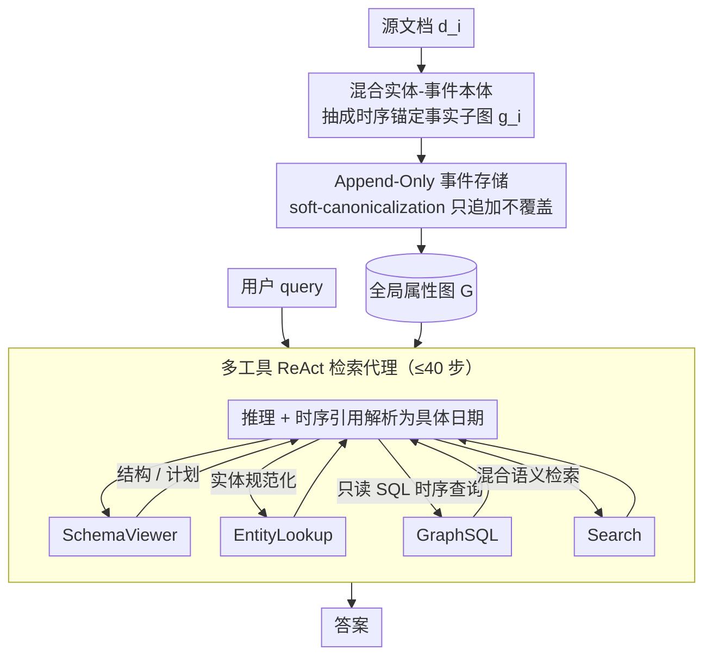

# APEX-MEM: Agentic Semi-Structured Memory with Temporal Reasoning for Long-Term Conversational AI

**会议**: ACL 2026  
**arXiv**: [2604.14362](https://arxiv.org/abs/2604.14362)  
**代码**: 无  
**领域**: 对话系统 / 长期记忆 / Agent  
**关键词**: Property Graph, Append-Only Storage, Temporal Reasoning, ReAct Agent, GraphSQL

## 一句话总结
把对话长期记忆建成"领域无关本体支撑的属性图 + 只追加事件存储 + ReAct 多工具检索代理"三件套——构建时永不覆盖、检索时再做时序冲突解析，在 LOCOMO 拿到 88.88%（比 MIRIX 高 3.5 个点）、LongMemEval 拿到 86.2%（比最强 RAG baseline 高 13.7 个点）。

## 研究背景与动机

**领域现状**：LLM 在长期多轮对话里需要"记住前几个 session、跨 session 累积知识、随上下文演化更新事实"。常见解法分两类：① 加长上下文窗口（128K 也只换来 51.6% F1）；② RAG 检索文本/摘要段（噪声仍重）。最近的结构化记忆系统 Mem0 / A-MEM / Zep / MIRIX 把记忆建图，但还远未达"glass-box"水准。

**现有痛点**：当前结构化记忆系统在两点上仍弱——
① 像 Mem0 这种**实体中心**图把所有信息塞成实体-关系三元组，实体类别有限且无法捕捉属性的时序演变；
② 几乎所有系统在写入时都会做**合并 / 覆盖**（eager update / state merge），早早扔掉历史版本，导致后续"X 是什么时候变的？""Y 之前是什么样？"这类时序问题无法回答。

**核心矛盾**："保留完整历史"（利于时序推理）和"减少检索噪声"（利于答题准确）天然冲突——过早合并会丢信息，完整保留又增大检索负担。

**本文目标**：把"何时解析冲突"从写入时推迟到检索时，让记忆系统既能保留完整时间线，又能在 query 期间按上下文动态选择正确版本。

**切入角度**：借鉴知识图谱里 YAGO 4.5 的实体类型层级 + 数据库 append-only log 的思路，把对话事实**锚定到带时间戳的事件**而非直接挂在实体上。

**核心 idea**："属性图 + append-only 事件存储 + 检索时多工具时序解析"三位一体——写入端做减法（不合并），读取端做加法（多工具 ReAct）。

## 方法详解

### 整体框架
系统分两阶段。**构建阶段**：把每个 source document $d_i$ 抽成子图 $g_i$，通过 soft-canonicalization 增量合入全局属性图 $G^{(t+1)}\leftarrow\mathrm{Merge}(G^{(t)},g_t)$。形式化记 $G=(V,E,\Pi,\Lambda)$，其中 $\Pi$ 是 key-value 属性映射，$\Lambda$ 是节点/边的本体类型。**查询阶段**：ReAct 代理 $\pi_\theta$ 在每步 $t$ 生成推理 trace $r_t$ 和动作 $a_t$，动作要么是工具调用 $(T_t,z_t)$（$T_t\in\{\text{SchemaViewer, EntityLookup, GraphSQL, Search}\}$），要么是 Answer。代理把时序引用先解析成具体日期，再调工具，最后给答案。

### 关键设计

**1. 混合实体-事件本体 + 时序锚定事实**

APEX-MEM 不把对话信息直接拍成实体-关系三元组，而是用一套领域无关本体为记忆提供统一语义结构。它定义 35 类实体（Person / Organization / Product / Place / Event / Software / ...），并把每条事实写成时序锚定的多元组 $f=(s,p,v,\delta,[t_{\text{from}},t_{\text{to}}],c,\mathcal{E})$——$s$ 是主体实体、$p$ 是属性名、$v$ 是值、$\delta$ 是数据类型、$[t_{\text{from}},t_{\text{to}}]$ 是有效区间、$c\in[0,1]$ 是置信度、$\mathcal{E}$ 是支撑证据集合；而且所有事实都必须挂到一个对话事件 $\varepsilon=(\text{type},T,L,P,F,\mathcal{E}_\varepsilon)$ 上。这样设计是因为像 Mem0 那种实体中心的三元组无法表达"Alice 在 2024-01-15 最爱 Italian Garden、2024-03-20 改最爱 Sakura Sushi"这类属性随时间演变的情形；把事件提升为一等公民、再给每条事实配上有效区间，细粒度时序推理才真正变得可写可查。

**2. Append-Only 事件存储 + 检索时时序解析**

这是 APEX-MEM "写入做减法、读取做加法"哲学的落点：构建时永不覆盖旧事实，任何冲突或修订都作为新事件追加进图，把冲突解析整体推迟到 query 时按时序有效性裁决。实体与属性的对齐走 RAG 风格——给定 mention $m$ 先用 dense embedding 召回 top-k 候选 $C=\{(\text{id}_i,\text{text}_i,s_i)\}$，再让结构化 LLM 输出决策 $d\in\{\text{choose\_existing, propose\_new, none}\}$ 及置信度，但始终只追加节点、不删旧。查询时由 GraphSQL 按 `created_at` 或 `from_date` 排序，代理选出最新的、或问题指定时间下有效的那条。早期合并等于信息丢失，会让 Mem0 多跳掉 18%、MIRIX 时序掉 20%；append-only 则保住完整时间线，把原本沉默的失败模式转化成"可被显式查询"的状态。

**3. 多工具 ReAct 检索代理（SchemaViewer / EntityLookup / GraphSQL / Search）**

读端的智能集中在一个 ReAct 代理上，它按问题特性把结构化推理、实体规范化和语义搜索拼进同一条推理回路：SchemaViewer 作为 meta-planner 给出库表结构与工具使用建议；EntityLookup 把表面 mention 规范化到图 id 并返回带时间戳的事实快照；GraphSQL 是只读 SELECT 接口（白名单表 entities/properties/facts/events/evidence/turns），支持 julianday 时序计算、聚合和多跳 JOIN；Search 是 dense+lexical 混合检索，返回与问题相关的子图 $(E_q,P_q,\mathcal{V}_q,\mathcal{T}_q)$。代理按 ReAct 范式 $(r_t,a_t)\sim\pi_\theta(\cdot\mid x,h_t)$ 反复决策，最多 40 步。之所以要多工具协作，是因为任何单一工具都不够用——纯 GraphSQL 解一组题要 27,282 次调用（3.3× 浪费），纯 EntityLookup 的多跳上限只到 77%；而单跳、多跳、时序、开放域、对抗这些不同问题类型需要不同的最优工具组合，让代理自己挑选反而比任何固定的单工具方案都强。

### 损失函数 / 训练策略
完全不重训：构建期用 Claude Sonnet 4.5 做 fact extraction、Claude Haiku 4.5 做 entity/property resolution（平衡成本和质量）；query 期用 GPT-5 / Claude Sonnet 4.5 等强模型挂工具。对超长对话（>$10^3$ 文档）采用 APEX-MEM Online：先用语义+词法搜索筛 $\mathrm{Relevance}(d_i|Q)>\Theta_{\text{rel}}=0.2$ 的子集再建局部图。所有实验温度=0，工具调用上限 40。

## 实验关键数据

### 主实验
LOCOMO（多 session 长期对话记忆）+ LongMemEval（长输入记忆）+ SealQA-Hard（噪声多文档事实问答）三个 benchmark，与 MIRIX / Mem0 / Zep / A-MEM / Nemori / MemGPT / OpenAI Memory 等对比。

| 数据集 | 方法 | 整体 | 单跳 | 多跳 | 时序 | 开放域 | 对抗 |
|---|---|---|---|---|---|---|---|
| LOCOMO | **APEX-MEM (GPT-5)** | **88.88%** | **89.88%** | **86.29%** | **90.63%** | **91.68%** | 86.77% |
| LOCOMO | APEX-MEM (Claude 4.5 Sonnet) | 88.41% | 89.36% | 86.92% | 90.63% | 87.75% | 86.10% |
| LOCOMO | MIRIX | 85.38% | 85.11% | 83.70% | 65.62% | 88.39% | N/A |
| LOCOMO | Nemori | 79.40% | 84.90% | 75.10% | 77.60% | 51.00% | N/A |
| LOCOMO | Mem0 | 68.44% | 65.71% | 47.19% | 75.71% | 58.13% | N/A |
| LOCOMO | Zep | 75.14% | 61.70% | 41.35% | 76.60% | 49.31% | N/A |
| LOCOMO | Full Context GPT-4o | 87.52% | 88.53% | 77.70% | 71.88% | 92.70% | N/A |
| LongMemEval | **APEX-MEM (Sonnet)** | **86.2%** | - | - | - | - | - |
| LongMemEval | Nemori | 74.6% | - | - | - | - | - |
| SealQA-Hard | **APEX-MEM (GPT-5)** | **40.15%** | - | - | - | - | - |
| SealQA-Hard | O3 | 34.6% | - | - | - | - | - |

### 消融实验（工具组合，LOCOMO，Claude 4.5 Haiku 后端）

| 配置 | 单跳 | 多跳 | 时序 | 开放域 | 对抗 | 整体 |
|---|---|---|---|---|---|---|
| SchemaViewer + EntityLookup | 80.85 | 76.64 | 72.92 | 76.34 | 77.80 | 77.19 |
| + GraphSQL | 80.78 | 79.75 | 82.29 | 78.00 | 81.16 | 79.45 |
| **+ Search（全部 4 个工具）** | **85.46** | **84.74** | 79.17 | **89.18** | **87.22** | **87.00** |

### 关键发现
- **时序推理是最大杀手锏**：APEX-MEM 90.63% vs MIRIX 65.62%（差 25 个点）、Mem0 75.71%（差 15 个点），直接验证 append-only + GraphSQL 时序操作组合的有效性。
- **Search 工具是开放域 +11 个点的关键**：从 78.00→89.18，纯结构化查询无法覆盖语义模糊的问题。
- **GraphSQL 不能孤军作战**：单独使用要 27,282 次调用（3.3× 浪费），且最高只能到 79.45%；和 Search 配合时调用次数降到 8,260 次，效率提升 3 倍。
- **强 LLM 让工具调用更少**：Claude 4.5 Sonnet 用 10 次调用就能达到 84-86% 准确率，而 GPT-4o 因为 SQL 生成错误率高需要更多调用，最终精度也低（86.35% vs 88.88%）。
- **token 成本上的甜蜜点**：APEX-MEM 每 query 平均 30,000 tokens，比 MIRIX 的 112,000 低近 4 倍，但准确率更高；图构建成本只占 16.6%。
- **SQL 错误恢复机制**：87% 的 SQL 失败可由 SchemaViewer 重查（45%）/ EntityLookup fallback（28%）/ Search fallback（14%）自动救回，多工具架构韧性强。

## 亮点与洞察
- **"写入做减法、读取做加法"是优雅的范式**：与数据库的 WAL（write-ahead log）异曲同工——所有智能都集中在读端，写端永远是 append-only，这让冲突解析变成"按 query 时间裁决的查询问题"而非"提前猜哪条对的预测问题"。
- **用 SQLite 做图存储是工程上很务实的选择**：让 GraphSQL 直接复用 SQL 的 julianday、聚合、JOIN，比自定义 Cypher/SPARQL 查询语言通用得多，且 LLM 写 SQL 远比写 Cypher 熟练（Sonnet SQL 成功率 97.6%）。
- **35 类实体本体的平衡**：既细到能区分 Software / Service / Device，又广到跨领域适用；属性可灵活附着，相当于在严格 schema 和完全 schemaless 之间找到甜蜜点。
- **silent failure 转化为 queryable state**：可以问"Alice 的最爱餐厅是什么时候变的"、"Bob 之前的工作是什么"——这些问题在 Mem0 那种覆盖式系统里根本无法回答。
- **append-only 优势的间接实证**（附录 F）：APEX-MEM 时序 90.63% vs Mem0 75.71% (–14.92) vs MIRIX 65.62% (–25.01) vs Zep 76.60% (–14.03)，强烈暗示 update 策略而非 LLM 强弱才是时序天花板的真正瓶颈。

## 局限与展望
- 图构建依赖大模型做 fact extraction（Claude Sonnet 4.5 抽取精度 97.3%、schema coverage 91.1%、实体解析 98.2%），实时对话部署成本不低；作者计划研究小模型替代和缓存机制。
- 多工具 ReAct 平均要 20-30 次工具调用才能收敛，时延可能影响交互式场景；20 次以后边际收益递减明显，需要 RL 学到更聪明的 stop 准则。
- 35 类领域无关本体在专业领域（医疗 / 法律）可能不够细，缺自动 ontology 精炼能力。
- SealQA-Hard 上 40.15% 说明在严重噪声多文档场景仍有改进空间，主要瓶颈是 fact extraction 对隐式关系和时序细节的覆盖不够。
- 系统仅支持文本对话；多模态（图像/音频）输入未覆盖。
- 评估只到 QA 任务，事件摘要、对话生成等需要叙事合成的任务未验证。

## 相关工作与启发
- **vs Mem0 / Mem0g**：Mem0 实体类有限且写入即合并，APEX-MEM 35 类本体 + append-only，时序推理 +15 个点。
- **vs MIRIX**：MIRIX 用 6 个专用记忆 + 多代理路由达 85.4%，但 eager state merge 把时序信息折损得只剩 65.62%；APEX-MEM 更简洁的架构反而拿到 90.63% 时序分。
- **vs Zep / Graphiti**：Zep 也建时序 KG 但严重依赖文本检索，GraphSQL 提供了它缺失的精确结构化查询能力；APEX-MEM 时序 +14 个点。
- **vs A-MEM / Nemori**：A-MEM 用 Zettelkasten 风格自主链接，Nemori 借鉴认知科学做自组织记忆，但都没解决"写入即合并"的根本问题。
- **vs Full Context GPT-4o**：直接塞 128K 上下文能达到 87.52%，已经被 APEX-MEM 超过，且 APEX-MEM 平均 token 消耗只有它的 1.2 倍（30K vs 25K）——结构化记忆并非以效率为代价。

## 评分
- 新颖性: ⭐⭐⭐⭐ "事件本体 + append-only + 检索时解析"组合很巧，单点元素都不算全新，但三者拼成的范式确有突破。
- 实验充分度: ⭐⭐⭐⭐⭐ 三 benchmark + 工具消融 + 模型对比 + token 成本拆解 + SQL 失败救援分析，全方位覆盖。
- 写作质量: ⭐⭐⭐⭐ 数学形式化清晰，case study 直观，附录极其详尽（连 SQL query 类型都统计了）。
- 价值: ⭐⭐⭐⭐⭐ 给"长期对话记忆"提供了可直接落地的工程模板，append-only 思想可迁移到更广义的 agent 记忆系统。

<!-- RELATED:START -->

## 相关论文

- [\[ACL 2025\] SHARE: Shared Memory-Aware Open-Domain Long-Term Dialogue Dataset Constructed from Movie Script](../../ACL2025/dialogue/share_shared_memory-aware_open-domain_long-term_dialogue_dataset_constructed_fro.md)
- [\[ICLR 2026\] ReIn: Conversational Error Recovery with Reasoning Inception](../../ICLR2026/dialogue/rein_conversational_error_recovery_with_reasoning_inception.md)
- [\[ICLR 2026\] Think-While-Generating: On-the-Fly Reasoning for Personalized Long-Form Generation](../../ICLR2026/dialogue/think-while-generating_on-the-fly_reasoning_for_personalized_long-form_generatio.md)
- [\[ACL 2026\] Reasoning Gets Harder for LLMs Inside A Dialogue](reasoning_gets_harder_for_llms_inside_a_dialogue.md)
- [\[ACL 2025\] PersonaLens: A Benchmark for Personalization Evaluation in Conversational AI Assistants](../../ACL2025/dialogue/personalens_a_benchmark_for_personalization_evaluation_in_conversational_ai_assi.md)

<!-- RELATED:END -->
