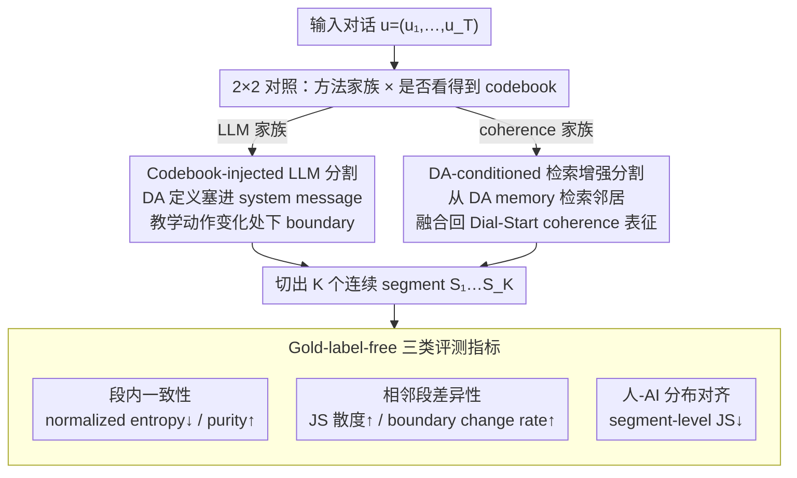

# Codebook-Injected Dialogue Segmentation for Multi-Utterance Constructs Annotation: LLM-Assisted and Gold-Label-Free Evaluation

**会议**: ACL 2026  
**arXiv**: [2601.12061](https://arxiv.org/abs/2601.12061)  
**代码**: https://github.com/National-Tutoring-Observatory/codebook-injected-segmentation (有)  
**领域**: 对话分割 / 教育对话标注  
**关键词**: dialogue act 标注, codebook-injected 分割, LLM 标注, gold-free 评测, 教育对话

## 一句话总结
论文把 dialogue act 标注重新定义为"先分段、再贴标签"的两步问题，提出 codebook-injected 的 LLM 分割（System 1）和 Dial-Start 的 DA-aware 检索增强（System 2）两种方案，并给出无需 gold boundary 的三类评测指标（segment 内一致性 / 相邻段差异性 / 人-AI 分布对齐），在 TalkMoves 和 CLASS-annotated 两套教学对话上证明：DA-aware 提示能让 LLM 切出更同质的 segment，但和 coherence-based baseline 各占不同评测维度，没有单一最优。

## 研究背景与动机

**领域现状**：Dialogue Act (DA) 标注通常默认 label 贴在单个 utterance 或 turn 上，使用 inter-annotator agreement（IRR）作为质量度量。早期分割工作沿用 TextTiling / C99 / LCseg 等基于词汇衔接的方法，近年转向 contrastive learning（Dial-Start）和 LLM prompting。

**现有痛点**：在教学对话里，"教学动作"（pedagogical move）天然跨多个 utterance —— 老师讲解时学生穿插"嗯"、"为什么"等短回答，标注者对"这是不是同一段讲解"会出现 boundary 分歧，但对底层 label 反而是一致的。强制 utterance-level 标注 + 用 IRR 衡量，会把这种 boundary 分歧误判成 conceptual disagreement，inflating disagreement 并掩盖 span-level 的真实一致。

**核心矛盾**：unit-of-analysis 问题 —— "label 是什么"与"label 在哪开始/结束"是两个独立维度，但 prevailing pipeline 把它们绑在 utterance 上一次性决定，制造虚假分歧。又因为教学领域天然缺 gold segment 标注（成本高、ambiguous），无法用 $P_k$ / WindowDiff 这类经典 boundary metric 评测。

**本文目标**：(1) 把 segmentation 单独抽出做一阶设计；(2) 在 segmentation 阶段把 codebook（即 DA 定义）显式注入，让 boundary 决策直接为下游 DA label 服务；(3) 在没有 gold segment 的前提下，造一套基于分布的可比评测指标。

**切入角度**：作者把 LLM 和 coherence-based 方法都看作 candidate segmenters，关键操纵是"是否能看到 codebook (DA-aware vs text-only)"，做一个 2×2 controlled experiment；同时跑人 + GPT-5 两套 utterance-level label，把"人-AI distributional agreement"作为评测指标之一。

**核心 idea**：把 segmentation 当成"对下游 annotation 目标的优化问题"而非通用 coherence 问题 —— 给分割器看 codebook，让它在 boundary 决策时直接服务于"这段是什么 DA"，再用三类 gold-free 指标多目标评测。

## 方法详解

### 整体框架
对于一段对话 $\mathbf{u}=(u_1,\ldots,u_T)$，segmenter 要输出 boundary 集合 $\mathcal{B}\subset\{1,\ldots,T-1\}$，把对话切成 $K=|\mathcal{B}|+1$ 个连续 segment $S_1,\ldots,S_K$，再交给三类 gold-free 指标打分。全文的核心操纵是一个 2（方法家族）×2（是否看得到 codebook）的对照实验：方法家族取 LLM-zero-shot（GPT-5 / Gemini-3-pro，纯 topic-shift 提示，输出 boundary index 的 JSON）和 Dial-Start（非 LLM，contrastive utterance encoder $f(\cdot)$ 算相邻相似度 depth score，按 $\mathrm{thr}=\mu+\alpha\sigma$ 选 boundary）；codebook-awareness 则决定 segmenter 在切之前是否看得到 DA 定义——LLM 侧把定义塞进 system message，Dial-Start 侧用 DA-conditioned retrieval 注入。最后用段内一致性（normalized entropy ↓ / purity ↑）、相邻段差异性（JS 散度 ↑ / boundary change rate ↑）、人-AI 分布对齐（segment-level JS ↓）三组指标多目标评测。

### 关键设计

**1. Codebook-injected LLM segmentation：让 LLM 在"哪里切"这一步就盯着"切完贴什么 label"**

传统 topic-shift 提示让 LLM 凭"主题变化"切，结果常在内容主线一致、但教学动作切换处不切（如老师从 explanation 转到 questioning），恰好错失下游 annotation 最关键的 boundary。本设计在 zero-shot prompt 基础上插入完整 move definitions（TalkMoves 的 6 类 talk moves、CLASS 的 4 类 instructional support），要求模型"在 pedagogical function 发生变化时下 boundary，但不要给段贴 label"，输出仍是 boundary index JSON。把 DA 定义显式注入，等于让 LLM 内化"教学动作"这个 unit-of-analysis，使 boundary 与 downstream label 直接对齐——实验里它把 GPT-5 在 CLASS 上的 normalized entropy 从 0.349 压到 0.286、purity 从 0.546 抬到 0.570，是所有方法中段内一致性最强的。

**2. DA-conditioned retrieval-augmented coherence segmentation：不重训 boundary detector，把 codebook 语义检索进 coherence 表征**

直接 fine-tune Dial-Start 需要 boundary 标注，而教学领域恰恰没有；于是作者改用检索注入。维护一份 expert-labeled DA utterance 的 memory $\mathcal{M}=\{(h_j, m_j)\}$（TalkMoves 1.9k、CLASS 301 条），对当前 utterance $u_i$ 抽 embedding $h_i=f(u_i)$，从 memory 取 top-$K_{\text{ret}}$ 邻居，用 cosine + softmax 温度 $\tau$ 算 attention 权重，聚合 DA 嵌入 $r_i=\sum_k a_k e_{m_{j_k}}$，再融合回原表征 $\hat{h}_i=\text{norm}(h_i+\alpha r_i)$，送回 Dial-Start 的相邻相似度计算。这样既不破坏原 coherence 目标，又让 boundary score 反映"附近 DA 是否一致"。但实验有趣地显示这招对 LLM 有效、对 coherence-based 基线无效（Dial-Start+DA-aware 在 CLASS 上 entropy 反而从 0.303 升到 0.319），暗示 DA-awareness 与 instruction-following 模型的契合度更高。

**3. Gold-label-free 三类评测指标：没有 gold boundary 时，用 DA 分布的统计性质给 segmentation 打分**

$P_k$ / WindowDiff 都要 reference boundary，标注成本高且本身有 boundary ambiguity，教学领域根本拿不到。本设计改用 DA 分布作间接信号：把每个 segment $S_k$ 转成 DA 分布 $p_{k,c}^{(r)}=\frac{1}{|S_k|}\sum_{u_i\in S_k}\mathbb{1}[y_i^{(r)}=c]$，segment 权重 $w_k=|S_k|/T$，再从三个独立目标考核。段内一致性看 normalized entropy $\widetilde{H}_k^{(r)}=H_k^{(r)}/\log_2 C$（↓）和 purity $\max_c p_{k,c}^{(r)}$（↑）；相邻段差异性看相邻段 JS 散度 $\overline{\text{JS}}_{\text{adj}}^{(r)}$（↑）和 boundary change rate $\text{BCR}^{(r)}$（↑）；人-AI 分布对齐看 $\overline{\text{JS}}_{\text{HA}}=\sum_k w_k \text{JS}(p_k^{(H)}, p_k^{(A)})$（↓）。三个目标用同一货币度量，自然把 segmentation 暴露成一个 multi-objective design 问题，而不是 single-score 的优劣排序。

### 损失函数 / 训练策略
论文不训练新模型。Dial-Start 沿用原作者的 contrastive utterance encoder，超参 window_size=2、$\alpha$=0.5、pick_num=4、min_gap=3；LLM 用 GPT-5 / Gemini-3-pro 固定 prompt 与 decoding。retrieval-augmented Dial-Start 用 $K_{\text{ret}}$ 邻居 + temperature softmax + 学习的 move-embedding 表 $E\in\mathbb{R}^{M\times d}$（move 总数 $M$=6 或 4），但 boundary detector 本身不再训练。

## 实验关键数据

### 主实验 (mean [95% CI]，K = 每对话平均 segment 数)

CLASS-annotated 数据集（30 个 tutoring session，4 类 CLASS move）：

| 方法 | K | 段内 $\widetilde{H}$ ↓ | Purity ↑ | $\overline{\text{JS}}_{\text{adj}}$ ↑ | BCR ↑ | 人-AI $\overline{\text{JS}}_{\text{HA}}$ ↓ |
|---|---|---|---|---|---|---|
| GPT-5 | 4.90 | 0.349 | 0.546 | 0.447 | 0.222 | 0.424 |
| **GPT-5 DA-aware** | 6.30 | **0.286** | 0.570 | 0.477 | **0.288** | 0.449 |
| Gemini-3-pro | 4.47 | 0.384 | 0.528 | 0.447 | 0.237 | **0.407** |
| Gemini-3-pro DA-aware | 4.53 | 0.391 | 0.531 | 0.435 | 0.267 | 0.411 |
| Dial-Start | 4.60 | 0.303 | 0.564 | **0.545** | 0.208 | 0.459 |
| Dial-Start + DA-aware | 4.50 | 0.319 | 0.561 | 0.515 | 0.253 | 0.484 |

TalkMoves 数据集（63 个 K-12 数学课堂转写，6 类 talk moves）：

| 方法 | K | 段内 $\widetilde{H}$ ↓ | Purity ↑ | $\overline{\text{JS}}_{\text{adj}}$ ↑ | BCR ↑ | 人-AI $\overline{\text{JS}}_{\text{HA}}$ ↓ |
|---|---|---|---|---|---|---|
| GPT-5 | 10.86 | 0.616 | 0.659 | 0.447 | 0.235 | **0.470** |
| GPT-5 DA-aware | 12.54 | 0.609 | 0.664 | 0.470 | 0.222 | 0.489 |
| Gemini-3-pro | 16.62 | 0.598 | 0.662 | 0.471 | 0.235 | 0.480 |
| **Gemini-3-pro DA-aware** | 19.53 | **0.566** | **0.676** | **0.478** | 0.252 | 0.505 |
| Dial-Start | 14.60 | 0.619 | 0.640 | 0.475 | 0.416 | 0.513 |
| Dial-Start + DA-aware | 14.75 | 0.639 | 0.633 | 0.469 | **0.524** | 0.503 |

### 消融 / 对照分析

| 对照 | 现象 | 含义 |
|---|---|---|
| LLM text-only → LLM DA-aware | CLASS 上 entropy −0.063、purity +0.024 | DA-awareness 显著改善 LLM 段内一致 |
| Dial-Start → Dial-Start + DA-aware | CLASS 上 entropy +0.016、TalkMoves 上 −0.020；purity 在 CLASS −0.003、TalkMoves −0.007 | DA retrieval 对 coherence-based segmenter 无稳定收益甚至略降 |
| 段内 H 改善 vs 相邻 JS | CLASS 上 GPT-5 DA-aware 段内最优 (0.286)，但 $\overline{\text{JS}}_{\text{adj}}$ (0.477) 不如 Dial-Start (0.545) | 段内同质性 ↑ 经常伴随 boundary 差异性 ↓ |
| DA-aware vs 人-AI 一致性 | CLASS 上 GPT-5 DA-aware $\overline{\text{JS}}_{\text{HA}}$ 0.449 高于 GPT-5 0.424；TalkMoves 同样 | codebook 严格化让 LLM 与人标更不一致（人会做语用平滑） |
| K 变化 | DA-aware 提示让 K 增加（CLASS 4.90→6.30，TalkMoves 10.86→12.54），但 within-method 方差仍大于差异，性能增益不是单纯切更细 | 改进非 over-segmentation artifact |

### 关键发现
- **DA-aware 对 LLM 有效、对 coherence-based 无效**：codebook 注入与 instruction-following 模型契合，但与"相似度 drop"型 boundary detector 哲学不兼容。
- **三目标 trade-off 显著**：段内一致、boundary 差异、人-AI 对齐没有方法同时最优。LLM 倾向给出"内部更同质"的段，coherence-based 给出"切口更明确"的段。
- **DA-aware 提示甚至会拉低人-AI 一致**：codebook-guided LLM 会更"教条"地按定义切，反而偏离人标的"语用平滑"风格 —— 作者把这解读为 LLM 当 diagnostic tool，能 surface 出 codebook 自身的歧义。
- **TalkMoves 上 Dial-Start + DA-aware 的 BCR 高达 0.524**：retrieval 在 multi-party、多 move 密集交织的场景能 sharpen local boundary，与 CLASS 表现相反，说明 DA-aware retrieval 的有效性受数据密度影响（CLASS 仅 301 条 labeled，TalkMoves 有 1.9k）。

## 亮点与洞察
- **把 segmentation 从"通用 coherence 问题"重定位为"对下游 annotation 目标的优化"**：这种 reframing 直接打开"codebook-injected"这条路，给后续 educational / clinical / legal 等高 stakes 标注场景提供了通用思路。
- **gold-free 评测三件套很巧妙**：用 DA 分布的 entropy、相邻 JS、人-AI JS 把"段内一致 / 段间差异 / 跨标注者对齐"三类目标用同一货币度量，绕开了 gold boundary 的不可得问题，且天然体现 multi-objective 性质。
- **把 codebook-guided LLM 当 diagnostic tool**：作者主动把"LLM 与人不一致"解读为暴露 codebook 自身歧义的工具，而非模型 error，这是一种成熟的研究视角，给标注协议自我校准提供了新做法。
- **2×2 controlled comparison 干净利落**：方法家族 (LLM vs coherence) × DA-awareness (text-only vs DA-aware) 这套设计让"DA-aware 到底有用没用"成为一个 clean variable，结论也因此可信。

## 局限与展望
- 作者承认：(1) 三类 gold-free 指标不能完全捕捉教学上有意义但分布不显著的 shift；(2) 评测依赖 DA taxonomy 与标注质量，尤其 CLASS-annotated 只有 301 条 labeled，metric 分辨率有限；(3) 仅两个数据集 + 单语 + 单一 modality。
- 自己看到的局限：LLM segmenter 用商业 API（GPT-5 / Gemini-3-pro），可复现性受 API 版本影响；Dial-Start retrieval 的 $\alpha$、temperature $\tau$ 等关键超参讨论略弱；没有评估 segmenter 的 latency / cost，对实际课堂转写场景部署不够直接。
- 改进思路：把 codebook embedding 显式作为 cross-attention 输入而非 prompt 注入，可能让 LLM 切得更稳；引入"人-AI 不一致即 codebook 歧义"信号做 active learning，让标注协议迭代；在多说话人 / 多模态（音频 + 视频）教学场景验证。

## 相关工作与启发
- **vs Dial-Start (Gao et al. 2023)**：Dial-Start 是 contrastive utterance encoder + depth-score 选 boundary 的 SOTA unsupervised baseline；本文证明 Dial-Start 在"段间 sharp shift"上仍是强者，但段内 DA 同质性输给 codebook-injected LLM。
- **vs SuperDialSeg (Jiang et al. 2023)**：SuperDialSeg 给监督式 boundary 预测提供大规模数据；本文反过来在没有 gold boundary 的领域用 LLM + 评测设计绕过监督，互补。
- **vs S3-DST (Das et al. 2024)**：用 structured prompting 让 LLM 同时做 segmentation + state tracking；本文专门把 segmentation 抽出，强调它是 first-class design 而非 side product。
- **vs EduDCM (Qi et al. 2024)**：把构念分解成 act + event 再多模型一致性检查；本文走的是"先分段再贴标签"路线，与 EduDCM 的"分解构念"形成两种 noise-reduction 策略。

## 评分
- 新颖性: ⭐⭐⭐⭐ Codebook-injected segmentation 在概念上是清晰新角度；gold-free 三类指标可复用。
- 实验充分度: ⭐⭐⭐ 2 个数据集 × 6 个 segmenter × 多指标 + 人/AI 双 label，覆盖到位但数据集偏少；超参敏感性、统计检验略弱。
- 写作质量: ⭐⭐⭐⭐ 把 unit-of-analysis 问题讲得透彻，三 metric 设计的动机解释清晰；附录 prompt / 例子充分。
- 价值: ⭐⭐⭐⭐ 给所有"label 跨多 turn"的标注任务提供了 reframing + 评测套件，对教学、医疗咨询、法律访谈类对话分析有直接迁移价值。

<!-- RELATED:START -->

## 相关论文

- [\[ACL 2026\] Template-assisted Contrastive Learning of Task-oriented Dialogue Sentence Embeddings](template-assisted_contrastive_learning_of_task-oriented_dialogue_sentence_embedd.md)
- [\[ACL 2026\] ETHICMIND: A Risk-Aware Framework for Ethical-Emotional Alignment in Multi-Turn Dialogue](ethicmind_a_risk-aware_framework_for_ethical-emotional_alignment_in_multi-turn_d.md)
- [\[ACL 2026\] Discourse Coherence and Response-Guided Context Rewriting for Multi-Party Dialogue Generation](discourse_coherence_and_response-guided_context_rewriting_for_multi-party_dialog.md)
- [\[NeurIPS 2025\] AC-LoRA: (Almost) Training-Free Access Control-Aware Multi-Modal LLMs](../../NeurIPS2025/dialogue/aclora_almost_trainingfree_access_controlaware_multimodal_ll.md)
- [\[ICML 2026\] Not All Prefills Are Equal: PPD Disaggregation for Multi-turn LLM Serving](../../ICML2026/dialogue/not_all_prefills_are_equal_ppd_disaggregation_for_multi-turn_llm_serving.md)

<!-- RELATED:END -->
