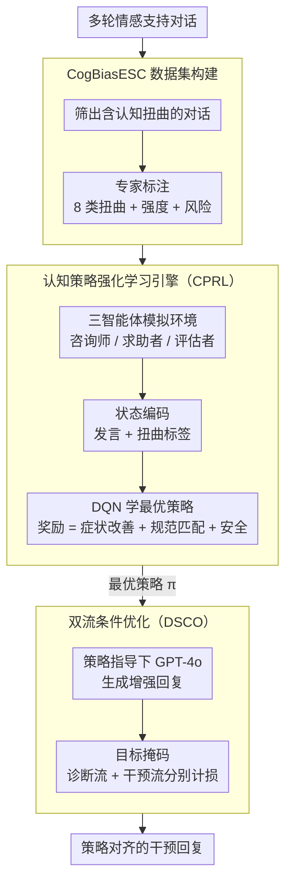

# Cognitive Policy-Driven LLM for Diagnosis and Intervention of Cognitive Distortions in Emotional Support Conversation

**会议**: ACL 2026  
**arXiv**: [2604.17178](https://arxiv.org/abs/2604.17178)  
**代码**: [https://github.com/Chips98/CoPoLLM-for-ACL-2026](https://github.com/Chips98/CoPoLLM-for-ACL-2026)  
**领域**: 医学图像  
**关键词**: 情感支持对话, 认知扭曲, 认知行为疗法, 强化学习策略, 安全干预

## 一句话总结

提出CoPoLLM框架，通过构建首个带认知扭曲标注的情感支持对话数据集CogBiasESC，结合认知策略强化学习（CPRL）引擎和双流条件优化（DSCO），使LLM能诊断8类认知扭曲并生成策略感知的干预回复，在15个SOTA基线上全面领先。

## 研究背景与动机

**领域现状**：LLM在情感支持对话（ESC）任务中表现出良好的共情能力，如SoulChat、ChatCounselor等方法通过SFT或DPO在流畅性和共情方面取得进展。然而专业心理咨询不仅是情感安慰，更需要基于认知行为疗法（CBT）的认知干预。

**现有痛点**：现有ESC方法忽视了求助者表达中隐含的认知扭曲（如灾难化思维、全或无思维）。现有数据集（D4、CPsyCounD等）中咨询师的原始回复往往未充分考虑认知扭曲，导致基于这些数据训练的模型只能提供表面安慰而非认知层面的深层帮助。

**核心矛盾**：一方面，在数据层面缺乏带认知扭曲标注的ESC数据集；另一方面，在算法层面，有效的CBT需要根据扭曲类型、强度和风险等级精确选择干预策略，而现有方法的策略选择机制过于粗糙。

**本文目标**：构建带认知扭曲标注的数据集，设计能够诊断认知扭曲并选择最优干预策略的LLM框架。

**切入角度**：将心理咨询建模为强化学习的多智能体交互环境，让咨询师智能体通过DQN学习最优干预策略。

**核心 idea**：用RL学习CBT策略选择策略，再通过双流优化将策略知识蒸馏到LLM中，同时保证诊断准确和干预有效。

## 方法详解

### 整体框架

CoPoLLM 要解决的是「先看懂求助者话里的认知扭曲、再选对 CBT 干预策略」这条链路。输入是一段多轮情感支持对话，模型先在带认知扭曲标注的数据上学会诊断扭曲类型，再借助一个强化学习引擎学到「从诊断状态到干预策略」的最优映射，最后把这份策略知识蒸馏进 LLM，输出既诊断准确、又策略对齐的干预回复。整条流水线由两块拼成：CPRL 引擎在三智能体模拟环境里用 DQN 离线学策略，DSCO 算法再把策略知识灌进生成模型并解耦诊断与干预两条训练流。

### 关键设计

**1. CogBiasESC 数据集：给 ESC 补上认知扭曲这一层标注**

现有 ESC 数据集（D4、CPsyCounD 等）里咨询师的回复多停留在情感安慰，几乎没有标注求助者话语中隐含的认知扭曲，模型自然学不会认知层面的干预。作者依据 CBT 理论定义了 8 类认知扭曲（情绪推理、灾难化、全或无等），从 3 个公开 ESC 数据集中筛出含扭曲的对话，由 3 名专家独立标注扭曲类型、强度（轻/中/重）和风险等级（低/中/高）。最终得到 2,499 段多轮对话、82,293 条发言、15,092 个扭曲标签，平均每段对话 3.2 个标签，专家间一致性 Fleiss' Kappa 在 0.73–0.85，足以支撑后续的诊断训练和策略评估。

**2. 认知策略强化学习引擎（CPRL）：把选策略建模成带安全约束的序贯决策**

CBT 本身就是「看症状—选策略—看反应—再调整」的序贯过程，因此作者把它放进一个三智能体模拟环境：咨询师智能体 $\mathcal{A}_{coun}$ 负责在 $K$ 种 CBT 策略里选动作，求助者智能体 $\mathcal{A}_{seek}$ 产生带扭曲的表达，评估智能体 $\mathcal{A}_{eval}$ 计算奖励。状态被编码为「发言 + 扭曲标签」的连续向量，用 DQN 近似价值函数学习策略。奖励是混合的 $R_t = \omega_1 R_{imp} + \omega_2 R_{match} + \omega_3 R_{safe}$，其中症状改善项 $R_{imp}$ 由 LLM 评估，而 CBT 规范匹配项 $R_{match}$ 和安全项 $R_{safe}$ 是规则基的硬约束。选 DQN 而非 PPO/DPO 正是看中这点：基于价值的方法可以直接对「高风险状态下选了不安全策略」施加显式惩罚，安全约束落地更干脆。

**3. 双流条件优化（DSCO）：把策略知识灌进 LLM，同时不让生成压过诊断**

光有策略还不够，得让生成模型用上它。作者先用训练好的策略 $\pi_{\theta^*}$ 为每条对话推断最优干预策略，由 GPT-4o 在策略指导下生成增强回复、经人工审核构成 CogBiasESC-PRO；再用目标掩码机制把诊断流和干预流拆开训练：$\mathcal{L}_{total} = \mathcal{L}_\tau(\phi; X, \mathcal{C}_t) + \mathcal{L}_\tau(\phi; X, y^*)$，前一项对认知标签 $\mathcal{C}_t$ 计损、后一项对干预回复 $y^*$ 计损。这样解耦是因为干预回复 token 远多于诊断标签，若混在一起优化，生成目标会盖过诊断学习，导致模型只会安慰、不会判断。

### 损失函数 / 训练策略

CPRL 用 TD 误差 $\mathcal{L}_{DQN}(\theta) = \mathbb{E}[(y_t - Q(s_t, a_t; \theta))^2]$ 学价值函数，并采用 Double DQN 解耦动作选择与评估以缓解过估计；DSCO 端则用条件掩码交叉熵，对诊断流和干预流分别计算，避免两条流互相干扰。

## 实验关键数据

### 主实验

CoPoLLM vs 15个SOTA基线（包括SoulChat、ChatCounselor、PsycoLLM等）：

| 指标 | CoPoLLM | 最佳基线 | 提升 |
|------|---------|---------|------|
| 认知扭曲诊断F1 | 最优 | - | 显著 |
| 高风险漏检率(HRMDR) ↓ | 最低 | - | 安全性大幅提升 |
| 干预策略有效性 | 最优 | - | GPT和人类评估一致 |
| 临床规范性 | 最优 | - | 专业咨询师确认 |

### 消融实验

| 配置 | 关键发现 |
|------|---------|
| w/o CPRL | 策略选择退化为随机/模仿，干预效果显著下降 |
| w/o DSCO | LLM无法有效利用策略知识 |
| w/o 安全奖励 $R_{safe}$ | 高风险漏检率显著升高 |
| w/o 诊断流 | 干预回复缺乏针对性 |

### 关键发现

- 传统ESC方法在认知扭曲诊断上表现极差，验证了现有数据和模型的根本性缺陷
- 安全奖励 $R_{safe}$ 的硬惩罚设计对降低高风险漏检至关重要——确保模型在检测到自伤/自杀倾向时立即激活安全机制
- CogBiasESC中情绪推理（36.9%）占主导，存在严重的长尾分布，对模型训练提出挑战
- 双流解耦训练比联合训练更有效——诊断和干预有不同的优化景观

## 亮点与洞察

- 将心理咨询建模为RL决策问题非常巧妙：CBT本身就是一个序贯决策过程——根据当前症状选择策略、观察反应、调整策略——这与RL框架天然契合。
- 三智能体模拟环境（咨询师-求助者-评估者）构成了一个自洽的训练闭环，无需大量真实咨询数据即可探索策略空间。
- 安全机制的设计值得借鉴：通过规则基的硬惩罚（而非软正则化）确保高风险场景的安全，这在其他安全关键应用中也适用。

## 局限与展望

- CogBiasESC主要基于中文心理咨询数据集，跨语言和跨文化的泛化性有待验证
- 8类认知扭曲虽覆盖CBT核心，但真实咨询中扭曲类型更多且更模糊
- 多智能体模拟环境的保真度依赖LLM的角色扮演能力，可能引入系统性偏差
- DQN的离散动作空间限制了策略的灵活性，连续策略空间可能更适合复杂场景

## 相关工作与启发

- **vs SoulChat/ChatCounselor**: 专注于共情和流畅性，缺乏认知干预能力；CoPoLLM在诊断和干预两个维度全面超越
- **vs PsycoLLM**: 引入伦理检查机制但策略选择粗糙；CoPoLLM通过RL学习更精细的策略映射
- **vs CSO (Zhao et al., 2025)**: 使用MCTS进行策略搜索但缺乏认知框架；CoPoLLM将CBT理论深度融入RL设计

## 评分
- 新颖性: ⭐⭐⭐⭐⭐ 首个认知扭曲标注ESC数据集+RL策略学习框架
- 实验充分度: ⭐⭐⭐⭐⭐ 15个基线对比+多维度评估+人类评估
- 写作质量: ⭐⭐⭐⭐ 框架设计清晰，CBT动机充分
- 价值: ⭐⭐⭐⭐⭐ 推动ESC从表面安慰走向专业认知干预

<!-- RELATED:START -->

## 相关论文

- [\[ACL 2026\] MA$^2$P: A Meta-Cognitive Autonomous Intelligent Agents Framework for Complex Persuasion](ma2p_a_meta-cognitive_autonomous_intelligent_agents_framework_for_complex_persua.md)
- [\[ACL 2026\] Stress-Testing Emotional Support Models: Moving from Homogeneous to Diverse Help Seekers](stress-testing_emotional_support_models_moving_from_homogeneous_to_diverse_help_.md)
- [\[AAAI 2026\] Chatsparent: An Interactive System for Detecting and Mitigating Cognitive Fatigue in LLMs](../../AAAI2026/dialogue/chatsparent_an_interactive_system_for_detecting_and_mitigating_cognitive_fatigue.md)
- [\[ACL 2025\] Dialogue Systems for Emotional Support via Value Reinforcement](../../ACL2025/dialogue/dialogue_systems_for_emotional_support_via_value_reinforcement.md)
- [\[ACL 2026\] Dual Hierarchical Dialogue Policy Learning for Legal Inquisitive Conversational Agents](dual_hierarchical_dialogue_policy_learning_for_legal_inquisitive_conversational_.md)

<!-- RELATED:END -->
