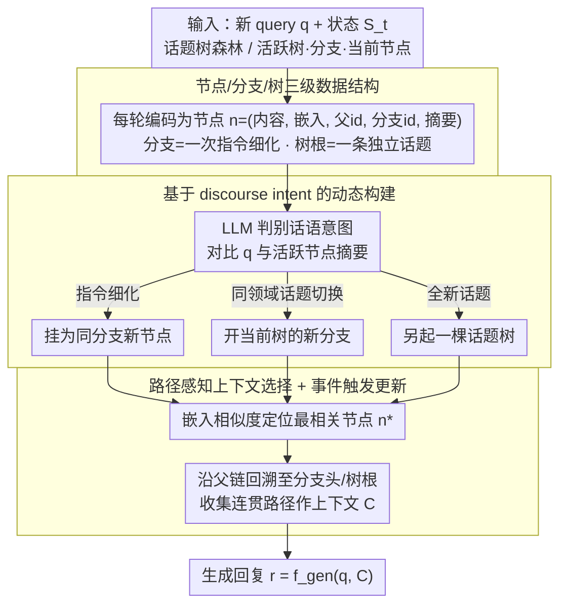

# Context-Agent: Dynamic Discourse Trees for Non-Linear Dialogue

**会议**: ACL 2026  
**arXiv**: [2604.05552](https://arxiv.org/abs/2604.05552)  
**代码**: 见 GitHub（论文摘要承诺开源数据集与代码）  
**领域**: 对话系统 / Agent / 上下文管理  
**关键词**: 多轮对话、动态树、话题切换、上下文压缩、长程对话

## 一句话总结
作者提出 Context-Agent，把多轮对话历史建模为"话题树森林"（每棵树代表一个独立话题、每条分支代表一次指令细化/分叉），按导航意图而非语义相似度组织节点，并配套提出 NTM 基准评测非线性长程对话，在多种 LLM 上同时提升任务完成率并降低 token 消耗。

## 研究背景与动机

**领域现状**：现代 LLM Agent 已能跑很长上下文，但对话历史依然被当作一条扁平的 token 序列喂进模型——这是把所有事件按时间顺序堆叠，没有显式区分"哪几句属于同一个子话题"。

**现有痛点**：(1) 真实对话经常跳话题、回到之前的话题、refine 早些时候说的某个指令，扁平历史无法表达这种"分叉 + 回溯"结构；(2) 上下文窗口扩展（YaRN / LongLoRA）和压缩（summarization-based）走向两极——前者算力贵且容易掉到 "lost-in-the-middle"，后者把对话细节压扁后失去复杂推理所需的局部线索；(3) RAG / MemTree / RAPTOR 这类结构化记忆按语义相似度聚类——但语义相近不代表 discourse 上属于同一线索（"我去日本玩"和"我去日本出差"会被合并）。

**核心矛盾**：当对话历史既要支持长程跨度又要保留局部连贯时，**按文本相似度组织**的结构性记忆和**按话语意图组织**的认知结构之间有本质不匹配。

**本文目标**：(1) 用一种既支持回溯又能保留局部连贯的结构性记忆来表示非线性对话；(2) 在该结构上实现"event-triggered"低成本上下文选取；(3) 提供专门评测长程非线性对话的基准。

**切入角度**：借鉴 Grosz & Sidner 1986 的 Attentional State 理论——人类认知焦点是 stack 式的话题切换 + 子话题展开，而不是图式的随意连接；树天然匹配这种 "focus stack"。

**核心 idea**：把对话历史建模为"话题树森林" $F_t$，每棵树是一个独立话题、每条分支是一次指令细化，按 discourse intent（话题切换 / 指令 refinement）触发节点/分支创建，检索时返回一条连贯路径而非孤立片段。

## 方法详解

### 整体框架

Context-Agent 想把多轮对话历史从「一条扁平 token 序列」改造成「一片话题树森林」，让回溯和分叉这种非线性结构能被显式表达。框架在每轮 $t+1$ 维护状态 $S_t = (H_t, T_{\text{act}}, B_{\text{act}}, n_{\text{cur}})$，即历史森林、当前活跃话题树、活跃分支与当前节点。新 query $q_{t+1}$ 到来时分三步走：先做 discourse 分类判断它属于当前分支、当前树的新分支还是全新话题，决定挂载位置；再用上下文选择函数 $C_{t+1} = f_{\text{select}}(q_{t+1}, S_t)$ 从森林里抽出一条「连贯路径」作上下文；最后 $r_{t+1} = f_{\text{gen}}(q_{t+1}, C_{t+1})$ 生成回复。整套优化目标是在最大化任务完成率的同时压低 $C_{t+1}$ 的 token 数。

### 关键设计

**1. 节点/分支/树三级数据结构：用嵌套结构承载话语层次**

单一扁平 list 的根本缺陷是表达不了「refine 之前那条指令」这种关系，于是作者把每轮对话编码成元组 $n = (c, v, p, \beta, s_i)$：$c$ 是本轮内容，$v \in \mathbb{R}^d$ 是嵌入，$p$ 是父节点 id（root 为 null），$\beta$ 是分支 id，$s_i = S_{node}(c_i)$ 是 LLM 生成的摘要。分支 id 让你显式标出「这是同一指令的第 3 次细化」，树根则代表一条独立话题主线，从结构上保证不同话题不会被错误地共享上下文。节点摘要用于后续的话题归属和分支管理，省去每次都重读整轮原文的开销。

**2. 基于 discourse intent 的动态构建：按导航意图而非语义相似度组织节点**

这是全文最核心的差异点。决定新一轮该挂哪里时，作者不看 embedding 相似度，而是用 LLM 把 $q_{t+1}$ 和当前活跃节点摘要做 discourse 判别：instruction refinement 挂为同分支新节点，同领域内 topic switch 开当前树的新分支，全新话题则另起一棵树。这与 MemTree 这类「按相似度聚类」形成鲜明对比——同样在聊「日本」，旅游分支和出差分支语义高度相似却不该合并，因为说话人的 navigational intent 完全不同。论文在 Table 1 里把它定位为「Discourse Intent 构造 + Path-Aware 检索」，正是和 RAPTOR（离线重建静态树）、MemTree（在线语义聚类）、DH-RAG（语义链）拉开距离的地方，能强制隔离 diverging path、避免上下文污染。

**3. 路径感知上下文选择 + 事件触发更新：返回连贯路径而非孤立片段**

检索时，系统先用嵌入相似度找到最相关节点 $n^*$，再沿父链一路回溯，把到分支头或树根的整条路径收集成本次上下文 $C_{t+1}$；一旦回退到不同的话题树就停下，确保不混入无关线索。这样拿到的不是 5 个最相关的孤立 chunk，而是「这条指令从提出到细化的完整演化过程」，对长程 refinement 类任务的局部连贯性帮助极大。更新只在节点/分支/树被创建时触发，维护成本接近 $O(\log N)$，远低于 summarization 类压缩方法每次 $O(N^2)$ 的重算。

### 损失函数 / 训练策略

本工作是 inference-time 框架，不训练 LLM，任何 LLM 都能即插即用；收益来自结构性的上下文管理而非模型偏好。配套的 NTM 基准用合成与真实对话混合构造，刻意塞入多次话题切换与指令细化，专门压测长程非线性对话。

## 实验关键数据

### 主实验

> 因本笔记的本地缓存只截取到论文前半部分（方法 3.2 节止），完整定量数值见原文 §4。可基于摘要的方法对比表 (paper Table 1) 给出结构性对比：

| 方法 | 结构 | 构造依据 | 检索单元 | 局部连贯 | 更新效率 |
|------|------|----------|----------|----------|----------|
| Full Context | 线性序列 | token 拼接 | 整段历史 | 高 | 极低 $O(N^2)$ |
| MemGPT | OS-like 层级 | event/function 触发 | 分页内存 | 高（self-edit） | 中 |
| 标准 RAG | 扁平索引 | 语义相似度 | 独立 chunk | 低（碎片） | 高 |
| DH-RAG | 链 | 语义聚类 | query chain | 高（动态） | 中（增量） |
| RAPTOR | 静态树 | 自底向上聚类 | 抽象 summary | 高 | 低（离线重建） |
| MemTree | 动态树 | 在线聚类 | collapsed 节点 | 中（碎片） | 高 $O(\log N)$ |
| **Context-Agent** | **动态树** | **discourse intent** | **coherent path** | **极高（path-aware）** | **高（event-triggered）** |

### 消融实验（基于论文摘要陈述）

| 配置 | 任务完成率 | Token 消耗 | 说明 |
|------|-----------|-----------|------|
| 线性 baseline（扁平历史） | 较低 | 高 | 长程 + 话题切换易失忆 |
| 仅语义聚类树（无 discourse intent） | 中 | 中 | local coherence 受损 |
| **完整 Context-Agent** | **最高** | **最低** | discourse-aware + path 检索同时受益 |
| 跨多个 LLM 后端 | 同向收益 | 同向降低 | 即插即用稳定 |

> 详细 NTM 基准每个 backbone 的数字、子任务分解和与 MemTree / RAPTOR 的 head-to-head 对比建议直接查阅论文 Table/Figure 的实验章节。

### 关键发现
- 在 NTM 多个非线性长程场景下，Context-Agent 同时提高任务完成率并降低 token——这两个目标传统上有 trade-off，但树式检索通过"只拿同一分支路径"打破了它。
- 对话越长、话题切换越频繁、指令 refinement 越多，相对 baseline 的优势越大；线性方法在这种 setting 下退化严重。
- 跨多个 LLM backbone 收益稳定，意味着收益主要来自结构性上下文管理而非某模型偏好。

## 亮点与洞察
- "Discourse intent" vs "semantic similarity"的分离是关键洞察——MemTree 这类工作把语义当成首要组织依据是误判；真正决定 context 该不该共享的是说话人的 navigational intent。
- "Path 检索"代替"chunk 检索"是简单但强有力的设计：返回一条连贯路径让模型直接看到 refinement 历史，比 5 个相关 chunk 更有用。
- 把 Grosz & Sidner 的 Attentional State 理论直接映射到工程实现（forest of trees + focus stack）—— old idea, new application 的典范。
- 事件触发更新而非每轮重算让框架在长对话里仍然便宜，可作为通用对话 agent 的底层 memory 抽象层复用。

## 局限与展望
- 树结构假设 discourse 是严格嵌套的，但真实对话经常出现跨树引用（"还记得我们聊日本时提到的 X 吗，回到工作话题…"），单纯的森林无法表达 cross-tree reference。
- discourse intent 分类高度依赖 LLM 自身判断，当 LLM 误判话题切换时会创建错误的新树/分支并影响后续所有检索。
- NTM 基准本身的 ecological validity 需更多验证——合成对话和真实用户的非线性可能不同。
- 节点摘要 $s_i = S_{node}(c_i)$ 是有损压缩，复杂指令 refinement 中的细节可能被丢失，需要更精细的摘要策略或保留原文链接。

## 相关工作与启发
- **vs MemTree（动态树 + 在线聚类）**：他们用语义相似度聚类导致 local coherence 中等；本文用 discourse intent 强制 path-aware，coherence 极高。
- **vs RAPTOR（静态树 + 离线重建）**：每次重建代价大；本文 event-triggered 更新 + 动态分支，适合在线对话。
- **vs MemGPT（OS-like 层级 + 分页）**：MemGPT 把记忆当作分页内存，self-edit 维护；本文把记忆当作 discourse tree，结构更贴合对话结构。
- **vs DH-RAG（query chain）**：DH-RAG 是链不是树，无法表达多分支并存；本文森林支持平行话题。

## 评分
- 新颖性: ⭐⭐⭐⭐ "discourse intent + path-aware 检索"在记忆结构上是清晰的差异化贡献
- 实验充分度: ⭐⭐⭐ 提出 NTM 基准 + 跨多 LLM 验证，但本地缓存只能确认结构性对比、详细数值需查原文
- 写作质量: ⭐⭐⭐⭐ 与认知科学（Grosz & Sidner）的连接很自然，paradigm 对比表清晰
- 价值: ⭐⭐⭐⭐ 对长程对话 agent / 多步指令 refinement / 客服与编程助手类应用直接可用

<!-- RELATED:START -->

## 相关论文

- [\[ACL 2026\] Discourse Coherence and Response-Guided Context Rewriting for Multi-Party Dialogue Generation](discourse_coherence_and_response-guided_context_rewriting_for_multi-party_dialog.md)
- [\[ACL 2026\] Metro: Towards Strategy Induction from Expert Dialogue Transcripts for Non-collaborative Dialogues](metro_towards_strategy_induction_from_expert_dialogue_transcripts_for_non-collab.md)
- [\[ACL 2026\] SPASM: Stable Persona-driven Agent Simulation for Multi-turn Dialogue Generation](spasm_stable_persona-driven_agent_simulation_for_multi-turn_dialogue_generation.md)
- [\[ACL 2026\] ETHICMIND: A Risk-Aware Framework for Ethical-Emotional Alignment in Multi-Turn Dialogue](ethicmind_a_risk-aware_framework_for_ethical-emotional_alignment_in_multi-turn_d.md)
- [\[ACL 2026\] GenesisFunc: Multi-Agent Data Generation for Accurate and Generalizable Function-Calling](genesisfunc_multi-agent_data_generation_for_accurate_and_generalizable_function-.md)

<!-- RELATED:END -->
