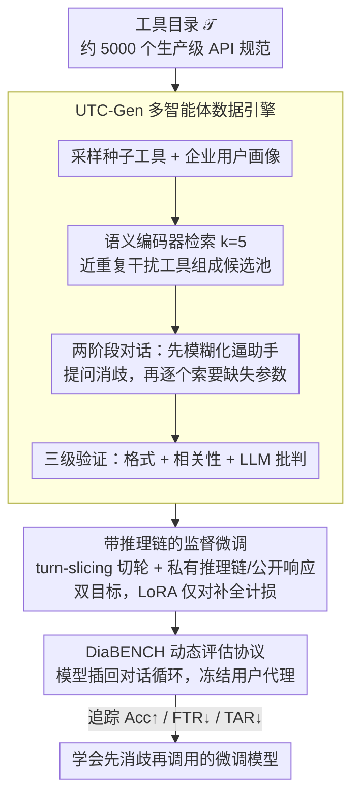

# Disambiguation-Centric Finetuning Makes Enterprise Tool-Calling LLMs More Realistic and Less Risky

**会议**: ACL 2026 Findings  
**arXiv**: [2507.03336](https://arxiv.org/abs/2507.03336)  
**代码**: [HuggingFace](https://huggingface.co/SAP/diaforge-utc-r-0725)  
**领域**: 对话系统 / LLM Agent  
**关键词**: 工具调用, 消歧, 多轮对话, 企业API, 微调

## 一句话总结

提出 DiaFORGE 框架，通过消歧中心的合成数据生成管线 + 推理链微调 + 动态评估体系，让开源 LLM 在面对近重复企业 API 时的工具调用成功率比 GPT-4o 高 27 个百分点、比 Claude-3.5-Sonnet 高 49 个百分点。

## 研究背景与动机

**领域现状**：LLM 正从对话助手演变为能调用 API 的操作型智能体。企业环境中管理着成千上万的 API，其中很多是核心功能的细微变体（如面向客户支持、财务、供应链的不同版本）。

**现有痛点**：现实中约 35-38% 的查询会检索到高度相似的干扰 API，71% 的 API 有必填参数，76-81% 的调用缺少至少一个必填字段。然而现有工具调用基准（BFCL、ToolBench、API-Bank）使用预编写的用户脚本做静态评估，无法暴露这类"请求不完整 + 工具近重复"的级联失败模式。

**核心矛盾**：企业工具调用需要两种紧密交织的能力——多轮对话补全缺失参数 + 在密集重叠的 API 表面上做细粒度消歧——但现有训练数据和评估方法都忽略了这一点。

**本文目标**：(1) 构建消歧中心的训练数据，(2) 微调开源模型使其学会主动提问和精准选择工具，(3) 设计动态评估框架衡量端到端目标完成率。

**切入角度**：作者来自 SAP Labs，拥有真实的企业 API 生产环境遥测数据，从中提炼出消歧是工具调用的核心瓶颈这一洞察。

**核心 idea**：用"自底向上"的多智能体数据引擎合成消歧中心的对话——给助手提供近重复工具集 + 故意隐藏关键信息，迫使助手学会先消歧再调用。

## 方法详解

### 整体框架

DiaFORGE 针对的是企业工具调用里「请求不完整 + 工具近重复」的级联失败：输入是约 5000 个生产级 API 规范组成的工具目录 $\mathcal{T}$，输出是一个学会先消歧再调用的微调模型。整条管线分三段串起来——UTC-Gen 数据引擎自底向上合成消歧中心的对话，带推理链的监督微调把这种能力灌进开源模型，最后用静态 + 动态双轨评估在真实对话循环里检验端到端的目标完成率。

### 关键设计

**1. UTC-Gen 多智能体数据引擎：把消歧从「附带需求」变成「合成时的硬约束」**

现有数据集普遍假设用户请求已经完全指定，模型根本没机会学习面对歧义该怎么办。UTC-Gen 反其道而行：对每个种子工具 $\tau^*$ 先采样一个企业用户画像 $p$，再用语义编码器 $\phi$ 检索 $k=5$ 个最近邻干扰工具组成候选池 $\mathcal{C}_k(\tau^*)$，结构性地制造近重复混淆。对话被强制拆成两阶段展开——工具选择阶段里用户故意把话说模糊，逼助手通过提问逐一排除干扰工具；参数补全阶段再让助手逐个索要缺失的必填字段。所有合成对话还要过格式、相关性、LLM 批判三级验证才入库，保证训练信号干净。

**2. 带推理链的监督微调：让模型不只调对，还知道为什么**

工具选择若靠模式匹配，遇到近重复工具就容易翻车，所以作者要求模型在调用前先产出可解释的推理过程。训练采用 turn-slicing 策略，对每个助手轮次构建输入-目标对 $x_{i,t} = [\text{SYS}]\;u_1\;a_1\;\ldots\;u_t$、$y_{i,t} = a_t$；助手的每个回复被拆成私有推理链（思考过程）和公开响应，两者都作为学习目标。微调用 LoRA、仅对补全部分计损，让模型学会显式说明「为什么排除这几个干扰工具」，而非黑箱地蒙一个。

**3. DiaBENCH 动态评估协议：在活的对话循环里量端到端成功率**

静态评估用预写脚本，捕捉不到「助手这一句怎样影响用户下一句」的级联效应。DiaBENCH 把微调后模型作为助手重新插回 UTC-Gen 循环，冻结用户代理策略，进行至多 $T_{max}$ 轮交互生成完整轨迹，并追踪三个指标：准确率 Acc（工具与参数都对）、误报率 FTR（调错工具）、弃权率 TAR（该调却没调）。用户代理用多采样 + 投票来压低评估噪声，使结果更贴近真实部署场景。

### 损失函数 / 训练策略

训练就是标准 SFT + LoRA，用 AdamW、只跑一个 epoch；数据是 5000 条 DiaFORGE 对话切出的 13,649 个 turn-sliced 补全样本，损失仅在补全 token 上计算（loss masking），避免把用户输入也算进目标。

## 实验关键数据

### 主实验

DiaBENCH 动态评估结果（工具调用准确率 Acc↑ / 误报率 FTR↓ / 弃权率 TAR↓）：

| 模型 | Acc↑ | FTR↓ | TAR↓ |
|------|------|------|------|
| GPT-4o | 0.62 | 0.02 | 0.36 |
| GPT-4o-fc | 0.56 | 0.59 | 0.05 |
| Claude-3.5-Sonnet | 0.39 | 0.03 | 0.55 |
| Gemma-3-DiaFORGE-27B | **0.89** | 0.03 | 0.03 |
| Nemotron-DiaFORGE-49B | **0.89** | 0.06 | 0.03 |
| Gemma-3-DiaFORGE-4B | 0.81 | 0.09 | 0.05 |
| Llama-3.2-DiaFORGE-3B | 0.80 | 0.08 | 0.06 |

### 消融实验

基于 Gemma-3-27B 的消融（动态评估 Acc）：

| 设置 | Acc↑ | FTR↓ | TAR↓ |
|------|------|------|------|
| 完整 DiaFORGE | 0.89 | 0.03 | 0.03 |
| 去掉验证级联 | 0.56 | 0.06 | 0.35 |
| 去掉近重复干扰采样 | 0.63 | 0.18 | 0.19 |
| 去掉推理链 | 0.77 | 0.16 | 0.04 |

### 关键发现

- 仅用 5000 条合成对话微调，3B 小模型就能在动态评估中超越 GPT-4o（0.80 vs 0.62）
- 原生函数调用模式（fc 后缀）反而增加误报率：GPT-4o-fc 的 FTR 高达 0.59
- 在日均 10K 工具调用场景下，GPT-4o 每天约 3500-3800 次弃权或 5500-6000 次误调，DiaFORGE 模型仅 250-350 次总失败
- 近重复干扰采样是最关键组件，移除后 FTR 从 0.03 跳升至 0.18

## 亮点与洞察

- 来自 SAP 生产环境的数据驱动洞察具有极强说服力：35-38% 查询遇到近重复工具、76-81% 调用缺参数
- 将消歧从"附带需求"升级为"核心训练目标"的思路转变很有启发性
- 动态评估框架弥补了现有工具调用基准的重大空白

## 局限与展望

- DiaBENCH 仅包含 119 个种子工具，规模有限
- 用户代理仍由 LLM 模拟，与真实用户行为可能有差距
- 未探索检索增强的工具选择，当工具数量进一步增长时检索质量将成为新瓶颈

## 相关工作与启发

- ReAct 和 HuggingGPT 建立了 LLM 作为工具调用代理的基本范式，DiaFORGE 在此基础上补充了消歧能力
- APIGen 和 ToolACE 关注数据验证但假设请求完全指定，DiaFORGE 的消歧中心策略是重要互补
- 启发：企业级 AI Agent 的核心挑战不是"能否调用工具"，而是"面对歧义时能否安全地不调用或先澄清"

## 评分

- 新颖性: ⭐⭐⭐⭐ 消歧中心的问题定义和系统性解决方案在工具调用领域独树一帜
- 实验充分度: ⭐⭐⭐⭐⭐ 6 个开源模型 + 2 个闭源模型，静态+动态双轨评估，消融完整
- 写作质量: ⭐⭐⭐⭐ 问题动机清晰，产业视角有说服力，数学符号偏多但逻辑连贯

<!-- RELATED:START -->

## 相关论文

- [\[NeurIPS 2025\] Less is More: Local Intrinsic Dimensions of Contextual Language Models](../../NeurIPS2025/dialogue/less_is_more_local_intrinsic_dimensions_of_contextual_language_models.md)
- [\[ACL 2026\] Reasoning Gets Harder for LLMs Inside A Dialogue](reasoning_gets_harder_for_llms_inside_a_dialogue.md)
- [\[ACL 2026\] GenesisFunc: Multi-Agent Data Generation for Accurate and Generalizable Function-Calling](genesisfunc_multi-agent_data_generation_for_accurate_and_generalizable_function-.md)
- [\[ICLR 2026\] Non-Collaborative User Simulators for Tool Agents](../../ICLR2026/dialogue/non-collaborative_user_simulators_for_tool_agents.md)
- [\[ACL 2026\] Preference Learning Unlocks LLMs' Psycho-Counseling Skills](preference_learning_unlocks_llms_psycho-counseling_skills.md)

<!-- RELATED:END -->
