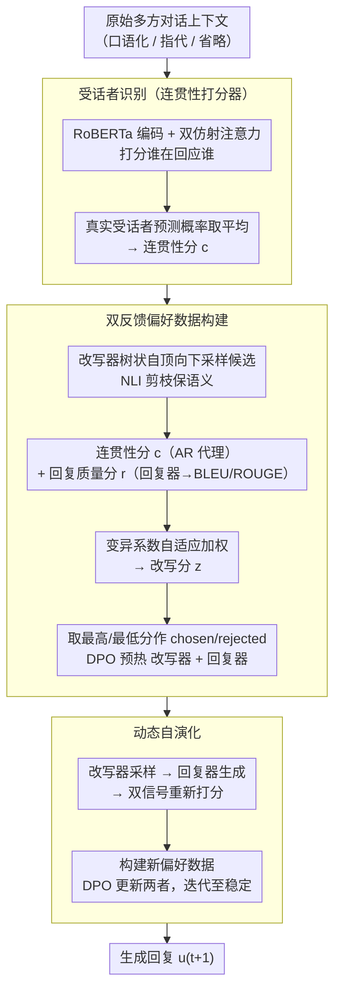

# Discourse Coherence and Response-Guided Context Rewriting for Multi-Party Dialogue Generation

**会议**: ACL 2026  
**arXiv**: [2604.06784](https://arxiv.org/abs/2604.06784)  
**代码**: 无  
**领域**: 对话系统 / 多方对话  
**关键词**: 多方对话, 上下文改写, 话语连贯性, 偏好学习, 动态自演化

## 一句话总结

本文提出 DRCR，首个将上下文改写引入多方对话生成的框架，使用话语连贯性和回复质量双反馈信号构建偏好数据，通过动态自演化学习让改写器和回复器在迭代训练中相互增强。

## 研究背景与动机

**领域现状**：多方对话生成（MDG）涉及多个角色和复杂的话语结构（跨越多个话语的发言关系），比双方对话困难得多。已有方法通过编码对话结构信息来辅助生成。

**现有痛点**：(1) 对话中的口语化表达和不完整话语（如指代、省略）损害了话语连贯性，进而影响对话结构的表示质量；(2) 先前方法直接用有缺陷的对话上下文编码结构，未尝试先改善上下文质量；(3) 在多方对话中这些问题更加突出——多个说话者增加了指代和省略的复杂度。

**核心矛盾**：对话结构编码的质量取决于上下文的连贯性，但原始上下文中的口语表达和省略破坏了连贯性。简单改写可能无法兼顾话语连贯性和下游回复生成的质量。

**本文目标**：通过对话上下文改写提升多方对话生成质量，同时保证改写既提高话语连贯性又有利于生成高质量回复。

**切入角度**：用话语连贯性质量和回复生成质量作为双反馈信号构建偏好数据，训练改写器生成既连贯又有利于回复的上下文。

**核心 idea**：改写器和回复器通过迭代训练相互增强——更好的改写产生更好的回复，更好的回复反馈引导更好的改写。

## 方法详解

### 整体框架

DRCR 把"先把口语化、带省略和指代的多方对话上下文改写干净，再去编码结构生成回复"这件事拆成改写器（Rewriter）和回复器（Responder）两个模块协同的闭环。整套流程分三个阶段推进：① 先训练一个受话者识别（Addressee Recognition）分类器，用它给上下文的话语连贯性打分；② 用话语连贯性与回复质量两路信号给改写器采样出的候选排序、构建偏好数据，并用 DPO 预热改写器和回复器；③ 让两个模块在动态自演化中靠彼此反馈轮流迭代，直到改写既"读得顺"又"对下游生成有用"。

### 关键设计

**1. 受话者识别：把"话语连贯性"变成可打分的代理信号**

多方对话里指代和省略密集，原始上下文一旦带着这些缺陷被直接编码，话语结构表示就会失真——可"连贯不连贯"本身难以量化。DRCR 借用一个观察：如果一段对话足够连贯，模型就能轻松判断每句话在回应谁。于是它先用 RoBERTa 编码上下文、再用双仿射注意力（biaffine attention）给每对发言打"谁是受话者"的分，训练出一个受话者识别（Addressee Recognition）分类器；之后把分类器赋予真实受话者的预测概率取平均，当作这段上下文的连贯性分数 $c$。这样"读得顺不顺"被转译成一个可比较的数值，成为后面给改写候选排序的连贯性反馈来源。

**2. 双反馈偏好数据构建：连贯性与回复质量，按变异系数自适应加权**

光有连贯性还不够——把上下文改通顺却丢了对生成关键的信息，等于白改。所以 DRCR 给每个改写候选打两路分：连贯性分 $c$（来自设计 1 的 AR 分类器）衡量上游可读性，回复质量分 $r$（让回复器在该候选上生成回复、与标准答案算 BLEU-1 + ROUGE-L）衡量下游可用性。候选本身由改写器"树状自顶向下采样"逐句生成，并用自然语言推理（NLI）剪掉偏离原意的分支。难点在于两路分该谁重——DRCR 用变异系数（Coefficient of Variation，标准差/均值）算自适应权重：哪一路在这批候选里波动大、区分度高，就给它更大权重，再 softmax 归一化融成改写分 $z$。最后取最高/最低分的候选作 chosen/rejected 偏好对，用 DPO 分别预热改写器与回复器。

**3. 动态自演化：改写器与回复器互训迭代，摆脱对外部数据的依赖**

预热阶段的偏好数据来自外部 teacher LLM，是静态的；可训练过程中两个模块的偏好会漂移，静态数据跟不上。DRCR 让两者轮流自演化——每一轮用当前改写器采样新候选、当前回复器生成回复，再按设计 1/2 的双信号重新打分，据此构建本轮新偏好数据去 DPO 更新两个模块；其间若某个改写候选的得分超过原始上下文，就直接用它替换原上下文以降噪。如此"更好的改写→更好的回复→更好的反馈→更好的改写"接成自增强循环，直到改写与回复质量都稳定。

### 损失函数 / 训练策略

改写器和回复器都采用 DPO 风格的偏好学习，偏好对由话语连贯性与回复质量双信号联合构建；迭代训练持续到改写和回复质量稳定为止。

## 实验关键数据

### 主实验

**四个多方对话数据集上的 BLEU/ROUGE 分数**

| 方法 | 数据集1 | 数据集2 | 数据集3 | 数据集4 |
|------|--------|--------|--------|--------|
| SS-MPC（先前SOTA） | 基线 | 基线 | 基线 | 基线 |
| LLM 直接生成 | 中等 | 中等 | 中等 | 中等 |
| **DRCR** | **超越** | **超越** | **超越** | **超越** |

### 消融实验

| 配置 | 效果 | 说明 |
|------|------|------|
| 仅话语连贯性反馈 | 提升但有限 | 缺少下游信号 |
| 仅回复质量反馈 | 提升 | 直接优化目标 |
| 双反馈 | 最优 | 两个信号互补 |
| 无自演化（单次训练） | 次优 | 缺少协同优化 |
| 有自演化 | 最优 | 迭代提升 |

### 关键发现

- DRCR 在全部四个多方对话数据集上超越先前 SOTA
- 双反馈信号优于单一信号——话语连贯性和回复质量提供互补视角
- 动态自演化的迭代训练显著优于单次训练——改写器和回复器的协同效应
- 上下文改写有效消除了指代和省略导致的理解障碍

## 亮点与洞察

- 首次将上下文改写引入多方对话生成——解决了被忽视的口语化问题
- 双反馈+自演化的设计形成了优雅的闭环优化
- 改写作为生成的前处理步骤，与现有生成方法正交，可叠加使用

## 局限与展望

- 改写增加了推理时的计算开销（额外的改写步骤）
- 自演化的迭代次数和收敛条件需要实验确定
- 仅在中文多方对话数据集上验证，跨语言效果待确认
- 改写可能引入信息偏差，尤其在涉及模糊意图的场景

## 相关工作与启发

- **vs SS-MPC**: SS-MPC 直接编码原始对话结构，DRCR 先改写再编码
- **vs 查询改写**: 搜索中的查询改写启发了对话上下文改写，但多方对话的结构更复杂

## 评分

- 新颖性: ⭐⭐⭐⭐ 上下文改写+双反馈自演化在多方对话中首次应用
- 实验充分度: ⭐⭐⭐⭐ 四个数据集、详细消融
- 写作质量: ⭐⭐⭐⭐ 框架描述清晰，示例直观
- 价值: ⭐⭐⭐⭐ 为多方对话生成提供了新的预处理范式

<!-- RELATED:START -->

## 相关论文

- [\[ACL 2026\] Context-Agent: Dynamic Discourse Trees for Non-Linear Dialogue](context-agent_dynamic_discourse_trees_for_non-linear_dialogue.md)
- [\[ACL 2026\] Author-in-the-Loop Response Generation and Evaluation: Integrating Author Expertise and Intent in Responses to Peer Review](author-in-the-loop_response_generation_and_evaluation_integrating_author_experti.md)
- [\[ACL 2026\] SPASM: Stable Persona-driven Agent Simulation for Multi-turn Dialogue Generation](spasm_stable_persona-driven_agent_simulation_for_multi-turn_dialogue_generation.md)
- [\[ACL 2026\] ETHICMIND: A Risk-Aware Framework for Ethical-Emotional Alignment in Multi-Turn Dialogue](ethicmind_a_risk-aware_framework_for_ethical-emotional_alignment_in_multi-turn_d.md)
- [\[ACL 2026\] GenesisFunc: Multi-Agent Data Generation for Accurate and Generalizable Function-Calling](genesisfunc_multi-agent_data_generation_for_accurate_and_generalizable_function-.md)

<!-- RELATED:END -->
