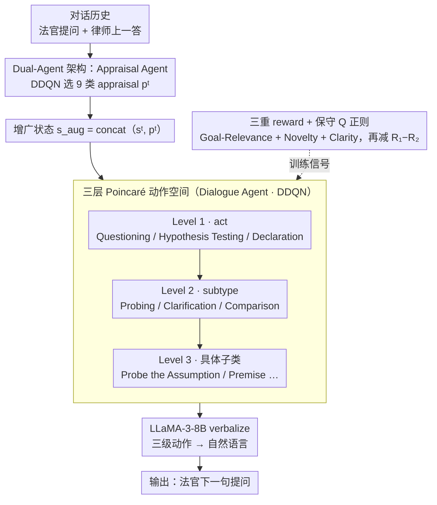

# Dual Hierarchical Dialogue Policy Learning for Legal Inquisitive Conversational Agents

**会议**: ACL 2026 Findings  
**arXiv**: [2605.14057](https://arxiv.org/abs/2605.14057)  
**代码**: 论文脚注提到 Git repository，未给出公开链接  
**领域**: 对话 / 法律 / 强化学习  
**关键词**: Inquisitive Conversational Agent、Dual Hierarchical RL、Appraisal Agent、Poincaré 嵌入、Offline DDQN

## 一句话总结
作者把"美国最高法院法官审律师"这种"AI 主动提问、对方未必合作"的对话定义为 Inquisitive Dialogue，提出 Dual Hierarchical RL 框架——一个 Appraisal Agent 实时打分律师回答（9 种 appraisal 类）、一个 Hierarchical Dialogue Agent 在三层（act/subtype/utterance）Poincaré 动作空间上做 DDQN 选 act，再叠加目标相关性/新颖性/简洁性三重 reward 与一个 conservative 正则项，在 Oyez Supreme Court 数据集上把 PES（探查有效性）从 baseline 的 4.22 推到 4.47，多轮 Coverage / MR 都最高。

## 研究背景与动机

**领域现状**：主流对话系统（MultiWOZ、Schema-Guided、Taskmaster 等）几乎全是"collaborative TOD"——用户主动提问、Agent 服从满足；近年又有 negotiation dialogue（Lewis 2017）。但 Conversational AI 一直没有系统化研究"**Agent 主导、对方不合作、信息靠 Agent 自己挖**"的情景。

**现有痛点**：在法院庭审、调查记者、医生问诊、警察询问这种场景里，AI 不能被动响应，必须主动 probe、reframe、challenge。直接套现有 TOD 会有三大问题：(i) 启发式 + slot ontology 撑不起"问哪个问题最优"的策略；(ii) Supreme Court 一轮 transcript 常常 > 5000 token，主流 seq2seq context 不够长；(iii) 双方目标不一致甚至对抗——律师可能 evasive、incomplete，简单 reward maximization 会被绕开。

**核心矛盾**：把对话当成"扁平动作空间下的 RL"，要么动作空间太大（NLG 级）训不动，要么动作空间太小（act 级）失去表达力；而且单一 reward 信号（如 task success）抓不住"问得好不好"这个核心。

**本文目标**：设计一个 RL 框架，让 agent 同时学会 (i) **何时该追问**（评估对方答得够不够）、(ii) **该问什么类型的问题**（probing / hypothesis / challenge / clarification）、(iii) **该怎么把它说出来**（具体话术）。

**切入角度**：作者注意到 Supreme Court 法官的提问行为天然是分层的——先决定 act（Questioning vs Declaration vs Hypothesis Testing），再决定 subtype（Probing vs Clarification vs Comparison），最后才是 utterance；而且法官**会先评估律师上一答**（"你绕过去了 / 你答非所问 / 满意"），评估结果决定下一步策略。

**核心 idea**：把"评估"和"对话决策"拆成两个互相耦合的 RL 智能体——Appraisal Agent 输出 9 类离散 appraisal $p^t$ 作为内部状态，喂给 Hierarchical Dialogue Agent 在 3 层动作上做 DDQN，自然对应法官的两步思维。

## 方法详解

### 整体框架
方法把"法官审律师"建模成一个增广 MDP：每轮 justice utterance $u_j^t$ 是 action $a^t$、attorney response $u_a^{t+1}$ 是 observation，transition 被扩成 $\mathcal{D} \sim (s^t, p^t, a^t, r^t, s^{t+1})$，其中 $p^t = f(u_j^{t-1}, u_a^t, u_j^t)$ 是法官对律师上一答的态度。在这个 MDP 上跑两个互相耦合的 RL 智能体——Appraisal Agent 先把对话历史读成一个离散 appraisal $p^t$，Dialogue Agent 再把 $p^t$ 拼进 state 后在 act/subtype/utterance 三层动作空间上序列决策；选定的三级动作连同增广 state 一起 prompt LLaMA-3-8B-Instruct，verbalize 成最终自然语言提问。整条链路从"评估对方"到"决定怎么问"再到"说出来"，对应法官庭审时的两步思维。

### 关键设计

**1. Dual-Agent 架构：把"怎么看你上一答"和"我下一步怎么问"解耦成两个 RL agent**

如果用单个 agent 端到端做，它既要判断律师在回避还是答得完整、又要决定下一步该 probe 还是 challenge，state 信号被两件事来回拉扯。DRCR 把评估单独交给 Appraisal Agent：它接收对话历史，用 DDQN 选出 $p(s) = \arg\max_p Q_{\text{App}}(s, p; \theta)$，输出 9 类离散 appraisal（evasive / incomplete / satisfactory / contradictory 等），转 one-hot 后拼成增广 state $s_{\text{aug}}^t = \text{concat}(s^t, p^t)$ 喂给 Dialogue Agent。两个 agent 各用 DDQN、独立训练，只在 state augmentation 处耦合——Appraisal 专注 evaluation、Dialogue 专注 policy，模块化且可解释。消融里去掉 Appraisal Agent 后 PES 从 4.47 掉到 4.30，是单组件里掉得最多的，说明"先评估再决定"确实是探查有效性的主要来源。

**2. 三层 Poincaré 动作空间：把"问什么"分解成 act→subtype→utterance 三级树并用双曲嵌入表示**

扁平动作空间下"Probe assumption"和"Challenge premise"只是两个互不相干的 token，学不出泛化。DRCR 把动作拆成三级：Level 1 是高级 act（Questioning / Hypothesis Testing / Declaration），Level 2 是 subtype（Probing / Clarification / Comparison），Level 3 是具体子类（Probe the Assumption / Probe the Premise 等）。这棵树用双曲 Poincaré 嵌入训练，目标 $\mathcal{L} = \sum_{(u,v) \in D} \log \frac{e^{-d(u,v)}}{\sum_{v' \in \mathcal{N}(u)} e^{-d(u, v')}}$ 让 parent 靠近原点、child 指数远离、sibling 天然相似，比欧氏空间更契合 tree-like 结构。Q-network 序列化预测三个动作，每个完整动作产生 3 个 transition tuple，并用层级一致损失 $\mathcal{L}_{\text{Dia}}^{\text{hier}} = \sum_i (Q(s, a_i) - \max_{a_{i+1}} Q(s, a_{i+1}))^2$ 强制 $Q(s, a_0) = \max_{a_1} Q(s, a_1)$，让父节点的 Q 值与最优子节点对齐。这样同父的兄弟动作能共享信号，泛化好、参数省。

**3. 三重 reward + 保守 Q 正则：把"问得好"拆成三个可计算目标，再压住 offline RL 的 Q 高估**

单一 task-success reward 在"task 是否完成"本就模糊的对话里几乎没有信号，DRCR 把"问得好"分解成三路互补奖励：Goal-Relevance $R_{\text{rel}}^{t+1} = \max_i \text{sim}(C[i], u_a^{t+1})$ 用 LLaMA-3-8B 算律师回答与案件子结论 $C[i]$ 的最大相似度，奖励"问出有用信息"；Novelty $R_{\text{nov}}^{t+1} = N_{\text{attorney}}^{t+1} / (V(1 - ((V-1)/V)^{|u_a^{t+1}|}))$ 用 EAD 度量新引入 token 比例（对长度做了归一化），奖励"问出之前没出现的信息"；Clarity $R_{\text{clarity}}^{t+1} = -\log|u_a^{t+1}|$ 偏好律师答得简短，便于法官控对话。三者加权后给 Q-learning。由于是 offline RL，再加一个 conservative 正则 $\mathcal{L}^{\text{Reg}} = R_1(s) - R_2(s)$，其中 $R_1 = \max_a Q(s,a)$ 是可能被高估的最大值、$R_2 = Q(s, a)$ 在数据集 $(s,a) \in \mathcal{D}$ 上回采，把 OOD 的 Q 值往 dataset policy 拉回。这是 CQL 思路的轻量版，针对 Supreme Court 这种"数据集策略已近最优"的场景，只要把 Q 往数据分布拉就够了，实现仅几行减法。

### 损失函数 / 训练策略
- **Backbone**：双 agent 都用 Double DQN (DDQN)。
- **Appraisal**：$\mathcal{L}_{\text{App}} = \mathcal{L}_{\text{App}}^{\text{DDQN}} + \alpha \mathcal{L}_{\text{App}}^{\text{Reg}}$，其中 $Y_{\text{App}} = r + \gamma Q(s, \arg\max_{p'} Q(s', p'; \theta_{App}); \theta_{App}^-)$。
- **Dialogue**：$\mathcal{L}_{\text{Dia}} = \mathcal{L}_{\text{Dia}}^{\text{DDQN}} + \beta \mathcal{L}_{\text{Dia}}^{\text{Reg}} + \lambda \mathcal{L}_{\text{Dia}}^{\text{hier}}$，层级一致 loss 强制 $Q(s, a_0) = \max_{a_1} Q(s, a_1)$ 等。
- **数据**：U.S. Supreme Court Oral Argument Transcript（Oyez，1955–2023），按年划分 train/test。
- **Verbalization**：选好 act/subtype/utterance 后 prompt LLaMA-3-8B-Instruct + 模板生成自然语言；method 本身 fine-tuning-free。

## 实验关键数据
- **Backbone**：双 agent 都用 Double DQN (DDQN)。
- **Appraisal**：$\mathcal{L}_{\text{App}} = \mathcal{L}_{\text{App}}^{\text{DDQN}} + \alpha \mathcal{L}_{\text{App}}^{\text{Reg}}$，其中 $Y_{\text{App}} = r + \gamma Q(s, \arg\max_{p'} Q(s', p'; \theta_{App}); \theta_{App}^-)$。
- **Dialogue**：$\mathcal{L}_{\text{Dia}} = \mathcal{L}_{\text{Dia}}^{\text{DDQN}} + \beta \mathcal{L}_{\text{Dia}}^{\text{Reg}} + \lambda \mathcal{L}_{\text{Dia}}^{\text{hier}}$，层级一致 loss 强制 $Q(s, a_0) = \max_{a_1} Q(s, a_1)$ 等。
- **数据**：U.S. Supreme Court Oral Argument Transcript（Oyez，1955–2023），按年划分 train/test。
- **Verbalization**：选好 act/subtype/utterance 后 prompt LLaMA-3-8B-Instruct + 模板生成自然语言；method 本身 fine-tuning-free。

## 实验关键数据

### 主实验
SaulLM-7B 自动打分 1–5 分，4 个指标：CS (Conformity) / PS (Progression) / OS (Outcome Relevance) / PES (Probing Effectiveness)（Tab.1）：

| 方法 | CS | PS | OS | PES | Overall |
|------|----|----|----|-----|---------|
| Vanilla LLaMA-3 | 3.99 | 3.94 | 4.70 | 3.92 | 4.14 |
| SFT LLaMA-3 | 3.98 | 3.81 | 4.45 | 3.38 | 3.91 |
| SaulLM-7B (法律专精 LLM) | 4.01 | 3.91 | 4.56 | 3.75 | 4.06 |
| Hudeček et al. (pipeline TOD) | 3.99 | 3.97 | 4.77 | 3.63 | 4.09 |
| VaRMI (offline policy gradient) | 4.00 | 3.94 | 4.71 | 3.93 | 4.15 |
| ArCHer (Actor-Critic) | 3.96 | 3.79 | 4.17 | 4.22 | 4.04 |
| **Ours (Dual Hierarchical)** | **4.01** | **3.98** | **4.89** | **4.47** | **4.34** |

多轮对话用 SeCom 模拟律师对手、上限 10 轮：Coverage Score 和 Marginal Relevance Score 在 Figure 3/4 上本文都最高；人评（Tab.8）Overall 4.53，也最高。

### 消融实验
Tab.2 四组消融（Full Model 4.34）：

| 配置 | CS | PS | OS | PES | Overall |
|------|----|----|----|-----|---------|
| Full Model | 4.01 | 3.98 | 4.89 | 4.47 | **4.34** |
| w/o Appraisal Agent | 4.03 | 4.00 | 4.74 | **4.30** | 4.27 |
| w/o Succinct Reward | 4.01 | 3.97 | 4.85 | 4.39 | 4.31 |
| w/o Novelty Reward | 4.01 | 3.97 | 4.82 | 4.34 | 4.29 |
| w/o Goal-Relevance | 4.00 | 3.97 | 4.83 | 4.32 | 4.28 |

### 关键发现
- **Appraisal Agent 是 PES 的最大贡献者**：去掉它 PES 从 4.47 掉到 4.30，掉 0.17 是单组件最大；OS 也从 4.89 掉到 4.74。说明"先评估再决定"机制比"端到端单 agent"在"探查有效性"上明显更强。
- **专精法律 LLM 不一定胜出**：SaulLM-7B 训练集已经含 Supreme Court transcript，但在 dialogue 任务上反被 Vanilla LLaMA-3 超过（4.06 vs 4.14），说明"领域知识"≠"对话策略"——必须有 RL 风格的策略学习。
- **SFT 的失败是数据质量问题**：SFT LLaMA-3 在 6 个方法里最低（3.91），主因是 Supreme Court 数据有大量低质片段，纯 SFT 全部吸收；本文的 RL + conservative 正则能"绕开"低质数据，因为 reward 不会奖励那些 transition。
- **三种 reward 互补**：去掉任意一个 reward 单项 Overall 都掉 0.03–0.06，OS 受 novelty 影响最大（−0.07），PES 受 goal-relevance 和 succinct 都明显影响——说明三者不是冗余而是各管一个维度。
- **Coverage / MR 在多轮上一直最高**：Fig.3/4 显示本文方法在 2/4/6/8/10 轮都领先所有 baseline，说明 dual agent 不仅在单轮上更好，长程对话规划也更稳。

## 亮点与洞察
- **重新定义 TOD 的三分法（collaborative / negotiation / inquisitive）** 是这篇论文最 conceptual 的贡献，把 "AI 主动 probe" 这一长期被忽视的场景定义清楚，未来很可能成为引用增长点。
- **把 "appraisal" 显式做成一个 agent**很巧妙——它把 Theory of Mind 风格的 "agent's evaluation of interlocutor" 从隐性 prompt 变成可学习的离散信号，并通过 state augmentation 把这个信号注入决策，是 dialogue policy 一个干净的解耦设计。
- **Poincaré 双曲嵌入 + 层级 Q 一致性 loss** 让"act/subtype/utterance" 三级 tree 真正被利用上，相比 flat one-hot 能力提升明显且参数省。
- **conservative 正则 $R_1 - R_2$ 非常轻量**：相比 CQL 复杂的 saddle-point 求解，这个减法形式实现 5 行代码，但对"dataset policy 近最优"的场景效果可观——值得在其他 offline RL 任务里 try。
- **EAD-based novelty reward** 比 raw distinct-N 更合理，因为它对 utterance 长度做了 length-normalize；这是一个可以迁移到 chatbot diversity 任务的 metric trick。

## 局限与展望
- **Verbalization 依赖 LLM 概率**：作者自己承认"if LLM 概率不在最优序列上，本方法到不了最优"，因为最终自然语言不是 RL 学出来的而是 prompt LLM 出来的。
- **Reward / Action 是手工设计的、领域绑死**：迁移到 medical interview / journalism interrogation 需要重新设计 9 类 appraisal、3 级 action taxonomy；可推广性需要后续工作。
- **Conservative 正则的有效性依赖 dataset policy 接近最优**：Supreme Court 法官是顶级专业人士，policy 优；如果换成 amateur dialogue dataset，把 Q 往 dataset 拉反而是错的方向。
- **只在 Oyez 一个数据集上验证**：legal 领域内部还有 lower court、deposition transcript 等异质场景；缺跨数据集泛化实验。
- **没有人类用户在线 evaluation**：所有实验都是 simulated attorney（用 SeCom 构造），未在真人或专业律师身上跑过——而 inquisitive 对话的关键就是"对手会不会反 probe"。
- **改进方向**：把 reward 模型升级成 learned reward（用律师专家偏好数据训）；把 hierarchical action 扩到 4 级以支持 hypothetical 推理链；把方法迁到 medical history-taking 验证可推广性。

## 相关工作与启发
- **vs collaborative TOD (MultiWOZ / Schema-Guided / Taskmaster)**：那些只覆盖"用户问、Agent 答"的 slice；本文把 inquisitive 单独立出来，定义、数据集、方法都补齐。
- **vs negotiation dialogue (Lewis 2017 Deal or No Deal)**：negotiation 是双方有不一致目标但**主动 trade-off**，inquisitive 是**单方主动 probe + 对方未必合作**，作者把它放在 negotiation 旁边作为第三类，这一分类有概念价值。
- **vs ArCHer (Zhou 2024)**：ArCHer 也是 hierarchical Actor-Critic for multi-turn，但 flat reward；本文加 dual agent + Poincaré + 三重 reward 后 Overall 从 4.04 提到 4.34，证明结构化层级 + 解耦 evaluation 比单 hierarchy 更强。
- **vs VaRMI (Shea & Yu 2023)**：VaRMI 用 offline policy gradient + IS 维持 role consistency；本文用 DDQN + conservative 正则，PES 上从 3.93 提到 4.47，差距明显。
- **vs CQL (Kumar 2020)**：CQL 用 logsumexp 形式做 Q regularization，本文简化成 $R_1 - R_2$ 减法形式，更轻量、更易实现。
- **启发**：把"agent's internal evaluation" 当 explicit module 是一个普适思想，可以迁到 investigative journalism agent、medical history-taking、police interrogation 等所有"主动挖信息"场景；hierarchical action + 双曲嵌入也可以迁到 agent planning。

## 评分
- 新颖性: ⭐⭐⭐⭐ Inquisitive Dialogue 的提出 + Dual Hierarchical RL + Poincaré 动作空间是一组干净的创新组合。
- 实验充分度: ⭐⭐⭐ 主实验 + 4 组消融 + 多轮 Coverage/MR + 人评齐备；但只有 Supreme Court 单数据集、且没有 online human evaluation。
- 写作质量: ⭐⭐⭐⭐ 把"inquisitive vs collaborative vs negotiation"讲清楚，Method/Reward 公式整齐，可读性高。
- 价值: ⭐⭐⭐⭐ 把 proactive Conversational AI 的疆界往前推了一截，对法律/医疗/调查类对话系统都有借鉴意义。

<!-- RELATED:START -->

## 相关论文

- [\[ACL 2026\] Template-assisted Contrastive Learning of Task-oriented Dialogue Sentence Embeddings](template-assisted_contrastive_learning_of_task-oriented_dialogue_sentence_embedd.md)
- [\[ACL 2026\] Preference Learning Unlocks LLMs' Psycho-Counseling Skills](preference_learning_unlocks_llms_psycho-counseling_skills.md)
- [\[ACL 2026\] Cognitive Policy-Driven LLM for Diagnosis and Intervention of Cognitive Distortions in Emotional Support Conversation](cognitive_policy-driven_llm_for_diagnosis_and_intervention_of_cognitive_distorti.md)
- [\[CVPR 2026\] Evolutionary Multimodal Reasoning via Hierarchical Semantic Representation for Intent Recognition](../../CVPR2026/dialogue/evolutionary_multimodal_reasoning_via_hierarchical_semantic_representation_for_i.md)
- [\[ACL 2025\] Single- vs. Dual-Prompt Dialogue Generation with LLMs for Job Interviews in Human Resources](../../ACL2025/dialogue/single-_vs_dual-prompt_dialogue_generation_with_llms_for_job_interviews_in_human.md)

<!-- RELATED:END -->
