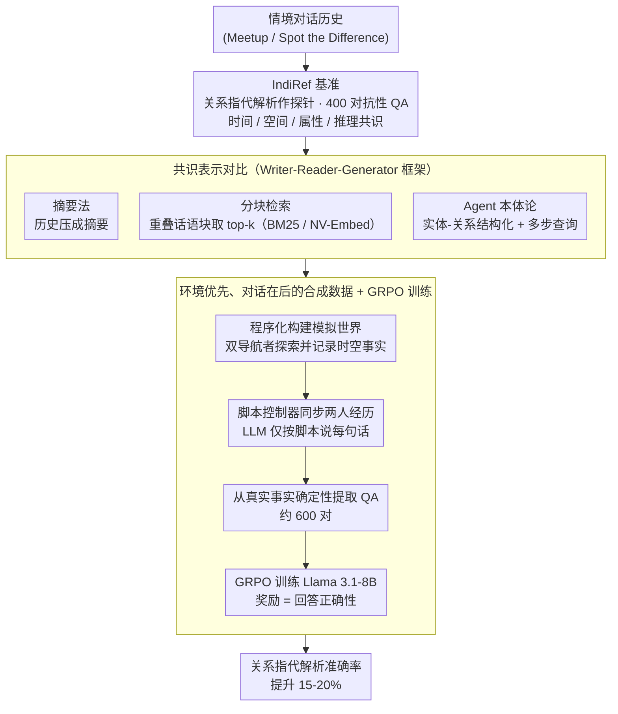

# Frame of Reference: Addressing the Challenges of Common Ground Representation in Dialogue

**会议**: ACL 2026  
**arXiv**: [2601.09365](https://arxiv.org/abs/2601.09365)  
**代码**: [GitHub](https://github.com/biswesh/IndiRef)  
**领域**: 强化学习  
**关键词**: 共识建立, 关系指代, 情境对话, 强化学习, 对话记忆

## 一句话总结

本文提出 IndiRef 基准测试，用于评估对话系统通过"关系指代"（如"昨天我们去的那个公园旁边的咖啡馆"）建立和利用持久共识（common ground）的能力，发现现有 LLM 在全上下文条件下准确率不超过 50%，并通过合成数据 + GRPO 强化学习训练将性能提升 15-20%。

## 研究背景与动机

**领域现状**：在对话中，共识（common ground）指的是对话参与者之间积累的共享知识、信念和假设。近年来 LLM 已展现出执行某些基础对话行为（如确认、回应）的能力，但这些行为是否代表真正的理解仍不确定。

**现有痛点**：(1) 现有 LLM 可能只是通过生成合理的回应来"模拟"理解，而非真正建立和利用共识——即"理解的幻觉"；(2) 对话历史增长后，系统必须依赖记忆管理技术从已建立的共识中检索信息，但现有方法（摘要、RAG、知识图谱）在处理复杂关系指代时表现不佳；(3) 缺乏有效的基准来测量对话系统建立持久、可用共识的能力。

**核心矛盾**：情境对话中，实体往往没有唯一的指代表达（如同一个房间可以被称为"有电视的房间"或"浴室前面的房间"），且指代关系涉及空间、时间、属性等多维度的关系推理。现有表示方法无法充分捕捉这些实体间关系。

**本文目标**：(1) 提出一个基于关系指代解析的基准来评估对话系统的共识建立能力；(2) 评估现有常用共识表示方法的效果；(3) 通过合成数据和强化学习改善系统的对话理解能力。

**切入角度**：受 Kruijt and Vossen (2022) 启发，利用人类对话中常见的"关系指代"（通过空间、时间、属性等关系来引用实体）作为测试共识能力的探针——如果模型能正确解析这类指代，说明它确实建立了有效的共识。

**核心 idea**：将"解析复杂关系指代"作为衡量对话系统共识建立能力的核心指标，并通过合成情境对话数据 + GRPO 训练来增强 LLM 的多步推理能力。

## 方法详解

### 整体框架

本文围绕三个研究问题搭建工作：先用一个对抗性基准 IndiRef 量化"对话系统能否真正建立可持久利用的共识"，再在资源受限条件下对比几种主流共识表示方法的检索效果，最后用合成情境对话数据 + 强化学习把模型的多步关系推理能力顶上去。整条链路的输入都是一段情境对话历史，输出是对其中"关系指代"问题（如"昨天我们去的那个公园旁边的咖啡馆"指的是哪个实体）的正确回答——能答对，就说明模型确实把对话里积累的共享知识沉淀成了可调用的共识。

### 关键设计

**1. IndiRef 基准：把"理解能力"翻译成一道对抗性 QA。** 现有对话基准大多只测即时行为（确认、回应），模型靠生成一句合理的回应就能蒙混过关，根本测不出它是否真的建立了能持久复用的共识。IndiRef 转而以"关系指代解析"为探针：基于 Meetup 和 Spot the Difference 两个对话数据集手工构建 400 个问答对（每类 100 个），覆盖时间指代（"我们看完蜘蛛侠之后去的那个泰国餐厅"）、空间指代（"桌上的瓶子"）、属性指代（"黄色房子"）和推理共识（隐含信息的理解）四类。

关键在于它刻意做成对抗性——每段对话里塞进多个同类实体，让简单关键词匹配失效；再用指示代词（你的/我的）逼模型区分说话者视角。只有真正把多维度关系（空间、时间、属性）整合进共识表示的模型才能答对，从而把抽象的"是否理解"变成一个可量化的指标。

**2. Writer-Reader-Generator 框架下的共识表示对比。** 真实长对话的完整历史塞不进上下文窗口，必须靠某种表示来存储和检索共识，但哪种表示最能保住关系信息是未知的。本文用统一的 $W$（写入）-$R$（读取）-$G$（生成）框架横评三条路线：摘要法把历史压成摘要 $s_t$；分块检索法把对话切成重叠话语块 $c_i$（每块 7 条话语、步长 3），检索 top-k 最相关块；本体论法则用 Agent 抽取实体、属性、关系和说话者信息构成结构化知识，再通过多步查询（RAG[n]→Process→Final）逐步检索。

嵌入侧同时测了稀疏（BM25）和稠密（NV-Embed-V2）两种方式。这套对比直接暴露出信息损失才是资源受限场景的核心瓶颈，也解释了为何显式建模实体-关系的本体论法在关系指代上略胜摘要和分块。

**3. "环境优先、对话在后"的合成数据 + GRPO 训练。** 现有 LLM 几乎没有情境对话的训练数据，而直接让 LLM 凭空编对话又会让推理部分变得不可靠（编出来的时空关系往往自相矛盾）。本文把推理逻辑从语言生成里剥离出来，走三阶段流程：先程序化构建一个模拟世界，让两个导航者探索并记录时空事实；再由脚本控制器同步两人的经历、生成对话脚本，LLM 只负责在脚本约束下把每句话说出来；最后从真实事实里确定性地提取问答对。

如此生成约 600 个问答对后，用 GRPO（Group Relative Policy Optimization）训练 Llama 3.1-8B，奖励函数只看回答正确性——模型答案与预定义答案匹配即给正奖励。因为事实由程序保证、推理由脚本控制器负责，合成数据的正确性可控，训练信号干净，最终在 Meetup 和 STD 上都带来 15-20% 的稳定提升。

## 实验关键数据

### 主实验

**全上下文基线（不同 LLM 在 IndiRef 上的表现，FEM/LLM-as-Judge）**

| 模型 | 时间指代 | 空间指代 | 属性指代 | 推理共识 |
|------|---------|---------|---------|---------|
| Gemma2-2B | 0.20/0.18 | 0.18/0.16 | 0.24/0.26 | 0.26/0.16 |
| Llama3.1-8B | 0.38/0.32 | 0.46/0.38 | 0.46/0.44 | 0.20/0.20 |
| Gemma2-27B | 0.50/0.44 | 0.58/0.56 | 0.48/0.44 | 0.28/0.26 |
| Qwen-QWQ-32B | 0.38/0.32 | 0.52/0.38 | 0.44/0.40 | 0.40/0.40 |

**资源受限场景下不同表示方法对比（Llama3.1-8B，Meetup）**

| 方法 | 时间 | 空间 | 属性 | 推理 |
|------|------|------|------|------|
| 全上下文基线 | 0.38/0.32 | 0.46/0.38 | 0.46/0.44 | 0.20/0.20 |
| 摘要 | 0.32/0.28 | 0.34/0.26 | 0.30/0.25 | 0.28/0.18 |
| 分块(NV-Embed) | 0.24/0.20 | 0.08/0.06 | 0.16/0.08 | 0.22/0.24 |
| 分块(BM25) | 0.26/0.24 | 0.20/0.16 | 0.20/0.18 | 0.24/0.26 |
| Agent本体论 | 0.40/0.36 | 0.38/0.34 | 0.38/0.30 | 0.24/0.22 |

### 消融实验

**GRPO 训练效果（Llama3.1-8B）**

| 配置 | 时间 | 空间 | 属性 | 推理 |
|------|------|------|------|------|
| 原始（全上下文） | 0.38/0.32 | 0.46/0.38 | 0.46/0.44 | 0.20/0.20 |
| In-Context Learning | 0.60/0.56 | 0.58/0.54 | 0.62/0.58 | 0.42/0.34 |
| GRPO 训练 | 0.58/0.52 | 0.66/0.54 | 0.62/0.60 | 0.46/0.42 |

**Agent 本体论 + GRPO 训练**

| 配置 | 时间 | 空间 | 属性 | 推理 |
|------|------|------|------|------|
| 无 GRPO | 0.40/0.36 | 0.38/0.34 | 0.38/0.30 | 0.24/0.22 |
| 有 GRPO | 0.48/0.46 | 0.44/0.42 | 0.52/0.44 | 0.36/0.38 |

### 关键发现

- 即使在全上下文条件下，最强模型（Gemma2-27B）在所有类别上的准确率均未超过 58%，说明关系指代解析对当前 LLM 极具挑战性
- 所有资源受限表示方法均不如全上下文基线，信息损失是核心问题
- Agent 本体论方法优于摘要和分块方法，说明多步检索和显式实体-关系建模有助于理解上下文
- 推理型模型（Qwen-QWQ）在推理共识类别上表现最优（0.40），但在其他类别上表现一般，且常出现幻觉
- GRPO 训练在 Meetup 和 STD 数据集上均提升 15-20%，证明合成数据训练可迁移到不同场景

## 亮点与洞察

- "关系指代解析"作为共识能力的探针是一个精巧的设计——它将抽象的"理解能力"转化为可量化的 QA 任务
- 合成数据生成的"环境优先"方法值得借鉴——将推理逻辑交给程序化控制器、语言生成交给 LLM，确保数据的事实正确性
- 发现稀疏嵌入（BM25）在命名实体检索上略优于稠密嵌入，这对 RAG 系统设计有参考价值

## 局限与展望

- IndiRef 基准规模较小（400 个问答对），且手工构建限制了扩展性
- 仅在 8B 参数量的模型上进行了 GRPO 训练，更大模型可能受益更多
- 合成数据的领域较窄（主要是导航场景），对其他情境对话的泛化性有待验证
- Agent 本体论方法在相似图像场景（STD）中容易合并不同参与者的信息

## 相关工作与启发

- **vs Dialog State Tracking (DST)**: DST 使用槽-值对表示任务导向型对话状态，但缺乏处理实体间关系的灵活性；本文的关系指代需要更丰富的表示
- **vs 知识图谱方法**: 知识图谱可建模实体关系，但在情境对话中实体往往没有稳定的指代表达，本文的本体论方法通过事件日志和多步查询部分解决了这一问题
- **vs RAG 方法**: RAG 依赖相似度检索，但在关系指代中问题的语义与答案所在片段的语义可能差异较大，导致检索失败

## 评分

- 新颖性: ⭐⭐⭐⭐ 将"关系指代"作为共识能力的探针是独到的视角，合成数据方法设计巧妙
- 实验充分度: ⭐⭐⭐⭐ 多种表示方法、多个模型对比，但数据集规模较小
- 写作质量: ⭐⭐⭐⭐⭐ 三个研究问题层层递进，实验设计清晰，分析深入
- 价值: ⭐⭐⭐⭐ 揭示了对话系统在共识建立方面的根本缺陷，为具身对话和社交机器人提供了评估方向

<!-- RELATED:START -->

## 相关论文

- [\[CVPR 2026\] Evolutionary Multimodal Reasoning via Hierarchical Semantic Representation for Intent Recognition](../../CVPR2026/dialogue/evolutionary_multimodal_reasoning_via_hierarchical_semantic_representation_for_i.md)
- [\[ACL 2026\] CoDial: Interpretable Task-Oriented Dialogue Systems Through Dialogue Flow Alignment](codial_interpretable_task-oriented_dialogue_systems_through_dialogue_flow_alignm.md)
- [\[ACL 2026\] Reasoning Gets Harder for LLMs Inside A Dialogue](reasoning_gets_harder_for_llms_inside_a_dialogue.md)
- [\[ACL 2026\] Context-Agent: Dynamic Discourse Trees for Non-Linear Dialogue](context-agent_dynamic_discourse_trees_for_non-linear_dialogue.md)
- [\[ACL 2026\] Dual Hierarchical Dialogue Policy Learning for Legal Inquisitive Conversational Agents](dual_hierarchical_dialogue_policy_learning_for_legal_inquisitive_conversational_.md)

<!-- RELATED:END -->
