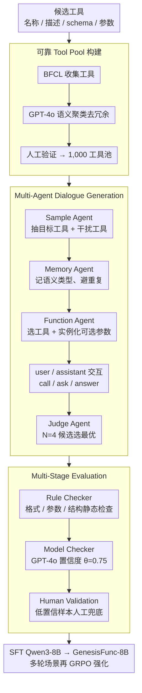

# GenesisFunc: Multi-Agent Data Generation for Accurate and Generalizable Function-Calling

**会议**: ACL2026  
**arXiv**: [2605.28835](https://arxiv.org/abs/2605.28835)  
**代码**: https://github.com/famoustourist/GenesisFunc  
**领域**: Agent / 函数调用 / 合成数据  
**关键词**: Function Calling, 多代理数据生成, 工具学习, 合成数据质检, GRPO  

## 一句话总结
GenesisFunc 用可靠工具池、多代理对话生成和多阶段质检自动构造高质量函数调用训练数据，微调 Qwen3-8B 后在 BFCL、API-Bank 和 ACEBench 上超过同规模开源函数调用模型，并展示出向更多工具和多轮 RL 训练扩展的潜力。

## 研究背景与动机
**领域现状**：函数调用让 LLM 从纯文本生成器变成能调用外部工具的 agent，是工作流自动化、旅行规划、信息查询和复杂任务执行的基础能力。当前提升 function-calling 的主流路线包括 prompting、SFT 以及带奖励的 RL。

**现有痛点**：函数调用能力高度依赖训练数据质量，但真实标注数据成本高，且现实场景常包含模糊意图、多工具组合、多轮交互、动态约束和错误处理。已有合成管线常用人工设计或公开 API，存在工具不可靠、难扩展、场景单一、质量控制弱等问题，导致模型学到的工具使用能力不够泛化。

**核心矛盾**：要训练强 function-calling 模型，数据必须同时满足可靠、准确、多样、覆盖广；但自动生成越大规模，越容易出现工具定义错误、参数抽取不一致、对话意图重复和不可执行样本。

**本文目标**：作者希望构建一个端到端自动数据生成 pipeline，从可靠工具开始，系统生成单轮、多轮和特殊错误/无解场景，并通过自动与人工结合的评估模块保证数据质量。

**切入角度**：与其从零设计合成 API，GenesisFunc 先从 BFCL 这类成熟 benchmark 中抽取可靠工具，再用 multi-agent 机制扩大语义场景、参数槽位和对话形态，最后用 rule/model/human 三层验证兜底。

**核心 idea**：用“可靠工具池 + 多代理生成多样对话 + 多阶段质检”构造 function-calling 数据，再用这些数据 SFT/RL 小模型，使其获得接近 API 模型的工具调用能力。

## 方法详解
GenesisFunc 的方法重点在数据工程和质控闭环。它不是只让一个 LLM 直接写工具调用样本，而是把生成过程拆成工具选择、场景记忆、函数参数选择、候选对话裁判和后验验证几个角色，减少低质合成数据进入训练。

### 整体框架
输入是一组候选工具，每个工具包含名称、描述、schema、必选/可选参数。pipeline 分三阶段：第一阶段从 BFCL 构建 1,000 个可靠工具组成 Tool Pool；第二阶段用多代理辅助的 Dialogue Generation System 生成单轮、多轮和 special-case 函数调用对话；第三阶段用 Rule Checker、Model Checker 和 Human Validation 检查格式、参数、语义完成度和可执行性。最终数据用于对 Qwen3-8B 做 SFT，得到 GenesisFunc-8B；在多轮场景上还进一步尝试 GRPO 强化训练。

### 关键设计

**1. 可靠 Tool Pool 构建：先把工具源头稳住，再谈对话生成**

很多合成数据的问题根子不在对话写得自不自然，而在底层工具本身就不可靠、schema 难以落地——工具一歪，后面再花哨的对话都白搭。GenesisFunc 因此不从零造 API，而是从 BFCL evaluation set 收集工具，先用 GPT-4o 做语义聚类、去掉冗余或高度相似的工具，再经一轮轻量人工验证检查正确性和可用性，最终沉淀出 1,000 个工具的 Tool Pool。

之所以选 BFCL 作为源头，是因为它本身就覆盖多种真实工具场景，这让这个 pool 同时兼顾了可靠性和领域多样性——既稳，又不至于把生成局限在单一领域。

**2. Multi-Agent Dialogue Generation：用分工的多代理把"多样"和"准确"同时纳入生成**

真实函数调用从来不是"用户问一句、模型调一个 API"那么简单：它要区分相关与无关工具、补齐缺失参数、处理多工具组合、维护对话历史。单个 LLM 一把梭很难同时照顾这些维度，于是作者把生成拆给四个角色协作：Sample Agent 从全局工具池里抽出目标工具和干扰工具；Memory Agent 记录历史对话及其语义类型，主动避开已生成过的场景；Function Agent 选出能解决当前请求的工具，并随机实例化一部分可选参数槽位；Judge Agent 则从每轮默认 $N=4$ 个候选对话中挑出最优样本。

真正的对话由 user agent 和 assistant agent 交互产生，assistant 的动作空间包含 `call`、`ask` 和 `answer` 三种——分别对应调用工具、追问缺失信息、直接作答。正是这套分工，让生成的数据天然覆盖单任务、多任务、多轮澄清、错误处理乃至无工具可答等多样形态，而不是清一色的模板化请求。

**3. Multi-Stage Evaluation：用三层质检在数据进训练前拦下坏样本**

SFT 对错误标签极其敏感，尤其工具参数一旦标错，会直接把模型教歪，因此质检不能省。作者按"便宜→昂贵"的顺序叠了三层：Rule Checker 不执行工具，只静态检查工具定义完整性、调用格式与参数合规、对话结构合理性、以及工具结果与 assistant 说法是否一致；Model Checker 用 GPT-4o 做更高层的 faithfulness、task satisfaction 和 compliance 判断，只保留置信度超过 $\theta=0.75$ 的样本。

经过自动筛查后，剩余样本的错误率已低于 5%，其中 80% 以上来自参数抽取错误；这些失败或低置信样本再进入人工验证，总人工成本约 15 小时。便宜规则兜底大头、模型判断管语义、少量人工补最难的一截，这套组合避免了大规模人工标注，又把数据质量压在了可用线之上。

### 一个完整示例

跟着一条对话样本走一遍，能看清这几个角色怎么串起来。Sample Agent 先从 1,000 个工具的池子里抽出本轮的目标工具（比如一个 `book_flight`）和几个干扰工具（语义相近但不该被调用的 `search_hotel`、`get_weather`），逼模型学会区分相关与无关；Memory Agent 查一眼历史，发现"订机票 + 缺出发城市"这种语义类型还没生成过，于是放行、避免重复；Function Agent 选定 `book_flight` 并随机实例化一部分可选参数槽位（如只填 `destination`、留空 `departure_city`）。

接着 user agent 与 assistant agent 开始交互：用户说"帮我订一张去东京的机票"，assistant 发现出发城市缺失，于是走 `ask` 动作追问而非贸然 `call`；用户补上"从上海出发"，assistant 这才走 `call` 调用 `book_flight`，最后用 `answer` 汇报结果。这一轮默认会并行生成 $N=4$ 个候选对话，Judge Agent 从中挑出最优的一条。最后样本进入质检：Rule Checker 核对 `book_flight` 的参数是否合规、assistant 的口头汇报和工具返回是否一致，Model Checker 再判一次置信度是否过 $\theta=0.75$，通过才进训练集。整条链路下来，一个"会追问、会区分干扰工具、参数无误"的多轮样本才算合格。

### 损失函数 / 训练策略
主模型 GenesisFunc-8B 是在 Qwen3-8B 上用 pipeline 生成的数据做 SFT 得到的，结果报告为三次独立运行平均。RL 部分使用 GRPO，奖励包含格式合规和函数正确性两类信号。作者还利用 Qwen3-8B 的 thinking mode，为训练样本加入显式 reasoning traces；其中 GenesisFunc-8B-RL(part) 先用单轮和 special-case 数据 SFT，再专门用多轮对话做 RL，以提升复杂多轮函数调用。

## 实验关键数据

### 主实验
| 数据集 / 设置 | 指标 | GenesisFunc-8B | 强基线 / 对照 | 提升 / 结论 |
|--------|------|------|----------|------|
| BFCL Non-Live | Overall accuracy | 93.31 ± 0.42 | ToolACE-8B 91.04；Qwen3-32B 89.90 | 同规模开源 SOTA 之上，也超过更大开源模型 |
| BFCL Live | Overall accuracy | 83.78 ± 0.37 | ToolACE-8B 80.73；Qwen3-32B 81.13 | in-domain live 工具设置仍领先 |
| API-Bank | Overall accuracy | 64.79 ± 0.41 | Qwen-ToolRL-8B 60.36；ToolACE-8B 56.21 | out-of-domain API-Bank 上开源方法最好 |
| ACEBench Normal | Overall accuracy | 73.60 ± 0.32 | Qwen-ToolRL-8B 65.10；ToolACE-8B 70.30 | Normal tool-learning 场景提升明显 |
| ACEBench Special | Overall accuracy | 83.67 ± 0.35 | Qwen-ToolRL-8B 78.67；Qwen3-8B 76.67 | special cases 也保持强泛化 |
| Out-of-domain 平均 | API-Bank / ACEBench | API-Bank 64.79；ACEBench 约 78.64 | prior open-source SOTA | 论文称相对提升 7.3% 与 9.4% |

### 消融实验
| 配置 | 关键指标 | 说明 |
|------|---------|------|
| 移除 Judge Agent | BFCL Non-Live / Live 均下降 | 候选对话裁判对样本准确性重要 |
| 移除 Memory Agent | BFCL Non-Live / Live 显著下降 | 语义记忆和去重复对场景多样性贡献更大 |
| 每工具 1 / 5 / 10 条对话 | 从 1 到 5 提升明显，5 到 10 收益变小 | 数据量增加有用，但达到足够场景多样性后边际收益递减 |
| 不做 Multi-Stage Evaluation | 各条件准确率低于使用质检数据 | 规则 + 模型 + 人工验证能提升训练数据质量 |
| GenesisFunc-8B-RL(part) | ACEBench Normal 75.20；Multi-Turn 70.00；Special 82.88 | 相比 SFT 的 Normal 73.60、Multi-Turn 65.00，多轮 RL 明显增强复杂交互 |
| GenesisFunc + ACEBench tools | BFCL 87.89；API-Bank 65.11；ACEBench 81.87 | 添加目标 benchmark 工具后 ACEBench 从 78.64 到 81.87，其他数据不明显退化 |

### 关键发现
- in-domain BFCL 上，GenesisFunc-8B 的 Non-Live Overall 达到 93.31，Live Overall 达到 83.78，说明训练数据与真实工具语义对齐能显著缩小小模型和 API 模型之间的差距。
- out-of-domain 上，GenesisFunc-8B 仍能超过同规模开源函数调用模型，说明它不是只记住 BFCL 工具，而是学到了更一般的工具选择、参数填充和多轮交互模式。
- Memory Agent 比简单增加样本更像“多样性控制器”：它记录历史语义类型，引导生成未覆盖场景，避免数据集中出现大量模板化重复请求。
- 专门针对多轮场景做 RL(part) 比全量 RL(all) 更有效，说明复杂函数调用能力可能需要分阶段训练，而不是把所有数据混在一个奖励目标里。

## 亮点与洞察
- **把合成数据质量问题拆得很工程化**：可靠工具、对话多样性、参数正确性、候选选择和后验验证分别有对应模块，整体比单 prompt 生成数据稳很多。
- **Tool Pool 的来源选择很务实**：复用 BFCL 可靠工具避免从零造 schema，也让后续扩展到真实 downstream tools 更自然。
- **特殊场景很重要**：函数调用模型不仅要会调用正确工具，也要知道何时询问缺失信息、拒绝不匹配工具或直接回答。special-case 数据能提升真实部署稳定性。
- **SFT 和 RL 的边界比较清楚**：SFT 先建立基本工具调用格式和语义对齐，RL(part) 再重点优化多轮推理和复杂交互，这比直接全量 RL 更可控。

## 局限与展望
- GenesisFunc-8B 虽然在开源同规模模型中很强，但作者承认它在更广泛 reasoning 和 comprehension 上仍不如 GPT-4 等 API 模型。
- 当前训练数据还没有完全覆盖高度复杂、多轮且工具序列强耦合的 agentic workflows，未来需要面向更复杂 benchmark 扩展数据生成方法。
- 多代理和质检阶段依赖 Gemini-2.5 Pro、GPT-4o 等强模型，虽然论文说框架 model-agnostic，但实际构建成本和闭源依赖仍需评估。
- 自动筛查后仍需要人工验证低置信样本，15 小时成本不高，但当工具池扩大到更多领域、更多高风险功能时，人工审核标准可能更复杂。

## 相关工作与启发
- **vs ToolACE / APIGen / ToolForge**: 这些方法都关注函数调用数据合成，但 GenesisFunc 更强调可靠工具来源、多代理协作和多阶段评估闭环，尤其把参数错误作为重点质控对象。
- **vs prompting-based tool use**: ReAct 等 prompting 方法依赖上下文示例和模型原生能力，工具复杂度增加时不稳定；GenesisFunc 通过 SFT/RL 把工具调用能力写入模型参数。
- **vs ToolRL / AWPO**: RL 方法强调奖励优化，GenesisFunc 表明高质量 SFT 数据仍是强基线，并且 RL 最好针对多轮薄弱环节定向使用。
- **启发**：构建 agent 数据集时，不应只追求样本数量，而要显式控制工具可靠性、语义场景覆盖、参数槽位分布和失败/无解样本比例。

## 评分
- 新颖性: ⭐⭐⭐⭐☆ 多代理生成和质检并非完全新概念，但组合成函数调用数据闭环且效果扎实。
- 实验充分度: ⭐⭐⭐⭐☆ BFCL、API-Bank、ACEBench、消融、扩展工具和 RL 都有覆盖；部分消融图在主文 cache 中缺少精确数值。
- 写作质量: ⭐⭐⭐⭐☆ pipeline 讲解清楚，实验组织完整；一些表格列较多，阅读时需要反复对齐。
- 价值: ⭐⭐⭐⭐⭐ 对工具调用数据合成和小模型 agent 能力提升很实用，尤其适合想构建私有工具生态的团队参考。

<!-- RELATED:START -->

## 相关论文

- [\[ACL 2026\] SPASM: Stable Persona-driven Agent Simulation for Multi-turn Dialogue Generation](spasm_stable_persona-driven_agent_simulation_for_multi-turn_dialogue_generation.md)
- [\[ICML 2026\] From Self-Evolving Synthetic Data to Verifiable-Reward RL: Post-Training Multi-turn Interactive Tool-Using Agents](../../ICML2026/dialogue/from_self-evolving_synthetic_data_to_verifiable-reward_rl_post-training_multi-tu.md)
- [\[ACL 2026\] Discourse Coherence and Response-Guided Context Rewriting for Multi-Party Dialogue Generation](discourse_coherence_and_response-guided_context_rewriting_for_multi-party_dialog.md)
- [\[ACL 2026\] Context-Agent: Dynamic Discourse Trees for Non-Linear Dialogue](context-agent_dynamic_discourse_trees_for_non-linear_dialogue.md)
- [\[ACL 2026\] Disambiguation-Centric Finetuning Makes Enterprise Tool-Calling LLMs More Realistic and Less Risky](disambiguation-centric_finetuning_makes_enterprise_tool-calling_llms_more_realis.md)

<!-- RELATED:END -->
