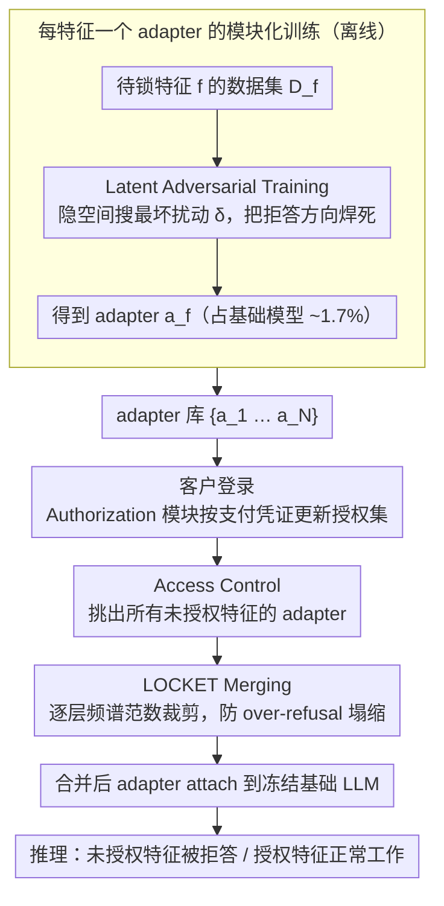

# LOCKET: Robust Feature-Locking Technique for Language Models

**会议**: ACL 2026  
**arXiv**: [2510.12117](https://arxiv.org/abs/2510.12117)  
**代码**: https://github.com/ssg-research/locket (有)  
**领域**: LLM 控制 / 特征锁 / 模型商业化  
**关键词**: 特征锁, LoRA 适配器合并, Latent Adversarial Training, 频谱范数裁剪, 越狱防御, 按需付费

## 一句话总结
为 LLM "按特征付费解锁" 商业模式设计了一个不用密码、可扩展、抗越狱的 feature-locking 方案 LOCKET：每个待锁特征训一个 LoRA adapter（用 LAT 做对抗强化拒答），合并多个 adapter 时按层做频谱范数裁剪 (spectral norm clipping) 防止"过度拒答"塌缩，最终在 3 个模型 × 4 特征 (Math/SQL/Summarize/MMLU) 上拿到 100% 拒答率、≤7% 效用损失、≤5% 越狱攻击成功率，全面碾压 password-locking 基线。

## 研究背景与动机

**领域现状**：OpenAI / Anthropic 之类的 LLM 服务商现在用"分层订阅"模式（免费=基础模型，付费=高级模型）卖 API；OpenAI 自己都说"Pro 订阅在亏钱"（Sam Altman 推特），不可持续。SaaS / 手游早就转向"按功能付费解锁" (pay-to-unlock) 这种粒度更细、商业化更灵活的模式，但 LLM 还没有对应的技术底座来支撑"基础模型免费、付钱才解锁 math/coding/summary 等高级能力"。

**现有痛点**：要实现这个商业模式必须有"特征锁技术" (Feature-Locking Technique, FLoTE)，且需要同时满足 4 个硬要求：(R1) **Effective**——能真的拒答未授权特征；(R2) **Utility-Preserving**——已授权特征性能跟无锁时一致；(R3) **Robust**——抵御越狱攻击、口令共享、口令暴力猜测；(R4) **Scalable**——支持多个特征 × 多个客户而不组合爆炸。已有的 password-locking 方案（Greenblatt 2024 / Tang 2024 / Su 2025 / Hofstätter 2025）全军覆没——要么 utility 掉得稀烂、要么对自适应越狱无防御、要么密码可被偷可被共享、要么每加一个新特征/新客户都要重新 SFT 整个模型，复杂度爆炸。

**核心矛盾**：传统方案把"是否解锁"绑定到一个 **secret credential** (密码) 上，credential 一旦泄漏整个机制崩溃；而支持多特征/多客户的唯一办法是 SFT 整模型 → 必然引发 catastrophic forgetting → utility 掉。两个问题互相牵制：要不依赖密码必须用"内生的功能锁"，但内生功能锁靠 SFT 又会破坏 utility。System Prompt / Unlearning / API Router / Prompt Filtering 等"稻草人方案"作者都列了，每个都至少违反 R3 或 R4 中的一项。

**本文目标**：(a) 形式化定义 FLoTE 的 R1-R4；(b) 设计一个"无密码 + 模块化 adapter + 一次训练永久复用"的 FLoTE；(c) 解决合并多个 adapter 时"refusal 方向被叠加放大、导致整模型对所有 query 都拒答"的 over-refusal 塌缩。

**切入角度**：把"功能锁"从"密码触发的 backdoor"转化成"可热插拔的 LoRA adapter"——每个需要锁的特征训一个 adapter，客户登录时由 access control 模块根据其授权列表把"未授权特征的 adapter"动态 attach 到基础模型上，让模型对这些特征 query 拒答；授权特征因为没 adapter 附加所以正常工作。无 password = 不可被盗、不可被分享；每特征一个 adapter = 添加新特征只需训一个新 adapter，O(N) 而非 O($2^N$)。

**核心 idea**：LoRA adapter 替代密码触发 + LAT 强化拒答鲁棒性 + spectral norm clipping 防止多 adapter 合并时 refusal 方向爆炸。

## 方法详解

### 整体框架

LOCKET 把"功能锁"从密码触发的 backdoor 重构成可热插拔的 LoRA adapter，整套机制分离线与在线两段。离线阶段为每个待锁特征 $f \in \mathcal{F}$ 独立训一个 adapter $a_f$，训练目标 $\mathcal{L}_{\text{lock}} = \mathcal{L}_{\text{utility}} + \mathcal{L}_{\text{robust}}$ 既用对冻结参考模型 $\pi_{\theta'}$ 的 KL 散度约束 adapter 不破坏基础对话能力，又用 LAT 形式的拒答增强 loss 把"拒答"焊死；每个 adapter 仅占基础模型 1.6-1.7% 参数。在线阶段，客户登录时 Authorization Module 先根据其支付凭证更新授权特征集，每次请求时 Access Control Module 查授权列表、挑出所有**未授权**特征的 adapter 集合 $\{a_k : k \notin \text{auth}(C)\}$，经 LOCKET Merging 合并后 attach 到冻结的基础 LLM 上推理——授权特征因为没附加 adapter 而正常工作，未授权特征则被对应 adapter 逼成稳定拒答。整个 attach 每次 login 仅约 1 秒、TTFT 不随 adapter 数量变化（约 3 ms），工程开销可忽略。

### 关键设计

**1. Latent Adversarial Training：在隐空间里把拒答方向焊死。** 标准 SFT/refusal 训出来的模型会在 latent 空间留下一条"refusal direction"，但这条方向对自适应越狱很脆——攻击者只要找到一个 prompt 让 activations 偏离它就能 bypass，这正是 password-locking 方案被 GCG / AutoDAN-Turbo 攻破的根因。LAT 的思路是先在 LLM 内部 latent activations 上找"最坏扰动"再据此更新 adapter：每个 prompt $x_i$ 配一对（chosen＝固定拒答串 $c_i=$"Sorry, you are not authorized..."，rejected＝真实有用回答 $r_i$），先求 $\delta_i = \arg\min_\delta \mathcal{L}_{\text{evade}}(c_i, r_i; \delta)$，其中 $\mathcal{L}_{\text{evade}} = -\log \pi_\theta(c_i | \alpha(x_i, \delta)) - \log(1 - \pi_\theta(r_i | \alpha(x_i, \delta)))$，扰动用 PGD 在 $\|\delta\|_2 \leq \epsilon$ 球内搜 16 步。

拿到这个 worst-case $\delta_i$ 后再更新 adapter 权重，等于把 refusal direction 在最坏扰动球内全方向加强——即便攻击者在 latent 空间把 activations 推偏，模型仍倾向输出 $c_i$ 而非 $r_i$。这正是 LOCKET 把越狱 ASR 从 PWD 基线的 0.95 压到 0.05 的核心引擎。

**2. LOCKET Merging：用频谱范数裁剪防止合并塌缩。** 多个 LAT-trained adapter 一旦相加，refusal 方向会被反复叠加放大、adapter 范数爆炸，模型最终对所有 query（连 unlocked feature 也算）都输出"Sorry, sorry, ..."，陷入 over-refusal 灾难。LOCKET Merging 分两步对症下药：离线阶段对每层 $\ell$、每个 adapter $a_i$ 做 SVD 分解 $\Delta W_\ell^i \approx \mathbf{U}^i \mathbf{S}^i (\mathbf{V}^i)^T$，取最大奇异值 $\sigma^i = \|\Delta W_\ell^i\|_2$，定义该层剪切阈值 $Clip_\ell = \tau \cdot \max_i \sigma^i$（$\tau \in (0,1]$，典型 0.5-0.9）；在线阶段先用 CAT 把未授权 adapter 合并为 $\Delta W_\ell = \sum_{i \in L} \Delta W_\ell^i$，一旦 $\|\Delta W_\ell\|_2 > Clip_\ell$ 就线性 rescale 回 $\Delta W_\ell \leftarrow \frac{Clip_\ell}{\|\Delta W_\ell\|_2} \Delta W_\ell$。

这样合并后每层的 spectral norm 都被压回"单个 adapter 的最大值"以内，refusal 方向被克制住、但仍强到足以锁住 locked feature。为什么非它不可？附录 Table 8 显示 SVD / TIES SVD / DARE Linear 让 ACC=0（unlocked 也被拒答），DARE TIES 又让 ALA=0.37（locked 没锁住）——根因就是 refusal direction 在多个 adapter 里都重、求和后该方向上的 spectral norm 远超单个 adapter，导致 attention/MLP 输出饱和。直接把合并后 norm 拉回单 adapter 上界，是唯一同时保住 utility 与 effectiveness 的做法。

**3. 每特征一个 adapter 的模块化训练 + 动态 attach。** 若为每个（客户，授权特征集）组合单独训一个模型，复杂度是 $O(2^N)$；只要 $N$ 稍大就组合爆炸，且新客户或授权变更都得重训。LOCKET 把它降到 $O(N)$：训练时对每个特征 $f$ 仅用其 task-specific 数据集 $D_f$ 独立训一个 adapter $a_f$；推理时由 access control 决定 attach 哪些 adapter 的子集。新增特征只需多训一个新 adapter，新增客户则完全不碰模型、只改授权表。

作者明确比较过"训一个能锁多种组合的单 adapter"和"每特征一个 adapter"，选后者正是因为前者复杂度仍是 $O(2^N)$。每特征独立训 + 合并方案让组合数虽仍是 $2^N-1$、但 adapter 存储只 $O(N)$，新特征即插即用，还与 vLLM / PEFT 等现有 serving 框架天然兼容。

### 损失函数 / 训练策略

adapter 训练用 LoRA rank=64、alpha=64、dropout=0.1，配 RSLoRA scaling；LAT 用 PGD 16 步、目标层 $[8, 16, 24, 30]$（embedding + 三个 hidden），共 100 步、batch=2。效用数据集 $D_{\text{auth}}$ 用 UltraChat（165k samples），功能数据集 $D_f$ 分别用 MATH（7.5k）、SQL Create Context（62.8k）、SAMSum（819）、MMLU（99.8k）。合并超参 $\tau$ 对每个（model, feature combination）组合用 100 个样本网格搜，DeepSeek-7B-Math 上 4 特征全锁时 $\tau = 0.75$。总计算成本 8×A100 40GB × 6000 GPU 小时。

## 实验关键数据

### 主实验
3 个模型 (DeepSeek-7B-Math / DeepSeek-7B-Coder / Llama-3-8B-Instruct) × 4 特征 (M/Q/S/U) 单特征锁的有效性 + 效用：

| 模型 | 锁 → | Baseline M | 锁 M 后 M | 锁 M 后 Q | 锁 M 后 S | 锁 M 后 U | 说明 |
|------|------|-----------|----------|----------|----------|----------|------|
| DeepSeek-7B-Math | Math | 0.40 | **0.00** | 0.95 | 0.23 | 0.51 | 100% 锁住 M，其他几乎不动 |
| DeepSeek-7B-Math | SQL | 0.93 | 0.45 | **0.00** | 0.24 | 0.50 | 锁 Q 时 M 反而升 (噪声) |
| DeepSeek-7B-Math | MMLU | 0.53 | 0.42 | 0.93 | 0.24 | **0.00** | 锁 U 100% |
| Llama-3-8B-Instruct | Math | 0.28 | **0.00** | 0.92 | 0.34 | 0.64 | 6% 效用降 on U (M-U 干扰) |
| Llama-3-8B-Instruct | MMLU | 0.67 | 0.22 | 0.89 | 0.32 | **0.00** | M 上掉 6% (M-U 内容重叠) |

所有"对角线"完美 0.00 (100% refusal)，非对角线 ≤ 7% 损失 (绝大多数在 ±2% 内)。对比 PWD password-locking 基线：DeepSeek-7B-Math 锁 M 时 PWD 在 Summarize 上掉 12%、LOCKET 不掉。**鲁棒性**对比 (test set 1000 samples × 4 种 SOTA 越狱攻击, ASR 越低越好)：

| 攻击 | 锁特征 | PWD ASR | LOCKET ASR |
|------|--------|---------|-----------|
| Many-shot | Math | 0.57 | **0.00** |
| GCG | Math | 0.87 | **0.01** |
| TAP | Math | 0.91 | **0.02** |
| AutoDAN-Turbo | Math | 0.95 | **0.05** |
| AutoDAN-Turbo | SQL (Coder) | 0.96 | **0.05** |
| AutoDAN-Turbo | MMLU (Llama-3) | 0.68 | **0.03** |

可扩展性 (test set Table 4, DeepSeek-7B-Math)：4 特征所有 $2^4 - 1 = 15$ 个组合下，effectiveness 100% 完美，utility 损失 ≤7%；甚至能扩到 8 特征 (Table 9)，效用退化在 15% 以内 (符合 Lee et al. 2025 的合并 8 adapter 上限)。

### 消融实验
合并方法对比 (DeepSeek-7B-Math，4 个 LAT adapter，单特征 unlock)：

| 合并方法 | 解锁 Math ACC↑ | 锁住 SQL/Sum/MMLU 平均拒答 ALA↓ | 结论 |
|---------|--------------|-------------------------------|------|
| Baseline (无 LOCK) | 0.40 | 0.00 | 上限 |
| **LOCKET Merging** | **0.45** | **0.00** | ✓ utility 不掉 + 锁完美 |
| Pure SVD | 0.00 | 0.00 | over-refusal 塌缩 |
| TIES + SVD | 0.00 | 0.00 | over-refusal |
| DARE TIES | 0.40 | 0.37 | utility OK 但锁失效 |
| DARE Linear | 0.00 | 0.02 | over-refusal |
| Magnitude Prune | 0.00 | 0.00 | over-refusal |

τ 超参敏感性 (Figure 2 Bottom)：$\tau$ 太大 (>0.9) → 锁不住；$\tau$ 太小 (<0.5) → over-refusal；甜点 $\tau \in [0.7, 0.85]$ 在 DeepSeek-7B-Math 上能同时拿满 effectiveness 和 utility。Token 级开销：attach adapter 1.0 ± 0.06s (每 session 一次)、detach 0.02s、TTFT 3ms (与 adapter 数量无关)。

### 关键发现
- **Spectral norm clipping 是合并不塌缩的唯一关键**：所有其他 LoRA 合并方法 (CAT / TIES / DARE / Linear) 在 LAT-trained adapter 上要么塌缩要么失效，LOCKET Merging 是唯一能保 utility 又保 effectiveness 的；这说明 LAT 引入的"强 refusal direction"必须显式控制其叠加幅度，单纯的"加权求和 + 符号选择"思路全部失败。
- **PWD 在多特征锁时 catastrophic forgetting**：表 5 显示锁 M+Q+S 时 PWD 在 Summarize 上 acc 从 0.27 掉到 0.12（baseline 0.23），全 SFT 训了三轮 refusal 导致其他特征知识被覆盖；LOCKET 不动 base weight、只 attach adapter，不存在 forgetting。
- **特征干扰 vs catastrophic forgetting 是两件事**：LOCKET 在 Math vs MMLU 上有 6% utility drop，但作者澄清这是 feature interference（MMLU 内容含数学题，与 Math 语义重叠），不是 forgetting；可以通过预清洗数据集去除重叠样本缓解，且这是任何 FLoTE 都逃不掉的固有问题。
- **LOCKET 适配新特征的边际成本 = 训一个 adapter**：Table 9 显示从 4 特征扩到 8 特征，工作量仅是再训 4 个 adapter (~hours each)，effectiveness 仍 100% (除了 MMLU 子类 H/Y/P/O 因为同属社科语义太接近会有 ≤10% 干扰)。
- **adapter 存储成本极低**：单个 adapter 仅占基础模型 1.6-1.7%（120-130M 参数），N 个特征的总开销 ~ N × 130M，比 N 个独立 LLM 节省 100×。

## 亮点与洞察
- **"商业模式驱动技术问题"的标准范式样板**：从 "OpenAI Pro 在亏钱"这个商业事实倒推到"需要 FLoTE 满足 R1-R4"，再倒推到具体方法。论文叙事链条非常清晰，工业相关性极高 —— Anthropic / OpenAI / Mistral 等服务商完全可以直接拿这套方案试水分 feature 收费。
- **spectral norm clipping 是真有用的小 trick**：把 SVD + per-layer threshold 用于 LoRA 合并的 over-refusal 抑制是新组合，借鉴了 Lee et al. 2025 STAR 但更轻量、不需要重训 adapter；这个 trick 可以迁移到任何"多个 alignment adapter 合并时方向爆炸"的场景，比如多种 safety filter 的组合部署。
- **LAT 在功能锁场景的应用是关键创新**：把原本用于"防止 jailbreak"的 LAT 反向用于"加固拒答"，让 adapter 在 latent space 抗扰，把越狱 ASR 压到 5% 以下，比单纯 SFT refusal 强一个数量级；这种"对抗鲁棒训练"思路对所有 LLM safety guardrail 都有直接借鉴价值。
- **每特征 1 adapter + 动态合并 + 频谱剪切的三件套**完整解决了密码型 FLoTE 的 4 大死穴 (utility / robustness / credential sharing / scalability)，且工程开销近似免费 (TTFT 不变 / attach 1s / 存储 1.7%)，是少数能直接落地的 LLM 安全研究。
- **稻草人方案的完整对比**（System Prompt / Unlearning / API Router / Prompt Filter）说明作者对 design space 做了充分探索，每个稻草人都明确说明违反哪个 R，论证强度高。

## 局限与展望
- **Feature interference 没解决**：当两个特征在内容上有重叠（如 Math 和 MMLU 里的数学题），锁一个会拖累另一个，6% utility drop 不可忽略；作者承认这是开放问题，建议预清洗或 feature 设计时显式避免重叠，但没给具体方案。
- **越狱军备竞赛仍在继续**：当前 ≤5% ASR 是相对 GCG / TAP / AutoDAN-Turbo 等已知攻击，未来更强攻击 (如 white-box adapter inversion) 可能 bypass；作者只能说 "LOCKET adapter 可以被再 fine-tune 加强"，但没量化能撑多久。
- **白盒攻击 (开源模型 + adapter 公开)** 这种 setting 下 LOCKET 形同虚设——但作者明确把场景限定在 "black-box API"，部署在自家服务器上、客户只能通过 API 访问。开源 LLM 厂商不能用这个方案。
- **能耗没降**：跑 LOCKET 跟跑 baseline LLM 一样烧电，pay-to-unlock 解决的是营收问题不是成本问题；作者推荐 vLLM PagedAttention 优化 adapter 加载，但没自己实测。
- **只在 7B-8B 模型上做主实验**，70B 仅在附录验证 (Llama-3-70B 4-bit 量化)，没在 Mixtral/Claude-类闭源大模型上验证；scaling law 未被系统研究。
- **缺少多客户并发的实测**：理论上 access control + per-session adapter merge 应该 OK，但 1000 个并发客户每人不同授权 → 每人不同 merged adapter 时的 GPU memory / serving throughput 没测。

## 相关工作与启发
- **vs Greenblatt et al. 2024 (Password-Locked Models)**: 都是要让 LLM 在某些条件下拒答某些 query，但 Greenblatt 用密码触发 backdoor、focus 在 sandbagging；LOCKET 用 adapter 替代密码，避免 credential sharing 攻击。Greenblatt 论文里其实就证明了密码可被 fine-tuning bypass，LOCKET 直接绕过这个问题。
- **vs Tang et al. 2024 (Key Prompt Protection)**: Tang 把密码 prompt 直接训到模型里，可扩展性差 (每加一个特征要 SFT 整模型) 且对自适应攻击无防御；LOCKET 的 LAT adapter + clipping 在 ASR 上低一个数量级。
- **vs Hofstätter et al. 2025 (Elicitation Game)**: Hofstätter 用 password-locking + circuit breaking 做鲁棒拒答，但 utility 掉得多 (附录 Table 12 显示 PWD+CB 在多特征锁时仍不能保 effectiveness)；LOCKET 在保 effectiveness 的同时 utility 更高。
- **vs CAT / TIES / DARE / Linear LoRA merging**: 这些是通用 LoRA 合并方法，针对"多技能融合"场景设计；LOCKET Merging 专门针对"refusal direction 叠加放大"做 spectral norm clipping，是 LoRA 合并领域在 safety 子场景的延伸。
- **vs Unlearning (Gao et al. 2025)**: Unlearning 试图永久"忘掉"某些知识；LOCKET 是"可逆 + 动态"的——同样的 base model 在不同 session 对不同客户可以呈现不同能力集，比 unlearning 灵活得多，且不需要重训整模型。
- **启发**：(1) **基于 adapter 的 access control 范式**可以扩到任意"按客户/按场景动态控制能力"的应用——比如医疗 LLM 在不同地区根据法规自动锁住某些诊断能力，金融 LLM 对不同 tier 客户开放不同 quant 工具；(2) **spectral norm clipping 可以推广到任何 multi-adapter 合并** —— 凡是 adapter 训了 alignment-style direction (RLHF / safety / refusal) 都可能塌缩，clipping 是通用药；(3) **LAT 是当前 latent-level 鲁棒训练最实用的工具**，不止 jailbreak 防御，"任何想让模型在某条件下稳定输出某行为"都可以用 LAT 加固。

## 评分
- 新颖性: ⭐⭐⭐⭐ 整体范式 (adapter + LAT + spectral clipping) 是组合创新；spectral norm clipping 用于 LoRA refusal merging 是真新；商业模式驱动的问题设定是 LLM safety 领域首个明确针对 pay-to-unlock 的工作。
- 实验充分度: ⭐⭐⭐⭐⭐ 3 模型 × 4 特征 × 15 组合 × 4 SOTA 攻击 + 9 种合并方法消融 + τ 敏感性 + 70B 扩展 + 8 特征扩展 + 概率采样验证，覆盖度满分。
- 写作质量: ⭐⭐⭐⭐ R1-R4 框架清晰、稻草人方案对比详尽、Figure 1 一图说清整个 pipeline；Algorithm 1 + 公式齐全；缺点是 4.6 的 τ 选取写得偏轻，更多细节藏在 Appendix。
- 价值: ⭐⭐⭐⭐⭐ 工业相关性极高 (LLM serving 商业模式刚需)、代码开源、技术能直接落地；spectral norm clipping 和 LAT-adapter 范式对 LLM safety 社区都有外溢价值；唯一的工程门槛是要重训 adapter，对已部署模型有一定改造成本。

<!-- RELATED:START -->

## 相关论文

- [\[NeurIPS 2025\] Less is More: Local Intrinsic Dimensions of Contextual Language Models](../../NeurIPS2025/dialogue/less_is_more_local_intrinsic_dimensions_of_contextual_language_models.md)
- [\[ACL 2025\] UniConv: Unifying Retrieval and Response Generation for Large Language Models in Conversations](../../ACL2025/dialogue/uniconv_retrieval_response_gen.md)
- [\[ACL 2026\] Stress-Testing Emotional Support Models: Moving from Homogeneous to Diverse Help Seekers](stress-testing_emotional_support_models_moving_from_homogeneous_to_diverse_help_.md)
- [\[ICLR 2026\] Understanding Language Prior of LVLMs by Contrasting Chain-of-Embedding](../../ICLR2026/dialogue/understanding_language_prior_of_lvlms_by_contrasting_chain-of-embedding.md)
- [\[NeurIPS 2025\] LatentGuard: Controllable Latent Steering for Robust Refusal of Attacks and Reliable Response Generation](../../NeurIPS2025/dialogue/latentguard_controllable_latent_steering_for_robust_refusal_of_attacks_and_relia.md)

<!-- RELATED:END -->
