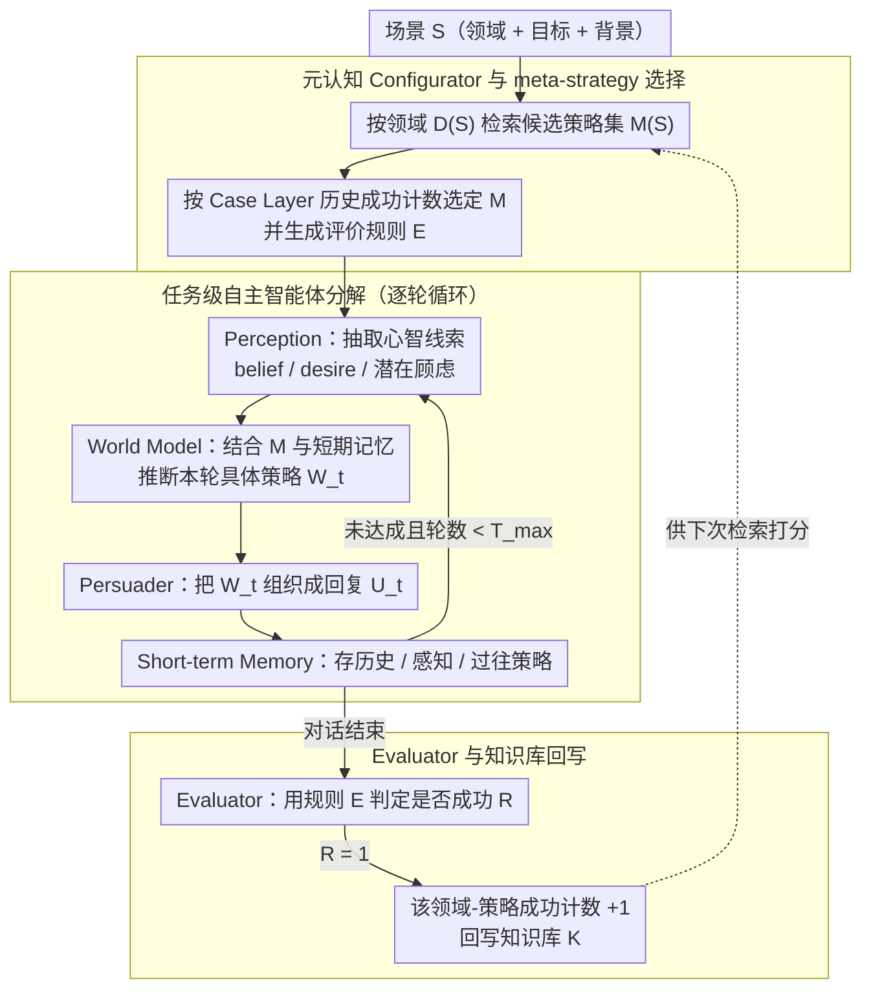

# MA$^2$P: A Meta-Cognitive Autonomous Intelligent Agents Framework for Complex Persuasion

**会议**: ACL2026  
**arXiv**: [2605.18572](https://arxiv.org/abs/2605.18572)  
**代码**: 论文称将释放 prompt、代码与知识库，但缓存中未给出公开仓库链接  
**领域**: 对话系统 / LLM Agent / 说服式对话  
**关键词**: 复杂说服, 元认知, 多智能体, 心智状态建模, 策略知识库

## 一句话总结
MA$^2$P 将复杂说服对话拆成“元策略选择-任务级多智能体说服-事后知识更新”的闭环，在不训练底座 LLM 的情况下，把被说服者的信念、欲望和顾虑转成更具体的策略动作，并在 CToMPersu 上显著提升多种 LLM 的说服成功率。

## 研究背景与动机
**领域现状**：说服式对话已经从早期单领域捐赠、协商类任务，发展到更多领域和更细粒度用户状态建模。新的 CToMPersu 这类数据集不仅给出对话上下文，还暴露被说服者的 belief、desire 等心智状态，因此模型不能只生成流畅回复，还要根据隐含顾虑持续规划。

**现有痛点**：当前 LLM 说服者通常是单个 next-turn generator。它们能识别“缺钱”“没有时间”等显性障碍，却常常停在泛泛建议，例如只强调心理治疗的重要性，而没有把障碍转成保险报销、线上时段、低成本试用等可执行行动。另一个问题是跨领域表现不稳：缓存中给出的动机实验显示，gpt-5-mini 在 CToMPersu 各领域成功率从 88.24% 到 16.67%，跨度达 71.57 个百分点。

**核心矛盾**：复杂说服不是单轮语言生成，而是部分可观测、多轮、目标导向的交互任务。模型既要根据对方的隐藏状态选择策略，又要在不同领域之间保持稳定泛化；单体 LLM 缺少显式规划状态和策略记忆，容易反应式地输出漂亮但不落地的话。

**本文目标**：作者希望构建一个 plug-and-play、training-free 的外部框架，让任意底座 LLM 都能更稳定地完成复杂说服。具体子问题包括：如何从对话历史抽取心智状态，如何把高层心理策略落实成下一轮具体话术，如何用历史成功案例降低跨领域波动，以及如何在对话后把成功经验写回系统。

**切入角度**：论文借鉴 LeCun 式自主智能体中的 perception、world model、actor、memory、cost/evaluator 结构，同时引入元认知中的 planning、monitoring、evaluation。它的核心观察是：说服系统需要先决定“这类场景应该用什么高层策略”，再由任务级 agent 生成下一轮行动，而不是每轮临时让 LLM 自由发挥。

**核心 idea**：用一个元认知配置器先从结构化知识库选择领域相关的 meta-strategy，再让 Perception、World Model、Persuader、Memory、Evaluator 多个智能体在闭环中执行和更新，从而把心智状态线索转化为策略一致的可执行说服动作。

## 方法详解

### 整体框架
MA$^2$P 把一次说服对话建模为三阶段循环。输入是场景 $S$，包括领域、目标和背景；输出是多轮说服对话以及更新后的知识库。第一阶段是 **Meta-level Judging**：Configurator 根据场景领域从知识库检索候选 meta-strategy，选择历史上最有效的策略，并构造本轮评价规则。第二阶段是 **Task-level Persuading**：多个自主智能体协作生成每一轮回复，包括感知心智线索、推断具体策略、生成话术并维护短期记忆。第三阶段是 **Knowledge Updating**：Evaluator 判断本轮是否成功，成功案例会回写到知识库，使后续相似领域的策略选择更有依据。

这套框架不是重新训练 LLM，而是作为外部 orchestration layer 接到底座模型上。实验中同一套 MA$^2$P 可以套在 gpt-4o-mini、gpt-4o、gpt-5-mini、gemini-2.5-flash 和 deepseek-v3 上，体现了 plug-and-play 的设计目标。

### 关键设计

**1. 元认知 Configurator 与 meta-strategy 选择：对话开局先定高层策略，而不是每轮临场拍脑袋**

跨领域波动的根源之一是 LLM 对不同领域的策略泛化不均匀，弱领域里它常常盲目发挥、停在泛泛建议。Configurator 把这件事提前到对话开始之前：知识库按 meta-strategy、domain、case 三层组织，它先取出与当前领域 $D(S)$ 匹配的候选策略集合 $M(S)$，再用 Case Layer 里该领域-策略组合的历史成功次数给每个候选打分，选出 $M=\arg\max_{m \in M(S)} score(m,S)$ 作为本场景的全局意图；同时它还顺手生成一套供第三阶段 Evaluator 使用的成功判据 $E$。这相当于把“某个领域里哪类策略更管用”显式记成可检索的证据，让系统先有“这场该怎么说服”的方向，再进入逐轮生成，从而在弱领域少踩坑。

**2. 任务级自主智能体分解：把抽象 meta-strategy 翻译成每一轮具体、落地的话术**

单体 LLM 直接生成下一句话，容易识别出“缺钱”“没时间”这类显性障碍却只会泛泛劝说，把障碍落实成可执行行动的能力很弱。MA$^2$P 把这一步拆给一条小流水线：Perception 先从历史 $H_t$ 抽取显性信号和潜在心智线索 $P_t=f_{perc}(H_t)$（belief、desire、latent concern）；World Model 再结合选定的 meta-strategy $M$ 和短期记忆 $\Sigma_t$ 推断本轮的具体策略 $W_t=f_{wm}(M,\Sigma_t)$；Persuader Agent 把 $W_t$ 和对话历史组织成自然语言回复 $U_t=f_{pers}(W_t,H_t)$；Short-term Memory 则持续保存历史、感知结果与过去策略 $\Sigma_t=\{H_t,P_t,W_{1:t-1}\}$。这套“先理解对方为什么抗拒、再决定策略、再组织措辞”的分工更贴近人类说服流程；在阻力隐含且动态变化的场景里，显式 memory 还能防止策略漂移和重复劝说同一句话。

**3. Evaluator 与知识库回写：把一次成功的说服沉淀成可复用经验**

说服策略的有效性高度依赖领域和人群，一次性的成功如果不记下来，下次相似场景还得从零摸索。Evaluator 用第一阶段生成的规则 $E$ 和最终短期记忆 $\Sigma_T$ 判断本轮是否成功，得到 $R=f_{eval}(E,\Sigma_T)$；一旦 $R=1$，系统就把所选 meta-strategy 在当前领域的成功计数加一，即 $K_{case}(M,D(S)) \leftarrow K_{case}(M,D(S))+1$，并通过 $K'=update(K,M,S,R)$ 生成更新后的知识库。正是这条回写通道让框架从冷启动的规则化 agent 逐渐长成带经验的元认知系统——下一次同领域对话时，Configurator 的打分就有了更扎实的依据。

### 一个完整示例：劝说一位顾虑费用的来访者尝试心理治疗

以一次心理健康场景为例走一遍闭环。**Meta-level Judging**：Configurator 识别出领域 $D(S)$ 为“心理咨询”，从知识库取出候选 meta-strategy 集合 $M(S)$，根据 Case Layer 中“降低行动门槛”类策略在该领域的历史成功计数最高，选定它作为 $M$，并生成成功判据 $E$（例如“来访者明确表示愿意尝试一次”）。**Task-level Persuading**：第 1 轮 Perception 从来访者“我觉得治疗太贵了”里抽出 latent concern = 费用顾虑；World Model 把抽象的 $M$ 实例化为本轮策略 $W_1$ = “把费用障碍转成可执行选项”；Persuader 据此生成 $U_1$ —— 不再泛泛强调“治疗很重要”，而是给出保险报销、线上低价时段、首次低成本试用等具体行动；Memory 记下 $\Sigma_1=\{H_1,P_1\}$。若来访者转而担心时间，下一轮 World Model 会基于更新后的 $\Sigma_2$ 切换到时间相关的具体方案，而不会重复上一轮的话。**Knowledge Updating**：对话在 $T_{max}=4$ 轮内来访者答应预约，Evaluator 判 $R=1$，于是“降低行动门槛”策略在“心理咨询”领域的成功计数 $+1$，让后续相似场景的元策略选择更有把握。

### 损失函数 / 训练策略
MA$^2$P 本身不训练底座模型，也没有传统监督损失或 RL 损失。它采用 prompt-based、多 agent 调度的 inference-time 策略。主实验使用 CToMPersu 官方测试集 525 个实例，最大对话轮数 $T_{max}=4$，固定 gpt-4o-mini 作为被说服者模拟器和 LLM judge。知识库大小作为 warm-up 超参研究：$K=0$ 时已经有 0.66 成功率，$K=500$ 时达到 0.79，并作为主实验设置。

## 实验关键数据

### 主实验
论文在 CToMPersu 上比较五个底座 LLM 及其 MA$^2$P 增强版本。指标包括 Success、Persuasive、Logic、Helpful、跨领域 Range/SD，以及平均成功轮数 Avg_Turn。下面保留最能说明效果的成功率和轮数数据：

| 底座模型 | Success 基线 | Success + MA$^2$P | 提升 | Avg_Turn 基线 | Avg_Turn + MA$^2$P |
|----------|--------------|-------------------|------|---------------|--------------------|
| gpt-4o-mini | 0.45 | 0.79 | +0.34 | 2.94 | 1.86 |
| gpt-4o | 0.46 | 0.75 | +0.29 | 3.03 | 2.00 |
| gpt-5-mini | 0.51 | 0.72 | +0.21 | 2.66 | 1.60 |
| gemini-2.5-flash | 0.46 | 0.66 | +0.20 | 3.27 | 2.08 |
| deepseek-v3 | 0.53 | 0.80 | +0.27 | 3.05 | 1.82 |

质量指标也基本提升：例如 gpt-5-mini 的 Persuasive 从 6.40 到 7.15、Logic 从 7.81 到 8.28、Helpful 从 7.55 到 8.27；deepseek-v3 的 Persuasive 从 6.98 到 7.58，Helpful 从 7.84 到 8.42。例外是 gemini-2.5-flash 的 Logic 和 Helpful 略降，但 Success 仍提升 0.20。

### 消融实验
作者比较了 base LLM、没有元认知增强的自主智能体系统（+Auto）和完整 MA$^2$P。结果说明：多 agent 分解本身提升成功率，但元认知配置器进一步降低跨领域波动。

| 模型 | 配置 | Success | Range | SD | 说明 |
|------|------|---------|-------|----|------|
| 4o-mini | Base | 0.45 | 0.450 | 0.104 | 单体说服者 |
| 4o-mini | + Auto | 0.66 | 0.530 | 0.118 | 成功率升高，但领域波动变大 |
| 4o-mini | + MA$^2$P | 0.79 | 0.400 | 0.107 | 成功率最高，Range 下降 |
| 4o | Base | 0.46 | 0.500 | 0.114 | 单体说服者 |
| 4o | + Auto | 0.68 | 0.458 | 0.120 | 成功率升高，SD 略增 |
| 4o | + MA$^2$P | 0.75 | 0.488 | 0.109 | 成功率继续升高，SD 降低 |

### 知识库规模与人工偏好
| 设置 | 关键结果 | 含义 |
|------|----------|------|
| K=0 | Success 0.66, Range 0.53, SD 0.118 | 冷启动也有效，但更像 +Auto |
| K=100 | Success 0.73, Range 0.44, SD 0.107 | 少量 warm-up 已明显改善 |
| K=500 | Success 0.79, Range 0.40, SD 0.107 | 主实验采用，整体最好 |
| 人工偏好 | 400 个样本、2 名计算机硕士标注；LLM-human weighted Cohen's $\kappa_w=0.549$ | LLM 与人类偏好中等一致，趋势均偏向 MA$^2$P |

### 关键发现
- MA$^2$P 对五个底座模型都提升 Success，说明收益不是某个 API 模型的偶然 prompt trick。
- +Auto 能提升平均成功率，但有时扩大领域差距；完整 MA$^2$P 的价值在于把“多智能体执行力”与“领域级策略选择”结合起来。
- Warm-up 并不需要很大：K=100 已经从 0.66 提升到 0.73；但 K=500 在成功率和 Range 上最稳。
- 缓存只给出 A/B 偏好图的趋势，没有列出具体 win/tie/lose 百分比，因此这里只记录样本量和 $\kappa_w$，不补造图中数值。

## 亮点与洞察
- **把说服从生成问题改写成闭环控制问题**：论文没有继续堆 prompt，而是把说服建模成感知、世界模型、行动、记忆和评价的循环。这让“理解顾虑”和“生成话术”之间多了一个可解释的策略层。
- **元策略选择解决跨领域稳定性，而不只是提高均值**：+Auto 已能提高成功率，但完整 MA$^2$P 更强调 Range/SD。这一点很重要，因为真实说服系统不能只在强领域更强，还要避免弱领域彻底失效。
- **知识库设计很轻量**：Case Layer 只是记录领域-策略成功计数，却能提供可解释的 meta-strategy prior。对于很多 LLM agent 系统，这种“轻量经验统计 + prompt 调度”可能比复杂训练更容易落地。
- **训练免费但不等于部署免费**：它把训练成本转成推理时多 agent 调用和 warm-up 交互成本。这种折中适合高价值低吞吐任务，例如咨询、教育辅导、谈判辅助，但不一定适合高并发聊天机器人。

## 局限与展望
- 自动指标主要依赖 gpt-4o-mini judge，开放式说服质量仍有主观性；虽然有人类偏好验证，但只有 2 名标注者和 400 个样本，规模偏小。
- 被说服者模拟仍较简单，只条件化 belief 和 desire，没有系统建模人格、长期偏好、价值观、信任关系等变量。真实说服互动里的“人”比这个模拟器复杂得多。
- 新领域需要 warm-up 阶段来积累知识库案例，冷启动虽然可用，但最好效果依赖 K=500 这类经验规模。
- 论文关注有明确用户目标的教育、咨询等场景，但说服技术天然有滥用风险。未来如果面向真实用户，需要更强的 consent、敏感领域限制、操纵风险评估和可审计日志。
- MA$^2$P 的多 agent 调度会增加推理调用成本和系统复杂度，论文没有详细报告延迟、token 成本或错误传播分析。

## 相关工作与启发
- **vs 单体 LLM 说服者**: 单体方法直接从历史生成下一轮回复，优势是简单低成本；MA$^2$P 在外部显式加入心智状态抽取、策略选择和记忆更新，优势是更可解释、更稳定，但推理链更长。
- **vs 用户状态感知说服方法**: 既有方法强调识别用户状态或选择心理策略，本文进一步把策略选择放进可更新知识库，并在每轮由 World Model 实例化为具体动作。
- **vs ReAct / Reflexion 类 agent**: ReAct 更通用，强调思考-行动-观察；MA$^2$P 是说服任务专用，把 meta-strategy、persuasion principles 和 domain-case success count 放到核心位置。
- **启发**: 对话 agent 的“记忆”不一定要保存完整长文本，也可以保存任务相关的结构化统计。对于客服挽留、学习动机干预、医疗依从性沟通等场景，可以考虑把 MA$^2$P 的领域-策略成功计数扩展成更严格的因果或 bandit 策略选择机制。

## 评分
- 新颖性: ⭐⭐⭐⭐☆ 把自主智能体蓝图和元认知策略选择用于复杂说服，组合扎实且任务契合，但核心模块多依赖 prompt 调度和成功计数。
- 实验充分度: ⭐⭐⭐⭐☆ 覆盖 5 个底座模型、消融、warm-up、人类偏好和案例分析；不足是自动 judge 占比较高，真实用户实验缺失。
- 写作质量: ⭐⭐⭐⭐☆ 动机清楚，方法图和三阶段算法易读；部分公式更像形式化包装，系统成本分析略少。
- 价值: ⭐⭐⭐⭐☆ 对训练免费、可解释的说服 agent 很有参考价值，尤其适合研究复杂对话规划和跨领域鲁棒性的读者。

<!-- RELATED:START -->

## 相关论文

- [\[ACL 2026\] Cognitive Policy-Driven LLM for Diagnosis and Intervention of Cognitive Distortions in Emotional Support Conversation](cognitive_policy-driven_llm_for_diagnosis_and_intervention_of_cognitive_distorti.md)
- [\[AAAI 2026\] Emergent Persuasion: Will LLMs Persuade Without Being Prompted?](../../AAAI2026/dialogue/emergent_persuasion_will_llms_persuade_without_being_prompted.md)
- [\[AAAI 2026\] Chatsparent: An Interactive System for Detecting and Mitigating Cognitive Fatigue in LLMs](../../AAAI2026/dialogue/chatsparent_an_interactive_system_for_detecting_and_mitigating_cognitive_fatigue.md)
- [\[ACL 2026\] STRIDE-ED: A Strategy-Grounded Stepwise Reasoning Framework for Empathetic Dialogue Systems](stride-ed_a_strategy-grounded_stepwise_reasoning_framework_for_empathetic_dialog.md)
- [\[ACL 2026\] ETHICMIND: A Risk-Aware Framework for Ethical-Emotional Alignment in Multi-Turn Dialogue](ethicmind_a_risk-aware_framework_for_ethical-emotional_alignment_in_multi-turn_d.md)

<!-- RELATED:END -->
