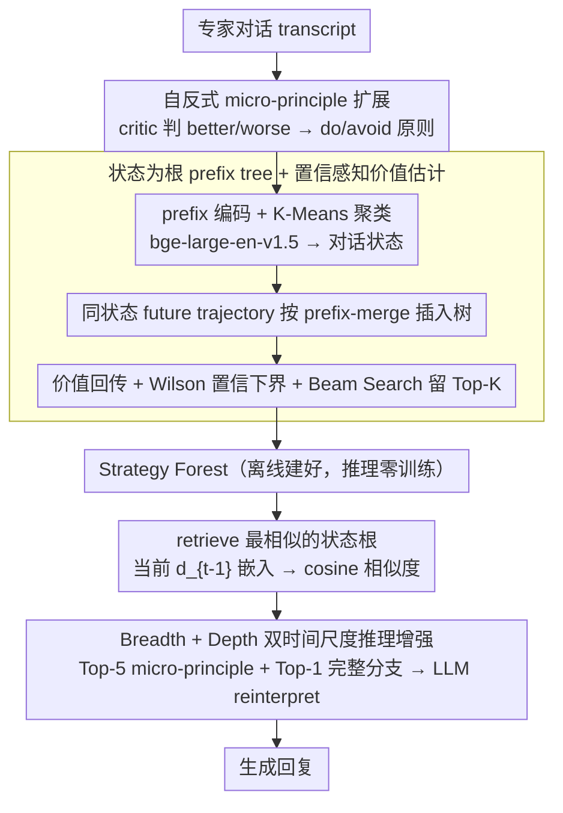

# Metro: Towards Strategy Induction from Expert Dialogue Transcripts for Non-collaborative Dialogues

**会议**: ACL 2026  
**arXiv**: [2604.11427](https://arxiv.org/abs/2604.11427)  
**代码**: https://github.com/Humphrey-0125/METRO (有)  
**领域**: 对话策略 / 非合作对话 / 知识归纳 / LLM agent  
**关键词**: strategy induction、Strategy Forest、谈判、说服、planning logic

## 一句话总结
Metro 把专家对话 transcript 自动归纳成一片 "Strategy Forest"——以 K-Means 聚类的对话状态为根节点的树，节点是 LLM 扩展的 micro-principle 动作、分支是按 Wilson 置信下界 + MCTS 风格价值回传打分剪枝后的完整动作轨迹，推理时直接 retrieve 一棵树、并行抽取 short-term（breadth）和 long-term（depth）建议，无需任何训练就在 P4G / CB 两个非合作对话任务上比 PRINCIPLES、PPDPP、GDP-Zero 等基线平均涨点约 10%。

## 研究背景与动机

**领域现状**：非合作对话（价格谈判、慈善劝捐、债务催收）需要 agent 在对手有 conflicting interest 时还能"赢"。标准范式靠 (i) 领域专家手工 codify strategy action set（如 He et al. 2018 的 negotiation acts、Wang et al. 2019 的 persuasion acts），再 (ii) 训练 plug-in planner（PPDPP）或跑 MCTS（GDP-Zero）来挑动作。这套 pipeline 不可规模化：每换一个领域就要请专家重新写 action set。

**现有痛点**：(i) 专家依赖——action set 的质量决定上限，但人写出来的覆盖度有限，CB 数据集上人工 action 只占簇覆盖率（CC）的 ≤30%；(ii) 缺乏 planning logic——PRINCIPLES (Kim 2025) 已经能从 transcript 抽 "When [situation], you should [action A] rather than [action B], because [reason]" 形式的原则，但它把策略当作 independent unit，丢掉了"什么时候该接哪一招"的多轮 planning logic；(iii) 训练昂贵——PPDPP 要先 SFT 再 RL，GDP-Zero 推理时跑 MCTS 算力爆炸。

**核心矛盾**：strategy 包含两部分知识——"做什么"（action set）和"什么时候做"（planning logic）。前者可以靠 LLM 归纳，后者需要保留多轮上下文的 temporal 结构；但传统 induction 方法只擅长抽 flat 的规则，不擅长把 trajectory 织成 hierarchical 结构。

**本文目标**：让 LLM 直接从 raw transcript 同时归纳出 (a) 扩展后的 action set 和 (b) 与 dialogue state 绑定的多轮 planning logic，并以一种 retrieval-friendly 的结构存下来，推理时无需训练。

**切入角度**：作者观察到——同一个 dialogue state 下可能有多条历史轨迹通向成功/失败，把这些轨迹按状态聚类后做 prefix-merge 就天然形成"以状态为根的树"，每个根 = 一个对话状态、每个分支 = 一条多轮 planning 路径；用 Wilson 下界 + 价值回传剪枝就能筛掉"看似成功但样本少"的不可靠分支。

**核心 idea**：把 expert transcript 归纳成 "Strategy Forest"——breadth（root 的 immediate children）= 短期 tactical 响应，depth（root-to-leaf 完整分支）= 长期 strategic foresight，用 retrieval-augmented prompting 把这两类知识同时注入 LLM 决策。

## 方法详解

### 整体框架

Metro 要解决的是"如何从专家对话 transcript 里同时归纳出'做什么'（action set）和'什么时候做'（多轮 planning logic）"，并把它存成推理时无需训练的结构。它分离线归纳和在线推理两段：离线侧先从每条 transcript 抽 turn-level action 并用 LLM 扩展成 do/avoid 微原则，再把每个 history prefix $d'_i$ 用 bge-large-en-v1.5 编成 1024-d 向量做 K-Means 聚类（P4G 取 K=150、CB 取 K=80），最后为每个 cluster 建一棵以状态为根的树——所有"经过该状态的 future trajectory"按 prefix-merge 插入，节点回传 outcome value，用 Wilson 下界 + Beam Search 留 Top-K 分支，整片树即 Strategy Forest。在线侧，推理 turn $t$ 时把当前 $d_{t-1}$ 嵌入、retrieve 最相似的根，并行抽出 breadth（根的直接子节点，即短期 tactical 响应）和 depth（根到叶的完整分支，即长期 strategic 路线），交给 LLM reinterpret 成 context-aware 的短/长期提示，拼回 prompt 生成回复。

### 关键设计

**1. 自反式 micro-principle 扩展 action set。** raw transcript 里的 action 都是 case-specific 的（"Could you go down to \$50?"），泛化性差，直接拿来当 action set 覆盖度有限——CB 上人工 action 只覆盖 ≤30% 的簇。Metro 让 gpt-4.1-mini 当 critic，结合 local context（前情 + 当前 utterance + 对方回应）判断每个 agent turn 是 better / worse / neutral，5 次独立评估取 majority vote；对 better turn，让 LLM 不看原 action $a_i$、直接总结一条 "When [situation], do [...]" 形式的可复用原则，对 worse/neutral turn 则把原 action 包装成 "When [situation], avoid [$a_i$]"。

每条 micro-principle 都显式 condition 在对方上一句 utterance 上，方便后续按语义相似度 retrieve。这样 action set 就从"具体话术"抽象到"何时该让步/何时该坚持"的策略层级，既能跨 transcript 复用又能跨任务迁移；do/avoid 双路径同时吸收正反信号，避免只学成功样本带来的 distribution shift。

**2. 状态为根的 prefix tree + 置信感知价值估计。** "什么时候用哪个 action"是带 temporal 结构的多轮知识，传统 induction 只擅长抽 flat 规则、丢掉这层 planning logic。Metro 把每条 transcript $D$ 切成 $\{d'_1, \ldots, d'_{T-1}\}$ 个 history prefix，聚类后让同一 cluster 内所有 future trajectory $(a_{t+1}, \ldots)$ 按 prefix-merge 插入树（相同动作序列合并）——这等于把 transcript 看成 MCTS 的展开历史，"经过同一状态的多条历史"自然汇成一棵以对话状态为根的搜索树。

每个节点 $u$ 聚合两类统计：经验成功率 $\hat p(u)=s(u)/n(u)$ 和带 length penalty 的 outcome value $v(d,t) = r(d) - \lambda_{\text{len}}(t+1)/N_d$，价值再沿分支按 depth-discount $\gamma^k$ 回传到根。节点综合分数为 $S(u)=w_{\text{sr}}\cdot p_{\text{lb}}(u) + w_{\text{val}}\cdot \bar V(u) + w_{\text{cnt}}\cdot \log(1+n(u))$，其中 $p_{\text{lb}}$ 是 Wilson score 置信下界——这一手专治策略归纳最容易翻车的坑：一个 6/7 的成功率其实远比 60/70 不可靠，Wilson 下界会自动惩罚"看起来成功但只观测过几次"的分支。length penalty 则避免 agent 学到"靠拖延混到 success"的退化策略。最后用 Beam Search 留 Top-K 分支。

**3. Breadth + Depth 双时间尺度推理增强。** 单用 Top-1 action 容易短视，单用完整 trajectory 又过于刻板，所以 Metro 让 Strategy Forest 同时吐出两条互补建议。推理 turn $t$ 时先把 $d_{t-1}$ 嵌入、和所有根算 cosine 相似度 retrieve 最相似的树 $f$。Breadth 用对方最近一句 utterance 作 query，retrieve cluster 内 Top-5 micro-principles，让 LLM 把抽象原则 reinterpret 成当前对话的具体下一步（如把"build credibility"重写成"先讲清楚 charity 的具体项目"）；Depth 则选 $f$ 里平均节点价值最高的单条完整分支（如 build credibility → propose donation），让 LLM 重写成 high-level planning directive（"逐步建立信任和承诺再提捐款"）。

两条建议拼回 prompt 共同引导回复生成，对应 MCTS 里的 exploitation 与 plan rollout，让 LLM 同时握有"立刻该说什么"和"整局打算怎么走"。和 MCTS 的本质区别是：Metro 的树完全离线预计算，推理时不跑 test-time tree search，每轮只查表 + LLM 单次生成，因此比 GDP-Zero 便宜一个数量级。

### 损失函数 / 训练策略

Metro **完全无需训练**——离线归纳用 gpt-4.1-mini 跑 critic + expansion，编码用 bge-large-en-v1.5，K-Means 聚类用 scikit-learn，推理时 LLM backbone 是 GPT-3.5-turbo（与 baseline 一致）。关键超参：$\lambda_{\text{len}}=0.2$，$\gamma=0.9$，$w_{\text{sr}}=1.0, w_{\text{val}}=0.2, w_{\text{cnt}}=0.05$，Wilson z=1.96，Breadth Top-K=5，Depth Top-1 全长分支。

## 实验关键数据

### 主实验
P4G（charity persuasion）和 CB（CraigslistBargain 价格谈判），200 个 LLM 模拟器 + 5 名人类参与者评测：

| 方法 | P4G SR↑ | P4G AT↓ | CB SR↑ | CB SL%↑ | P4G* SR↑ (人评) | CB* SR↑ (人评) |
|------|---------|---------|--------|---------|------------------|-----------------|
| Standard | 0.620 | 4.56 | 0.185 | 0.154 | 0.333 | 0.283 |
| GDP-Zero (MCTS) | 0.660 | 5.35 | 0.495 | 0.125 | 0.600 | 0.450 |
| PPDPP (训练 planner) | 0.730 | 4.67 | 0.250 | 0.150 | 0.633 | 0.383 |
| PRINCIPLES (induction baseline) | 0.770 | 5.24 | 0.485 | 0.149 | 0.600 | 0.467 |
| **Metro** | **0.780** | 4.76 | **0.575** | **0.189** | **0.661** | **0.483** |

→ 相比 PRINCIPLES 平均涨 10.24%，相比第二名涨 9.93%，且不需训练 / 不需 test-time MCTS。

### 消融实验
Planning Logic 拆解（Table 2）：

| 配置 | P4G SR | CB SR | CB SL% | 说明 |
|------|--------|-------|---------|------|
| Full (Top-5 Nodes + Top-1 Full Branch) | 0.780 | 0.575 | 0.189 | 默认 |
| Breadth Top-1 Node | 0.760 | 0.465 | 0.140 | breadth 缩窄掉 11 pp |
| Depth 1-hop Branch | 0.770 | 0.535 | 0.150 | depth 截断掉 4 pp |
| Depth Top-3 Branches | 0.760 | 0.485 | 0.150 | 加更多分支反而拉低（边际负） |
| w/o Exp. Action | (Fig 3) | ↓ | ↓ | 砍掉 LLM 扩展 micro-principle |
| w/o Depth | ↓ on P4G, **↑ on CB** | — | — | CB 因 source transcript 重复度高，depth 反成噪声 |
| w/o Breadth | ↓ | ↓ | — | 短期建议是更稳定的信号 |

→ 单独看 SR，breadth 的边际收益大于 depth；depth 的有效性强依赖 source transcript 多样性（CB transcript 重复率 27%，去 depth 反而涨）。

### 关键发现
- **Action diversity 是 Metro carry 的核心**：Cluster Coverage 分析显示 Metro 在 K=100 时仍能覆盖 ~80% 簇，PRINCIPLES 只覆盖 ~50%，人工 action 不到 30%。
- **Cross-task transferability 强**：CB → P4G 迁移 SR=0.755（几乎和原 setting 持平），P4G → CB 反向稍弱但仍超 PRINCIPLES；扩动作空间到 ALL（CB+P4G）后 Metro 仍保持 0.770，而 PPDPP / GDP-Zero 直接退化或算力爆炸。
- **Transcript 质量 > Transcript 来源**：用 LLM 生成的 transcript 替代专家 transcript 居然能拿到 CB SR=0.500（比 expert 的 0.440 还高），说明这套 induction 框架对 source 质量敏感而非"专家身份"。
- **超 personality 泛化**：在 5 种 Big-Five × 4 种 decision-making style 切分下，Metro 在 9/10 子组上 SR 都是最优或第二，标准差 ≈ 0.08 比 baseline 低一半。

## 亮点与洞察
- **把 strategy 抽象成"状态-动作 prefix tree" 是个非常 PRINCIPLE-d 的设计**：等于把 PRINCIPLES 的 flat memory 升级成 state-conditioned 的 hierarchical memory，retrieve 时只看根、生成时同时给 short + long 视角，对话 agent 文献里很少见这种 dual-scale prompt。
- **Wilson 下界这一手很扎实**：策略归纳最容易被"侥幸成功"误导，传统做法是堆更多 sample，Metro 用经典的统计置信下界把不可靠分支自动剪掉，方法本身可以无痛迁移到任何 trajectory-mining 场景。
- **零训练 + 跨任务迁移**：和需要 RL fine-tune 的 PPDPP、需要 test-time MCTS 的 GDP-Zero 比，Metro 的 cost-effectiveness 非常突出——这是落地友好的工程亮点。
- **CB 上 w/o Depth 反而涨的 ablation 很诚实**：作者明确指出这不是方法缺陷而是 source data 的结构性局限（CB transcript 内动作序列重复率高），并在 Appendix C.3 证明换 LLM-generated transcript 后 depth 重新有效，这种 honest reporting 在 dialogue 论文里少见。

## 局限与展望
- 作者承认 source transcript 都是普通众包用户而非真专家（CraigslistNegotiation / PersuasionForGood），无法验证"真正专业人士对话"上的表现；这其实是非合作对话整个领域的共同缺数据问题。
- LLM-as-judge 链路太长（critic 评好坏 + expansion 写原则 + retrieval reinterpret + 最终生成），每一步都有 hallucination 累积风险，文章只在最终下游指标层面验证，缺少中间 step 的人工核验。
- breadth/depth 权重和聚类粒度 K 都是手调超参，没有自动选择策略；不同任务最优 K 差距大（P4G=150, CB=80），落地到新任务还得做 grid search。
- depth 只取 Top-1 分支可能丢掉多样性（Table 2 显示 Top-2 反而轻微下降，说明拼接策略简陋）——更聪明的"分支集成 + 自适应聚合"是明显的改进方向。

## 相关工作与启发
- **vs PRINCIPLES (Kim et al. 2025)**: 同样从 transcript 抽 strategy，但 PRINCIPLES 把规则当独立 unit 平铺存储；Metro 用状态-动作树保留多轮 planning logic，10.24% 的平均提升主要来自 depth 维度。
- **vs PPDPP (Deng et al. 2024)**: PPDPP 训练 RoBERTa 当 plug-in planner，Metro 完全无需训练，靠 retrieval + LLM reinterpret；Table 1 上 Metro SR 在 P4G 比 PPDPP 高 5 pp，CB 高 32 pp。
- **vs GDP-Zero (Yu et al. 2023)**: GDP-Zero 每轮 test-time 跑 MCTS 算力贵，Metro 离线一次性建好 Strategy Forest，推理只查表 + 一次 LLM 生成。
- **vs MERMAID / Dialogue Flow Extraction**: Burdisso et al. 2024 的 Dialog2Flow 等做 flat 流程归纳，没有 value-aware 剪枝；Metro 引入 outcome-driven Wilson 评估，更适合 outcome-sensitive 的非合作场景。

## 评分
- 新颖性: ⭐⭐⭐⭐ Strategy Forest 这个表示形式 + Wilson 下界剪枝在 dialogue strategy 文献里是新的，但 MCTS-style 价值回传 + retrieval prompting 各自都不算原创。
- 实验充分度: ⭐⭐⭐⭐⭐ 两个任务 × 8 baseline × LLM 模拟 + 人类参与者 + 跨任务迁移 + 9 种 user persona + 多种 ablation，覆盖度非常全。
- 写作质量: ⭐⭐⭐⭐ 框架描述清晰，notation 一致；少数公式（如分数 $S(u)$）需要去 Appendix 才看全，主文里写得稍嫌简略。
- 价值: ⭐⭐⭐⭐⭐ 完全零训练 + 跨任务 + 比 SOTA 涨 10%，对工业界落地非合作对话 agent 非常实用，且 Strategy Forest 这套抽象有望迁移到 medical consultation、debate 等其他 multi-turn strategic 任务。

<!-- RELATED:START -->

## 相关论文

- [\[ICLR 2026\] Non-Collaborative User Simulators for Tool Agents](../../ICLR2026/dialogue/non-collaborative_user_simulators_for_tool_agents.md)
- [\[ACL 2026\] STRIDE-ED: A Strategy-Grounded Stepwise Reasoning Framework for Empathetic Dialogue Systems](stride-ed_a_strategy-grounded_stepwise_reasoning_framework_for_empathetic_dialog.md)
- [\[ACL 2026\] Context-Agent: Dynamic Discourse Trees for Non-Linear Dialogue](context-agent_dynamic_discourse_trees_for_non-linear_dialogue.md)
- [\[ACL 2026\] Simulated Students in Tutoring Dialogues: Substance or Illusion?](simulated_students_in_tutoring_dialogues_substance_or_illusion.md)
- [\[ACL 2026\] CoDial: Interpretable Task-Oriented Dialogue Systems Through Dialogue Flow Alignment](codial_interpretable_task-oriented_dialogue_systems_through_dialogue_flow_alignm.md)

<!-- RELATED:END -->
