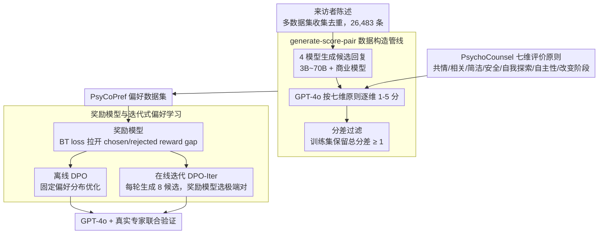

# Preference Learning Unlocks LLMs' Psycho-Counseling Skills

**会议**: ACL 2026  
**arXiv**: [2502.19731](https://arxiv.org/abs/2502.19731)  
**代码**: [https://huggingface.co/Psychotherapy-LLM](https://huggingface.co/Psychotherapy-LLM)  
**领域**: LLM安全 / 心理咨询对齐  
**关键词**: 心理咨询, 偏好学习, 奖励模型, DPO, 人类偏好对齐

## 一句话总结

本文构建了面向心理咨询回复质量的 PsyCoPref 偏好数据集，并用奖励模型、DPO 与迭代式偏好学习训练 LLM，使 8B 模型在心理咨询回复上相对 GPT-4o 达到 87.0% 的胜率。

## 研究背景与动机

**领域现状**：心理咨询辅助是 LLM 很有潜力的应用场景，因为现实中专业心理健康支持供给远低于需求。已有系统通常通过通用指令微调、角色提示或少量心理咨询数据来让模型扮演咨询师，但高质量真实会谈数据受隐私限制，难以公开积累。

**现有痛点**：心理咨询回复不是简单的“有帮助”或“安全”问题。一个回复需要共情、相关、简洁、安全，还要鼓励来访者自我探索、增强自主性，并识别其改变阶段。现有通用 reward model 或 LLM-as-judge 往往只学到泛化的帮助性，无法稳定区分专业心理咨询语境下的好坏回复。

**核心矛盾**：心理咨询最需要专业监督，但真实高质量标注最难获得；同时，不同治疗师经验差异会导致公开会话中的回复质量参差不齐，直接拿会话文本监督模型容易把低质量咨询行为也学进去。

**本文目标**：作者希望先建立一套专业、细粒度的心理咨询回复评价原则，再用这些原则生成并验证大规模偏好对，最后检验这些偏好能否训练出可靠的 reward model 和更会回应来访者的 policy model。

**切入角度**：与其收集“标准答案”，不如比较多个模型对同一来访者陈述的不同回复。偏好对天然适合表达咨询质量的相对判断，也能绕开单一治疗师回复质量不稳定的问题。

**核心 idea**：用专业心理咨询原则把多模型生成回复转化为高质量偏好数据 PsyCoPref，再用 reward modeling 与在线迭代 DPO 让 LLM 学会更专业、更有边界感的心理咨询回应。

## 方法详解

### 整体框架

作者把"教模型做心理咨询"这件事重新表述成一个专业偏好学习问题：输入是来访者的陈述，输出是一条更像专业咨询师的回复，而中间的关键是一套能稳定区分好坏的偏好信号。整条管线分三层推进——先用专业原则把多个 LLM 对同一陈述的回复转化成偏好对，构建 PsyCoPref 数据集；再用这些偏好对训练一个 Bradley-Terry（BT）奖励模型，学会判断"哪个回复更像专业咨询师"；最后以奖励模型为锚，用离线 DPO 和在线迭代 DPO 训练 policy model，并交由 GPT-4o 与真实心理咨询专家共同验证生成质量。

### 关键设计

**1. PsychoCounsel 七维评价原则：把"专业"拆成可打分的细粒度维度**

心理咨询回复的价值常常藏在细节里——是否追问触发因素、是否尊重来访者的自主性、是否在危机场景守住安全边界，这些都不是笼统的"helpfulness"能捕捉的。作者因此把回复质量拆成七个维度：共情与情绪理解、个性化与相关性、清晰简洁、避免有害语言、自我探索促进、自主性与信心促进、对改变阶段的敏感性。前四项覆盖 AI 回复的基础安全与可用性，后三项则直指以客户为中心的专业咨询目标。维度越细，偏好标签就越贴近真正专家的判断，而不是退化成"谁说得更客气"。

**2. generate-score-pair 数据构造管线：用多模型候选 + 原则打分构造高质量偏好对**

为了绕开真实会谈数据的隐私限制和单一治疗师质量不稳定的问题，作者不去收集"标准答案",而是比较多个模型对同一陈述的不同回复。具体地，从 counsel-chat、MentalAgora、TherapistQA、Psycho8k 等多个 HuggingFace 数据集收集来访者陈述，过滤掉 100 字符以下和 1000 字符以上的样本并去重，得到 26,483 条陈述，覆盖 8 个粗主题和 42 个细主题。每条陈述随机抽取 4 个模型（池子从 3B 到 70B 及商业模型）生成回复，由 GPT-4o 对每个原则打 1-5 分后取平均形成偏好对。训练集只保留总分差至少为 1 的对，测试集则直接取最高分与最低分回复——分差过滤把那些质量接近、连专家都难判断的样本挡在训练之外，避免引入标注噪声。

**3. 奖励模型与迭代式偏好学习：让偏好数据既能评估也能真正提升生成**

奖励模型采用标准 BT loss，目标是拉开 chosen 与 rejected 回复之间的 reward gap，即 $L=-\log\sigma(r_\theta(x,y_c)-r_\theta(x,y_r))$。在 policy 一侧，作者对比了两种训练方式：DPO 直接在 PsyCoPref 的离线偏好上优化，稳定但受限于固定的数据分布；DPO-Iter 则在每一轮为每条陈述现场生成 8 个回复，用同规模奖励模型挑出最高分与最低分组成在线偏好对，再用 DPO 目标更新模型。在线版本的好处是让当前 policy 在自己的生成分布上被持续纠偏，从而缓解离线偏好学习常见的分布偏移和 reward hacking 迹象——这也正是实验里 DPO-Iter 明显胜过离线 DPO 的原因。

### 损失函数 / 训练策略

奖励模型基于 Llama3.2-3B-Instruct 和 Llama3.1-8B-Instruct 初始化，在 PsyCoPref 上训练 2 个 epoch，batch size 为 128，学习率为 9e-6。policy model 使用 DPO 时令 $\beta=0.1$；DPO-Iter 每轮从训练集采样 6,400 条来访者陈述，每条生成 8 个候选，batch size 为 64，学习率为 5e-7，总训练步数为 1,600，并用 10% 开发集选择 checkpoint。

## 实验关键数据

### 主实验

**奖励模型在 PsyCoPref 测试集上的表现**

| 模型 | Acc.↑ | AUC↑ | ECE↓ | Brier↓ |
|------|-------|------|------|--------|
| Skywork-Reward-Llama-3.1-8B-v0.2 | 57.9 | 0.623 | 0.331 | 0.379 |
| Skywork-Reward-Gemma-2-27B | 69.2 | 0.740 | 0.123 | 0.229 |
| Llama-3.1-Nemotron-70B-Reward | 87.3 | 0.938 | 0.040 | 0.102 |
| Llama-3.1-70B-Instruct 作为 ranker | 88.2 | - | - | - |
| PsyCo-Llama3-3B-Reward | 98.1 | 0.997 | 0.050 | 0.014 |
| PsyCo-Llama3-8B-Reward | 97.8 | 0.998 | 0.045 | 0.016 |

**Policy model 相对 GPT-4o 的总体胜率**

| 设置 | Llama3-3B | +DPO | +DPO-Iter | Llama3-8B | +DPO | +DPO-Iter |
|------|-----------|------|-----------|-----------|------|-----------|
| 无长度约束 | 28.5 | 58.5 | 69.4 | 29.3 | 72.9 | 87.0 |
| 有长度约束 | 15.0 | 37.0 | 46.4 | 18.5 | 49.3 | 77.0 |

### 消融实验

**PsyCoPref 与通用 HelpSteer2 数据的互补性**

| 模型 | 训练数据 | PsyCoPref Acc.↑ | AUC↑ | Brier↓ | RewardBench Acc.↑ |
|------|----------|------------------|------|--------|-------------------|
| Llama-3B | HelpSteer2 | 81.6 | 0.916 | 0.120 | 83.6 |
| Llama-3B | HelpSteer2 + PsyCoPref | 97.6 | 0.998 | 0.017 | 86.1 |
| Llama-8B | HelpSteer2 | 81.7 | 0.898 | 0.128 | 86.6 |
| Llama-8B | HelpSteer2 + PsyCoPref | 97.5 | 0.998 | 0.018 | 87.2 |

**固定 10k 训练预算下的数据混合结果**

| 配置 | PsyCoPref Acc.↑ | RewardBench Acc.↑ | 平均 Acc.↑ | 说明 |
|------|------------------|-------------------|------------|------|
| Psy10k | 0.963 | 0.745 | 0.854 | 领域内最强，但通用迁移不足 |
| Help10k | 0.855 | 0.888 | 0.871 | 通用较好，心理咨询分辨率不足 |
| Psy5kHelp5k | 0.958 | 0.896 | 0.927 | 兼顾领域质量与通用 reward 能力 |

### 关键发现
- PsyCoPref reward model 的 3B 版本就能达到 98.1% 准确率，显著超过 70B 通用 reward model，说明心理咨询回复质量需要领域偏好监督。
- DPO-Iter 明显优于离线 DPO：Llama3-8B 在无长度约束下从 72.9% 提升到 87.0%，在有长度约束下从 49.3% 提升到 77.0%。
- 真实心理咨询专家与 GPT-4o judge 的判断一致率为 82.5%，且专家总体更偏好 PsyCo-Llama3-8B，支持自动评估的可信度。
- 长度约束会降低总体胜率，但能改善清晰度、安全性和阶段识别，说明 RL 后模型可能通过更长回复获得优势，需要推理阶段约束来平衡。

## 亮点与洞察
- 最大亮点是把心理咨询能力拆成“专业偏好建模”问题，而不是简单收集咨询文本做 SFT；这种设计更适合处理治疗师质量差异和隐私限制。
- PsyCoPref 的七维原则很有迁移价值，尤其是自我探索、自主性、改变阶段这三项，可作为医疗陪伴、教练式对话和危机支持系统的评价框架。
- DPO-Iter 的结果说明，心理咨询回复质量不仅要学“专家偏好”，还要在模型自己的生成分布上持续校准，否则离线偏好数据容易被模型学成固定话术。
- 专家案例显示，强模型不只是更安全或更礼貌，而是会更具体地承接来访者细节，并提出协作式探索问题，这比泛化共情模板更接近真实咨询实践。

## 局限与展望
- 当前 PsyCoPref 主要覆盖单轮来访者陈述与单轮回复，无法评估长期治疗关系、跨轮记忆、治疗联盟维护等核心咨询能力。
- 七维原则目前基本等权平均，不同危机等级、诊断背景和文化语境下的权重可能完全不同。
- 数据和评估高度依赖 GPT-4o 作为打分器与 judge，虽然专家验证结果较好，但仍可能继承 GPT-4o 的偏好偏差。
- 实验定位为辅助治疗师起草回复，而非直接面向来访者部署；未来需要加入风险分级、人工复核和危机干预协议。

## 相关工作与启发
- **vs RLHF / 通用偏好数据**: 通用 RLHF 主要优化 helpfulness、harmlessness 和 honesty，本文证明心理咨询这种专业场景需要单独的细粒度偏好原则。
- **vs DPO**: DPO 直接利用静态偏好对，本文的 DPO-Iter 通过在线生成候选再用 reward model 选择极端偏好对，更适合纠正当前 policy 的实际输出。
- **vs 心理咨询 SFT 数据集**: 直接模仿咨询对话容易吸收低质量或不稳定回复，PsyCoPref 通过多模型候选和偏好比较显式筛掉较差方案。
- **启发**: 医疗问答、法律咨询、教育反馈等高风险专业对话也可以采用“专家原则 + 多模型候选 + 偏好学习”的路线构建领域 reward model。

## 评分
- 新颖性: ⭐⭐⭐⭐ 将心理咨询回复建模为专业偏好学习问题，数据构造和在线偏好训练结合得很自然。
- 实验充分度: ⭐⭐⭐⭐⭐ 覆盖 reward model、policy model、专家验证、长度约束、在线/离线消融和数据混合分析。
- 写作质量: ⭐⭐⭐⭐ 论文主线清晰，数据构造和实验解释充分，但部分图表信息依赖附录。
- 价值: ⭐⭐⭐⭐⭐ 对心理健康 AI 辅助系统非常有参考价值，也为专业领域偏好数据构建提供了可复用范式。

<!-- RELATED:START -->

## 相关论文

- [\[ACL 2026\] Template-assisted Contrastive Learning of Task-oriented Dialogue Sentence Embeddings](template-assisted_contrastive_learning_of_task-oriented_dialogue_sentence_embedd.md)
- [\[NeurIPS 2025\] KL Penalty Control via Perturbation for Direct Preference Optimization](../../NeurIPS2025/dialogue/kl_penalty_control_via_perturbation_for_direct_preference_optimization.md)
- [\[ACL 2026\] Dual Hierarchical Dialogue Policy Learning for Legal Inquisitive Conversational Agents](dual_hierarchical_dialogue_policy_learning_for_legal_inquisitive_conversational_.md)
- [\[ACL 2026\] Reasoning Gets Harder for LLMs Inside A Dialogue](reasoning_gets_harder_for_llms_inside_a_dialogue.md)
- [\[ACL 2025\] KokoroChat: A Japanese Psychological Counseling Dialogue Dataset Collected via Role-Playing by Trained Counselors](../../ACL2025/dialogue/kokorochat_a_japanese_psychological_counseling_dialogue.md)

<!-- RELATED:END -->
