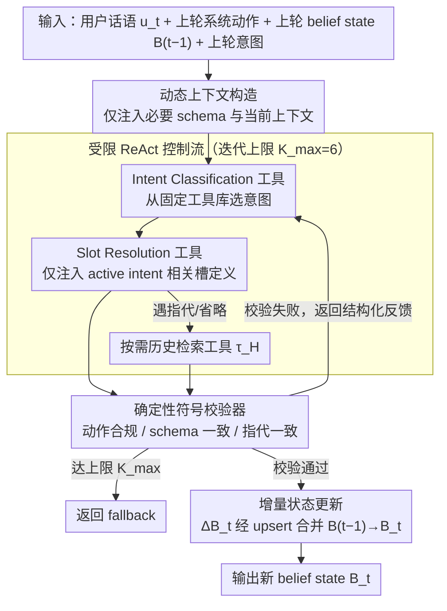

# ReacTOD: Bounded Neuro-Symbolic Agentic NLU for Zero-Shot Dialogue State Tracking

**会议**: ACL2026  
**arXiv**: [2605.19077](https://arxiv.org/abs/2605.19077)  
**代码**: 未在缓存中提供  
**领域**: 任务型对话 / Dialogue State Tracking / Agentic NLU  
**关键词**: 零样本DST, 神经符号系统, ReAct, 工具调用, 符号校验  

## 一句话总结
ReacTOD 将任务型对话状态跟踪拆成受限工具调用，并用确定性符号校验器拦截和反馈 LLM 错误，使 8B 到 32B 级模型也能在零样本 MultiWOZ 和 SGD 上获得强于先前大模型提示方法的 JGA。

## 研究背景与动机
**领域现状**：任务型对话系统通常需要把用户话语转成可执行的意图、槽位和值。传统企业 NLU 往往用 BERT 类判别模型做 Intent Classification 和 Slot Resolution，可靠、低延迟，但强依赖固定标签集和领域标注数据。近年的 LLM 方法则把 schema 写进 prompt，用生成式模型做零样本状态跟踪。

**现有痛点**：单次生成式 DST 容易出现格式错误、幻觉槽位、过度补全未提及实体等问题。在订酒店、订车、餐馆预订这类场景里，错误槽值会继续传给下游 API，造成静默失败。无约束 agent 虽然能多步推理，但开放循环和大模型依赖又带来延迟和成本风险。

**核心矛盾**：生产级 TOD 既想要 LLM 的零样本 schema 泛化，又不能接受 LLM 直接修改系统状态时的随机性。作者的观察是：很多 DST 错误不是深层语义理解失败，而是局部且可修复的错误，例如时间格式不对、槽名不合法、泛指实体没有解析。

**本文目标**：在不使用标注对话、不微调、不放入领域示例的前提下，让中等规模 LLM 能稳定完成状态跟踪；同时保证每次状态更新都可校验、可回退、可审计。

**切入角度**：论文不把 DST 视为一次性文本生成，而是把 NLU 约束为有限工具调用序列。LLM 负责提出动作，确定性程序负责判断动作是否安全和合法。

**核心 idea**：用“有界 ReAct 工具循环 + 符号校验器”替代单次 schema 生成，让模型在结构化错误反馈中自我修正，而不是把所有可靠性都压在模型一次生成上。

## 方法详解
ReacTOD 的核心是把对话状态跟踪从自由生成问题改写为一个受控的神经符号执行过程。LLM 不直接写最终状态，而是在每个 turn 内选择有限工具：先判断意图，再解析该意图相关槽位，必要时检索历史上下文。每个工具调用先经过确定性 validator，只有通过校验的槽位解析结果才能更新 belief state。

### 整体框架
输入包括当前用户话语 $u_t$、上一轮系统动作 $a_{t-1}$、上一轮 belief state $B_{t-1}$、上一轮 intent，以及当前 agent 的 action-observation trace。输出不是完整重写的状态，而是增量状态更新 $\Delta B_t$，最终通过 upsert 合并到 $B_t$。

具体流程可以概括为四步。第一，系统只把必要 schema 和当前上下文放进 prompt，避免小模型被完整 schema 和长历史淹没。第二，LLM 在受限工具库中调用 Intent Classification 工具，得到当前意图。第三，若意图是交易型任务，再调用 Slot Resolution 工具，只注入该意图相关槽定义；若遇到指代或省略，才按需调用历史检索工具。第四，validator 检查动作顺序、schema 合法性、值格式和指代一致性，失败时返回结构化反馈让 LLM 在 $K_{max}=6$ 的上限内重试。

### 关键设计

**1. 受限 ReAct 控制流：保留自我修正，去掉开放循环的不可控副作用**

生产系统最怕无约束 agent：它能多步推理，但开放循环和任意状态写入带来延迟、成本和静默失败的风险。ReacTOD 把 agent 的 action space 收窄到一个固定工具库 $\mathcal{T}$，每一步只能从中挑一个合法工具，prompt 引导它先做 Intent Classification 再做 Slot Resolution，而 validator 用“SR 必须基于已确认意图”这类规则把这个顺序变成硬约束；一旦达到迭代上限 $K_{max}=6$，系统直接返回 fallback 而不是继续烧推理。这样既留住了 ReAct“出错能自己改”的能力，又把它框在有限、可预测的动作序列里，避免循环失控。

**2. 确定性符号校验器：在任何状态被改动之前拦下错误**

很多 DST 错误并不是深层语义理解失败，而是局部且可修复的——时间格式不对、槽名非法、泛指实体没解析。与其再请一个 LLM-as-judge（那只会引入新的不确定性），ReacTOD 让一段确定性程序在每次工具调用落地前做三类低成本检查：动作合规性（例如还没调 IC 就提交槽值）、schema 一致性（非法 intent、槽名或枚举值）、指代一致性（输出了“restaurant”却没解析出真实实体）。校验失败时它返回明确的结构化反馈，例如“slot taxi-arriveby 需要 HH:MM 格式”，让 LLM 拿着错误信息重试。整套机制把 schema 约束、格式规则和状态更新协议固化成可验证的边界——LLM 负责提案，程序负责守门。

**3. 增量状态与动态上下文构造：让小模型不被长 prompt 淹没，也不让中间错误污染状态**

小模型在完整 schema 加长历史的 prompt 上很容易跟丢指令，中间的错误输出又可能顺着写进持久状态。ReacTOD 在两头都做了收口：模型每轮只预测增量更新 $\Delta B_t$，完整状态由上一轮 belief state $B_{t-1}$ 做 upsert 合并得到；槽位说明只在 active intent 下按需加载，历史对话默认不进 prompt，只有真正遇到指代或省略时才调用历史检索工具 $\tau_H$。状态采用 deferred update——只有通过 validator 的结果才真正写入 $B_t$。短 prompt 让小模型更容易守规矩，延迟写状态则保证被拒绝的中间输出不会污染后续轮次。

### 一个完整示例：一轮带格式纠错的状态更新

设当前用户说“帮我订一辆下午五点半到的出租车”。系统先只把必要 schema 和当前上下文塞进 prompt，LLM 在工具库里调用 Intent Classification，得到意图 `taxi`；因为是交易型任务，接着调用 Slot Resolution，并只注入 `taxi` 相关的槽定义。LLM 第一次解析把到达时间写成 `slot taxi-arriveby = 5:30pm`——这时 validator 介入，发现值不符合 `HH:MM` 格式（schema 一致性检查未过），于是拦下这次写入，返回结构化反馈“slot taxi-arriveby 需要 HH:MM 格式”。LLM 拿到反馈在第 2 次迭代里改成 `17:30`，validator 三类检查全部通过，这个增量 $\Delta B_t$ 才被 upsert 进 $B_{t-1}$ 得到新的 $B_t$。整轮在 $K_{max}=6$ 的上限内只用了一次校正就收敛——统计上多数 turn 仅需 IC + SR 两次 LLM 调用，被 validator 触发的 turn 里约 93.1% 都像这样在上限内自纠成功。

### 损失函数 / 训练策略
ReacTOD 不依赖任务特定训练数据、微调或 few-shot 示例。所有实验都是零样本推理，主要训练策略实际上是推理时架构约束：温度设为 0.0，统一最大 ReAct 轮数 $K_{max}=6$，不同 backbone 使用相同工具协议和 schema 注入方式。MultiWOZ 的 schema 来自 MultiWOZ 2.2 并补充槽类型，SGD schema 从官方 service definitions 程序化构造。

## 实验关键数据

### 主实验
| 数据集 | 模型 / 方法 | 指标 | 本文 | 对比方法 | 提升 |
|--------|-------------|------|------|----------|------|
| MultiWOZ 2.1 | gpt-oss-20B + ReacTOD | Overall JGA | 52.71% | FnCTOD + GPT-4 38.71% | +14.00 pp |
| MultiWOZ 2.1 | Qwen3-8B + ReacTOD | Overall JGA | 47.34% | FnCTOD + Qwen3-32B 40.36% | +6.98 pp |
| SGD | Claude-Opus-4.6 + ReacTOD | Avg. Service JGA | 80.68% | reproduced SRP 45.20% | +35.48 pp |
| SGD | Qwen3-32B + ReacTOD | Avg. Service JGA | 64.09% | reproduced SRP 45.20% | +18.89 pp |

### 消融实验
| 模型 | 数据集 | w/o ReAct Loop | ReacTOD | 提升 |
|------|--------|----------------|---------|------|
| Qwen3-8B | MultiWOZ Overall JGA | 39.29% | 47.34% | +8.05 pp |
| Qwen3-8B | SGD Avg. Svc. JGA | 45.49% | 57.31% | +11.82 pp |
| gpt-oss-20B | MultiWOZ Overall JGA | 43.39% | 52.71% | +9.32 pp |
| Claude-Opus-4.6 | SGD Avg. Svc. JGA | 73.49% | 80.68% | +7.19 pp |

### 效率与校验器分析
| 项目 | 数值 | 说明 |
|------|------|------|
| P50 LLM calls / turn | 2.00 | 所有模型中位数均为 IC + SR 两次调用 |
| Qwen3-32B output tokens / turn | 150.40 avg / 365.58 P99 | 紧凑文本 ReAct 输出 |
| gpt-oss-20B output tokens / turn | 448.09 avg / 1611.29 P99 | native thinking 带来更高 token 开销 |
| validator 触发 turns | 683 / 7372 | Qwen3-8B 上 9.3% turn 触发校正 |
| validator 自纠正率 | 636 / 683 = 93.1% | 只有 47 个 turn 达到 $K_{max}=6$ 上限 |
| 去掉 validator | 47.34% → 43.00% JGA | Qwen3-8B MultiWOZ 下降 4.34 pp |

### 关键发现
- ReAct 循环不是简单“多问几次”，而是和 validator 的结构化错误反馈一起起作用；仅打开循环但去掉 validator 会明显掉点。
- 小模型收益更大，Qwen3-8B 在 SGD 上从 45.49% 到 57.31%，说明复杂 schema 下校验器有更多机会捕获局部错误。
- 成本仍然可控：多数 turn 只需要两次 LLM 调用，长尾由迭代上限约束。

## 亮点与洞察
- 这篇论文最有价值的地方是把“LLM 可靠性”问题拆成局部可验证动作，而不是继续追求更长 prompt 或更强 backbone。对生产 NLU 来说，这比单纯堆模型更接近可部署系统。
- validator 的设计很务实：它不尝试理解自然语言，只检查 schema、格式和状态协议。这种“LLM 负责提案，程序负责边界”的模式可以迁移到工具调用、表单填写、API 参数生成等场景。
- 增量状态预测和按需历史检索解决的是小模型常见的 prompt 负担问题。论文结果显示，架构控制能让 8B 模型超过更大模型的单次生成 baseline。

## 局限与展望
- ReacTOD 比单次生成需要更多 LLM 调用，虽然循环有界，但在高吞吐业务里仍需评估延迟和成本。
- 方法依赖较完整的机器可读 schema，包括 intent、slot 描述、类型约束和枚举值。若 schema 缺失、噪声较大或领域开放，validator 能提供的保障会下降。
- MultiWOZ 的部分 schema 需要人工补充槽类型，说明“零样本”并不等于零工程成本。未来可以研究自动 schema 规范化、schema 质量诊断和更细粒度的错误反馈策略。

## 相关工作与启发
- **vs 传统判别式 NLU**: JointBERT 等方法可靠、快速，但依赖固定标签和标注数据；ReacTOD 牺牲部分推理成本，换取零样本 schema 迁移能力。
- **vs FnCTOD**: FnCTOD 把 domain logic 函数化，但仍偏单次生成；ReacTOD 增加有界 ReAct 和 validator，让错误可以被拦截并修复。
- **vs 通用 ReAct agent**: 通用 ReAct 追求开放工具推理，风险是循环不可控；ReacTOD 把工具和状态写入边界收窄，更适合生产 DST。
- **启发**: 对需要强结构输出的 LLM 系统，可以优先设计“可校验中间动作”，再让模型在错误反馈里迭代，而不是只做最终 JSON 校验。

## 评分
- 新颖性: ⭐⭐⭐⭐☆ 把 ReAct、工具调用和符号校验组合到 DST 中很自然但落地完整，关键创新在边界控制。
- 实验充分度: ⭐⭐⭐⭐☆ 覆盖 MultiWOZ、SGD 和多种 backbone，并有 loop、validator、效率分析；若有真实业务延迟会更完整。
- 写作质量: ⭐⭐⭐⭐☆ 动机清晰，工程细节充分，表格信息密集但主线明确。
- 价值: ⭐⭐⭐⭐⭐ 对任务型对话和结构化 LLM 应用很有参考价值，尤其适合生产系统中的零样本 NLU。

<!-- RELATED:START -->

## 相关论文

- [\[NeurIPS 2025\] Agentic Persona Control and Task State Tracking for Realistic User Simulation](../../NeurIPS2025/dialogue/agentic_persona_control_and_task_state_tracking_for_realistic_user_simulation_in.md)
- [\[ACL 2026\] APEX-MEM: Agentic Semi-Structured Memory with Temporal Reasoning for Long-Term Conversational AI](apex-mem_agentic_semi-structured_memory_with_temporal_reasoning_for_long-term_co.md)
- [\[ACL 2026\] Reasoning Gets Harder for LLMs Inside A Dialogue](reasoning_gets_harder_for_llms_inside_a_dialogue.md)
- [\[ACL 2026\] Surprisal Minimisation over Goal-directed Alternatives Predicts Production Choice in Dialogue](surprisal_minimisation_over_goal-directed_alternatives_predicts_production_choic.md)
- [\[ACL 2025\] Dynamic Label Name Refinement for Few-Shot Dialogue Intent Classification](../../ACL2025/dialogue/dynamic_label_name_refinement_for_few-shot_dialogue_intent_classification.md)

<!-- RELATED:END -->
