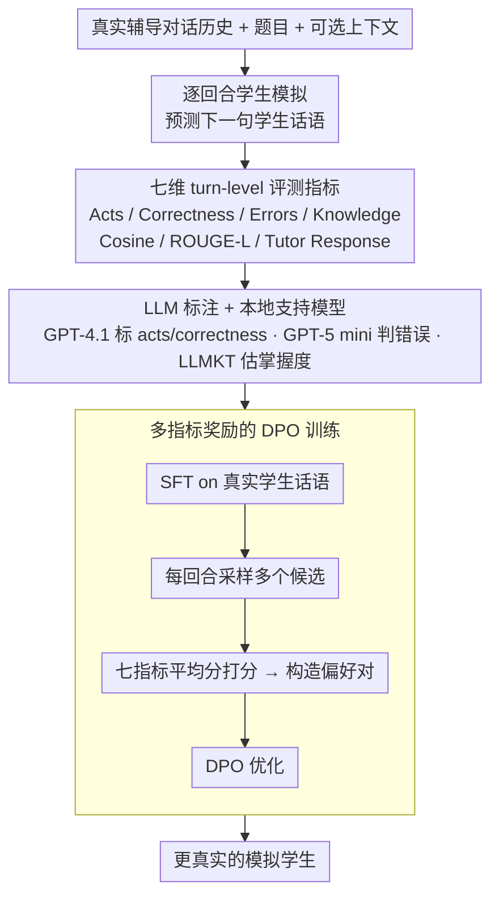

# Simulated Students in Tutoring Dialogues: Substance or Illusion?

**会议**: ACL2026  
**arXiv**: [2601.04025](https://arxiv.org/abs/2601.04025)  
**代码**: https://github.com/umass-ml4ed/sim-student-eval  
**领域**: LLM对齐 / 教育AI / 用户模拟  
**关键词**: 模拟学生, 智能辅导, 对话评测, DPO, 学习科学

## 一句话总结
这篇论文提出了一套面向数学辅导对话的模拟学生评测框架，发现简单 prompting 往往只会生成“看似会答题的学生”，而 SFT 和 DPO 更接近真实学生行为，但在错误复现和个体差异建模上仍然远未解决。

## 研究背景与动机
**领域现状**：LLM 已经被广泛用于智能辅导系统，既可以扮演 tutor，也可以扮演 student 参与训练和评估。很多教育 AI 工作为了避免真实学生实验成本过高，会让 LLM 模拟学生，并用这些模拟学生来测试或训练辅导策略。

**现有痛点**：如果模拟学生不真实，后续基于它们训练出的 tutor 很可能优化错目标。简单提示模型“像一个学生一样回答”通常会让模型过度正确、过度礼貌、过度解释，缺少真实学生的短句、困惑、错误和随机性。

**核心矛盾**：模拟学生的质量不是单一文本相似度能衡量的。真实学生行为同时包含对话行为、当前题目正确性、具体错误类型、知识掌握变化、语言风格以及能否引出真实 tutor 的下一步反应。缺少多维指标时，模型可能在一个维度看起来合理，却在教育意义上完全失真。

**本文目标**：作者希望形式化“turn-level student simulation”任务，建立一组可自动计算、能被人工验证的指标，并系统比较 prompting、SFT 和偏好优化方法在真实数学辅导对话上的表现。

**切入角度**：论文把每个学生回合作为预测目标，让模型基于此前学生/导师历史、题目和可选上下文生成下一句学生话语，再用真实学生话语作为 reference 进行多维评估。

**核心 idea**：把学习科学中的学生行为维度转化为自动评测指标，并把这些指标进一步用于 DPO 奖励构造，从而既评估模拟学生，也探索如何训练更真实的模拟学生。

## 方法详解

### 整体框架

论文把"turn-level 学生模拟"形式化成一个预测问题：给定真实 tutor-student 对话的历史、题目和可选上下文，模型在每个学生回合生成下一句学生话语，并以真实学生话语作为 reference 进行多维打分。整套设计因此分成评测与训练两层——评测层让模型逐回合生成模拟学生话语，从对话行为、正确性、错误、知识获得、语言相似度和 tutor 反应可预测性等角度衡量它是否真的"像学生"；训练层则反过来用这些指标做反馈信号，先用真实学生话语 SFT，再用指标给候选回答打分构造偏好对做 DPO，看能否把"评估真实性"变成"训练真实性"。实验数据来自 Question-Anchored Tutoring Dialogues 2k 这套真实中学数学在线辅导对话，处理后含 1,529 个训练对话和 382 个测试对话（训练集再切 1,147/382 的训练/验证），平均每段 23.42 个回合，学生每轮仅 4.11 个词，导师 14.84 个词——这种"短而碎"的学生语言本身就是模拟的难点。

### 关键设计

**1. 七维 turn-level 评测指标：用学习科学维度取代单一文本相似度**

教育场景里的"像学生"绝不等于"语义相似"：同样正确的回答可能反映完全不同的掌握程度，同样错误也要看是否犯了真实学生会犯的那种错。作者因此把评测拆成七个互补维度——Acts、Correctness、Errors、Knowledge Acquisition、Cosine Similarity、ROUGE-L 和 Tutor Response。前几项关注行为与认知（学生此刻在做什么、答对没有、错在哪、掌握度变化多少），后几项关注语言形式和对话能否自然延续。只有把这些维度并列起来，才能识破那些"看似会答题却在教育意义上完全失真"的模拟学生。

**2. LLM 标注与本地支持模型结合：让复杂指标既可规模化又对得上人工判断**

七个维度里有几项靠字符串指标根本算不出来，纯人工标注又太贵。作者的折中是分工标注：用 GPT-4.1 标真实学生的 dialogue acts 和 correctness，并训练一个本地 LLM 来分类 act；正确性与错误这类更难的判断交给 GPT-5 mini 辅助；知识获得则由 LLMKT 风格的知识追踪模型估计 mastery delta。LLM 批量标注负责覆盖规模，局部人工验证负责守住可靠性，这是目前在教育对话里兼顾两者的现实做法。

**3. 基于多指标奖励的 DPO 模拟学生训练：把评测指标变成训练信号**

有了可计算的指标，作者让它们反过来改进学生模型：先用 SFT 模型为每个回合生成多个候选学生话语，计算每个候选在七项指标上的平均分，分差超过阈值时构成偏好对，再用 DPO 优化。一个细节是跳过每段对话的前 5 个回合，因为早期上下文太少、奖励噪声更大。需要注意的是，基于自动指标训练天然有 reward hacking 风险，所以论文坚持用人工复核来交叉验证——这也解释了为什么 DPO 相比 SFT 只拿到小幅而非戏剧性的提升。

### 损失函数 / 训练策略

学生模型使用 Llama-3.2-3B-Instruct 和 Llama-3.1-8B-Instruct。SFT 使用 LoRA，学习率为 $5 \times 10^{-5}$，有效 batch size 为 64，LoRA rank 为 32、alpha 为 64、dropout 为 0.05。DPO 使用学习率 $5 \times 10^{-6}$、$\beta=0.1$，每个回合采样 4 个候选回答，偏好分差阈值为 0.1。DPO 为降低成本只使用训练对话的随机 20%，但效果接近全量。

## 实验关键数据

### 主实验
自动指标结果显示，fine-tuning 方法在大多数维度上优于 prompting；prompting 在 Correctness 上看似较好，主要因为它更倾向于生成正确答案这个多数类，而不是真实模拟学生。

| 方法 | Acts↑ | Corr.↑ | Errors↑ | Knowledge↑ | Cos. Sim.↑ | ROUGE-L↑ | Tutor Resp.↑ |
|------|-------|--------|---------|------------|------------|----------|--------------|
| DPO Llama 3.1 8B | 0.6840 | 0.5761 | 0.0529 | 0.8787 | 0.7390 | 0.3212 | 0.2039 |
| SFT Llama 3.1 8B | 0.6671 | 0.5670 | 0.0661 | 0.8766 | 0.7383 | 0.3212 | 0.2038 |
| DPO Llama 3.2 3B | 0.6762 | 0.5748 | 0.0584 | 0.8745 | 0.7345 | 0.3109 | 0.2037 |
| Reasoning GPT-5 Mini | 0.5755 | 0.5870 | 0.0088 | 0.8395 | 0.5992 | 0.2170 | 0.1909 |
| Zero-Shot GPT-4.1 | 0.4998 | 0.5926 | 0.0220 | 0.8078 | 0.5460 | 0.1648 | 0.1911 |
| Oracle GPT-4.1 | 0.5097 | 0.6755 | 0.1872 | 0.8063 | 0.6032 | 0.2109 | 0.1942 |

人工评测覆盖 38 个对话中的 190 个回合，趋势基本验证自动指标：DPO 更像真实学生，Oracle 因为含有泄露式摘要而在正确性和错误上更强。

| 方法 | Acts↑ | Corr.↑ | Errors↑ | Linguistic↑ | 解释 |
|------|-------|--------|---------|-------------|------|
| DPO | 0.7905 | 0.6377 | 0.0612 | 0.5405 | 行为和语言相似度最好 |
| Zero-Shot | 0.6143 | 0.6087 | 0.0408 | 0.3155 | 语言风格最不像真实学生 |
| Oracle | 0.6476 | 0.7101 | 0.2449 | 0.4071 | 依赖额外信息，错误复现最高 |

### 消融实验
作者用单一奖励训练 DPO，分析各指标之间的耦合。结果显示“优化某一维度”常常会带来副作用，平均奖励虽然稳健，但也不是最优组合。

| 奖励 | Acts↑ | Corr.↑ | Errors↑ | Knowledge↑ | Cos. Sim.↑ | ROUGE-L↑ | Tutor Resp.↑ | 主要现象 |
|------|-------|--------|---------|------------|------------|----------|--------------|----------|
| SFT | 0.6795 | 0.5546 | 0.0506 | 0.8723 | 0.7417 | 0.3155 | 0.2102 | 未做偏好优化 |
| Average | 0.6962 | 0.5699 | 0.0562 | 0.8691 | 0.7433 | 0.3181 | 0.2104 | 综合表现较均衡 |
| Correctness | 0.6692 | 0.5852 | 0.0506 | 0.8652 | 0.7275 | 0.3129 | 0.2081 | 正确性最高但多项下降 |
| Knowledge | 0.6846 | 0.5437 | 0.0730 | 0.8756 | 0.7486 | 0.3147 | 0.2124 | 知识、错误和 tutor response 更强 |
| Tutor Resp. | 0.6897 | 0.5349 | 0.0618 | 0.8763 | 0.7447 | 0.3137 | 0.2113 | 能带来较自然对话延续 |

### 关键发现
- Prompting 方法常常生成过长、过礼貌、过正确的回答，不像真实学生的短句和不确定表达。
- DPO 相比 SFT 只小幅提升，说明这不是一个容易靠简单偏好优化解决的任务；尤其错误复现信号非常稀疏。
- 8B 模型相对 3B 有稳定但不大的优势，说明任务瓶颈不只是模型容量，而是学生行为本身的随机性和个体差异。
- 自动指标与人工评测有较强一致性：Hum.-Metric 在 Acts、Correctness、Errors、Linguistic 上分别达到 0.7337、0.6891、0.6127、0.7397。

## 亮点与洞察
- 论文最大的价值是把“模拟学生是否真实”拆成了可操作的多维评测问题，而不是停留在直觉观察。
- Knowledge Acquisition 指标很有教育意义：两个回答都正确时，真实学生只答 “c” 和模型答 “6/10” 可能代表不同掌握状态，后续 tutor 策略也应不同。
- 人工验证设计扎实，虽然规模不大，但足以说明这些自动指标不是纯粹自说自话。
- 结果对教育 AI 是一个提醒：用模拟学生做 A/B 测试或 RL 训练之前，必须先证明模拟学生覆盖了真实学生的错误、犹豫和语言习惯。

## 局限与展望
- 实验只在一个数学辅导数据集上完成，学生年龄、学科、平台和文化背景都可能影响模拟难度。
- 指标是 reference-based，适合已有真实对话的离线评估，不适合没有标准学生回答的新题或开放式教学场景。
- Knowledge Acquisition 和 Tutor Response 没有纳入人工评测，因为人工难以可靠判断，这留下了两个关键指标的验证空白。
- 模型没有建模长期学生身份和历史学习轨迹，因此个体差异非常弱，难以模拟“这个学生一贯怎么想”。
- 未来可以探索 prior-student history、学生画像、过生成再重排、在线人类反馈和 reference-free 评测。

## 相关工作与启发
- **vs 传统用户模拟**: 传统对话模拟常关注下一轮话语是否合理，本文强调教育场景中还要看知识状态和错误类型。
- **vs persona prompting**: OCEAN persona 提示能略微改善 Acts，但远不如 SFT/DPO，说明高层人格描述不足以约束具体学习行为。
- **vs Oracle prompting**: Oracle 在 Correctness 和 Errors 上强，是因为拿到了当前对话行为摘要；但它在语言和行为维度仍输给小得多的 fine-tuned 模型。
- **启发**: 对齐研究里“用模拟用户训练助手”很常见，这篇论文说明模拟对象本身也需要被严肃评测，否则后续对齐结果可能只是对模拟器偏差的过拟合。

## 评分
- 新颖性: ⭐⭐⭐⭐☆ 将学习科学维度系统转成 LLM 模拟学生评测指标，问题定义很扎实。
- 实验充分度: ⭐⭐⭐⭐☆ 自动评测、人工评测、奖励消融和定性分析都比较完整，但数据域仍偏单一。
- 写作质量: ⭐⭐⭐⭐⭐ 方法和结果解释清楚，指标设计与教育动机对应紧密。
- 价值: ⭐⭐⭐⭐⭐ 对教育 AI、用户模拟、LLM 对齐评测和基于模拟器的训练都有很强警示价值。

<!-- RELATED:START -->

## 相关论文

- [\[ACL 2026\] Your Students Don't Use LLMs Like You Wish They Did](your_students_dont_use_llms_like_you_wish_they_did.md)
- [\[ACL 2026\] Metro: Towards Strategy Induction from Expert Dialogue Transcripts for Non-collaborative Dialogues](metro_towards_strategy_induction_from_expert_dialogue_transcripts_for_non-collab.md)
- [\[ACL 2026\] MA$^2$P: A Meta-Cognitive Autonomous Intelligent Agents Framework for Complex Persuasion](ma2p_a_meta-cognitive_autonomous_intelligent_agents_framework_for_complex_persua.md)
- [\[ACL 2026\] ReacTOD: Bounded Neuro-Symbolic Agentic NLU for Zero-Shot Dialogue State Tracking](reactod_bounded_neuro-symbolic_agentic_nlu_for_zero-shot_dialogue_state_tracking.md)
- [\[ACL 2026\] Surprisal Minimisation over Goal-directed Alternatives Predicts Production Choice in Dialogue](surprisal_minimisation_over_goal-directed_alternatives_predicts_production_choic.md)

<!-- RELATED:END -->
