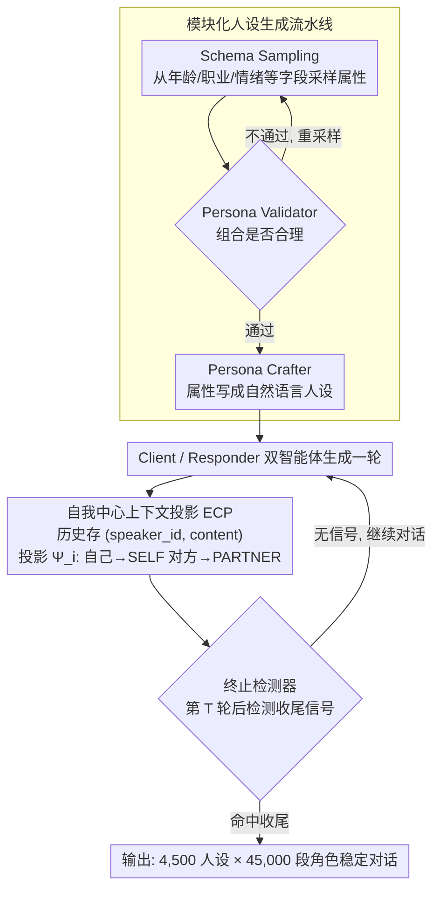

# SPASM: Stable Persona-driven Agent Simulation for Multi-turn Dialogue Generation

**会议**: ACL 2026 Findings  
**arXiv**: [2604.09212](https://arxiv.org/abs/2604.09212)  
**代码**: [GitHub](https://github.com/lhannnn/SPASM)  
**领域**: 对话系统  
**关键词**: 人设对话, 多轮模拟, 角色漂移, 自我中心投影, 数据生成

## 一句话总结

本文提出 SPASM，一个以稳定性为核心的人设驱动多轮对话模拟框架，通过模块化人设生成、自我中心上下文投影（ECP）和终止检测三个组件，在 LLM-LLM 对话中大幅减少角色漂移和"回声"现象，构建了 45,000 段高质量多轮对话数据。

## 研究背景与动机

**领域现状**：LLM 在辅导、支持、咨询等多轮交互场景中广泛部署。LLM-LLM 对话模拟是生成大规模训练/评估数据的有效方式，相比人工收集更低成本且可控。

**现有痛点**：LLM-LLM 长对话会累积身份相关故障——人设漂移（角色逐渐偏离指定身份）、角色混淆和"回声"效应（一个智能体逐渐模仿另一个的语言和立场）。这些问题在对话变长时更加严重，导致生成的对话不再对应预期的设定，污染合成数据集。

**核心矛盾**：朴素的对话历史拼接方式是问题根源——同一句话对不同智能体可能占据不同的相对角色（user vs assistant），导致角色混淆和反馈回路。

**本文目标**：设计一个"稳定性优先"的对话模拟框架，在不修改模型权重的前提下保证长期角色一致性。

**切入角度**：通过改变对话历史的**表示方式**而非模型本身来解决问题——将对话历史存储为视角无关格式，在生成时确定性地投影为每个智能体的自我中心视角。

**核心 idea**：自我中心上下文投影（ECP）：对话历史以 $(speaker\_id, content)$ 形式存储，生成时通过角色重标记算子 $\Psi_i$ 将说话者标签映射为 SELF/PARTNER，确保每个智能体始终从自己的视角看待对话。

## 方法详解

### 整体框架

SPASM 想解决的是 LLM-LLM 长对话里角色逐渐崩坏的问题，但它的切入点不是改模型权重，而是改对话历史的"表示方式"。整条流水线串起五个免训练组件：先由 Persona Schema 从预定义字段采样人设属性，经 Persona Validator 验证组合是否合理、Persona Crafter 把属性写成自然语言人设描述；随后进入 Client-Responder 双智能体对话模拟，其中每个智能体看到的历史都经过自我中心投影（ECP）重标记；最后由 Termination Detector 在对话出现自然收尾信号时停止。输入是采样到的人设组合，中间是一段视角无关的对话历史，输出则是一段角色稳定、自然结束的多轮对话。

### 关键设计

**1. 模块化人设生成流水线：采样—验证—精炼三步保证人设可信**

直接把随机采样的属性拼在一起很容易得到荒谬组合（比如"18 岁学生 + 退休金规划"），污染数据集。SPASM 因此把人设生成拆成三步：Schema Sampling 从年龄、职业、地点、情绪状态、行为模式等预定义字段随机采样；Validator 检查这组属性的连贯性与合理性，不通过就重采样；Crafter 再把验证过的属性集写成连贯的自然语言人设描述，并可补充额外细节。验证器与精炼器一前一后，既保住了多样性，又挡住了不可信的属性组合。

**2. 自我中心上下文投影（ECP）：用对称的 SELF/PARTNER 表示根除角色混淆**

ECP 是全文最关键的设计。朴素拼接里 user/assistant 标签的固定分配，正是角色混淆和"回声"效应的根源——同一句话对不同智能体本应占据不同的相对角色，硬贴绝对标签就会让一方逐渐模仿另一方。ECP 的做法是把对话历史存成视角无关的有序序列 $\mathcal{H}_t = (u_k)_{k=1}^t$，其中每条 $u_k = (s_k, c_k)$ 只记说话者 ID 与内容；在某个智能体 $i$ 要生成时，再用投影算子 $\Psi_i(\mathcal{H}_t) = ((\phi_i(s_k), c_k))_{k=1}^t$ 把绝对说话者确定性地映射为相对角色，自己的发言一律标 SELF、对方标 PARTNER。这样角色标签就与智能体身份彻底解耦，每个智能体始终从自己的视角看整段对话，长程一致性也随之稳定下来——消融实验里 ECP 几乎消除了回声效应、大幅压低了人设漂移。

**3. 终止检测器：在自然收尾处停下，避免硬截断或死循环**

固定轮数硬性截断会产生突兀的结尾，而不设上限又可能让两个智能体无限寒暄。终止检测器在第 $T$ 轮后才激活，基于最近 $m$ 轮历史和预定义终止规则判断是否出现关闭信号（如表达感谢、告别），一旦命中就结束对话。它让每段生成数据都有一个连贯、自然的收束点，而不是被人为切断。

### 损失函数 / 训练策略

完全免训练。所有组件通过 API 调用实现，不修改模型权重。

## 实验关键数据

### 人设检索准确率（Top-1 Acc）

| Client / Responder | Top-1 | Top-10 |
|-------------------|-------|--------|
| GPT / GPT | 0.96 | 1.00 |
| GPT / DeepSeek | 0.50 | 0.82 |
| DS / GPT | 0.99 | 1.00 |
| Qwen / Qwen | 0.98 | 1.00 |

### 消融实验（ECP 效果）

| 指标 | 有 ECP | 无 ECP |
|------|-------|--------|
| 人设漂移 | 显著降低 | 高 |
| 回声效应 | 人工验证接近零 | 频繁出现 |
| Silhouette 得分 | 高（0.60） | 低 |

### 关键发现
- ECP 是最关键的设计：大幅减少人设漂移，在人工验证中几乎消除了回声效应
- 同骨干模型交互产生更紧凑的人设聚类（GPT/GPT Silhouette=0.60 vs GPT/DS=0.10）
- Responder 模型骨干主导交互几何：固定 Responder 为 GPT 时，无论 Client 是什么，聚类质量都高
- 跨模型交互主要增加簇内方差，而非降低簇间分离度
- 构建了 4,500 人设 × 45,000 对话的大规模数据集

## 亮点与洞察
- **ECP 的"最小改变，最大效果"**非常优雅：仅改变对话历史的角色标签表示方式（user/assistant → SELF/PARTNER），就大幅提升了长期稳定性。这个简单想法有深刻的含义——角色表示方式比模型能力更关键
- **Responder 模型主导交互几何**的发现很有趣：在人设驱动对话中，回应者（而非主动方）决定了对话空间的结构，暗示"倾听者"对交互质量的影响比"说话者"更大
- **人设验证步骤**避免了不合理组合，使数据集更可信，是合成数据生成中值得推广的实践

## 局限与展望
- 仅验证了英语对话，多语言场景的效果未知
- 人设属性字段是预定义的，可能不够覆盖所有应用场景
- 最大对话长度限制为 25 轮/智能体，更长对话的稳定性未测试
- 未评估生成数据用于下游 SFT 训练的效果
- ECP 在多智能体（>2）场景的扩展虽然理论上可行但未验证

## 相关工作与启发
- **vs Self-Chat/RolePlay**: 这些方法使用简单的对话历史拼接，SPASM 通过 ECP 解决了长期角色一致性
- **vs Generative Agents (Park et al.)**: 侧重记忆和行为模拟，SPASM 专注于对话数据生成和身份稳定性
- **vs 指令漂移研究 (Li et al.)**: 本文将类似的度量方法扩展到人设驱动的对话生成场景

## 评分
- 新颖性: ⭐⭐⭐⭐ ECP 简单但有效，人设稳定性分析深入
- 实验充分度: ⭐⭐⭐⭐ 9种骨干组合、45K对话、多维度分析
- 写作质量: ⭐⭐⭐⭐ 形式化清晰，分析透彻
- 价值: ⭐⭐⭐⭐ 为 LLM 对话数据生成提供了实用的稳定性解决方案

<!-- RELATED:START -->

## 相关论文

- [\[ACL 2026\] GenesisFunc: Multi-Agent Data Generation for Accurate and Generalizable Function-Calling](genesisfunc_multi-agent_data_generation_for_accurate_and_generalizable_function-.md)
- [\[ACL 2026\] ETHICMIND: A Risk-Aware Framework for Ethical-Emotional Alignment in Multi-Turn Dialogue](ethicmind_a_risk-aware_framework_for_ethical-emotional_alignment_in_multi-turn_d.md)
- [\[ACL 2025\] Exploring Persona Sentiment Sensitivity in Personalized Dialogue Generation](../../ACL2025/dialogue/persona_sentiment_dialogue.md)
- [\[ACL 2026\] Discourse Coherence and Response-Guided Context Rewriting for Multi-Party Dialogue Generation](discourse_coherence_and_response-guided_context_rewriting_for_multi-party_dialog.md)
- [\[ACL 2025\] When Harry Meets Superman: The Role of The Interlocutor in Persona-Based Dialogue Generation](../../ACL2025/dialogue/when_harry_meets_superman_the_role_of_the_interlocutor_in_persona-based_dialogue.md)

<!-- RELATED:END -->
