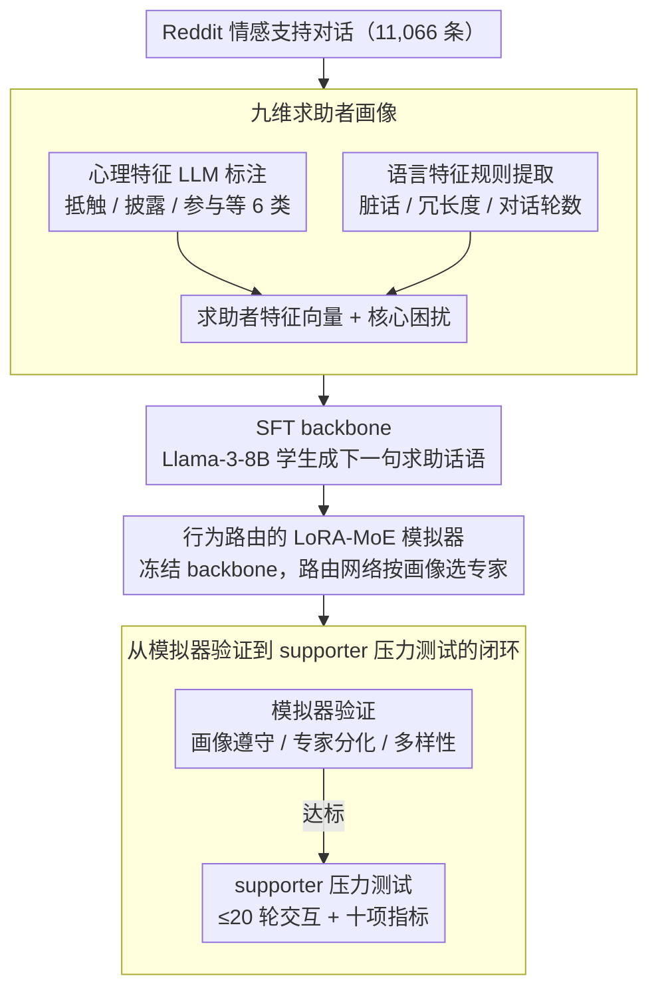

# Stress-Testing Emotional Support Models: Moving from Homogeneous to Diverse Help Seekers

**会议**: ACL2026 Findings  
**arXiv**: [2601.07698](https://arxiv.org/abs/2601.07698)  
**代码**: 无  
**领域**: 情感支持对话 / 对话评测 / 用户模拟  
**关键词**: 情感支持模型, 求助者模拟, 可控评测, MoE路由, 压力测试  

## 一句话总结
这篇论文用 Reddit 情感支持对话构造九维求助者画像，并用带行为路由的 LoRA-MoE 训练可控求助者模拟器，从而让情感支持模型在更真实、更困难、更多样的人群上接受交互式压力测试。

## 研究背景与动机
**领域现状**：情感支持对话模型已经从单轮共情回复走向多轮交互系统，评测方式也越来越依赖 seeker simulator：让一个模拟求助者和 supporter 模型对话，再用共情、安慰、建议、连贯性等指标评分。

**现有痛点**：主流模拟器经常生成“好说话”的求助者，它们配合、开放、语言清晰，几乎像理想化测试用户。这样的评测会高估 supporter 的实际能力，因为真实求助者可能沉默、抵触、跑题、情绪激烈、披露不足，甚至拒绝支持者的建议。

**核心矛盾**：情感支持系统最需要在困难用户上稳住表现，但现有评测恰恰缺少“人群差异”的控制变量。只有一个平均 seeker，就很难判断模型到底是不懂共情，还是只在高抵触、低披露、低参与这类人群上失败。

**本文目标**：作者要做的不是再训练一个更会安慰人的 supporter，而是做一个更可信的压力测试环境。具体来说，它需要能构造多种求助者画像、稳定保持画像行为、生成足够真实的多轮对话，并让同一 supporter 在不同 seeker population 下暴露性能差异。

**切入角度**：论文从 Reddit 在线支持小组中收集真实互动，把求助者行为拆成心理特征和语言特征，再把这些结构化特征作为生成控制信号。这样比简单写 persona prompt 更可靠，因为它将“抗拒程度”“自我披露深度”“参与度”等心理变量显式暴露给模型。

**核心 idea**：用九维求助者画像控制一个 LoRA-MoE 求助者模拟器，让 expert routing 学会不同求助行为子空间，再用它生成多样 seeker 与 supporter 的交互式评测。

## 方法详解
这篇论文的方法可以分成两层：第一层是“如何定义和标注多样求助者”，第二层是“如何让模型在多轮对话中持续扮演这些求助者”。

它的关键不是把更多角色描述塞进 prompt，而是把 seeker 的行为画像做成可学习的控制接口。

### 整体框架
输入端是一组真实 Reddit 支持对话，每条对话被转化成一个 seeker profile。

profile 包含九类特征：心理侧包括 coping strategy、engagement level、resistance level、utterance style、self-disclosure level、seeker reaction distribution；语言侧包括 verbosity level、profanity flag、total dialogue turns level。

此外，每个 profile 还包含 seeker main problem，也就是从 Reddit 原帖中概括出的求助者核心困扰。

训练阶段先用 Llama-3-8B-Instruct 做普通 SFT，学习“给定画像和历史后生成下一句求助者话语”。

随后冻结 SFT backbone，在 attention 和 FFN 的线性层上挂多个 LoRA experts，并用共享路由网络根据 seeker feature vector 输出 dialogue-level routing weights。

推理与评测阶段中，给定某类 seeker profile，模拟器和 supporter 模型进行最长 20 轮的交互；对生成对话再用自动指标评估 supporter 的情感支持技能、一般对话技能和总体质量。

### 关键设计

**1. 九维求助者画像：把真实求助行为拆成可控、可验证的特征向量**

传统 persona prompt 往往只描述身份或处境，却控制不了“是否抵触建议”“是否愿意披露”“是否话很多”这些真正决定支持难度的维度。作者从 11,066 条 Reddit 情感支持对话里把求助行为拆成九类特征：心理侧的 coping strategy、engagement level、resistance level、utterance style、self-disclosure level、seeker reaction distribution，语言侧的 verbosity level、profanity flag、total dialogue turns level，外加一个从原帖概括出的 seeker main problem。心理特征由 LLM tagger 标注，语言特征用规则提取——profanity 由 profanity-check 检测，verbosity 把求助者话语 token 数离散化，turn level 直接由对话轮数确定。

这套画像的价值在于它直接对准了支持模型最容易失效的互动维度，把“抗拒程度”“披露深度”“参与度”这些原本藏在文本里的心理变量显式暴露出来，于是后续评测可以像公平性评测一样按人群切片，而不再只看一个平均 seeker。

**2. 行为路由的 LoRA-MoE 模拟器：把画像控制从文本提示解耦到参数子空间**

只靠 prompt 喂画像有个老问题：随着对话变长，冗长的历史和 system prompt 会把画像信号稀释掉，单纯 SFT 的模型很容易回退到“礼貌、合作、平均化”的语言模式，扮不像高抵触、低披露的困难用户。作者的做法是先训练并冻结一个 SFT backbone，再在 attention 和 FFN 的每个线性层挂上多个低秩专家，由一个共享路由网络把结构化的 seeker feature vector 映射成 dialogue-level 的 routing 权重 $\alpha$，线性层的输出因此变成原始变换叠加专家增量：

$$y = W x + \sum_i \alpha_i \, \Delta_i(x)$$

专家语义不靠人工指定，而是在语言建模损失和路由的共同优化中自然分化出来。这样画像控制就从易被历史淹没的文本提示，转移到了相对稳定的参数子空间，不同求助风格由不同专家子空间承接，越到多轮后期越能稳住人格。

**3. 从模拟器验证到 supporter 压力测试的闭环：先证明 seeker 像目标画像，再评 supporter**

如果一个模拟器只是“看起来多样”却并不真的遵守画像，它就会把评测噪声直接灌进 supporter 的排名，让结论不可信。论文因此把验证放在前面：先用 profile adherence、expert fidelity、diversity 三组指标确认模拟器确实可控、可分化、够多样，再拿 300 个 held-out profiles 生成 seeker-supporter 对话，并用十项情感支持与通用对话指标去评估 supporter。模拟器还额外学习了一个 `<|end_of_dialogue|>` 结束符，让对话长度受 total turns level 控制，从而连“对话该多长”也纳入画像。这一“先验模拟器、再压测模型”的顺序，使得最终暴露出的性能差异更可能来自真实的人群难度，而不是模拟器自身的随机噪声。

### 损失函数 / 训练策略
第一阶段是标准 next-token prediction，只在下一句 seeker utterance 上计算语言建模损失。

训练配置使用 Llama-3-8B-Instruct 和 LoRA，LoRA rank 为 16，目标层覆盖所有 linear layers。

第二阶段冻结 SFT backbone，仅训练路由网络和 LoRA experts。

总目标为语言建模损失加上行为区分相关的训练约束，论文中对 contrastive baseline 还设计了 pseudo-feature 翻转的 disentanglement loss。

MoE 主模型的重点不在手工指定 expert，而在让路由根据画像自动选择行为子空间。

这种训练策略让模型保留 Reddit 对话的自然语言分布，同时强化对高抵触、低披露、低参与等维度的可控生成。

## 实验关键数据

### 主实验
模拟器自身的 profile adherence 用 Macro F1 衡量，作者对比了纯提示模型、SFT、contrastive learning 和本文 MoE。

| 模拟器 | Macro F1均值↑ | 标准差↓ | 最小值↑ | 最大值↑ |
|--------|---------------|---------|---------|---------|
| GPT-4.1-mini | 0.301 | 0.131 | 0.160 | 0.580 |
| Llama-3-8B-Instruct | 0.259 | 0.148 | 0.110 | 0.580 |
| Qwen-2.5-14B-Instruct | 0.284 | 0.095 | 0.150 | 0.470 |
| GPT-5 | 0.319 | 0.216 | 0.150 | 0.840 |
| DeepSeek-V3.2 | 0.431 | 0.218 | 0.180 | 0.910 |
| SFT | 0.515 | 0.160 | 0.360 | 0.760 |
| Contrastive Learning | 0.484 | 0.178 | 0.340 | 0.850 |
| Ours | 0.549 | 0.125 | 0.430 | 0.740 |

这个结果说明，单靠更强的通用 LLM 并不能稳定遵守 seeker profile；SFT 已经显著提升，而 MoE 在均值和最小值上最好，说明它对困难画像也更稳。

专家评估进一步比较了本文模拟器和已有 seeker simulator 在语言自然度、角色真实性、心理合理性上的胜负次数。

| 比较对象 | 语言自然度 Win/Loss/Tie | 角色真实性 Win/Loss/Tie | 心理合理性 Win/Loss/Tie |
|----------|--------------------------|--------------------------|--------------------------|
| Ours vs. Eeyore | 62 / 19 / 9 | 60 / 20 / 10 | 64 / 13 / 13 |
| Ours vs. ESC-Judge | 62 / 18 / 10 | 65 / 19 / 6 | 56 / 14 / 20 |
| Ours vs. ESC-Role | 72 / 9 / 9 | 61 / 16 / 13 | 61 / 12 / 17 |

在 supporter 评测中，本文模拟器往往给出更低、更有区分度的分数，说明它不是“刁难评分器”，而是生成了更接近真实困难互动的测试样本。

| Supporter | Seeker模拟器 | Identification | Comforting | Suggestions | Informativeness | Overall |
|-----------|---------------|----------------|------------|-------------|-----------------|---------|
| GPT-5-mini | ESC-Judge | 4.980 | 4.977 | 4.070 | 3.853 | 5.000 |
| GPT-5-mini | Ours | 4.410 | 4.477 | 2.820 | 2.393 | 4.853 |
| Llama-ESConv | ESC-Judge | 4.000 | 4.267 | 3.203 | 2.717 | 4.827 |
| Llama-ESConv | Ours | 3.390 | 3.150 | 2.303 | 1.807 | 3.887 |

### 消融实验
论文没有只做模块开关式消融，而是用 baseline family 和 routing analysis 来解释 MoE 的增益来源。

| 配置 / 分析 | 关键指标 | 说明 |
|-------------|----------|------|
| SFT | Macro F1 0.515 | 学到 Reddit 风格，但对细粒度画像的可控性不足 |
| Contrastive Learning | Macro F1 0.484 | 通过伪特征扰动增强区分，但不如显式行为路由稳定 |
| Ours MoE | Macro F1 0.549 | 路由到不同低秩专家后，画像遵守度最高 |
| Routing analysis | resistance 0.37→0.43, self-disclosure 0.40→0.45 | MoE 对 SFT 不易控制的心理维度有针对性提升 |
| 参数开销 | 路由网络约 15,881 参数 | 控制能力主要来自专家路由结构，而不是显著增加模型规模 |

### 关键发现
- MoE 的优势主要体现在“难控行为”上，尤其是抵触程度和自我披露深度，而这些正是情感支持系统最需要评测的用户维度。
- 强通用模型零样本扮演 seeker 时，最大值有时很高，但均值和稳定性不如训练式模拟器，说明 profile adherence 不能靠模型规模自然解决。
- 本文 seeker 让 supporter 的分数整体下降，尤其在建议、信息性、经验分享等指标上更明显，这表明传统模拟器可能让模型在过于合作的用户上刷高分。
- Expert routing 出现了可解释分化，例如 collaborative/open、pragmatic/general、reclusive 等模式，说明 MoE 并非黑箱地增加多样性，而是在行为空间中形成相对清晰的区域。

## 亮点与洞察
- 把“求助者多样性”从抽象口号变成九维 profile，是这篇论文最实用的地方。它让情感支持评测可以像公平性评测一样按人群切片，而不是只看平均分。
- MoE 用 structured feature vector 控制 expert，而不是把所有控制都塞到 system prompt 里，这个设计很适合长对话。因为越到多轮后期，文本 prompt 越容易被历史淹没，参数路由反而更稳定。
- 论文把 simulator validation 放在 supporter evaluation 前面，这点很关键。许多 agent 评测只关心最后模型排名，但这里先证明模拟用户确实可控、自然、多样，评测信号更可信。
- 这个框架可迁移到医疗问诊、教育辅导、客服投诉等场景。只要能定义目标用户画像，就可以训练一个“困难用户模拟器”来做上线前压力测试。

## 局限与展望
- 数据主要来自 Reddit 在线支持小组，与正式心理咨询、热线危机干预、跨文化求助场景仍有差异，画像分布不应直接代表所有真实求助者。
- 自动评价依赖 GPT-4o-mini 等 LLM judge，虽然作者做了人工相关性检查，但在心理支持场景中，自动分数仍不能替代临床专家或长期疗效指标。
- MoE 需要开放权重模型并训练 adapters，对只通过 API 使用闭源模型的团队不够直接。
- 九维画像虽然比 persona prompt 细，但仍可能遗漏年龄、文化背景、创伤史、求助阶段等影响支持效果的重要变量。
- 后续可以把 population configuration 做成可交互工具，让开发者选择目标人群后自动生成测试集和失效报告。

## 相关工作与启发
- **vs ESC-Eval / ESC-Judge**: 这些工作推动了模拟器式情感支持评测，但更偏固定画像或 prompt-based 角色扮演。本文强调细粒度画像控制和真实行为多样性，因此更适合做压力测试。
- **vs ESC-Role / Eeyore**: 这些模拟器已经尝试训练求助者模型，但容易停留在表层 persona 或特定心理状态。本文用九维 profile 和 MoE 路由增强持续控制，评估维度更系统。
- **vs 普通 SFT seeker simulator**: SFT 能学到语气和任务格式，但不会天然保持抵触、低披露、低参与等属性。本文的核心启发是：长对话人格控制需要结构化路由，而不是只靠文本条件。
- **对对话系统评测的启发**: 一个模型在“合作用户”上表现好不代表能服务真实用户。未来对话评测应更多报告分人群表现和 worst-case slice，而不是只报告总体均值。

## 评分
- 新颖性: ⭐⭐⭐⭐☆ 用 MoE 路由控制求助者画像不算全新架构，但把它用于情感支持压力测试很有针对性。
- 实验充分度: ⭐⭐⭐⭐☆ 模拟器验证、专家评价、supporter 压力测试都比较完整，但真实临床外部验证还有限。
- 写作质量: ⭐⭐⭐⭐☆ 论文结构清晰，动机和实验闭环好，部分表格很大且自动指标解释还可以更精炼。
- 价值: ⭐⭐⭐⭐⭐ 对情感支持模型上线前评测非常有用，也给“用户模拟器应如何验证”提供了可复用范式。

<!-- RELATED:START -->

## 相关论文

- [\[ACL 2026\] Cognitive Policy-Driven LLM for Diagnosis and Intervention of Cognitive Distortions in Emotional Support Conversation](cognitive_policy-driven_llm_for_diagnosis_and_intervention_of_cognitive_distorti.md)
- [\[ACL 2025\] Dialogue Systems for Emotional Support via Value Reinforcement](../../ACL2025/dialogue/dialogue_systems_for_emotional_support_via_value_reinforcement.md)
- [\[ACL 2026\] LOCKET: Robust Feature-Locking Technique for Language Models](locket_robust_feature-locking_technique_for_language_models.md)
- [\[ACL 2026\] ETHICMIND: A Risk-Aware Framework for Ethical-Emotional Alignment in Multi-Turn Dialogue](ethicmind_a_risk-aware_framework_for_ethical-emotional_alignment_in_multi-turn_d.md)
- [\[ACL 2026\] MA$^2$P: A Meta-Cognitive Autonomous Intelligent Agents Framework for Complex Persuasion](ma2p_a_meta-cognitive_autonomous_intelligent_agents_framework_for_complex_persua.md)

<!-- RELATED:END -->
