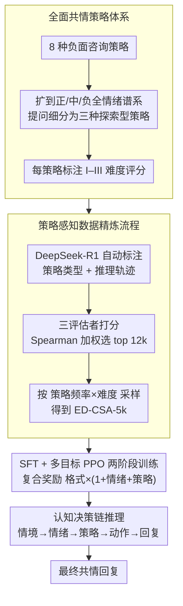

# STRIDE-ED: A Strategy-Grounded Stepwise Reasoning Framework for Empathetic Dialogue Systems

**会议**: ACL 2026  
**arXiv**: [2604.07100](https://arxiv.org/abs/2604.07100)  
**代码**: [https://github.com/jicoder-nwpu/STRIDE-ED](https://github.com/jicoder-nwpu/STRIDE-ED)  
**领域**: 强化学习  
**关键词**: 共情对话, 策略引导推理, 链式思考, 多目标强化学习, 数据精炼

## 一句话总结
本文提出 STRIDE-ED 框架，通过构建覆盖正/中/负情绪的全面共情策略体系，设计任务对齐的多阶段认知CoT推理，结合策略感知数据精炼和SFT+PPO两阶段训练，在多个开源LLM上实现共情对话SOTA，情感准确率达57.25%，BLEU-4达4.67。

## 研究背景与动机

**领域现状**：共情对话是社交AI的核心能力，要求模型不仅识别用户情绪，还要做出策略性的、上下文敏感的回复。早期工作通过外部常识知识图谱（如ATOMIC）增强情感理解，近期研究转向利用LLM的CoT提示来显式建模推理过程。

**现有痛点**：(1) 策略覆盖不完整——现有策略体系（如Liu et al. 2021的8种策略）仅针对负面情绪的咨询场景，忽略了正面和中性情绪；(2) 推理缺乏任务对齐——CoT方法虽然形式上结构化，但推理步骤浮于表面，缺少与共情决策过程的显式对齐；(3) 策略感知监督不足——训练数据缺少与策略推理对齐的高质量标注。

**核心矛盾**：共情对话本质上是一个多阶段认知决策过程（情境理解→情绪识别→策略选择→行动推理→回复生成），但现有方法要么隐式地跳过中间步骤，要么用通用CoT替代而不做任务特化。

**本文目标**：(1) 构建覆盖全情绪谱系的共情策略体系；(2) 设计与认知过程对齐的多阶段推理框架；(3) 建立策略感知的数据精炼流程和训练范式。

**切入角度**：从认知心理学出发，将共情回复生成建模为"情境总结→情绪识别→策略推断→行动推理→回复生成"的递进式认知链条，每一步都有显式输出和约束。

**核心 idea**：用全面的策略体系支撑结构化推理，用策略感知的数据精炼保证训练质量，用多目标RL对齐情绪/策略/格式三个维度。

## 方法详解

### 整体框架

STRIDE-ED 把共情回复生成当成一条递进的认知决策链来做：模型以对话历史 $\mathcal{C}$ 为输入，不直接吐回复，而是先在内部依次产出情境总结、情绪状态、共情策略和策略执行动作四个中间结果，再据此生成最终回复 $u_t$。每个中间步骤都被裹进结构化标签（`<Context>`、`<Emotion>`、`<Strategy>` 等），使推理过程既可解释又可被奖励信号约束。要让这条链真正学起来，框架先用一套覆盖全情绪谱系的策略体系定义「可选策略」，再用一条策略感知的数据精炼流程产出高质均衡的训练集，最后用 SFT 打底、多目标 PPO 收尾的两阶段训练把模型对齐到情绪、策略与格式三个维度，训练好的模型在推理时才能稳定走完这条认知链。

### 关键设计

**1. 全面共情策略体系：把策略从「负面咨询」扩到全情绪谱系**

现有策略系统（如 Liu et al. 2021 的 8 种策略）只面向负面情绪的咨询场景，可真实对话里正面情绪（如分享好消息）同样需要共情，且需要完全不同的策略。本文在这 8 种策略基础上扩展，覆盖正面、中性、负面三类情绪，并把笼统的「提问」策略细分为三种不同认知层次的「探索型」策略，让策略谱系横跨情感验证、积极倾听、认知重构、引导行动等多个维度。

更关键的是为每种策略标注三级难度评分（I–III）以反映其认知复杂度，这个难度标签会在后续数据采样中被用来给高阶策略「加权补课」，从根上缓解简单策略主导训练的偏置。

**2. 策略感知数据精炼流程：从噪声标注里捞出高质、均衡的训练集**

直接用 LLM 自动标注的数据质量参差不齐，且策略分布严重失衡（简单策略大量占据），因此本文设计了三步精炼：先用 DeepSeek-R1 对 EMPATHETICDIALOGUES 自动标注策略类型与推理轨迹；再用 DeepSeek-R1、Qwen3、Llama-3.1 三个独立评估者打分，按 Spearman 相关性加权聚合后选出 top 12k 高质量样本；最后按「策略频率 × 难度权重」的联合分布采样，得到 5k 精炼集 ED-CSA-5k。

多评估者加权解决了「单一标注者不可靠」的质量问题，而频率与难度交叉的采样则保证难的高阶策略也有足够样本，使数据在质量和分布两个维度同时被优化。

**3. SFT + 多目标 PPO 两阶段训练：先会推理，再对齐三维目标**

SFT 阶段把带策略标注的精炼数据和不带标注的剩余数据混合训练，让模型既学会显式的策略推理、又保持通用回复能力，避免只在小规模精炼集上过拟合。但 SFT 只能模仿示范，碰到分布外的策略选择就力不从心，于是 PPO 阶段接力，用复合奖励 $R = r_{\text{format}} \cdot (1 + r_{\text{emotion}} + r_{\text{strategy}})$ 做强化。

这个奖励的乘加结构很关键：格式奖励 $r_{\text{format}}$ 是门控因子，一旦结构化标签出错整体奖励直接归零；情绪与策略奖励则以加性方式叠加，引导模型在「格式合法」的前提下进一步对齐情绪识别和策略选择。

### 损失函数 / 训练策略

SFT 阶段使用标准负对数似然损失。PPO 阶段使用近端策略优化，奖励为三个二值奖励的乘加组合（格式 ×（1 + 情绪 + 策略））。初始学习率 1e-4，batch size 16，序列长度 2048。

### 一个完整示例

用户说「我终于拿到 offer 了！」——这是一条正面情绪话语，恰好落在旧策略体系覆盖不到的区间。STRIDE-ED 先在 `<Context>` 里总结情境（用户分享求职成功的喜讯），在 `<Emotion>` 里识别出「兴奋／自豪」，在 `<Strategy>` 里从全情绪策略库选出一条高阶的「积极共鸣 + 引导庆祝」策略而非简单的提问，再推断出具体执行动作（肯定努力、邀请用户多分享），最终生成既有温度又有策略落点的回复。整个过程的每一步都带结构化标签，PPO 的情绪/策略奖励正是据此逐段核对、对齐的。

## 实验关键数据

### 主实验（EMPATHETICDIALOGUES 数据集）

| 模型 | B-1 | B-4 | Acc_emo | D-2 | PPL |
|------|-----|-----|---------|-----|-----|
| MoEL | 18.02 | 2.73 | 31.02 | 1.76 | 36.81 |
| CAB | 20.23 | 3.01 | 40.52 | 2.95 | 35.06 |
| ReflectDiffu | 23.59 | 3.62 | 48.76 | 4.35 | 24.56 |
| **STRIDE-ED** | **24.54** | **4.67** | **57.25** | **13.63** | **10.50** |
| 提升 vs ReflectDiffu | ↑4.0% | ↑29.0% | ↑17.4% | ↑213% | ↓57.2% |

### 消融实验

| 配置 | B-1 | Acc_emo | D-2 | PPL | 说明 |
|------|-----|---------|-----|-----|------|
| Full | 24.66 | 57.57 | 13.68 | 9.26 | 完整模型 |
| w/o emotion | 23.58 | - | 13.66 | 10.47 | 去情绪推理 |
| w/o sum | 22.91 | 54.14 | 13.42 | 7.78 | 去情境总结 |
| w/o strategy | 22.44 | 54.58 | 15.09 | 6.98 | 去策略推理→多样性升但失控 |
| w/o CoT | 22.55 | - | 13.26 | 8.64 | 去结构化推理 |
| w/o 精炼+采样 | 22.22 | 55.93 | 15.25 | 11.86 | 掉点最多 |
| w/o PPO | 23.52 | 54.48 | 14.76 | 2.03 | PPL极低但情绪对齐差 |

### 关键发现
- 策略推理去除后多样性反而上升（D-2 从 13.68→15.09），但B-1和情感准确率下降——说明无策略约束的模型生成更随机但更不可控
- 数据精炼+采样是最关键组件，去除后各指标全面下降
- PPO 对 PPL 影响最大（2.03→9.26），说明RL阶段在格式/情绪/策略约束下牺牲了部分流畅性换取对齐性
- 框架在多个开源LLM上泛化（Qwen3-0.6B/4B、LLama3.2-3B等）

## 亮点与洞察
- **认知心理学驱动的多阶段推理设计**非常自然且有说服力：情境总结→情绪识别→策略选择→行动推理→回复生成，每一步都有明确的功能和可解释输出
- 策略感知采样的设计巧妙地解决了数据不均衡问题——通过难度×频率的联合分布采样，确保难的高阶策略得到充分训练
- 复合奖励函数的"门控"设计值得借鉴——格式正确是前提，否则情绪和策略奖励无意义

## 局限与展望
- 策略体系基于EMPATHETICDIALOGUES数据集的分析构建，在其他文化或场景（如医疗咨询、危机干预）中可能不适用
- 自动标注依赖DeepSeek-R1的推理质量，标注错误会通过精炼流程传播
- 人工评估仅用了1000轮对话，规模有限
- 未探索多轮对话中的策略连贯性——当前每轮独立推理，不考虑会话级的策略规划

## 相关工作与启发
- **vs ReflectDiffu (Yuan et al. 2025)**: ReflectDiffu 用扩散模型做共情回复，关注生成质量；STRIDE-ED 关注策略驱动的推理过程，在情感准确率上提升 17.4%
- **vs CAB (Gao et al. 2023)**: CAB 建模认知评估和行为倾向，但缺乏全面的策略体系和数据精炼；STRIDE-ED 的策略覆盖和数据质量控制更系统

## 评分
- 新颖性: ⭐⭐⭐⭐ 策略体系扩展+多阶段CoT+策略感知数据精炼的组合较新颖
- 实验充分度: ⭐⭐⭐⭐⭐ 自动+人工评估，消融全面，多模型泛化验证
- 写作质量: ⭐⭐⭐⭐ 框架图清晰，方法描述详尽，但公式符号略多

<!-- RELATED:START -->

## 相关论文

- [\[ACL 2026\] Metro: Towards Strategy Induction from Expert Dialogue Transcripts for Non-collaborative Dialogues](metro_towards_strategy_induction_from_expert_dialogue_transcripts_for_non-collab.md)
- [\[ACL 2026\] Reasoning Gets Harder for LLMs Inside A Dialogue](reasoning_gets_harder_for_llms_inside_a_dialogue.md)
- [\[ACL 2026\] CoDial: Interpretable Task-Oriented Dialogue Systems Through Dialogue Flow Alignment](codial_interpretable_task-oriented_dialogue_systems_through_dialogue_flow_alignm.md)
- [\[ACL 2025\] ReflectDiffu: Reflect between Emotion-intent Contagion and Mimicry for Empathetic Response Generation via a RL-Diffusion Framework](../../ACL2025/dialogue/reflectdiffu_empathetic_response.md)
- [\[ACL 2026\] ETHICMIND: A Risk-Aware Framework for Ethical-Emotional Alignment in Multi-Turn Dialogue](ethicmind_a_risk-aware_framework_for_ethical-emotional_alignment_in_multi-turn_d.md)

<!-- RELATED:END -->
