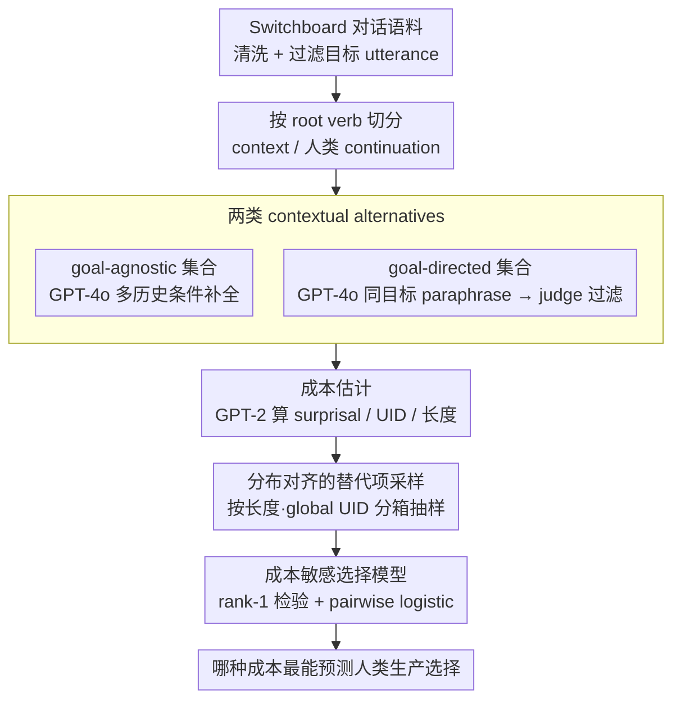

# Surprisal Minimisation over Goal-directed Alternatives Predicts Production Choice in Dialogue

**会议**: ACL2026  
**arXiv**: [2605.00506](https://arxiv.org/abs/2605.00506)  
**代码**: 无  
**领域**: 对话建模 / 心理语言学 / 信息论语言生产  
**关键词**: surprisal, goal-directed alternatives, 语言生产, UID, 对话语料  

## 一句话总结
这篇论文把自然对话中的话语生成建模为在上下文替代项中的成本敏感选择，并发现相对于“同一交际目标”的 goal-directed alternatives 最小化 surprisal，最能预测人类实际说出的 continuation。

## 研究背景与动机
**领域现状**：语言理解研究中，surprisal 常被用来解释阅读时间、眼动、脑成像和加工负荷；语言生产研究中，UID 假说和长度成本也常被用来解释为什么说话者会选择某种表达方式。

**现有痛点**：很多信息论分析只看观察到的话语本身，而没有明确说话者在当时还有哪些可选表达。没有 alternatives，就很难判断某个句子是“成本低所以被选中”，还是只是语料中碰巧出现。

**核心矛盾**：生产选择必须相对于一个候选集合定义，但自然对话是开放生成空间。传统模型要么只研究很小的句法变体集合，要么把替代项定义得过窄，无法覆盖真实对话中说话者可能考虑的表达。

**本文目标**：作者希望用语言模型生成开放式 alternatives，区分两种不同候选集合：goal-agnostic alternatives 表示听者在上下文中可能预期的各种合理延续；goal-directed alternatives 表示说话者为了实现同一交际目标可以选择的各种改写。

**切入角度**：如果一个成本指标真的刻画语言生产，它应该在同一目标的候选表达中偏好人类选择；如果它更像听者理解压力，则在 goal-agnostic alternatives 中可能更明显。

**核心 idea**：用 LM 生成 goal-directed 与 goal-agnostic 两类 alternatives，并比较人类 continuation 在 surprisal、UID 和长度成本下是否比 alternatives 更低，从而识别哪种成本最能解释生产选择。

## 方法详解
这篇论文的关键贡献不是提出新的神经模型，而是把“生产选择”重新定义为有候选集合、有成本函数、有概率选择规则的实验框架。

它最重要的区分是：同一个上下文下，听者不知道说话者要表达什么；但说话者知道自己的 communicative goal。

因此，用于解释说话者选择的 alternatives 应该保持同一目标，而不是只要上下文合理就算候选。

### 整体框架
论文使用 Switchboard Dialogue Act Corpus，这是自然口语对话数据。

作者先清理转写文本，去除 backchannels、短停顿、语音噪声标记和明显 disfluencies。

目标 utterance 被限制为 10 到 30 个词，且 dialogue act 是 statement 或 question，并且前一轮来自另一说话者。

每个目标 utterance 被切成 context 和 continuation：用句子的 root verb 作为选择点，root verb 及之前部分作为 context，之后部分作为人类实际 continuation。

清洗后得到 1,342 个 utterances；进一步生成 alternatives 和过滤后，最终分析集中包含 309 个 contexts、309 个观察到的人类 continuations 和 12,360 个生成 continuations。

成本估计使用 GPT-2 Small 计算 surprisal，理由是它在心理语言学中常作为处理负荷估计器。

goal-agnostic alternatives 由 GPT-4o 在不同 history 条件下补全句子，包括无历史、上一轮历史、完整历史。

goal-directed alternatives 则由 GPT-4o 对观察到的人类句子做受约束 paraphrase，要求改写必须保留同一个 context 和语义目标。

随后用 GPT-4o judge 过滤 paraphrase，人工抽样显示 paraphrase 判断准确率 98.75%。

由于 LM 生成的替代项可能在长度和整句信息密度上系统性偏离人类，作者还按长度和 global UID 分箱、从生成池无放回抽样，让替代项分布与人类对齐，避免生成偏差污染成本比较。

最后作者比较人类 continuation 在各类 cost 下的 rank，并用 pairwise logistic choice model 测试成本差异是否预测人类选择。

### 关键设计

**1. 两类 contextual alternatives：把生产者视角和听者视角分开**

以往的信息论分析只盯着观察到的那一句话，却没说清说话者当时还能选哪些表达——没有候选集，就分不清某句是“成本低所以被选中”还是“语料里碰巧出现”。本文的关键切分是把候选集分成两类：goal-agnostic 集合 $A_c$ 只条件化上下文 $c$，囊括任何语法合理、语境连贯的延续，代表听者在当前位置可能预期的各种续写；goal-directed 集合 $A_{c,g}$ 同时条件化上下文和交际目标 $g$，只保留与人类 continuation 语义等价或近似等价的改写。

之所以非分不可，是因为同一个 surprisal 在两类集合里讲的是两件事：相对于所有可能延续的低 surprisal 更像“听者的预期被满足”，而相对于同一目标各种改写的低 surprisal，才像“说话者为了表达同一意思挑了更省力的形式”。把这个原本含糊的“替代项”概念变成可操作的实验变量，是整篇论文的支点。

**2. 成本敏感选择模型：把“人类为什么说这句话”转成可检验的概率假设**

光统计“人类有没有选最低成本项”还不够，作者进一步给生产选择套了一个概率模型：候选 continuation 的生产概率与其效用成指数关系，而效用可写成常数减去成本，于是

$$P_S(a \mid c, g) \;\propto\; \exp\!\big(-\alpha\, C(a; c)\big)$$

成本 $C$ 越低，候选被选中的概率越高；当选择噪声 $\alpha \to \infty$、随机性趋于零时，人类 continuation 就应该频繁地排到 rank 1。这个形式把 deterministic 的 rank 分析和 probabilistic 的 logistic 分析接到了一起——前者问“人类是否选了最低成本项”，后者问“成本差异是否连续地预测选择概率”，两条证据互相印证。

**3. 分布对齐的替代项采样：防止结论被生成偏差驱动**

用 LM 生成 alternatives 有个隐患：模型可能天然偏好更短、更平滑的句子，如果生成池在长度或全局 UID 上系统性地不同于人类，那成本比较就被数据分布偏差污染了。作者先比对生成 continuations 和人类 continuations 的整体成本分布，发现 surprisal 和 local UID 差异不显著，但 length 和 global UID 差异显著；于是按 length 和 global UID 把人类 utterances 分箱，再从生成池里无放回抽样，让生成替代项的 strata 比例与人类分布对齐。经过这层 stratified sampling，后续结果才更像“同一上下文下的偏好”，而不是全局分布差异在冒充结论。

### 损失函数 / 训练策略
本文没有训练新模型，实验依赖已有 LM 做成本估计、替代项生成和 paraphrase 判断。

surprisal、local UID、global UID 与 length 是四类成本函数。

surprisal 是 continuation 在上下文和对话历史下的负对数概率。

local UID 衡量 continuation 内相邻词 surprisal 的平方差均值，越小表示局部信息密度越平滑。

global UID 衡量整句 surprisal 相对均值的方差，越小表示整句信息密度越均匀。

length 是 continuation 词数，作为生产努力的简单 proxy。

统计分析包括 Poisson-binomial rank-1 test、pairwise logistic choice model、one-sided t-test 和 conditional logit 辅助分析。

## 实验关键数据

### 主实验
deterministic cost minimisation 中，作者统计人类 continuation 在 alternatives 中成为最低成本项的比例。

| Cost | Goal-directed rank-1 | Goal-agnostic rank-1 | Uniform baseline |
|------|----------------------|----------------------|------------------|
| Surprisal | 53.4% | 15.2% | 16.5% / 7.2% |
| Local uniformity | 34.1% | 16.2% | 16.5% / 7.2% |
| Global uniformity | 24.1% | 19.3% | 16.5% / 7.2% |
| Length | 28.6% | 26.6% | 16.5% / 7.2% |

所有成本都显著高于 chance，但最强结果是 goal-directed alternatives 下的 surprisal：53.4% 的人类 continuation 是最低 surprisal 选项，相当于 baseline 的 3.24 倍。

pairwise logistic choice model 也支持相同结论：surprisal 的负向成本差异最稳定，且在 goal-directed condition 下效应约为 goal-agnostic 的 7 倍。

| Cost | Goal-agnostic β | Goal-directed β | Interaction β | Per-item LL |
|------|-----------------|-----------------|---------------|-------------|
| Surprisal | -0.304 | -2.073 | -1.769 | -0.615 |
| Local uniformity | 0.357 | -0.683 | -1.040 | -0.670 |
| Global uniformity | 0.796 | -0.632 | -1.428 | -0.637 |

负系数表示人类更可能选择低成本 continuation；surprisal 在 goal-directed 下最负，且 log-likelihood 最好。

### 消融实验
作者还做了分布差异和无 stratified sampling 的附加分析，确认主结论不是抽样策略偶然造成的。

| 分析 | Goal-directed | Goal-agnostic | 解释 |
|------|---------------|---------------|------|
| Surprisal t-test | t=-32.48, p<1e-8 | t=-8.23, p<1e-8 | 人类 continuation 的 surprisal 显著低于 alternatives，goal-directed 更强 |
| Local UID t-test | t=-13.37, p<1e-8 | t=10.57, p=1.00 | UID 只在 goal-directed 下符合低成本预测 |
| Global UID t-test | t=-12.11, p<1e-8 | t=26.48, p=1.00 | goal-agnostic 下方向反转 |
| Length t-test | t=2.99, p=1.00 | t=-10.72, p<1e-8 | 长度更像 goal-agnostic 中的表层压力 |

无 stratified sampling 时，surprisal 仍然是最强的 goal-directed 解释变量，只是绝对比例有所降低。

| Cost | Goal-directed rank-1 | Goal-agnostic rank-1 | Uniform baseline |
|------|----------------------|----------------------|------------------|
| Surprisal | 47.6% | 10.7% | 9.3% / 3.3% |
| Local uniformity | 22.1% | 12.4% | 9.3% / 3.3% |
| Global uniformity | 13.0% | 13.4% | 9.3% / 3.3% |
| Length | 22.8% | 22.5% | 9.3% / 3.3% |

### 关键发现
- Surprisal 相对于 goal-directed alternatives 的预测力最强，这支持“说话者在实现同一目标时偏好更易生成、更常规的表达”。
- UID 并非无效，但效果更弱且依赖 alternative set；在 goal-agnostic 下甚至可能方向反转，说明 UID 更复杂，不宜被简单解释为统一生产目标。
- 长度在 goal-agnostic 中有一定预测力，但它无法解释为什么同一交际目标的 paraphrase 中某个表达被选中。
- LM-generated alternatives 能把开放对话生产问题转成可检验实验，但必须用 paraphrase 过滤和分布对齐防止生成偏差。
- 这项工作给“speaker cost”和“listener expectation”提供了可操作区分：看成本是在同一目标集合中起作用，还是在所有上下文合理延续中起作用。

## 亮点与洞察
- goal-directed vs goal-agnostic 的区分非常漂亮。很多语言生产研究说“替代项”，但没有明确这些替代项是否共享交际目标；本文把这个模糊点变成实验变量。
- 论文没有把 LLM 直接当认知模型，而是把它当 alternatives generator、cost estimator 和 judge 的工具链。这个定位更稳健，也更容易分析误差来源。
- 分布对齐设计很关键。自然语言生成模型可能有自己的长度和风格偏好，不做 stratification 就容易把模型偏好误判为人类生产规律。
- 结果对 NLG 也有启发：如果系统要生成自然表达，不应只从全局高概率文本中采样，而应在固定 communicative goal 的 paraphrase set 内优化成本。

## 局限与展望
- 实验只覆盖英文 Switchboard 对话中的一类选择点，即 matrix verb 后的 continuation，不能直接推广到所有句法选择、语言和语域。
- 成本是整段 continuation 的 aggregate，对长句或增量规划可能不够敏感；离选择点更近的 token 应该有更高权重。
- GPT-4o 生成和过滤 alternatives 的质量会影响结论，尤其是 goal-directed paraphrase 是否真的保持同一 communicative goal。
- GPT-2 Small 的 surprisal 可能和现代大模型或人类加工不完全一致，不过它在心理语言学中常用，选择是有方法传统的。
- 框架没有显式建模 communicative effectiveness，因为自然对话中很难给每个 paraphrase 定义外部成功信号。未来若能加入 listener interpretation model，会更完整。

## 相关工作与启发
- **vs Uniform Information Density**: UID 强调信息密度平滑，但本文显示 UID 的解释力依赖 alternatives 类型，且不如 goal-directed surprisal 稳定。
- **vs Rational Speech Act / rate-distortion**: RSA 常在小的离散 action set 上建模选择，本文用 LLM 生成开放 alternatives，把类似思想推到自然对话场景。
- **vs 传统 surprisal comprehension 研究**: 传统 surprisal 多解释听者处理负荷，本文指出同一指标在 goal-directed alternatives 下也能有 speaker-oriented 解释。
- **vs LM alternative sampling 工作**: 过去 LM alternatives 常用于预测听者不确定性或语义推断，本文把 alternatives 分成 speaker/listener 两类，理论解释更精细。

## 评分
- 新颖性: ⭐⭐⭐⭐☆ 核心方法是重新定义 alternatives 并系统比较成本，理论区分很有新意。
- 实验充分度: ⭐⭐⭐⭐☆ 数据清洗、替代项生成、统计检验完整，但语料和选择点范围偏窄。
- 写作质量: ⭐⭐⭐⭐⭐ 论证链条清晰，背景、模型、实验和限制衔接自然。
- 价值: ⭐⭐⭐⭐☆ 对心理语言学和 NLG 生成目标设计都很有启发，工程落地取决于 alternatives 生成质量。

<!-- RELATED:START -->

## 相关论文

- [\[ACL 2025\] Enhancing Goal-oriented Proactive Dialogue Systems via Consistency Reflection and Correction](../../ACL2025/dialogue/enhancing_goal-oriented_proactive_dialogue_systems_via_consistency_reflection_an.md)
- [\[ACL 2026\] ReacTOD: Bounded Neuro-Symbolic Agentic NLU for Zero-Shot Dialogue State Tracking](reactod_bounded_neuro-symbolic_agentic_nlu_for_zero-shot_dialogue_state_tracking.md)
- [\[ACL 2026\] CoDial: Interpretable Task-Oriented Dialogue Systems Through Dialogue Flow Alignment](codial_interpretable_task-oriented_dialogue_systems_through_dialogue_flow_alignm.md)
- [\[ACL 2026\] Reasoning Gets Harder for LLMs Inside A Dialogue](reasoning_gets_harder_for_llms_inside_a_dialogue.md)
- [\[ACL 2026\] Frame of Reference: Addressing the Challenges of Common Ground Representation in Dialogue](frame_of_reference_addressing_the_challenges_of_common_ground_representation_in_.md)

<!-- RELATED:END -->
