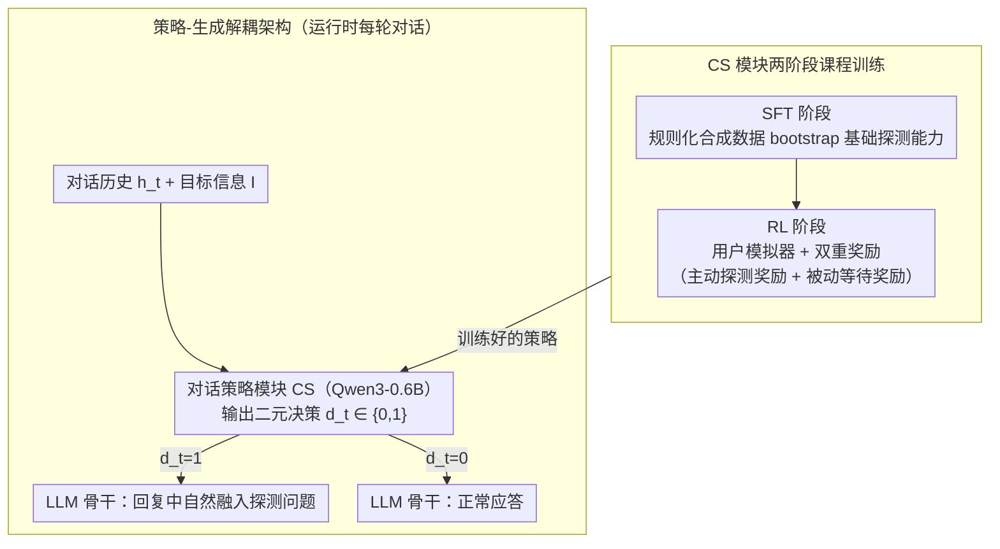

# Towards Proactive Information Probing: Customer Service Chatbots Harvesting Value from Conversation

**会议**: ACL 2026  
**arXiv**: [2604.11077](https://arxiv.org/abs/2604.11077)  
**代码**: [https://github.com/SCUNLP/PROCHATIP](https://github.com/SCUNLP/PROCHATIP)  
**领域**: 对话系统  
**关键词**: 主动信息探测, 客服聊天机器人, 对话策略, 强化学习, 商业智能

## 一句话总结

本文提出 ProChatIP 框架，将客服聊天机器人从被动应答工具转变为主动信息采集引擎，通过专门的对话策略模块学习"何时探测"用户以获取预设的目标信息，同时最小化对话轮数和用户摩擦。

## 研究背景与动机

**领域现状**：AI 客服聊天机器人已成为现代商业运营的重要组成部分，主要聚焦于回答用户查询、理解用户意图和提取问答对。LLM 时代的客服机器人已能有效处理复杂的交互动态。

**现有痛点**：现有客服机器人本质上是被动的——只回应用户提问，缺乏主动收集有价值商业信息的能力。例如，商品交易平台的客服可以在服务过程中主动询问用户对市场行情的看法（"您最近有关注库存水平吗？"），从而通过众包方式获取定价模型所需的市场情报。

**核心矛盾**：用户进入客服对话是为了解决自己的问题，如果机器人的信息探测显得突兀或与上下文无关，用户很可能拒绝或忽略，甚至降低满意度。过多的重复询问会延长对话且损害体验。

**本文目标**：定义"主动信息探测"任务，优化探测的时机（何时探测），最大化信息获取同时最小化对话轮数和用户摩擦。

**切入角度**：将信息探测决策解耦为独立的策略模块（CS），与 LLM 骨干分离，用 SFT + RL 两阶段课程学习训练策略。

**核心 idea**：在每轮对话中，轻量级策略模块决定是否探测（$d_t \in \{0,1\}$），如果决定探测，LLM 将自然地在回复中融入探测问题；用双重奖励（主动探测奖励 + 被动等待奖励）训练策略，学会在用户接受度最高的时机出手。

## 方法详解

### 整体框架

ProChatIP 的设计目标是让客服机器人在不打扰用户主诉求的前提下，学会「何时该主动探一句」。它把探测决策从生成中拆出来：每轮对话先由一个轻量级对话策略模块 CS（Qwen3-0.6B 实现）分析对话历史 $h_t$ 和目标信息 $\mathcal{I}$，输出二元决策 $d_t \in \{0,1\}$；再由 LLM 骨干执行——$d_t=1$ 时在客服回复里自然融入探测问题，$d_t=0$ 时正常应答。CS 模块经 SFT 打底、RL 精修的两阶段课程训练，逐步从「会探测」走向「会挑时机探测」。

### 关键设计

**1. SFT 阶段：用规则化合成数据 bootstrap 出基础探测能力**

现有客服数据集里根本没有主动探测的样本，模型连「什么时候适合探」都没见过，必须先冷启动。本文用 LLM 生成规则化的合成客服对话，每段对话都对应一条明确规则——例如「用户表现出话题拓展意愿时适合探测」或「用户明确拒绝时不应探测」，再在这些标注数据上做全参数微调。

SFT 由此让策略模块掌握一批启发式的模式识别能力，建立起可用的基线探测行为，为后续 RL 提供一个不至于乱探的起点。

**2. RL 阶段：双重奖励教会策略「知进退」**

只靠 SFT 的静态规则学不到动态最优时机，于是本文用 LLM 搭一个带随机化抵抗行为的用户模拟器，与 ProChatIP 多轮交互，并设计了一对互补的奖励。主动探测奖励管「该不该出手」：成功获取信息给大正奖励、被拒绝给惩罚、被忽略给小惩罚；被动等待奖励则管「该不该收手」：上轮被拒后选择等待给大正奖励（聪明的退让）、上轮被忽略后等待给小正奖励（暂停再试）、而连续不作为给大惩罚以防策略偷懒。

关键在于光有探测奖励会把机器人训得过于激进、拒绝率飙升；等待奖励的加入让策略学到「被拒后退一步比硬追更划算」，从而在用户接受度最高的时机才出手。整体用 REINFORCE 算法优化。

**3. 策略-生成解耦架构：探测能力不污染客服主业**

如果让同一个 LLM 既做探测决策又做回复生成，探测意图很容易渗进措辞、拖累服务质量。ProChatIP 把两者彻底解耦：决策交给独立的 0.6B 轻量模块，LLM 骨干只负责执行信号——收到 $d_t=1$ 就把探测问题自然嵌进回复，收到 $d_t=0$ 就老老实实答疑。

这种解耦既保证了客服回复质量不受探测逻辑干扰，又让策略模块可以即插即用地挂在任意 LLM 骨干上，部署成本极低。

### 损失函数 / 训练策略

SFT 使用交叉熵损失训练探测决策的二分类。RL 使用 REINFORCE 算法（$\theta \leftarrow \theta + \alpha \nabla_\theta \log \text{CS}_\theta(d_t | h_t, \mathcal{I}) \cdot G_t$）最大化累积折扣奖励。

## 实验关键数据

### 主实验

| 方法 | TSR↑ | AvgT↓ | RPR↓ | QRR↑ |
|--------|------|------|----------|------|
| Vanilla (GPT-4o-mini) | 0.00% | 7.57 | 0.00% | 99.65% |
| Proactive 基线 | 85.79% | 3.09 | 50.33% | 99.41% |
| ICL-AIF 基线 | 64.42% | 4.10 | 65.08% | 99.37% |
| ProChatIP | 87.38% | 1.92 | 24.59% | 98.67% |

TSR=目标信息成功率, AvgT=平均对话轮数, RPR=被拒率, QRR=查询回复率

### 消融实验

| 配置 | TSR | AvgT | 说明 |
|------|---------|------|------|
| 仅 SFT | 中等 | 中等 | 基础模式识别 |
| SFT + RL | 87.38% | 1.92 | RL 大幅优化时机选择 |
| w/o 等待奖励 | 下降 | 增加 | 没有退让策略，被拒率上升 |

### 关键发现

- **ProChatIP 显著优于基线**：相比最强基线，目标信息成功率提升 11.36%，对话轮数减少 39.50%，用户满意度提升 23.73%。
- **等待奖励的关键性**："聪明的退让"（被拒后选择等待再重新探测）是策略成功的关键——单纯的激进探测会导致高拒绝率。
- **真人评估一致**：LLM 模拟器和真人参与者的评估结果高度一致，验证了模拟器训练环境的有效性。
- **解耦架构有效**：策略模块仅 0.6B 参数，不影响 LLM 骨干的客服质量（QRR 保持 >98%）。

## 亮点与洞察

- **商业价值的范式转变**：将客服交互从"成本中心"转变为"利润中心"——每次客服对话都成为低成本的商业情报收集渠道。
- **双重奖励设计**：主动探测 + 被动等待的双重奖励机制巧妙地编码了"知进退"的策略智慧，避免了单一激进策略。
- **实际部署友好**：策略模块轻量（0.6B），与任何 LLM 骨干兼容，可即插即用地部署到现有客服系统。

## 局限与展望

- 目前仅支持单一目标信息的探测，未处理多目标信息的优先级排序。
- 用户模拟器的抵抗行为由规则生成，可能无法完全覆盖真实用户的复杂心理。
- 探测问题的生成质量完全依赖 LLM 骨干，未有针对性优化。
- 仅在金融和通用客服两个领域评估，更广泛的领域适用性有待验证。

## 相关工作与启发

- **vs 主动对话 Agent**: 现有主动对话系统（如澄清歧义、引导推荐）的主动性服务于用户利益。ProChatIP 引入了"系统中心效用"维度——利用主动性收集商业情报，形成多目标挑战。
- **vs 传统客户服务**: 传统客服聚焦查询解决、情感共情等用户体验维度。ProChatIP 在不损害这些维度的前提下增加了信息采集功能。

## 评分

- 新颖性: ⭐⭐⭐⭐⭐ 首次定义"主动信息探测"任务，问题定义新颖且有实际商业价值
- 实验充分度: ⭐⭐⭐⭐ 模拟器+真人双重验证，多基线对比
- 写作质量: ⭐⭐⭐⭐ 问题动机清晰，方法描述完整
- 价值: ⭐⭐⭐⭐⭐ 直接改变客服机器人的商业定位，实用价值极高

<!-- RELATED:START -->

## 相关论文

- [\[ACL 2025\] Enabling Chatbots with Eyes and Ears: An Immersive Multimodal Conversation System](../../ACL2025/dialogue/enabling_chatbots_with_eyes_and_ears_an_immersive_multimodal_conversation_system.md)
- [\[ACL 2026\] Cognitive Policy-Driven LLM for Diagnosis and Intervention of Cognitive Distortions in Emotional Support Conversation](cognitive_policy-driven_llm_for_diagnosis_and_intervention_of_cognitive_distorti.md)
- [\[ACL 2026\] Frame of Reference: Addressing the Challenges of Common Ground Representation in Dialogue](frame_of_reference_addressing_the_challenges_of_common_ground_representation_in_.md)
- [\[ACL 2025\] Dialogue Systems for Emotional Support via Value Reinforcement](../../ACL2025/dialogue/dialogue_systems_for_emotional_support_via_value_reinforcement.md)
- [\[ACL 2025\] Enhancing Goal-oriented Proactive Dialogue Systems via Consistency Reflection and Correction](../../ACL2025/dialogue/enhancing_goal-oriented_proactive_dialogue_systems_via_consistency_reflection_an.md)

<!-- RELATED:END -->
