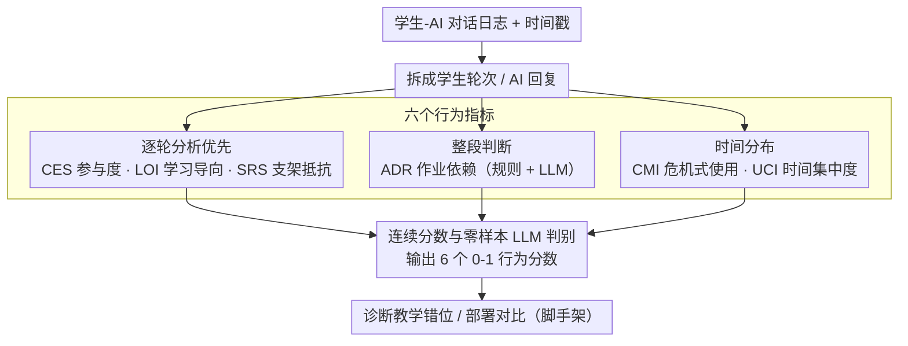

# Your Students Don't Use LLMs Like You Wish They Did

**会议**: ACL2026  
**arXiv**: [2604.23486](https://arxiv.org/abs/2604.23486)  
**代码**: 无公开代码  
**领域**: 教育对话系统 / Dialogue Evaluation / Learning Analytics  
**关键词**: 教育AI, 对话评估, 学习导向, 支架抵抗, 危机式使用

## 一句话总结
这篇论文提出 6 个面向教育 AI 对话的可计算行为指标，并在 500 段真实学生-AI 对话中发现：学生常把本应促进学习的 LLM 工具用成答案提取器，且部署方式比系统设计或学生偏好更能决定这种错位。

## 研究背景与动机
**领域现状**：教育 NLP 和 AI tutor 论文通常用满意度问卷、参与度、消息数、自报告学习收益来评估系统。这样的评估能说明学生是否喜欢工具，却很难说明工具是否真的达成了教育目标，例如促进概念理解、引导反思、减少直接抄答案。

**现有痛点**：教育心理学早已指出，学生常把“交互很顺”“答案看起来懂了”误认为真正学会了，即所谓 illusion of fluency。LLM 对话系统越流畅、越容易给出直接答案，越可能获得高满意度，但也越可能绕开 productive struggle。也就是说，满意度和教学有效性可能反向相关。

**核心矛盾**：教师希望 AI tutor 维持有支架的学习对话，学生在压力和截止日期下却常追求效率和答案。传统整段对话指标会把高频互动误判为高质量学习，而看不见每一轮中“要求直接答案”“绕过提示”“考试前临时抱佛脚”的行为。

**本文目标**：作者希望提供一套可扩展的计算指标，直接衡量学生是否按教育意图使用 AI 系统。它们要能覆盖对话参与、学习导向、支架抵抗、作业依赖、危机式使用和时间集中度，并用人工标注验证其可靠性。

**切入角度**：论文把 learning analytics 和 educational data mining 中已经很成熟的 gaming、help-seeking、deadline procrastination 等概念转成 NLP 可计算指标，而不是继续只评价 tutor 单轮回复质量。

**核心 idea**：用多维行为指标评价“学生实际怎么用 LLM”，把教育 AI 评估从满意度/参与度转向 pedagogical alignment，即工具使用行为是否符合教学目标。

## 方法详解
论文的贡献不是训练一个新 tutor，而是提出一套评估框架。输入是学生与 AI 工具的对话日志和时间戳，输出是 6 个 0-1 之间的行为分数或类别分布，用来判断学生行为是否与教学意图一致。作者同时比较 turn-by-turn 分析和 whole-dialogue 分析，前者更适合捕捉立即求答案、绕过支架等细粒度模式。

### 整体框架
框架先把每段学生-AI 对话拆成学生轮次和 AI 回复，然后针对不同指标调用规则检测或 LLM 零样本判断。CES、LOI、SRS 更依赖逐轮分析：它们需要判断学生是在延续讨论、探索概念，还是跳过引导直接求解。ADR 可以同时用规则和 LLM 做整段分析，判断是否存在作业题直接输入。CMI 和 UCI 则利用时间信息，比较学生在平时和考试/截止日期附近的行为变化。

为了验证指标，作者人工标注 248 段对话，其中 100 段由第二标注者重叠标注以估计人类一致性。LLM 侧比较 GPT-4.1-mini 和 GPT-5，并比较 turn-by-turn 与 whole-dialogue 两种粒度。最终在 500 段对话、12,650 条消息上应用这些指标，覆盖五个数据集和两种部署范式：可选的教学支架工具，以及整合进课程作业流程的 unrestricted AI 工具。

### 关键设计

**1. 六个行为指标覆盖不同教学风险：把“学生是否在学习”拆成多个可观测维度**

教育 AI 的失败不是单一形态——有的系统让学生高参与却低学习，有的只在考试周被想起，有的干脆被当成作业答案机，一个满意度分数根本概括不了这些差异。论文因此设计了六个互补指标：CES 衡量对话参与度，看轮次数、follow-up、上下文引用和确认语；LOI 衡量探索式学习与直接求解的比例；SRS 衡量学生对提示、引导问题、苏格拉底式支架的抵抗；ADR 检测作业题驱动的使用；CMI 捕捉考试或截止日期附近的危机式使用；UCI 则用类似 Gini 系数的时间集中度，衡量整个学期的使用是否挤在少数几个高压时段。六个维度合起来，才能把不同形态的“工具被用歪”分辨开。

**2. 逐轮分析优先于整段对话分析：捕捉一轮一轮发生的求答案和绕支架**

一段对话看起来很长、很活跃，但其中大部分轮次可能都在变着法逼 AI 给答案——教育风险往往藏在这种局部转折里，只看最终对话长度会被假象骗过。所以框架在 turn-by-turn 粒度上对每个学生回复单独判断：他是在承接 AI 的引导、还是在要求直接答案、还是在忽略支架；而 whole-dialogue 分析只把整段压成一个笼统判断。实验也印证了这一选择：GPT-5 的逐轮分析在 LOI、SRS、CES 上与人工标注的相关性明显高于整段分析，说明把判断下沉到每一轮确实保住了那些会被整段摘要抹平的细粒度模式。

**3. 连续分数与零样本 LLM 判别：在无大规模标注下让指标跨课程迁移**

学生行为常常处在灰区——可能先认真尝试理解，转头又要直接答案，硬二分类会把这种动态变化一刀切掉。框架因此让所有 LLM 指标走 zero-shot prompting，不做 fine-tuning、也不用 few-shot，输出尽量给 0-1 之间的连续分数而非非黑即白的标签：例如 SRS 把直接抵抗记为权重 1.0、绕过支架记为 0.5、部分参与给中间值。这样做牺牲了一点对单门课程的最优拟合，换来的是不必为每门课重训分类器就能跨课程、跨工具迁移——零样本 prompt 加人工验证，更适合当一个跨场景的诊断框架，而不是高成本的定制评估器。

### 损失函数 / 训练策略
本文没有训练新模型，因此没有监督损失函数。评估模型侧采用零样本 LLM prompt：LOI、SRS、ADR、CMI 主要由 GPT-4.1-mini 或 GPT-5 判别，CES 的部分组件也用 LLM 做二分类；ADR 另有规则检测版本。作者没有用数据驱动方式调指标权重，而是根据教学经验设定，例如 CES 中轮次数权重最高，CMI 中 panic indicator 和 query directness shift 权重最高。

这种策略的取舍很清楚：牺牲一部分最优拟合，换取跨课程通用性。如果为每个课程重新训练分类器，框架会变成高成本评估工具；而 zero-shot prompt 加人工验证更适合做跨场景诊断。

## 实验关键数据

### 主实验
人工验证显示，GPT-5 的逐轮分析在多个指标上接近人类一致性，而整段分析明显更弱。这直接支持作者强调的 turn-by-turn 评估。

| 方法 | LOI r/κ | CES r/κ | SRS r/κ | ADR r/κ | 关键结论 |
|------|-------:|-------:|-------:|-------:|----------|
| GPT-4.1-mini Turn | 0.62 | 0.42 | 0.64 | - | 可用但 CES 较弱 |
| GPT-4.1-mini Whole | 0.33 | 0.21 | 0.25 | 0.22 | 整段分析损失细节 |
| GPT-5 Turn | 0.72 | 0.59 | 0.67 | - | 与人工最一致 |
| GPT-5 Whole | 0.47 | 0.46 | 0.49 | 0.31 | 仍弱于逐轮分析 |
| Rule-based | - | - | - | 0.35 | ADR 规则略可用但有限 |
| Human-Human | 0.58 | 0.67 | 0.64 | 0.65 | 人工一致性基线 |

把指标应用到 500 段真实对话后，作者发现不同部署模式都存在错位：可选工具在考试/评估期变成危机管理工具，集成式 unrestricted 平台虽然互动更分散，却显著更偏向直接求答案。

| 数据集 | LOI | CES | SRS | ADR规则 | ADR-LLM | CMI | UCI |
|--------|----:|----:|----:|--------:|--------:|----:|----:|
| DrMattTabolism | 33 | 35 | 16 | 3 | 41 | 20 | 64 |
| DrNucleicAlice | 38 | 72 | 33 | 2 | 39 | 13 | 67 |
| MEDS2004 | 13 | 67 | 27 | 2 | 72 | 14 | 74 |
| OLiMent | 34 | 70 | 16 | 5 | 26 | 18 | 67 |
| StudyChat | 15 | 71 | 22 | 12 | 58 | - | 39 |

### 消融实验
这篇论文的“消融”主要体现在评估粒度、部署范式和指标间对照，而不是删除模型模块。最关键的对照是 constrained platforms 与 StudyChat 的学习导向分布。

| 平台类型 | Answer Seeking | Exploratory | Mixed | 解释 |
|----------|---------------:|------------:|------:|------|
| Constrained optional tools (n=400) | 66.5 | 15.5 | 18.0 | 有支架限制，但仍大量求答案 |
| StudyChat unrestricted (n=100) | 92.0 | 2.0 | 6.0 | 高可用、低摩擦导致几乎全是答案提取 |

| 分析项 | 关键发现 | 说明 |
|--------|----------|------|
| 逐轮 vs 整段 | GPT-5 turn-by-turn 在 LOI/SRS 上相关性 0.72/0.67 | 整段摘要会掩盖局部绕过支架行为 |
| 满意度外部验证 | RECIPE4U 上满意度与所有教学指标均无显著相关，`|r| < 0.12` | 学生喜欢不等于学生在学习 |
| 危机式使用 | 可选工具平均 UCI 0.681，DrNucleicAlice 单个考试周占 59.7% 学期使用 | 工具被放在可选位置时常变成考试前应急服务 |
| ADR 检测 | LLM 对 MEDS2004 作业依赖误报 72%，人工仅 7% | 自动判断“作业复制”很难，容易把正当练习判成作弊 |

### 关键发现
- 学生确实“没有按教师希望的方式使用 LLM”。即使系统设计了苏格拉底式支架，学生也会直接要求答案、绕过提示或在考试周集中使用。
- 高 engagement 可能是坏信号。StudyChat 的 CES 高于 constrained 平台，但 LOI 更低，说明更多对话并不等于更深学习。
- 部署方式比系统设计更强。可选工具会集中在截止日期附近，集成到课程中的工具会更分散使用，但仍可能主要服务于作业答案提取。
- 学术诚信检测不是简单的 LLM 分类问题。ADR 的误报/漏报说明，学生常用自然问题形式包装作业需求，模型也容易把正常练习误判为复制作业。

## 亮点与洞察
- 论文最有力量的地方是把教育 AI 评估对象从“AI 回答是否好”转到“学生行为是否符合教学意图”。这比单轮 tutor 质量评估更接近真实课堂问题。
- “满意度-有效性反转”是一个非常值得记住的概念。越顺滑、越省力的 LLM 体验，越可能让学生跳过真正有益的困难。
- 指标设计具有可迁移性。代码助手、写作助手、医学问答也可能出现类似现象：用户满意于快速完成任务，但系统目标可能是学习、理解或安全决策。
- 作者没有把 answer-seeking 简单道德化。论文承认这些行为可能是学生对系统压力的理性反应，这让结论更平衡：问题不只是学生偷懒，也在部署和评估设计。

## 局限与展望
- 数据可复现性有限。只有 StudyChat 约 20% 数据公开，其余 400 段对话因伦理和隐私无法发布；这会限制外部复验。
- 样本主要来自 STEM 课程。人文社科、写作课、语言学习课中的答案提取形态可能不同，需要重新校准指标定义。
- 指标依赖商业 LLM，尤其 GPT-5；作者报告分析成本约 145 美元，未来模型变化也可能影响可重复性。
- ADR 误差很大，说明当前方法还不能可靠用于学术诚信监控。若学校直接把这些指标用于学生监管，会带来严重误伤风险。
- 人工验证由作者完成，教育文化和标注视角较窄。未来应引入外部教师、学生和跨文化教育专家共同验证什么算 pedagogical misalignment。
- 论文没有直接测学习成绩或长期 learning gain，因此指标与真实学习结果之间仍需纵向研究连接。

## 相关工作与启发
- **vs 满意度问卷评估**: 传统问卷回答“学生是否喜欢”，本文指标回答“学生是否按教学目标使用”。两者可能完全不相关，甚至反向。
- **vs tutor response quality taxonomy**: Maurya 等工作评价 AI tutor 每个回复是否具备教学能力；本文评价学生跨时间的行为模式，是互补层面。
- **vs learning analytics / gaming detection**: 教育数据挖掘早就研究 gaming、help-seeking 和 procrastination；本文贡献是把这些概念迁移到 LLM 对话系统评估。
- **启发**: 未来教育 AI 不应只优化“回答得更好”，还要根据实时行为指标调节摩擦，例如在学生持续求答案时增加提示、要求解释、延迟直接解答，或把可选工具更深地嵌入课程流程。

## 评分
- 新颖性: ⭐⭐⭐⭐⭐ 把学生行为层面的 pedagogical alignment 做成可计算指标，切入点很新且击中教育 LLM 的真实痛点。
- 实验充分度: ⭐⭐⭐⭐ 有真实课程数据、人工验证、外部满意度数据对照，但数据不可完全公开且缺少学习结果验证。
- 写作质量: ⭐⭐⭐⭐⭐ 论证锋利，概念清楚，实验数字能支撑核心结论，讨论也没有过度归咎学生。
- 价值: ⭐⭐⭐⭐⭐ 对教育 AI 评估、课堂部署和对话系统设计都很有启发，值得作为后续研究的评估基线。

<!-- RELATED:START -->

## 相关论文

- [\[ICML 2026\] Is Your LLM Overcharging You? Tokenization, Transparency, and Incentives](../../ICML2026/dialogue/is_your_llm_overcharging_you_tokenization_transparency_and_incentives.md)
- [\[ACL 2026\] Simulated Students in Tutoring Dialogues: Substance or Illusion?](simulated_students_in_tutoring_dialogues_substance_or_illusion.md)
- [\[ACL 2025\] Know You First and Be You Better: Modeling Human-Like User Simulators via Implicit Profiles](../../ACL2025/dialogue/know_you_first_and_be_you_better_modeling_human-like_user_simulators_via_implici.md)
- [\[ACL 2026\] Reasoning Gets Harder for LLMs Inside A Dialogue](reasoning_gets_harder_for_llms_inside_a_dialogue.md)
- [\[ACL 2026\] Preference Learning Unlocks LLMs' Psycho-Counseling Skills](preference_learning_unlocks_llms_psycho-counseling_skills.md)

<!-- RELATED:END -->
