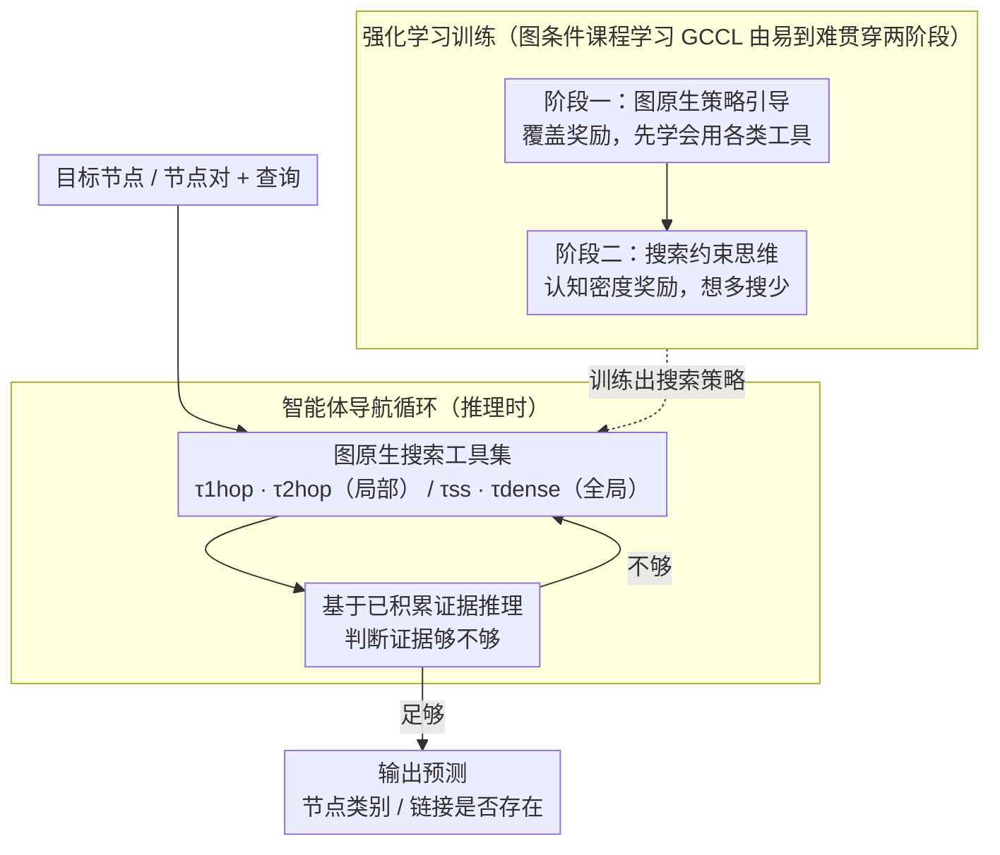

# AgentGL: Towards Agentic Graph Learning with LLMs via Reinforcement Learning

**会议**: ACL 2026  
**arXiv**: [2604.05846](https://arxiv.org/abs/2604.05846)  
**代码**: [https://github.com/sunyuanfu/AgentGL](https://github.com/sunyuanfu/AgentGL)  
**领域**: 图学习 / LLM Agent  
**关键词**: 图学习, 强化学习, 智能体导航, 文本属性图, 工具使用

## 一句话总结
提出 AgentGL，首个基于强化学习的智能体图学习（AGL）框架，让 LLM 智能体通过图原生搜索工具自主导航文本属性图（TAG），在节点分类和链接预测任务上分别实现最高 17.5% 和 28.4% 的绝对准确率提升。

## 研究背景与动机

**领域现状**：LLM 越来越多地依赖 agentic 能力（迭代检索、工具调用、决策推理）来突破静态参数化知识的局限。然而现有的 agentic 框架主要处理非结构化文本，无法利用现实世界数据中的拓扑依赖关系。

**现有痛点**：传统 GNN 能建模结构信号但难以处理丰富文本语义；GraphLLM（如 GraphGPT、GraphICL）依赖静态图上下文，推理时无法自适应探索；GraphRAG 构建的知识图谱成本高且不保留原始拓扑关联。三类方法都缺乏在真实图结构上的动态证据获取机制。

**核心矛盾**：图上的证据是多尺度的——有些线索存在于紧密的局部邻域中，有些只在更广泛的结构模式中显现。智能体需要在组合空间中决定"下一步去哪里"，同时避免冗余或无信息区域。此外，有效的图推理需要多步探索，但真实搜索轨迹标注极其稀缺。

**本文目标**：提出 Agentic Graph Learning（AGL）新范式，让 LLM 智能体能自主导航图结构、累积结构证据、基于实时推理迭代调整搜索轨迹。

**切入角度**：将图学习重新定义为拓扑感知导航与 LLM 推理的交替过程，而非静态特征编码或一次性检索。

**核心 idea**：用强化学习驱动 LLM 智能体学习图原生搜索策略，通过搜索约束思维抑制过度检索，通过图条件课程学习稳定长周期策略优化。

## 方法详解

### 整体框架
AgentGL 把图学习从"静态特征编码"改写成一个智能体决策过程：给定目标节点（或节点对）和查询后，LLM 智能体不再一次性吃下固定的图上下文，而是反复在"调用图原生搜索工具取证据"和"基于已有证据推理下一步去哪搜"之间交替，直到证据足够才输出预测。整个能力靠强化学习两阶段培养——先用图原生策略引导让智能体学会基本的导航行为，再用搜索效率优化教它"想多搜少"地剪掉冗余调用；两阶段全程都在图条件课程学习的"由易到难"排序下训练，以稳住长周期的策略优化。

### 关键设计

**1. 图原生搜索工具集：让 LLM 能像读文本一样自由读图。** 

智能体要在图上自主导航，前提是有一套覆盖"局部 vs 全局""结构 vs 语义"两个维度的探索原语。AgentGL 为此设计了四种互补工具：$\tau_{1hop}$ 做 1 跳邻域搜索（共同邻居优先、独有邻居均衡分配），$\tau_{2hop}$ 把视野扩到 2 跳邻域，$\tau_{ss}$ 是结构显著性搜索（用 PPR 分数检索全局拓扑枢纽），$\tau_{dense}$ 则用余弦相似度把语义相关但拓扑上断开的节点桥接起来。前两者管"近处的结构线索"，后两者管"远处的全局枢纽和跨断点的语义关联"，合在一起智能体就能从紧密局部邻域一路探到广义结构模式，证据是多尺度的就靠工具的多尺度来接住。

**2. 搜索约束思维（Search-Constrained Thinking）：把"穷举检索"扭成"深度推理"。** 

引导阶段训出来的策略有个通病——默认能搜就搜，靠堆调用次数刷覆盖率，既慢又稀释推理质量。搜索约束思维用三个组件治这个病：回溯终止触发器在每次工具执行后注入一个"认知中断"，逼智能体先评估"现在的证据够不够"再决定是否继续；认知密度正则化直接惩罚稀疏的推理片段，奖励项写成 $r_{depth} = \alpha \cdot \mathbb{I}[N_{short}=0] - \lambda_d \cdot N_{short}$，短而空的思考越多扣得越狠；自适应奖励过渡则在这一阶段丢掉覆盖激励，把奖励重心挪到准确率与推理密度上。三者叠加，智能体被推着用更少的搜索、更密的思考去拿同样甚至更好的答案。

**3. 图条件课程学习（GCCL）：用图自带的属性零成本排难度。** 

长周期 RL 直接在混合难度样本上训很容易抖，传统课程学习又要人工标注或试运行来定难度，成本高。GCCL 抓住一点：图本身就提供了可量化的难度先验，不花额外标注就能给样本排序。节点分类任务用 Wilson 下界校正过的同质性估计再叠加度先验来判一个节点好不好分；链接预测则看候选对的语义相似度与标签一致性。把样本按从易到难喂进去，策略优化先在简单样本上立稳再啃硬骨头，训练因此更稳、收敛更快。

### 损失函数 / 训练策略
两阶段的奖励设计正好对应"先学会搜、再学会省"。阶段一用 $R(\tau) = r_{fmt} + r_{acc} + r_{cov}$（格式 + 准确率 + 工具覆盖），鼓励智能体把各类工具都用起来、建立基本导航能力，优化器用 GRPO 或 REINFORCE++。阶段二切到 $R(\tau) = r_{fmt} + r_{acc} + r_{depth}$，撤掉覆盖激励、换上认知密度奖励 $r_{depth}$，把策略从"广撒网"收敛到"少而准"。

## 实验关键数据

### 主实验

| 任务 | 数据集 | AgentGL | 最强基线 | 提升 |
|------|--------|---------|---------|------|
| 节点分类 | OGB-Arxiv | 66.3 | 54.1 (GraphPrompter) | +12.2 |
| 节点分类 | PubMed | 74.5 | 67.0 (GraphPrompter) | +7.5 |
| 链接预测 | OGB-Arxiv | 91.5 | 79.8 (LLaGA) | +11.7 |
| 链接预测 | PubMed | 75.8 | 62.5 (GraphICL) | +13.3 |
| 零样本迁移(NC) | Arxiv-23 | 63.6 | 52.2 (GraphICL) | +11.4 |
| 零样本迁移(LP) | Reddit | 83.2 | 62.0 (GraphICL) | +21.2 |

### 消融实验

| 配置 | 说明 |
|------|------|
| Full AgentGL | 完整模型，最优性能 |
| w/o GCCL | 去掉课程学习，训练不稳定，性能下降 |
| w/o Search-Constrained Thinking | 过度检索但保持基本能力 |
| w/o 全局工具 | 只有局部工具，结构视野受限，明显下降 |

### 关键发现
- 所有 7 个数据集上均大幅超越 GNN、GraphLLM 和 GraphRAG 基线
- 零样本迁移场景提升尤为显著（Reddit LP +21.2%），学到的搜索策略泛化性强
- 搜索约束思维显著减少工具调用次数同时维持甚至提升准确率

## 亮点与洞察
- **AGL 范式本身是核心贡献**：将图学习从"静态编码"重新定义为"交互式导航+推理"，为 LLM 在结构化数据上的应用开辟新方向
- **课程学习零成本化**：利用图内在属性自动量化难度，避免人工标注或试运行的瓶颈
- **搜索约束思维可迁移**：这个"想多搜少"的设计可应用于任何工具增强 LLM 场景

## 局限与展望
- 仅在节点分类和链接预测两个任务上验证，社区检测、图分类等尚未涉及
- 图原生工具是手工设计的，未来可让智能体自主发现/组合新工具
- 训练成本较高（多轮 RL），大规模图上的可扩展性有待验证

## 相关工作与启发
- **vs GraphRAG (HippoRAG2)**：GraphRAG 需重建知识图谱且不保留原始拓扑，AgentGL 直接在原始图上导航
- **vs GraphCoT**：依赖启发式提示且只针对图 QA，AgentGL 通过 RL 端到端优化搜索策略

## 评分
- 新颖性: ⭐⭐⭐⭐⭐ 首个 AGL + RL 结合的工作，开创新方向
- 实验充分度: ⭐⭐⭐⭐ 7 个数据集 + 多个 backbone，消融可更充分
- 写作质量: ⭐⭐⭐⭐ 框架清晰，公式严谨
- 价值: ⭐⭐⭐⭐⭐ AGL 范式有很大潜力推动图学习与 LLM 深度融合

<!-- RELATED:START -->

## 相关论文

- [\[ACL 2026\] From Nodes to Narratives: Explaining Graph Neural Networks with LLMs and Graph Context](from_nodes_to_narratives_explaining_graph_neural_networks_with_llms_and_graph_co.md)
- [\[ACL 2026\] Graph-Based Alternatives to LLMs for Human Simulation](graph-based_alternatives_to_llms_for_human_simulation.md)
- [\[ACL 2026\] ARK: Answer-Centric Retriever Tuning via KG-augmented Curriculum Learning](ark_answer-centric_retriever_tuning_via_kg-augmented_curriculum_learning.md)
- [\[ICML 2026\] T-GINEE: A Tensor-Based Multilayer Graph Representation Learning](../../ICML2026/graph_learning/t-ginee_a_tensor-based_multilayer_graph_representation_learning.md)
- [\[ICML 2026\] Aitchison Embeddings for Learning Compositional Graph Representations](../../ICML2026/graph_learning/aitchison_embeddings_for_learning_compositional_graph_representations.md)

<!-- RELATED:END -->
